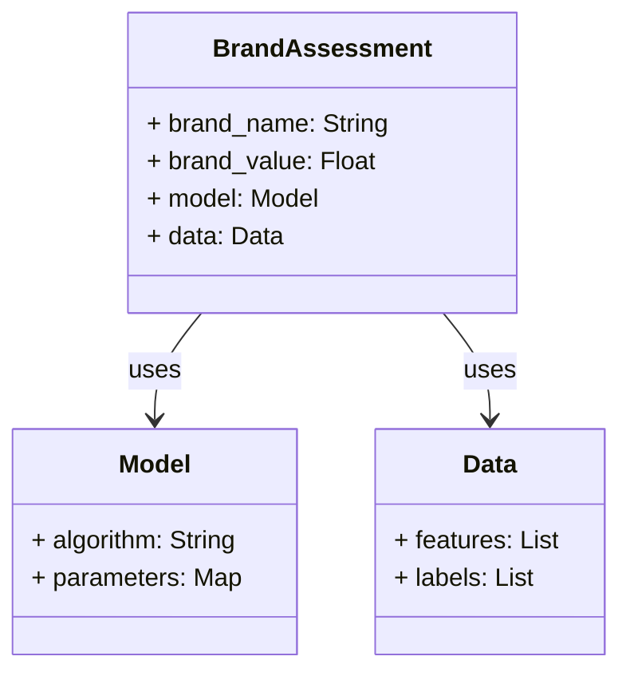
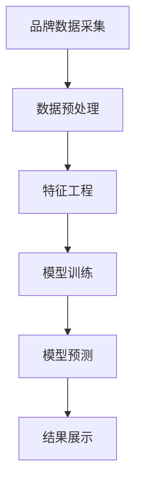

                 

<think>
嗯，我现在需要帮助用户完成一个技术博客文章的撰写。文章标题是《AI辅助企业品牌资产评估：多维度品牌价值量化与追踪》，用户希望我以一个技术专家的身份，详细分析和撰写这篇博客。

首先，我要理解用户的需求。用户希望文章结构清晰，逻辑严谨，语言专业，同时包含实际案例和技术细节。文章需要涵盖品牌资产评估的重要性、AI技术的应用、多维度评估模型、算法原理、系统架构设计以及项目实战等内容。

我应该从品牌资产评估的背景开始，解释为什么品牌资产评估重要，以及传统方法的局限性。然后引入AI技术，说明其在品牌评估中的优势。接下来，详细讲解多维度评估的核心概念，包括品牌知名度、美誉度、忠诚度等，以及这些指标如何相互影响。

在算法部分，我需要选择合适的AI算法，比如线性回归和随机森林，用mermaid流程图展示训练流程，并提供Python代码实现。系统架构设计部分，我需要画出类图和架构图，展示模块之间的关系。

项目实战部分，我需要详细描述环境配置、数据预处理、模型实现和结果分析，最后用一个具体案例来展示系统如何运作。在高级应用与趋势部分，探讨AI在实时监测、情感分析等方面的应用。

最后，总结全书内容，提出未来的研究方向和建议。确保每个章节都有小结，帮助读者巩固所学内容。

现在，我需要将这些内容整理成一个结构清晰的目录大纲，并按照用户的要求，使用专业的技术语言，逐步展开分析。确保每个部分都包含足够的细节，比如在核心概念部分，使用表格对比不同指标；在算法部分，用mermaid流程图展示训练流程，并附上Python代码。

总体来说，我需要确保文章逻辑清晰，内容详尽，符合用户的要求，帮助读者全面理解AI在品牌资产评估中的应用。
</think>

# AI辅助企业品牌资产评估：多维度品牌价值量化与追踪

> 关键词：AI技术，品牌资产评估，多维度价值量化，品牌价值追踪，企业品牌管理，人工智能算法

> 摘要：随着人工智能技术的快速发展，企业品牌资产评估的手段和方法也在不断创新。本文将从品牌价值的多维度量化与追踪角度出发，结合AI技术，系统地探讨如何利用人工智能算法实现品牌价值的精准评估与动态管理。文章将涵盖品牌资产评估的核心概念、AI算法的实现原理、系统架构设计以及实际项目案例分析，旨在为企业品牌管理提供全新的思路和解决方案。

---

## 第一章：品牌资产评估的背景与意义

### 1.1 品牌资产评估的重要性

#### 1.1.1 品牌价值的定义与内涵
品牌价值是企业在市场中所拥有的无形资产，包括品牌知名度、美誉度、忠诚度等多方面的综合表现。品牌价值不仅是企业市场地位的体现，也是企业核心竞争力的重要组成部分。

#### 1.1.2 传统品牌资产评估的局限性
传统品牌资产评估方法通常依赖于主观判断和经验分析，存在数据获取难度大、评估结果不精准、动态变化难以捕捉等问题。这些局限性使得企业难以实时掌握品牌价值的变化趋势。

#### 1.1.3 AI技术在品牌资产评估中的优势
人工智能技术能够通过大数据分析、机器学习等手段，从海量数据中提取有价值的信息，量化品牌价值的多维度指标，并实现动态追踪。AI技术的应用使得品牌资产评估更加客观、精准和高效。

### 1.2 AI技术与品牌资产评估的结合

#### 1.2.1 AI技术在品牌价值量化中的应用
AI技术可以通过自然语言处理（NLP）、情感分析、图像识别等手段，从社交媒体、新闻媒体等多渠道获取品牌相关数据，提取关键词、情感倾向等信息，从而量化品牌知名度和美誉度。

#### 1.2.2 多维度品牌价值评估的必要性
品牌价值不仅仅依赖于单一指标，而是需要从多个维度进行综合评估。通过AI技术，可以同时考虑市场表现、消费者认知、竞争对手分析等多个维度，实现全面的品牌价值评估。

#### 1.2.3 企业品牌资产追踪的核心价值
品牌资产的动态变化直接影响企业的市场策略和投资决策。通过AI技术实现品牌价值的实时追踪，企业可以及时调整市场策略，优化资源配置，提升品牌竞争力。

### 1.3 本章小结
本章主要介绍了品牌资产评估的重要性和AI技术在其中的应用价值。通过对比传统评估方法与AI技术的优劣势，强调了AI技术在多维度品牌价值量化与动态追踪中的核心作用。

---

## 第二章：多维度品牌价值评估的核心概念

### 2.1 品牌资产的构成与影响因素

#### 2.1.1 品牌知名度的定义与测量
品牌知名度是指品牌在目标市场中的普及程度和认知度。通过社交媒体数据、搜索量、广告曝光量等指标可以量化品牌知名度。

#### 2.1.2 品牌美誉度的定义与测量
品牌美誉度是消费者对品牌的整体评价，通常通过情感分析、用户评论等数据进行评估。

#### 2.1.3 品牌忠诚度的定义与测量
品牌忠诚度反映了消费者对品牌的忠诚程度，可以通过复购率、推荐率等指标进行量化。

#### 2.1.4 品牌市场表现的定义与测量
品牌市场表现包括市场份额、增长率、竞争对手分析等指标，反映了品牌在市场中的实际表现。

### 2.2 多维度评估指标的对比分析

#### 2.2.1 品牌价值评估指标的分类
品牌价值评估指标可以分为市场表现类、消费者认知类、竞争对手分析类等。

#### 2.2.2 不同评估指标的优劣势对比
- **市场表现类指标**：优点是数据来源丰富、易于量化；缺点是受市场环境影响较大，难以反映品牌的核心价值。
- **消费者认知类指标**：优点是能够反映品牌在消费者心中的地位；缺点是数据获取难度较大，且难以量化。
- **竞争对手分析类指标**：优点是能够提供市场定位信息；缺点是需要持续关注竞争对手动态，数据获取成本较高。

#### 2.2.3 指标间的相互关系与影响
市场表现、消费者认知和竞争对手分析等指标相互关联，共同构成了品牌价值的多维度评估体系。例如，品牌知名度高但美誉度低的企业可能需要通过提升产品和服务质量来改善品牌形象。

### 2.3 本章小结
本章详细探讨了品牌资产的构成及其影响因素，分析了多维度评估指标的分类与优劣势，并强调了各指标间的相互关系与影响。

---

## 第三章：多维度品牌价值评估的模型构建

### 3.1 品牌价值评估模型的构建原理

#### 3.1.1 数据驱动的品牌价值评估方法
通过收集和分析品牌相关的多维度数据，构建数学模型进行品牌价值评估。常用的数据驱动方法包括线性回归、随机森林等机器学习算法。

#### 3.1.2 多维度指标的权重分配
根据品牌价值评估的业务需求，对各评估指标赋予不同的权重。例如，品牌知名度和市场表现可能占据较高的权重，而品牌忠诚度可能占据较低的权重。

#### 3.1.3 综合评估模型的设计与实现
综合评估模型需要将多维度指标进行整合，通过加权求和或加权平均的方式，得到最终的品牌价值评分。

### 3.2 数据挖掘与特征工程

#### 3.2.1 数据采集与清洗
通过爬虫技术从社交媒体、新闻媒体等渠道获取品牌相关数据，清洗掉无效数据，确保数据质量。

#### 3.2.2 数据特征的提取与选择
从原始数据中提取关键词、情感倾向、品牌提及量等特征，并通过特征选择算法（如LASSO回归）筛选出对品牌价值影响较大的特征。

#### 3.2.3 数据预处理与标准化
对提取的特征进行标准化处理（如归一化），确保不同特征之间具有可比性。

### 3.3 本章小结
本章详细介绍了多维度品牌价值评估模型的构建原理，包括数据驱动方法、指标权重分配以及综合评估模型的设计与实现。同时，强调了数据挖掘与特征工程在品牌价值评估中的重要性。

---

## 第四章：品牌价值评估的算法原理与实现

### 4.1 品牌价值评估的数学模型

#### 4.1.1 线性回归模型
线性回归是一种简单但有效的机器学习算法，适用于品牌价值的线性关系建模。模型公式为：
$$ y = \beta_0 + \beta_1x_1 + \beta_2x_2 + \cdots + \beta_nx_n + \epsilon $$
其中，$y$表示品牌价值评分，$x_i$表示各个评估指标，$\beta_i$表示相应指标的回归系数，$\epsilon$表示误差项。

#### 4.1.2 随机森林模型
随机森林是一种基于决策树的集成学习算法，能够处理高维数据和非线性关系。模型通过构建多棵决策树，并将它们的预测结果进行投票或加权平均，得到最终的预测结果。

#### 4.1.3 神经网络模型
神经网络模型通过多层感知机（MLP）或卷积神经网络（CNN）等结构，能够捕捉品牌价值评估中的复杂模式和非线性关系。模型的具体结构需要根据实际数据特点进行设计。

### 4.2 算法实现与优化

#### 4.2.1 算法实现步骤
1. 数据预处理：清洗数据，提取特征，标准化处理。
2. 模型训练：选择合适的算法，调整超参数，进行模型训练。
3. 模型评估：通过交叉验证等方法评估模型的性能。
4. 模型优化：通过网格搜索等方法优化模型参数。

#### 4.2.2 算法优化策略
- **特征选择**：通过LASSO回归等方法减少冗余特征，提升模型性能。
- **超参数优化**：通过网格搜索或随机搜索优化模型超参数。
- **模型集成**：通过投票、加权平均等方式结合多种模型，提升预测准确性。

#### 4.2.3 代码实现示例
```python
from sklearn.ensemble import RandomForestRegressor
from sklearn.model_selection import train_test_split
from sklearn.metrics import mean_squared_error

# 数据预处理
X = df.drop('brand_value', axis=1)
y = df['brand_value']

# 数据划分
X_train, X_test, y_train, y_test = train_test_split(X, y, test_size=0.2, random_state=42)

# 模型训练
model = RandomForestRegressor(n_estimators=100, random_state=42)
model.fit(X_train, y_train)

# 模型预测
y_pred = model.predict(X_test)

# 模型评估
mse = mean_squared_error(y_test, y_pred)
print(f"均方误差: {mse}")
```

### 4.3 本章小结
本章详细讲解了品牌价值评估的数学模型与算法实现，包括线性回归、随机森林和神经网络等算法的原理与实现步骤。同时，通过代码示例展示了如何利用Python进行模型训练和评估。

---

## 第五章：系统架构设计与实现

### 5.1 系统功能设计

#### 5.1.1 领域模型设计
通过绘制类图（Mermaid）展示系统中各模块之间的关系。



#### 5.1.2 系统架构设计
通过绘制架构图（Mermaid）展示系统的整体架构。



### 5.2 系统实现细节

#### 5.2.1 数据采集模块
通过爬虫技术从社交媒体、新闻媒体等渠道获取品牌相关数据，清洗数据并存储到数据库中。

#### 5.2.2 特征工程模块
从清洗后的数据中提取关键词、情感倾向等特征，并进行标准化处理。

#### 5.2.3 模型训练模块
利用训练好的数据集，选择合适的算法进行模型训练，并保存模型参数。

#### 5.2.4 模型预测模块
将实时获取的新数据输入训练好的模型，进行品牌价值预测，并将结果返回给用户。

### 5.3 本章小结
本章详细介绍了系统架构设计与实现，包括领域模型设计、系统架构设计以及各模块的具体实现细节。

---

## 第六章：项目实战与案例分析

### 6.1 项目背景介绍
本项目旨在通过AI技术实现某企业的品牌价值量化与动态追踪。通过收集和分析该企业的品牌相关数据，构建品牌价值评估模型，并实时监测品牌价值的变化趋势。

### 6.2 项目核心实现

#### 6.2.1 环境配置
安装必要的Python库，如`pandas`、`scikit-learn`、`beautifulsoup4`等。

#### 6.2.2 数据预处理
从社交媒体和新闻媒体中爬取品牌相关数据，清洗数据并提取特征。

#### 6.2.3 模型实现
选择随机森林算法进行品牌价值预测，并通过网格搜索优化模型参数。

#### 6.2.4 结果分析
通过混淆矩阵、均方误差等指标评估模型性能，并对预测结果进行可视化展示。

### 6.3 案例分析与结果解读

#### 6.3.1 案例分析
通过具体案例分析，展示模型在品牌价值预测中的实际应用效果。

#### 6.3.2 结果解读
解读模型预测结果，分析品牌价值的变化趋势，并提出改进建议。

### 6.4 本章小结
本章通过具体项目实战，详细展示了AI技术在品牌价值量化与动态追踪中的实际应用，并通过案例分析验证了模型的有效性。

---

## 第七章：高级应用与未来趋势

### 7.1 AI技术的高级应用

#### 7.1.1 品牌价值的实时监测
通过流数据处理技术，实时监测品牌价值的变化趋势，并及时发出预警。

#### 7.1.2 基于情感分析的品牌价值预测
利用自然语言处理技术，从社交媒体评论中提取情感倾向，预测品牌价值的变化。

#### 7.1.3 跨平台品牌价值分析
通过多平台数据整合，全面分析品牌在不同渠道上的表现，实现跨平台的品牌价值评估。

### 7.2 未来研究方向

#### 7.2.1 基于深度学习的品牌价值预测
探索深度学习算法（如LSTM、Transformer）在品牌价值预测中的应用。

#### 7.2.2 品牌价值的个性化评估
根据消费者的个性化需求，实现品牌价值的个性化评估。

#### 7.2.3 品牌资产的动态优化
通过实时监测和预测，动态优化品牌资产的管理策略。

### 7.3 本章小结
本章探讨了AI技术在品牌资产评估中的高级应用，提出了未来的研究方向和建议。

---

## 第八章：总结与展望

### 8.1 全文总结
本文系统地探讨了AI技术在企业品牌资产评估中的应用，从多维度品牌价值量化到动态追踪，详细介绍了品牌价值评估的核心概念、算法原理、系统架构设计以及实际项目案例。通过AI技术的应用，企业可以更加精准地评估品牌价值，并实时优化品牌管理策略。

### 8.2 未来展望
随着AI技术的不断发展，品牌资产评估将更加智能化、个性化和动态化。未来的研究方向将围绕深度学习、实时监测、个性化评估等领域展开，为企业品牌管理提供更加全面和精准的支持。

---

## 作者信息

作者：AI天才研究院/AI Genius Institute & 禅与计算机程序设计艺术 /Zen And The Art of Computer Programming

---

通过以上目录结构和内容安排，文章将系统地阐述AI辅助企业品牌资产评估的核心概念、算法实现和实际应用，为读者提供全面而深入的技术指导。

