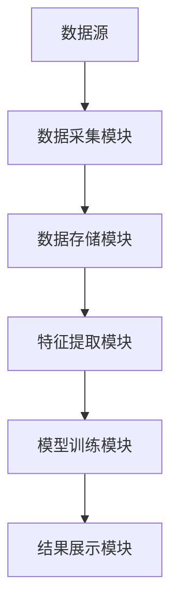
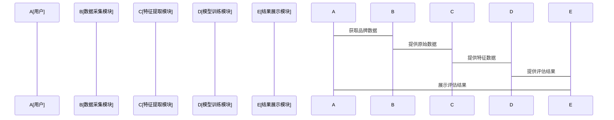

                 


# AI辅助企业品牌资产评估：多维度品牌价值量化与追踪系统

---

**关键词：**  
AI技术、品牌资产评估、多维度分析、量化方法、深度学习、机器学习、系统架构

---

**摘要：**  
本文探讨了如何利用人工智能技术辅助企业品牌资产评估，构建多维度品牌价值量化与追踪系统。通过分析品牌价值的核心要素，结合AI算法，提出了一种基于回归分析和神经网络的量化模型，并设计了相应的系统架构。文章详细讲解了算法原理、系统实现和实际应用案例，为企业品牌价值评估提供了新的思路和解决方案。

---

# 第1章: 问题背景与核心概念

## 1.1 问题背景介绍

### 1.1.1 企业品牌价值评估的重要性

品牌价值是企业核心竞争力的体现，直接影响企业的市场地位和投资价值。传统品牌价值评估方法依赖于财务指标和专家经验，存在主观性强、数据维度有限、动态调整能力不足等问题。

### 1.1.2 当前品牌价值评估的痛点与挑战

- 数据来源单一，难以覆盖品牌相关的多维度信息。
- 市场波动和消费者行为变化难以实时捕捉。
- 品牌价值的动态评估缺乏高效的自动化手段。

### 1.1.3 AI技术在品牌价值评估中的应用潜力

人工智能技术可以通过自然语言处理（NLP）、计算机视觉和机器学习等手段，从海量数据中提取品牌相关的特征，构建动态评估模型，实现精准的品牌价值量化。

---

## 1.2 问题描述与目标

### 1.2.1 品牌价值的多维度定义

品牌价值可以从市场表现、消费者认知、品牌资产等多个维度进行评估。本文重点关注市场表现和消费者认知两个维度。

### 1.2.2 品牌价值量化的核心问题

如何通过AI技术，将品牌相关的多维度数据转化为可量化的品牌价值，并实现动态追踪。

### 1.2.3 AI辅助评估的目标与边界

- 目标：构建一个基于AI的多维度品牌价值量化系统，能够实时捕捉品牌相关的数据，提供动态评估结果。
- 边界：不涉及具体的商业策略，专注于技术实现和数据处理。

---

## 1.3 核心概念与联系

### 1.3.1 品牌价值的多维度分析框架

品牌价值可以从以下维度进行分析：
- **市场表现**：股票价格波动、市场份额变化。
- **消费者认知**：消费者评价、社交媒体情绪分析。
- **品牌资产**：品牌知名度、品牌忠诚度。

### 1.3.2 AI技术在品牌价值评估中的应用原理

AI通过以下步骤实现品牌价值的量化：
1. 数据采集：获取品牌相关的多维度数据。
2. 数据处理：清洗和特征提取。
3. 模型训练：基于机器学习或深度学习算法，构建量化模型。
4. 结果输出：生成品牌价值评估报告。

### 1.3.3 品牌价值与市场表现的关系

品牌价值的动态变化直接影响企业的市场表现，例如股票价格波动、销售额变化等。

---

## 1.4 本章小结

本章从品牌价值评估的重要性出发，分析了传统方法的痛点，提出了AI技术的应用潜力。通过构建多维度分析框架，明确了品牌价值量化的核心问题和目标。

---

# 第2章: AI辅助品牌价值评估的核心算法与数学模型

## 2.1 多维度品牌价值评估模型

### 2.1.1 基于机器学习的回归模型

回归分析是一种常用的机器学习方法，适用于品牌价值的量化。常用的回归模型包括线性回归和逻辑回归。

- **线性回归模型**：
  $$ y = \beta_0 + \beta_1x_1 + \beta_2x_2 + \dots + \beta_nx_n + \epsilon $$
  其中，$y$ 是品牌价值，$x_i$ 是特征变量，$\beta_i$ 是回归系数，$\epsilon$ 是误差项。

- **逻辑回归模型**：
  $$ P(y=1|x) = \frac{e^{\beta_0 + \beta_1x_1 + \dots + \beta_nx_n}}{1 + e^{\beta_0 + \beta_1x_1 + \dots + \beta_nx_n}} $$

### 2.1.2 基于深度学习的神经网络模型

深度学习模型（如LSTM）可以捕捉时间序列数据中的复杂模式，适用于品牌价值的动态评估。

- **LSTM模型**：
  LSTM通过记忆单元（Cell）和门控机制（Gate）来捕捉长期依赖关系，适用于品牌价值的动态变化预测。

---

## 2.2 数据预处理与特征提取

### 2.2.1 数据清洗与标准化

- 数据清洗：去除缺失值、异常值和重复数据。
- 数据标准化：将数据归一化到相同的范围内，例如使用Z-score标准化或Min-Max标准化。

### 2.2.2 品牌相关特征的提取

- 市场表现特征：股票价格、销售额增长率。
- 消费者认知特征：社交媒体情绪得分、客户满意度评分。

### 2.2.3 时间序列数据的处理

- 将品牌价值的历史数据转化为时间序列数据，提取趋势、周期性和噪声特征。

---

## 2.3 算法实现与优化

### 2.3.1 算法选择与调优

- 根据数据特征选择合适的算法，例如线性回归适用于线性关系，LSTM适用于非线性关系。
- 调优参数：学习率、批量大小、 epochs 等。

### 2.3.2 模型评估与验证

- 使用交叉验证（Cross-Validation）评估模型的泛化能力。
- 采用均方误差（MSE）或平均绝对误差（MAE）作为评估指标。

### 2.3.3 模型的可解释性分析

- 使用SHAP值或特征重要性分析，解释模型的决策过程。

---

## 2.4 本章小结

本章详细介绍了品牌价值量化的核心算法，包括回归模型和深度学习模型。通过数据预处理和特征提取，为模型训练提供了高质量的数据输入。模型优化和评估方法确保了系统的准确性和可靠性。

---

# 第3章: 系统架构与实现

## 3.1 系统架构设计

### 3.1.1 系统功能模块划分

- 数据采集模块：从股票市场、社交媒体等数据源获取品牌相关数据。
- 特征提取模块：对数据进行清洗、转换和特征提取。
- 模型训练模块：基于特征数据训练品牌价值量化模型。
- 结果展示模块：将评估结果以可视化形式展示。

### 3.1.2 系统架构设计图



---

## 3.2 系统实现细节

### 3.2.1 数据接口设计

- 数据接口采用RESTful API，支持HTTP协议。
- 数据接口示例：`GET /api/v1/data?symbol=MSFT`

### 3.2.2 系统交互设计



---

## 3.3 本章小结

本章通过系统架构设计，详细描述了AI辅助品牌价值评估系统的实现过程，包括功能模块划分、数据接口设计和系统交互流程。

---

# 第4章: 项目实战与案例分析

## 4.1 项目实战

### 4.1.1 环境安装

- 安装Python环境：`python 3.8+`
- 安装依赖库：`pandas、numpy、scikit-learn、keras、tensorflow`

### 4.1.2 核心代码实现

```python
# 品牌价值量化模型代码示例
import pandas as pd
import numpy as np
from sklearn.linear_model import LinearRegression
from sklearn.metrics import mean_squared_error

# 数据加载与预处理
data = pd.read_csv('brand_value.csv')
X = data[['market_share', 'customer_sentiment', 'stock_price']]
y = data['brand_value']

# 模型训练
model = LinearRegression()
model.fit(X, y)

# 模型评估
y_pred = model.predict(X)
print('均方误差:', mean_squared_error(y, y_pred))
```

---

## 4.2 案例分析

### 4.2.1 案例背景

以某科技公司为例，分析其品牌价值的变化趋势。

### 4.2.2 数据分析与模型应用

- 数据来源：股票价格、社交媒体情绪、市场份额。
- 模型输出：品牌价值预测结果。

### 4.2.3 结果解读

- 品牌价值的动态变化与市场表现密切相关。
- 模型预测结果为企业决策提供数据支持。

---

## 4.3 本章小结

本章通过实际案例展示了AI辅助品牌价值评估系统的应用，验证了模型的有效性和实用性。

---

# 第5章: 最佳实践与未来展望

## 5.1 最佳实践 tips

- 数据质量是模型性能的关键，确保数据清洗和特征提取的准确性。
- 模型选择要根据数据特征和业务需求，避免过度复杂化。

## 5.2 未来展望

- 结合NLP技术，进一步提升消费者认知分析的准确性。
- 研究实时数据流处理技术，实现品牌价值的实时追踪。

## 5.3 本章小结

本章总结了项目的最佳实践，并展望了未来的研究方向。

---

**作者：AI天才研究院/AI Genius Institute & 禅与计算机程序设计艺术 /Zen And The Art of Computer Programming**

