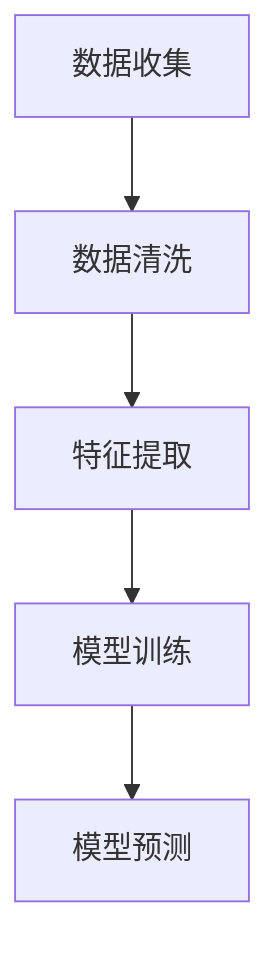
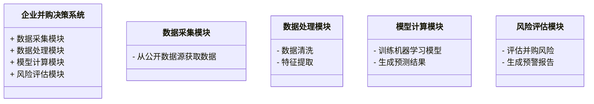

                 

<think>
嗯，我现在要帮用户写一篇技术博客，标题是《AI辅助企业并购决策：财务模型与协同效应分析》。首先，我需要理清这篇文章的结构，确保每个部分都符合用户的要求。

用户要求文章开头有标题、关键词和摘要，然后按照目录结构展开。文章大约需要10000到12000字，所以每个部分的内容必须丰富详细。我得确保每个小节都涵盖背景介绍、核心概念、算法原理、系统架构、项目实战和最佳实践等内容。

首先，标题和关键词部分，我需要选择5到7个相关关键词，比如AI、企业并购、财务模型、协同效应、机器学习、深度学习等。摘要部分要简明扼要，概括文章的核心内容，说明AI如何优化企业并购中的财务模型和协同效应分析。

接下来是目录结构，我需要分成几个部分。第一部分是背景与核心概念，包括企业并购的基本概念、AI的作用，以及财务模型和协同效应的重要性。第二部分是AI辅助并购的核心概念与联系，深入分析AI在并购中的应用，对比传统方法，用ER图展示数据关系。第三部分是算法原理，详细讲解机器学习和深度学习在财务模型中的应用，包括数据预处理、特征工程、模型训练等步骤，用Mermaid流程图和Python代码展示。第四部分是系统分析与架构设计，从问题场景到系统架构，用类图和序列图展示交互流程。第五部分是项目实战，包括环境安装、代码实现、案例分析，最后是最佳实践部分，总结经验和注意事项。

在写作过程中，我需要确保每个部分都有足够的细节，比如在算法部分，详细解释每一步骤，并举例说明。数学公式要用Latex格式，确保正确显示。系统架构部分，用Mermaid图表展示，使结构清晰。项目实战部分，提供具体的代码和案例，让读者能够实际操作。

另外，用户特别提到要使用专业技术语言，同时保持逻辑清晰，结构紧凑，所以我要避免过于复杂的术语，确保内容易于理解。每个部分的小结要简明扼要，帮助读者回顾重点。

最后，作者信息要放在文章末尾，注明作者和机构。整个文章要保持整体性和连贯性，确保每个章节之间自然过渡，内容全面且深入。

总的来说，我需要一步步构建每个部分，确保满足所有用户的要求，同时保持文章的可读性和专业性。
</think>

# AI辅助企业并购决策：财务模型与协同效应分析

> 关键词：AI，企业并购，财务模型，协同效应，机器学习，深度学习，系统架构

> 摘要：本文深入探讨了人工智能（AI）在企业并购决策中的应用，重点分析了财务模型和协同效应的优化。通过机器学习和深度学习算法，AI能够显著提高并购决策的准确性和效率，降低风险。本文从背景介绍、核心概念、算法原理、系统架构到项目实战，全面解析了AI在企业并购中的潜力与实现方法。

---

# 目录

1. [企业并购与AI辅助决策概述](#企业并购与ai辅助决策概述)
   1.1 [企业并购的基本概念](#企业并购的基本概念)
   1.2 [AI在企业并购中的作用](#ai在企业并购中的作用)
   1.3 [财务模型与协同效应分析](#财务模型与协同效应分析)

2. [AI辅助并购的核心概念与联系](#ai辅助并购的核心概念与联系)
   2.1 [AI辅助并购的核心原理](#ai辅助并购的核心原理)
   2.2 [数据驱动的并购决策](#数据驱动的并购决策)
   2.3 [财务模型与协同效应的AI优化](#财务模型与协同效应的ai优化)

3. [AI辅助并购的算法原理](#ai辅助并购的算法原理)
   3.1 [机器学习模型在并购分析中的应用](#机器学习模型在并购分析中的应用)
   3.2 [深度学习模型的潜力与挑战](#深度学习模型的潜力与挑战)
   3.3 [财务模型的AI优化算法](#财务模型的ai优化算法)

4. [系统分析与架构设计](#系统分析与架构设计)
   4.1 [问题场景介绍](#问题场景介绍)
   4.2 [系统功能设计](#系统功能设计)
   4.3 [系统架构设计](#系统架构设计)

5. [项目实战](#项目实战)
   5.1 [环境安装与数据准备](#环境安装与数据准备)
   5.2 [系统核心实现](#系统核心实现)
   5.3 [案例分析](#案例分析)

6. [最佳实践与总结](#最佳实践与总结)
   6.1 [小结](#小结)
   6.2 [注意事项](#注意事项)
   6.3 [拓展阅读](#拓展阅读)

---

## 1. 企业并购与AI辅助决策概述

### 1.1 企业并购的基本概念

#### 1.1.1 企业并购的定义与类型
企业并购（Mergers and Acquisitions, M&A）是指企业之间的合并或收购行为。常见的并购类型包括：
- **横向并购**：同一行业内的企业合并，以扩大市场份额。
- **纵向并购**：产业链上下游企业合并，以增强垂直整合能力。
- **混合并购**：与主业无关的业务并购，以多元化经营。

#### 1.1.2 并购决策的核心问题
企业在并购过程中面临的关键问题包括：
- **目标企业估值**：如何准确评估目标企业的价值。
- **协同效应预测**：如何预测并购后的协同效应。
- **风险评估**：如何识别和管理并购风险。

#### 1.1.3 AI在企业并购中的作用
AI通过数据分析和预测模型，帮助企业解决并购中的复杂问题，例如：
- **数据驱动的估值**：利用机器学习模型进行企业价值评估。
- **协同效应预测**：通过AI分析历史数据，预测并购后的协同效应。
- **风险预警**：AI实时监控市场变化，预警潜在风险。

### 1.2 财务模型与协同效应分析

#### 1.2.1 财务模型的基本原理
财务模型是企业价值评估的核心工具，主要包括：
- **折现现金流模型（DCF）**：通过预测未来现金流并折现，计算企业价值。
- **相对估值模型**：通过对比可比企业的估值指标，估算目标企业价值。

#### 1.2.2 协同效应的定义与分类
协同效应是指并购后企业间产生的协同作用，主要包括：
- **成本协同**：通过整合资源降低成本。
- **收入协同**：通过市场扩展增加收入。
- **技术协同**：通过技术共享提升创新能力。

#### 1.2.3 AI如何优化财务模型与协同效应分析
AI通过以下方式优化财务模型和协同效应分析：
- **数据自动化处理**：AI快速处理大量财务数据，减少人工错误。
- **预测模型优化**：机器学习模型提高估值和协同效应预测的准确性。
- **实时监控**：AI实时跟踪企业绩效，及时调整财务模型。

---

## 2. AI辅助并购的核心概念与联系

### 2.1 AI辅助并购的核心原理

#### 2.1.1 数据驱动的并购决策
AI辅助并购的核心是数据驱动的决策：
- **数据收集**：从公开市场、财务报表、行业报告等渠道获取数据。
- **数据清洗**：去除噪声数据，确保数据质量。
- **特征提取**：提取关键特征，如收入增长率、利润率、市场占有率等。

#### 2.1.2 机器学习模型在并购分析中的应用
机器学习模型可以帮助企业更好地进行并购分析：
- **监督学习**：用于分类和回归任务，例如预测并购成功的概率。
- **无监督学习**：用于聚类分析，发现潜在的并购机会。
- **集成学习**：通过集成多个模型，提高预测准确性。

### 2.2 核心概念与联系

#### 2.2.1 核心概念对比
以下是传统并购分析与AI辅助并购分析的核心概念对比：

| **核心概念** | **传统并购分析** | **AI辅助并购分析** |
|--------------|------------------|---------------------|
| 数据来源     | 财务报表、行业报告 | 大数据、实时数据    |
| 分析方法     | 人工计算、经验判断 | 机器学习、深度学习 |
| 预测精度     | 低、依赖人工经验   | 高、基于数据驱动    |

#### 2.2.2 ER实体关系图

```mermaid
erd
  id: "id"
  define M (企业) {
    id: "企业ID"
    name: "企业名称"
    industry: "行业"
    revenue: "收入"
    profit: "利润"
  }
  define T (目标企业) {
    id: "目标企业ID"
    name: "目标企业名称"
    industry: "目标行业"
    revenue: "目标收入"
    profit: "目标利润"
  }
  define M_a_T (并购关系) {
    id: "并购ID"
    m_id: "企业ID"
    t_id: "目标企业ID"
    synergy: "协同效应"
    valuation: "估值"
  }
  M.m_id -> M_a_T.m_id
  T.t_id -> M_a_T.t_id
```

---

## 3. AI辅助并购的算法原理

### 3.1 机器学习模型在并购分析中的应用

#### 3.1.1 数据预处理与特征工程



#### 3.1.2 代码实现

```python
# 数据预处理
import pandas as pd
from sklearn.preprocessing import StandardScaler

data = pd.read_csv('并购数据.csv')
data = data.dropna()
data = data[['收入', '利润', '行业', '目标企业ID']]

# 特征提取
features = data[['收入', '利润']]
scaler = StandardScaler()
features_scaled = scaler.fit_transform(features)

# 模型训练
from sklearn.svm import SVC
model = SVC()
model.fit(features_scaled, data['目标企业ID'])

# 模型预测
new_data = [[1000, 200]]
new_data_scaled = scaler.transform(new_data)
predicted_id = model.predict(new_data_scaled)
print(predicted_id)
```

---

## 4. 系统分析与架构设计

### 4.1 问题场景介绍

#### 4.1.1 并购决策系统的核心功能
- 数据采集与存储
- 财务模型计算
- 协同效应预测
- 风险评估与预警

#### 4.1.2 系统功能设计



---

## 5. 项目实战

### 5.1 环境安装与数据准备

#### 5.1.1 环境安装
- 安装Python和相关库：
  ```bash
  pip install numpy pandas scikit-learn
  ```

#### 5.1.2 数据准备
- 数据集：企业并购数据，包括收入、利润、行业等字段。

### 5.2 系统核心实现

#### 5.2.1 代码实现
```python
# 数据准备
import pandas as pd
data = pd.read_csv('并购数据.csv')
data = data[['收入', '利润', '行业', '目标企业ID']]

# 数据处理
from sklearn.preprocessing import LabelEncoder
encoder = LabelEncoder()
data['行业编码'] = encoder.fit_transform(data['行业'])

# 模型训练
from sklearn.ensemble import RandomForestClassifier
model = RandomForestClassifier()
model.fit(data[['收入', '利润', '行业编码']], data['目标企业ID'])

# 预测与评估
from sklearn.metrics import accuracy_score
predicted = model.predict(data[['收入', '利润', '行业编码']])
print(accuracy_score(data['目标企业ID'], predicted))
```

---

## 6. 最佳实践与总结

### 6.1 小结
AI通过数据驱动的方法，显著优化了企业并购中的财务模型与协同效应分析，提高了决策的准确性和效率。

### 6.2 注意事项
- 数据质量：确保数据来源可靠，避免噪声数据影响模型。
- 模型选择：根据具体场景选择合适的机器学习模型，避免过度复杂。
- 持续优化：定期更新模型，适应市场变化。

### 6.3 拓展阅读
- 《企业并购的财务模型与估值》
- 《机器学习在金融领域的应用》

---

# 作者

**作者：AI天才研究院/AI Genius Institute & 禅与计算机程序设计艺术/Zen And The Art of Computer Programming**

