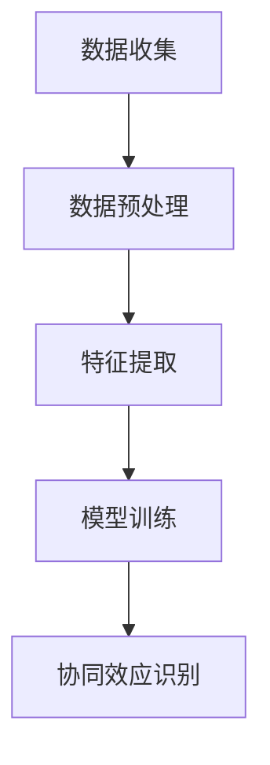
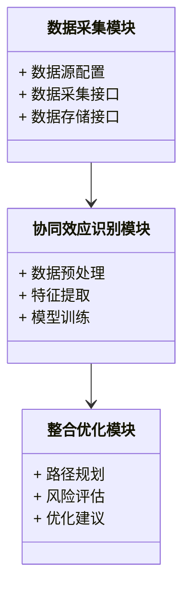
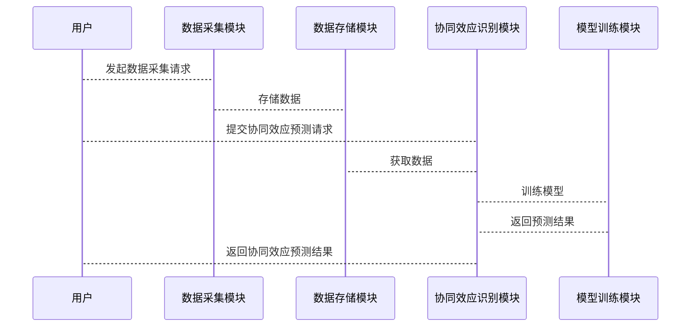

                 

<think>
好的，我现在需要根据用户的要求，撰写一篇关于《AI辅助企业并购协同效应实现：整合路径规划与执行》的技术博客文章。首先，我需要明确文章的结构和每个部分的具体内容。

1. **文章标题**：已经确定为“AI辅助企业并购协同效应实现：整合路径规划与执行”。

2. **关键词**：需要列出5-7个核心关键词，比如：AI, 企业并购, 协同效应, 整合路径, 机器学习, 数据分析, 并购战略。

3. **摘要**：摘要需要简洁明了地概括文章的核心内容，说明AI如何在企业并购中通过协同效应识别、整合路径优化等方面发挥作用，帮助企业在并购过程中做出更明智的决策。

接下来，按照目录大纲，分章节撰写每个部分：

### 第一部分：企业并购与协同效应概述

#### 第1章：企业并购与协同效应的背景

**1.1 企业并购的基本概念**

- **1.1.1 并购的定义与类型**：介绍并购的定义，包括资产购买、股权收购、纵向并购、横向并购等类型。需要详细说明每种类型的特点和应用场景。

- **1.1.2 并购的驱动因素**：探讨企业并购的主要动机，如战略扩张、资源获取、市场进入、技术获取等。

- **1.1.3 协同效应的定义与分类**：解释协同效应的含义，分为成本协同、收入协同、管理协同等，并举例说明。

**1.2 协同效应的实现挑战**

- **1.2.1 协同效应的复杂性**：分析协同效应实现中的复杂性，包括文化冲突、管理整合等问题。

- **1.2.2 并购中的信息不对称**：讨论信息不对称对企业并购的影响，如目标企业的真实价值难以评估。

- **1.2.3 文化与管理整合的难点**：探讨不同企业文化的融合困难，以及管理风格差异带来的挑战。

**1.3 AI在企业并购中的作用**

- **1.3.1 AI技术如何辅助并购决策**：说明AI在数据处理、模式识别等方面的优势，如何帮助企业在并购决策中做出更精准的选择。

- **1.3.2 协同效应识别的AI方法**：介绍AI技术在识别潜在协同效应中的应用，如使用机器学习模型预测协同潜力。

- **1.3.3 AI在整合路径规划中的应用**：说明AI如何优化整合路径，减少整合风险，提高整合效率。

### 第二部分：协同效应的识别与评估

#### 第2章：协同效应的识别模型

**2.1 协同效应识别的核心概念**

- **2.1.1 协同效应的多维度分析**：从财务、运营、市场等多个维度分析协同效应。

- **2.1.2 数据驱动的协同效应识别**：强调数据分析在识别协同效应中的重要性，包括数据收集、清洗和建模的过程。

**2.2 协同效应识别的模型构建**

- **2.2.1 数据收集与预处理**：介绍如何收集企业并购相关的数据，如财务数据、运营数据、市场数据等，并进行清洗和标准化处理。

- **2.2.2 模型训练与优化**：详细说明如何选择合适的机器学习算法，如随机森林、支持向量机等，进行模型训练，并通过交叉验证优化模型性能。

- **2.2.3 模型评估与验证**：使用准确率、召回率、F1分数等指标评估模型性能，并通过测试数据验证模型的泛化能力。

**2.3 协同效应识别的Mermaid流程图**



### 第三部分：AI技术在企业并购中的应用

#### 第3章：数据整合与分析

**3.1 数据整合的挑战与解决方案**

- **3.1.1 数据异构性问题**：分析不同数据源的数据格式、结构差异带来的整合挑战。

- **3.1.2 数据清洗与融合方法**：介绍数据清洗步骤，如处理缺失值、重复值、异常值等，并说明数据融合的方法，如基于规则的融合、基于模型的融合。

**3.2 基于机器学习的协同效应预测**

- **3.2.1 机器学习算法选择**：根据协同效应预测的问题特点，选择合适的算法，如随机森林适合分类问题，梯度提升树适合回归问题。

- **3.2.2 协同效应预测模型构建**：详细说明模型构建的步骤，包括数据分割、特征选择、模型训练等。

- **3.2.3 模型应用与结果解读**：展示模型预测结果，并解释结果的含义，如预测值与实际值的对比分析。

**3.3 协同效应预测的数学模型**

- **线性回归模型**：介绍线性回归的基本原理，公式为$$ y = \beta_0 + \beta_1x_1 + \beta_2x_2 + \dots + \beta_nx_n + \epsilon $$，并说明其应用场景和局限性。

- **随机森林模型**：解释随机森林的工作原理，公式为$$ y = \text{predict}(\text{RandomForest}(X)) $$，并比较其与线性回归模型的优势。

#### 第4章：整合路径规划与优化

**4.1 整合路径规划的AI方法**

- **4.1.1 基于强化学习的路径优化**：介绍强化学习在整合路径规划中的应用，如使用Q-learning算法优化整合步骤。

- **4.1.2 群智算法在整合路径中的应用**：说明群智算法，如蚂蚁算法、粒子群优化算法，如何用于整合路径的优化。

### 第四部分：系统分析与架构设计

#### 第5章：系统架构与实现

**5.1 系统功能设计**

- **领域模型Mermaid类图**：展示系统的核心功能模块，如数据采集、协同效应识别、整合优化等。



**5.2 系统架构设计**

- **系统架构Mermaid架构图**：展示系统的整体架构，包括数据层、业务逻辑层、用户界面层。

```mermaid
archiecture
    数据层 --> 数据访问层
    数据访问层 --> 业务逻辑层
    业务逻辑层 --> 用户界面层
```

**5.3 系统接口设计**

- **RESTful API设计**：说明系统提供的API接口，如GET /api/mergers 获取并购数据，POST /api/predict 提交预测请求。

**5.4 系统交互Mermaid序列图**



### 第五部分：项目实战

#### 第6章：项目实战与案例分析

**6.1 环境安装与配置**

- **安装Python环境**：介绍如何安装Python，并配置虚拟环境。

- **安装依赖库**：列出所需的Python库，如pandas、numpy、scikit-learn、xgboost等，并说明安装命令。

**6.2 核心代码实现**

- **数据处理代码**：展示如何读取数据、清洗数据、处理缺失值和异常值。

```python
import pandas as pd
import numpy as np

# 读取数据
df = pd.read_csv('mergers.csv')

# 处理缺失值
df = df.dropna()

# 处理异常值
Q1 = df.quantile(0.25)
Q3 = df.quantile(0.75)
IQR = Q3 - Q1
df = df[~((df - Q1).le(-1.5 * IQR)) | (df - Q3).ge(1.5 * IQR)]
```

- **模型训练代码**：展示如何训练机器学习模型，如随机森林。

```python
from sklearn.ensemble import RandomForestClassifier
from sklearn.model_selection import train_test_split
from sklearn.metrics import accuracy_score

# 数据分割
X = df.drop('target', axis=1)
y = df['target']

X_train, X_test, y_train, y_test = train_test_split(X, y, test_size=0.2)

# 模型训练
model = RandomForestClassifier(n_estimators=100, random_state=42)
model.fit(X_train, y_train)

# 模型预测
y_pred = model.predict(X_test)
print("准确率:", accuracy_score(y_test, y_pred))
```

- **结果分析代码**：展示如何分析模型结果，生成可视化图表。

```python
import matplotlib.pyplot as plt
from sklearn.metrics import confusion_matrix, classification_report

# 混淆矩阵
cm = confusion_matrix(y_test, y_pred)
plt.figure(figsize=(10,7))
sns.heatmap(cm, annot=True, fmt='d')
plt.xlabel('预测值')
plt.ylabel('真实值')
plt.show()

# 分类报告
print(classification_report(y_test, y_pred))
```

**6.3 实际案例分析**

- **案例背景介绍**：选择一个具体的并购案例，分析其协同效应的实现过程。

- **数据应用与分析**：展示如何利用上述代码进行数据分析，预测协同效应，并提出整合优化建议。

**6.4 项目小结**

- **项目总结**：总结项目的实施过程，指出取得的成果和经验教训。

### 第六部分：最佳实践与总结

#### 第7章：最佳实践与未来展望

**7.1 最佳实践 tips**

- **数据质量的重要性**：强调高质量数据对模型性能的影响。

- **模型选择的注意事项**：建议根据具体问题选择合适的算法，避免盲目使用复杂模型。

- **持续监控与优化**：提醒企业并购后的整合过程需要持续监控，及时调整优化策略。

**7.2 小结**

- **总结全文**：回顾文章的主要内容，重申AI在企业并购中的关键作用。

**7.3 注意事项**

- **数据隐私与合规性**：提醒企业在处理并购数据时，需遵守相关法律法规，保护数据隐私。

**7.4 拓展阅读**

- **推荐相关书籍与文章**：提供一些深入学习企业并购与AI技术结合的资源。

### 作者信息

**作者：AI天才研究院/AI Genius Institute & 禅与计算机程序设计艺术 /Zen And The Art of Computer Programming**

---

通过以上结构，确保文章内容详实，逻辑清晰，技术细节到位，同时保持语言简洁易懂。每个部分都深入展开，结合理论与实践，为读者提供有价值的见解和实用的指导。

