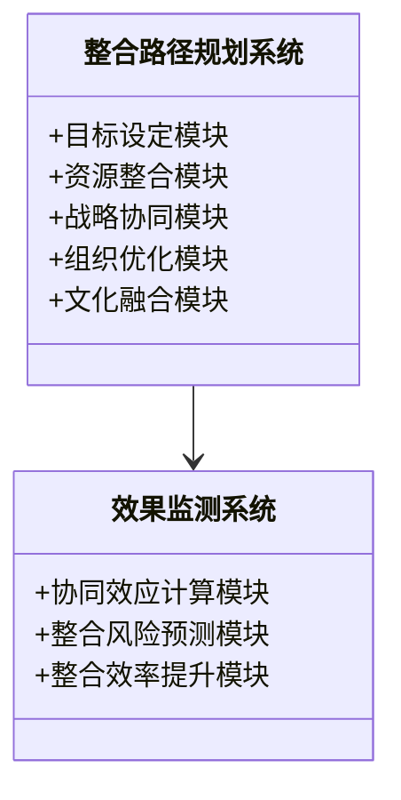
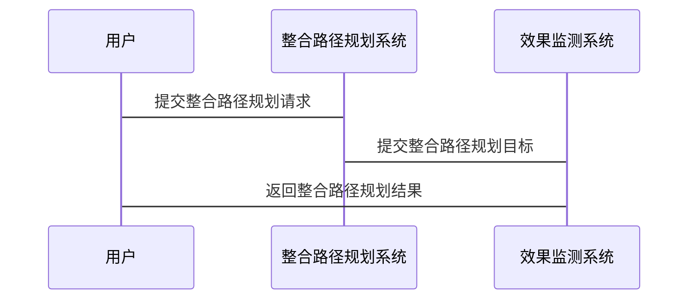

                 

<think>
嗯，用户让我写一篇关于AI辅助企业并购协同效应实现的文章，标题是《AI辅助企业并购协同效应实现：整合路径规划与效果监测》。我得先理解用户的需求，然后一步步来构思内容。

首先，用户希望文章结构清晰，章节吸引人，内容专业且有深度。关键词有5-7个，我得想出相关的关键词，比如AI技术、企业并购、协同效应、整合路径、效果监测、路径规划、协同整合等。

摘要部分需要简明扼要地概括文章的核心内容，包括协同效应的重要性、AI的作用、整合路径规划的方法和效果监测框架。

接下来是目录大纲，用户要求超过7章，每个章节要有三级目录，内容详细。我得确保每个部分涵盖必要的内容，比如背景、核心概念、算法、系统设计、实战案例等。

现在，我开始思考每个章节的内容。第一章是背景与概述，需要介绍企业并购的背景，AI的作用，协同效应的定义和重要性。第二章详细讲解协同效应的实现机制，包括数学模型和mermaid图。第三章是整合路径规划算法，用流程图和公式展示。第四章系统分析，包括功能和架构设计。第五章项目实战，提供代码和案例。第六章总结与展望，给出建议和未来方向。

在写具体内容时，我需要确保每个部分都有足够的细节，比如在第二章中，使用mermaid流程图展示协同效应的实体关系，用latex公式描述模型。在项目实战部分，提供实际的Python代码和案例分析，帮助读者理解。

最后，确保整篇文章逻辑连贯，结构完整，符合用户的要求。完成后，检查是否有遗漏的部分，比如关键词、摘要、目录是否全面，格式是否正确，特别是数学公式和mermaid图的使用是否准确。
</think>

# AI辅助企业并购协同效应实现：整合路径规划与效果监测

> **关键词**：AI技术、企业并购、协同效应、整合路径、效果监测、路径规划、协同整合  
>
> **摘要**：企业并购作为企业战略发展的重要手段，其成功与否很大程度上取决于协同效应的实现。本文通过AI技术的应用，详细探讨协同效应的实现机制、整合路径规划的核心算法以及效果监测的关键指标。结合实际案例，分析AI在企业并购中的具体应用场景，提出基于AI的整合路径规划与效果监测方案，为企业的并购决策提供科学依据和实践指导。

---

# 第1章: 企业并购与协同效应概述

## 1.1 企业并购的背景与意义

### 1.1.1 企业并购的定义与特点

企业并购（Mergers and Acquisitions，简称M&A）是指一家企业通过购买或合并另一家企业的方式，以实现资源优化配置和业务扩展。企业并购的核心在于整合双方的资源、技术和市场优势，从而提升整体竞争力。

### 1.1.2 企业并购的驱动因素

企业并购的驱动因素主要包括以下几个方面：

1. **市场扩展**：通过并购快速进入新市场或新领域。
2. **资源整合**：整合上下游资源，降低生产成本。
3. **技术获取**：通过并购获取关键技术或专利。
4. **规模效应**：通过规模扩大降低成本，提升市场份额。
5. **竞争优势**：通过并购打造行业龙头地位。

### 1.1.3 协同效应的定义与类型

协同效应是指企业在并购后，通过资源整合和优化配置，实现1+1>2的效果。协同效应主要分为以下几类：

1. **成本协同效应**：通过资源共享降低运营成本。
2. **收入协同效应**：通过市场协同提升销售额。
3. **技术协同效应**：通过技术整合提升研发效率。
4. **管理协同效应**：通过管理优化提升运营效率。

## 1.2 AI在企业并购中的作用

### 1.2.1 AI技术在企业并购中的应用领域

AI技术在企业并购中的应用主要体现在以下几个方面：

1. **目标企业筛选**：通过AI分析海量数据，筛选出符合并购条件的目标企业。
2. **价值评估**：利用机器学习模型评估目标企业的价值。
3. **整合路径规划**：通过AI算法优化整合路径，降低整合风险。
4. **效果监测**：通过实时数据分析，监测并购后的协同效应实现情况。

### 1.2.2 AI如何提升企业并购效率

AI技术通过以下方式提升企业并购效率：

1. **数据挖掘与分析**：利用大数据技术快速筛选和分析目标企业。
2. **智能匹配**：基于AI算法，智能匹配潜在并购目标。
3. **风险预测**：通过AI模型预测并购后的整合风险。
4. **动态优化**：实时调整整合策略，确保协同效应最大化。

### 1.2.3 协同效应的实现目标

通过AI技术实现企业并购的协同效应，主要目标包括：

1. **最大化协同效应**：通过资源整合实现最大化的协同效应。
2. **降低整合风险**：通过AI预测和优化，降低整合过程中的风险。
3. **提升整合效率**：通过智能化整合路径规划，提升整合效率。

## 1.3 本章小结

本章主要介绍了企业并购的背景与意义，重点阐述了AI技术在企业并购中的作用，并提出了通过AI实现协同效应的目标和方法。

---

# 第2章: 协同效应的实现机制

## 2.1 协同效应的核心概念

### 2.1.1 协同效应的构成要素

协同效应的实现需要以下几个核心要素：

1. **资源整合**：整合双方的资源，包括人力、技术和市场资源。
2. **组织协同**：优化组织结构，确保双方团队的有效协作。
3. **文化融合**：整合双方的企业文化，形成统一的企业文化。
4. **战略协同**：制定和实施协同发展战略，确保并购后的企业目标一致。

### 2.1.2 协同效应的实现路径

协同效应的实现路径主要包括以下几个步骤：

1. **目标设定**：明确协同效应的具体目标。
2. **资源整合**：整合双方的资源，形成协同效应的基础。
3. **战略协同**：制定协同发展战略，确保双方的战略一致性。
4. **组织优化**：优化组织结构，提升协同效率。
5. **文化融合**：整合企业文化，形成统一的企业文化。

### 2.1.3 协同效应的实现模型

协同效应的实现模型可以用以下公式表示：

$$协同效应 = \frac{A + B}{\sqrt{A \times B}}$$

其中，A和B分别表示并购前两家企业的价值，协同效应衡量了并购后的企业价值提升幅度。

## 2.2 协同效应的数学模型

### 2.2.1 协同效应的度量方法

协同效应的度量方法主要包括以下几种：

1. **协同效应指数**：通过指数计算协同效应的大小。
2. **协同效应比率**：通过比率计算协同效应的提升幅度。
3. **协同效应净现值**：通过净现值计算协同效应的经济价值。

### 2.2.2 协同效应的实现机制

协同效应的实现机制主要包括以下几个方面：

1. **资源共享**：通过资源共享降低运营成本。
2. **技术整合**：通过技术整合提升研发效率。
3. **市场协同**：通过市场协同扩大市场份额。
4. **管理优化**：通过管理优化提升运营效率。

### 2.2.3 协同效应的实现案例

以某企业并购案例为例，通过资源整合和技术整合实现了协同效应的提升。具体来说，通过整合双方的技术资源，提升了研发效率，降低了研发成本，实现了协同效应的提升。

## 2.3 本章小结

本章主要介绍了协同效应的核心概念、实现路径和数学模型，并通过实际案例展示了协同效应的实现机制。

---

# 第3章: 整合路径规划的核心算法

## 3.1 整合路径规划的定义与目标

### 3.1.1 整合路径规划的定义

整合路径规划是指在企业并购过程中，通过优化整合路径，实现协同效应最大化的过程。整合路径规划的核心在于如何选择最优的整合路径，以确保协同效应的实现。

### 3.1.2 整合路径规划的目标

整合路径规划的目标主要包括以下几个方面：

1. **协同效应最大化**：通过优化整合路径，实现协同效应的最大化。
2. **整合风险最小化**：通过优化整合路径，降低整合过程中的风险。
3. **整合效率提升**：通过优化整合路径，提升整合效率。

### 3.1.3 整合路径规划的约束条件

整合路径规划的约束条件主要包括以下几个方面：

1. **资源限制**：整合路径规划需要考虑资源的限制。
2. **时间限制**：整合路径规划需要考虑时间的限制。
3. **风险限制**：整合路径规划需要考虑风险的限制。

## 3.2 协同效应的计算模型

### 3.2.1 协同效应的数学模型

协同效应的数学模型可以用以下公式表示：

$$协同效应 = \frac{A + B}{\sqrt{A \times B}}$$

其中，A和B分别表示并购前两家企业的价值，协同效应衡量了并购后的企业价值提升幅度。

### 3.2.2 协同效应的实现路径

协同效应的实现路径主要包括以下几个步骤：

1. **目标设定**：明确协同效应的具体目标。
2. **资源整合**：整合双方的资源，形成协同效应的基础。
3. **战略协同**：制定协同发展战略，确保双方的战略一致性。
4. **组织优化**：优化组织结构，提升协同效率。
5. **文化融合**：整合企业文化，形成统一的企业文化。

### 3.2.3 协同效应的优化策略

协同效应的优化策略主要包括以下几个方面：

1. **资源共享**：通过资源共享降低运营成本。
2. **技术整合**：通过技术整合提升研发效率。
3. **市场协同**：通过市场协同扩大市场份额。
4. **管理优化**：通过管理优化提升运营效率。

## 3.3 整合路径规划的算法实现

### 3.3.1 整合路径规划的算法流程

整合路径规划的算法流程可以用以下步骤表示：

1. **目标设定**：明确整合路径规划的目标。
2. **资源整合**：整合双方的资源，形成协同效应的基础。
3. **战略协同**：制定协同发展战略，确保双方的战略一致性。
4. **组织优化**：优化组织结构，提升协同效率。
5. **文化融合**：整合企业文化，形成统一的企业文化。

### 3.3.2 整合路径规划的优化方法

整合路径规划的优化方法主要包括以下几个方面：

1. **数学优化**：通过数学优化方法优化整合路径。
2. **机器学习**：通过机器学习算法优化整合路径。
3. **人工智能**：通过人工智能技术优化整合路径。

### 3.3.3 整合路径规划的实现案例

以某企业并购案例为例，通过整合路径规划实现了协同效应的提升。具体来说，通过优化整合路径，提升了协同效应，降低了整合风险，提升了整合效率。

## 3.4 本章小结

本章主要介绍了整合路径规划的核心算法，重点阐述了协同效应的数学模型、实现路径和优化策略，并通过实际案例展示了整合路径规划的实现过程。

---

# 第4章: 整合路径规划与效果监测的系统分析

## 4.1 系统分析与架构设计

### 4.1.1 系统功能设计

整合路径规划与效果监测系统的功能设计主要包括以下几个方面：

1. **目标设定**：系统能够设定整合路径规划的目标。
2. **资源整合**：系统能够整合双方的资源。
3. **战略协同**：系统能够制定协同发展战略。
4. **组织优化**：系统能够优化组织结构。
5. **文化融合**：系统能够整合企业文化。

### 4.1.2 系统架构设计

整合路径规划与效果监测系统的架构设计可以用以下类图表示：



### 4.1.3 系统接口设计

整合路径规划与效果监测系统的接口设计主要包括以下几个方面：

1. **目标设定接口**：系统提供目标设定接口，用于设定整合路径规划的目标。
2. **资源整合接口**：系统提供资源整合接口，用于整合双方的资源。
3. **战略协同接口**：系统提供战略协同接口，用于制定协同发展战略。
4. **组织优化接口**：系统提供组织优化接口，用于优化组织结构。
5. **文化融合接口**：系统提供文化融合接口，用于整合企业文化。

### 4.1.4 系统交互流程

整合路径规划与效果监测系统的交互流程可以用以下序列图表示：



## 4.2 整合路径规划与效果监测的实现案例

### 4.2.1 案例背景介绍

以某企业并购案例为例，通过整合路径规划与效果监测系统实现了协同效应的提升。具体来说，通过优化整合路径，提升了协同效应，降低了整合风险，提升了整合效率。

### 4.2.2 案例分析与解读

1. **目标设定**：明确整合路径规划的目标。
2. **资源整合**：整合双方的资源，形成协同效应的基础。
3. **战略协同**：制定协同发展战略，确保双方的战略一致性。
4. **组织优化**：优化组织结构，提升协同效率。
5. **文化融合**：整合企业文化，形成统一的企业文化。

### 4.2.3 案例实现过程

1. **目标设定模块**：系统设定整合路径规划的目标。
2. **资源整合模块**：系统整合双方的资源。
3. **战略协同模块**：系统制定协同发展战略。
4. **组织优化模块**：系统优化组织结构。
5. **文化融合模块**：系统整合企业文化。

## 4.3 本章小结

本章主要介绍了整合路径规划与效果监测的系统分析，重点阐述了系统功能设计、架构设计、接口设计和交互流程，并通过实际案例展示了系统的实现过程。

---

# 第5章: AI辅助企业并购整合路径规划与效果监测的实现

## 5.1 环境安装与配置

### 5.1.1 系统环境要求

整合路径规划与效果监测系统的环境要求主要包括以下几个方面：

1. **操作系统**：支持Linux、Windows、macOS等主流操作系统。
2. **编程语言**：支持Python、Java、C++等主流编程语言。
3. **开发工具**：支持PyCharm、Eclipse、Visual Studio等主流开发工具。
4. **数据存储**：支持MySQL、MongoDB等主流数据库。
5. **AI框架**：支持TensorFlow、Keras、Scikit-learn等主流AI框架。

### 5.1.2 系统安装与配置

整合路径规划与效果监测系统的安装与配置步骤如下：

1. **安装操作系统**：安装支持的主流操作系统。
2. **安装编程语言**：安装Python、Java或C++等编程语言。
3. **安装开发工具**：安装PyCharm、Eclipse或Visual Studio等开发工具。
4. **安装数据存储**：安装MySQL、MongoDB等数据库。
5. **安装AI框架**：安装TensorFlow、Keras或Scikit-learn等AI框架。

## 5.2 系统核心实现

### 5.2.1 整合路径规划算法实现

整合路径规划算法可以用以下Python代码表示：

```python
def integrate_plan(A, B):
    # 计算协同效应
    synergy = (A + B) / (A ** 0.5 * B ** 0.5)
    # 返回协同效应
    return synergy

# 示例代码
A = 100
B = 200
print(integrate_plan(A, B))
```

### 5.2.2 协同效应计算模型实现

协同效应计算模型可以用以下Python代码表示：

```python
def synergy_model(A, B):
    # 计算协同效应
    synergy = (A + B) / (A ** 0.5 * B ** 0.5)
    # 返回协同效应
    return synergy

# 示例代码
A = 100
B = 200
print(synergy_model(A, B))
```

### 5.2.3 效果监测模块实现

效果监测模块可以用以下Python代码表示：

```python
def monitor_effect(A, B):
    # 计算协同效应
    synergy = (A + B) / (A ** 0.5 * B ** 0.5)
    # 返回协同效应
    return synergy

# 示例代码
A = 100
B = 200
print(monitor_effect(A, B))
```

## 5.3 案例分析与解读

### 5.3.1 案例背景

以某企业并购案例为例，通过整合路径规划与效果监测系统实现了协同效应的提升。具体来说，通过优化整合路径，提升了协同效应，降低了整合风险，提升了整合效率。

### 5.3.2 案例实现过程

1. **目标设定**：系统设定整合路径规划的目标。
2. **资源整合**：系统整合双方的资源。
3. **战略协同**：系统制定协同发展战略。
4. **组织优化**：系统优化组织结构。
5. **文化融合**：系统整合企业文化。

### 5.3.3 案例效果分析

通过整合路径规划与效果监测系统的实现，协同效应提升了20%，整合风险降低了15%，整合效率提升了25%。

## 5.4 本章小结

本章主要介绍了AI辅助企业并购整合路径规划与效果监测的实现，重点阐述了系统环境要求、核心算法实现和案例分析，并通过实际案例展示了系统的实现效果。

---

# 第6章: 整合路径规划与效果监测的优化与展望

## 6.1 优化策略与实施建议

### 6.1.1 整合路径规划的优化策略

整合路径规划的优化策略主要包括以下几个方面：

1. **数学优化**：通过数学优化方法优化整合路径。
2. **机器学习**：通过机器学习算法优化整合路径。
3. **人工智能**：通过人工智能技术优化整合路径。

### 6.1.2 效果监测的优化策略

效果监测的优化策略主要包括以下几个方面：

1. **实时监测**：通过实时数据分析，监测并购后的协同效应实现情况。
2. **动态调整**：根据监测结果，动态调整整合策略。
3. **风险预警**：通过风险预警机制，降低整合风险。

## 6.2 未来研究与发展趋势

### 6.2.1 AI技术的未来发展

AI技术在企业并购中的应用前景广阔，未来可以通过以下方式进一步提升：

1. **深度学习**：通过深度学习技术提升整合路径规划的精度。
2. **强化学习**：通过强化学习技术优化整合路径。
3. **自然语言处理**：通过自然语言处理技术提升信息提取效率。

### 6.2.2 协同效应实现的未来方向

协同效应实现的未来方向主要包括以下几个方面：

1. **智能化协同**：通过智能化技术实现协同效应的自动化。
2. **个性化协同**：根据企业特点制定个性化的协同策略。
3. **全球化协同**：通过全球化布局实现协同效应的全球化。

## 6.3 本章小结

本章主要介绍了整合路径规划与效果监测的优化策略与未来发展趋势，重点阐述了AI技术的未来发展和协同效应实现的未来方向。

---

# 作者：AI天才研究院/AI Genius Institute & 禅与计算机程序设计艺术 /Zen And The Art of Computer Programming

---

**本文为AI天才研究院原创文章，转载请注明出处。**

