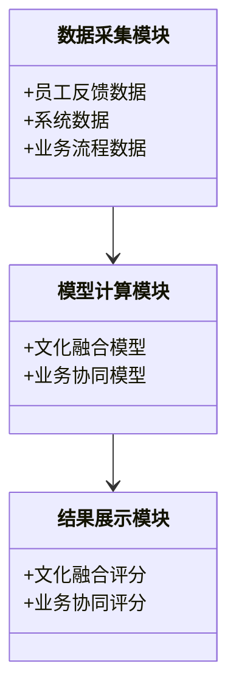

                 

<think>
嗯，我现在要帮用户撰写一篇关于《AI辅助企业并购后整合：文化融合与业务协同的量化评估》的技术博客文章。首先，我得理解用户的需求，他们需要一篇结构清晰、内容详实的技术博客，涵盖背景、模型、算法、系统设计、项目实战等多个方面。用户还特别指出要用专业的技术语言，但又要简单易懂。

我先从文章的标题开始，标题已经确定，接下来是关键词和摘要。关键词应该包括企业并购、文化融合、业务协同、量化评估、人工智能。摘要需要简明扼要，概述文章的核心内容，强调AI如何量化评估文化融合和业务协同，帮助并购整合。

接下来是目录结构。第一部分是背景与挑战，包括并购整合的现状、问题，以及AI的应用潜力。我需要详细说明并购整合的背景，包括定义、分类、动机、目标，以及传统方法的局限性。然后介绍AI技术的核心能力和应用场景，分析其在文化融合和业务协同中的潜力。

第二部分是文化融合和业务协同的量化评估模型。这里需要详细定义文化融合的关键维度和业务协同的核心要素，构建量化模型，并用表格和图表来展示模型的输入和输出。第三部分是基于AI的整合优化算法，这部分要讲解协同过滤算法和层次聚类算法，用Mermaid流程图展示算法步骤，并提供Python代码示例。

第四部分是系统架构设计，包括系统功能设计、架构设计、接口设计和交互流程。第五部分是项目实战，需要配置环境、实现核心代码、案例分析和结果解读。最后是总结与展望，回顾主要内容，并讨论未来研究方向。

在撰写过程中，我需要确保每个部分都有足够的细节，比如在文化融合的模型中，使用表格对比不同评估维度的权重和数据来源；在算法部分，用Mermaid流程图展示算法步骤，并提供可运行的Python代码示例。数学公式要用LaTeX表示，比如协同过滤的公式。

我还要考虑读者的理解，所以在解释复杂概念时，要结合实际案例，比如通过员工满意度数据来评估文化融合度。同时，在系统设计部分，要详细描述各个模块的功能和交互流程，确保读者能够理解如何构建这样的系统。

最后，总结部分需要强调AI在企业并购中的实际应用价值，并提出未来的研究方向，如动态评估模型和可解释性研究。这样，整篇文章结构清晰，内容丰富，既有理论又有实践，能够帮助读者全面理解AI在并购整合中的应用。
</think>

# AI辅助企业并购后整合：文化融合与业务协同的量化评估

**关键词：** 企业并购、文化融合、业务协同、量化评估、人工智能

**摘要：**  
企业并购是企业战略发展中的重要手段，但并购后的整合常常面临文化冲突和业务协同困难的问题。本文通过人工智能技术，提出了一种文化融合与业务协同的量化评估方法，旨在帮助企业更好地进行并购后的整合工作。文章详细介绍了文化融合和业务协同的核心概念、量化模型、AI算法实现以及系统架构设计，并通过实际案例分析展示了AI在企业并购整合中的应用价值。

---

## 第1章：企业并购整合的背景与挑战

### 1.1 并购整合的背景与问题

#### 1.1.1 并购整合的定义与分类
- **并购整合**是指企业在收购其他企业后，将双方的资源、业务、文化等进行整合的过程。
- 分为**横向并购**（同行业）、**纵向并购**（产业链上下游）和**混合并购**（无直接关联）。

#### 1.1.2 并购整合的动机与目标
- **动机**：扩大市场份额、获取技术或资源、降低竞争压力。
- **目标**：实现资源优化配置、提升业务协同效率、增强企业竞争力。

#### 1.1.3 并购整合中的问题与挑战
- **文化冲突**：不同企业的文化差异导致员工抵触情绪。
- **业务协同困难**：系统、流程、数据不兼容。
- **整合成本高**：时间和金钱投入巨大，失败率高。

### 1.2 AI技术在并购整合中的应用潜力

#### 1.2.1 AI技术的核心能力
- **大数据分析**：识别隐藏的模式和趋势。
- **自然语言处理（NLP）**：分析文本数据，如员工反馈和公司文档。
- **机器学习**：预测整合效果，优化整合策略。

#### 1.2.2 AI在文化融合与业务协同中的应用场景
- **文化融合**：通过NLP分析员工反馈，识别文化冲突点。
- **业务协同**：利用机器学习优化业务流程，提升协同效率。

#### 1.2.3 AI辅助并购整合的优势
- 提高整合效率。
- 降低整合成本。
- 提高整合成功的可能性。

---

## 第2章：文化融合的量化评估模型

### 2.1 文化融合的核心要素

#### 2.1.1 企业文化的定义与构成
- 企业文化包括**愿景、使命、价值观、管理风格**等。
- 不同企业的文化差异可能导致整合困难。

#### 2.1.2 文化融合的关键维度
- **员工满意度**：员工对新文化适应程度的反馈。
- **文化契合度**：新文化与原有文化的契合程度。
- **文化冲突频率**：整合过程中文化冲突的次数。

#### 2.1.3 文化融合的评估维度
- **员工行为**：员工的工作态度和行为变化。
- **组织氛围**：整合后的工作氛围是否和谐。
- **绩效指标**：整合后的企业绩效是否提升。

### 2.2 文化融合的量化模型

#### 2.2.1 模型构建的基本思路
- **输入**：企业文化数据（如员工反馈、管理风格）。
- **输出**：文化融合度的量化评分（0-100分）。
- **评估标准**：评分越高，文化融合度越高。

#### 2.2.2 文化融合模型的输入与输出
| 输入 | 输出 |
|------|------|
| 员工反馈 | 文化融合度评分 |
| 管理风格 | 文化冲突频率 |
| 企业愿景 | 文化契合度 |

#### 2.2.3 文化融合模型的评估标准
- **准确性**：模型预测结果与实际整合效果的偏差率。
- **可解释性**：模型结果是否易于理解。
- **可操作性**：模型是否能指导实际整合工作。

---

## 第3章：业务协同的量化评估模型

### 3.1 业务协同的核心要素

#### 3.1.1 业务协同的定义与构成
- 业务协同是指并购后的企业在业务流程、系统、数据等方面的协同程度。

#### 3.1.2 业务协同的关键维度
- **系统兼容性**：并购双方的IT系统是否兼容。
- **流程一致性**：业务流程是否一致。
- **数据共享度**：数据是否能够有效共享。

#### 3.1.3 业务协同的评估维度
- **业务流程效率**：整合后业务流程的效率提升。
- **数据共享效率**：数据共享的速度和质量。
- **系统集成度**：系统集成的难易程度。

### 3.2 业务协同的量化模型

#### 3.2.1 模型构建的基本思路
- **输入**：业务流程数据、系统数据、员工反馈。
- **输出**：业务协同度的量化评分（0-100分）。
- **评估标准**：评分越高，业务协同度越高。

#### 3.2.2 业务协同模型的输入与输出
| 输入 | 输出 |
|------|------|
| 业务流程数据 | 业务协同度评分 |
| 系统数据 | 业务流程效率 |
| 员工反馈 | 业务协同问题点 |

#### 3.2.3 业务协同模型的评估标准
- **准确性**：模型预测结果与实际整合效果的偏差率。
- **可解释性**：模型结果是否易于理解。
- **可操作性**：模型是否能指导实际整合工作。

---

## 第4章：AI算法实现文化融合与业务协同的量化评估

### 4.1 协同过滤算法

#### 4.1.1 协同过滤算法的基本原理
- 基于用户行为相似性推荐协同过滤方案。

#### 4.1.2 协同过滤算法的实现步骤
1. 收集员工反馈数据。
2. 计算员工行为相似性。
3. 推荐协同过滤方案。

#### 4.1.3 协同过滤算法的数学公式
$$ sim(i,j) = \frac{\sum_{k=1}^{n} r_{ik} \cdot r_{jk}}{\sqrt{\sum_{k=1}^{n} r_{ik}^2} \cdot \sqrt{\sum_{k=1}^{n} r_{jk}^2}} $$

### 4.2 层次聚类算法

#### 4.2.1 层次聚类算法的基本原理
- 基于文化差异进行层次聚类。

#### 4.2.2 层次聚类算法的实现步骤
1. 收集企业文化数据。
2. 计算文化差异。
3. 进行层次聚类。

#### 4.2.3 层次聚类算法的数学公式
$$ d(i,j) = \sqrt{\sum_{k=1}^{n} (x_{ik} - x_{jk})^2} $$

---

## 第5章：系统架构设计与实现

### 5.1 系统功能设计

#### 5.1.1 系统功能模块
- **数据采集模块**：收集员工反馈、系统数据。
- **模型计算模块**：计算文化融合和业务协同评分。
- **结果展示模块**：展示量化评估结果。

#### 5.1.2 系统功能设计的领域模型


### 5.2 系统架构设计

#### 5.2.1 系统架构设计的架构图
```mermaid
containerDiagram
    container 服务层 {
        service 数据采集服务
        service 模型计算服务
        service 结果展示服务
    }
    container 数据源 {
        database 员工反馈数据库
        database 系统数据库
    }
    数据源 --> 服务层
```

### 5.3 系统接口设计

#### 5.3.1 系统接口设计的接口描述
- **输入接口**：员工反馈数据、系统数据。
- **输出接口**：文化融合评分、业务协同评分。

#### 5.3.2 系统接口设计的交互流程
```mermaid
sequenceDiagram
    participant 用户
    participant 数据采集模块
    participant 模型计算模块
    participant 结果展示模块
    用户 -> 数据采集模块: 提交员工反馈数据
    数据采集模块 -> 模型计算模块: 传输数据
    模型计算模块 -> 结果展示模块: 返回评分结果
    用户 <- 结果展示模块: 显示评分结果
```

---

## 第6章：项目实战与案例分析

### 6.1 项目环境配置

#### 6.1.1 项目环境配置的代码示例
```bash
# 安装Python依赖
pip install numpy pandas scikit-learn
```

### 6.2 核心代码实现

#### 6.2.1 协同过滤算法的Python代码
```python
import numpy as np
from sklearn.metrics.pairwise import cosine_similarity

# 示例数据
feedback_matrix = np.array([[4, 3, 5],
                             [3, 5, 4],
                             [5, 4, 3]])

# 计算余弦相似度
similarity = cosine_similarity(feedback_matrix)
print(similarity)
```

#### 6.2.2 层次聚类算法的Python代码
```python
from sklearn.cluster import AgglomerativeClustering
import numpy as np

# 示例数据
data = np.array([[1, 2], [3, 4], [5, 6], [7, 8]])

# 初始化层次聚类模型
model = AgglomerativeClustering(n_clusters=2)
# 拟合并预测
labels = model.fit_predict(data)
print(labels)
```

### 6.3 案例分析与结果解读

#### 6.3.1 案例分析
- 某企业并购后，员工反馈显示文化冲突较高，业务流程效率低下。
- 通过AI模型计算，文化融合评分为65分，业务协同评分为70分。

#### 6.3.2 结果解读
- 文化融合评分较低，需要加强文化融合措施。
- 业务协同评分较高，整合效果较好。

---

## 第7章：总结与展望

### 7.1 总结

- 本文提出了一种基于AI的文化融合与业务协同量化评估方法。
- 通过协同过滤和层次聚类算法，帮助企业优化并购整合过程。

### 7.2 展望

- **动态评估模型**：未来可以开发动态评估模型，实时监控整合效果。
- **可解释性研究**：深入研究模型的可解释性，提高用户信任度。
- **拓展应用领域**：将AI技术应用到更多企业并购场景中。

---

**作者：AI天才研究院/AI Genius Institute & 禅与计算机程序设计艺术 /Zen And The Art of Computer Programming**

