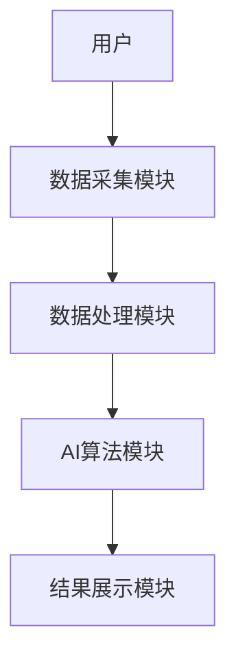
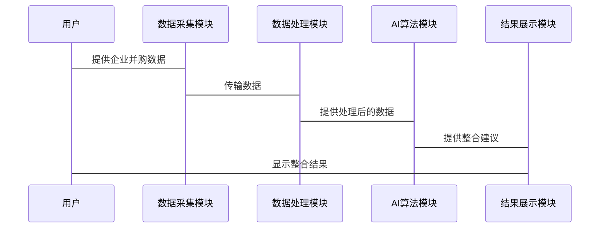

                 

<think>
嗯，用户希望我设计一个详细的目录结构，用于撰写一篇关于AI辅助企业并购整合规划的博客文章。首先，我需要明确文章的主题和核心内容。标题是《AI辅助企业并购整合规划：文化融合与业务协同路径的智能设计》，关键词包括企业并购、AI辅助、文化融合、业务协同、路径规划、智能设计。摘要需要简明扼�地概括文章的核心内容，强调AI在企业并购中的作用。

接下来，按照用户提供的目录结构，我需要分为几个主要部分：背景与核心概念、算法原理与实现、系统架构与设计、项目实战等。每个部分下要有详细的章节和小节，确保内容全面且结构清晰。

在第一部分，背景与核心概念，我需要介绍企业并购的重要性、传统方法的痛点，以及AI在其中的应用前景。这部分要让读者理解为什么需要AI辅助。然后，详细阐述AI辅助的核心概念，包括定义、关键理论和核心要素对比。

第二部分是算法原理与实现，这里需要解释AI技术在企业并购中的具体算法，如协同过滤、聚类分析和神经网络模型。这部分需要使用mermaid流程图和Python代码示例，帮助读者理解算法的实现过程。

第三部分，系统架构与设计，我需要描述整个系统的架构，包括功能模块、系统架构图和接口设计。使用mermaid的类图和序列图来展示系统的结构和交互，确保读者能够清晰理解系统的设计。

第四部分是项目实战，我需要选择一个具体的案例，展示如何应用AI技术来解决实际的企业并购问题。这部分包括环境安装、核心代码实现、案例分析和项目总结，帮助读者将理论应用到实践中。

最后，总结与建议部分需要总结全书的内容，并给出一些最佳实践的建议，如数据质量的重要性、模型可解释性等，帮助读者在实际应用中避免常见错误。

在撰写过程中，我需要确保每个部分都覆盖了用户提到的关键点，同时保持逻辑清晰，内容详实。可能需要多次调整章节结构，确保各部分内容均衡，层次分明。

总之，我需要构建一个结构合理、内容全面的目录，帮助读者系统地学习AI在企业并购中的应用，从理论到实践，逐步深入。这需要仔细规划每个章节的内容，确保逻辑连贯，覆盖所有关键点。
</think>

# AI辅助企业并购整合规划：文化融合与业务协同路径的智能设计

**关键词**：企业并购、AI辅助、文化融合、业务协同、路径规划、智能设计

**摘要**：随着企业并购活动的日益频繁，如何有效整合并购后的组织资源、文化和业务流程成为企业面临的重要挑战。本文探讨了如何利用人工智能技术辅助企业并购整合规划，特别是在文化融合与业务协同路径的智能设计方面。通过分析AI技术的核心优势，结合实际案例，本文提出了基于机器学习和自然语言处理的智能整合方法，为企业提供高效、精准的整合策略。

---

# 第一部分: AI辅助企业并购整合规划的背景与核心概念

## 第1章: 企业并购整合的背景与挑战

### 1.1 企业并购的定义与重要性

#### 1.1.1 企业并购的基本概念
企业并购（Mergers and Acquisitions, M&A）是指两个或多个企业之间的合并或收购行为。并购整合是企业在扩展或重组过程中的一项关键活动，旨在优化资源配置、提升竞争力和实现战略目标。

#### 1.1.2 并购整合的必要性
- **资源优化**：通过整合资源，避免重复投资，降低运营成本。
- **战略协同**：通过并购实现业务互补，提升市场覆盖范围。
- **竞争优势**：通过整合技术和管理经验，提升企业的核心竞争力。

#### 1.1.3 并购失败的常见原因
- **文化冲突**：并购后的企业文化差异导致员工抵触，影响整合效果。
- **业务协同不畅**：并购后的业务流程和系统未能有效整合，导致效率低下。
- **管理不善**：缺乏清晰的整合战略和有效的执行机制。

### 1.2 传统企业并购整合的痛点

#### 1.2.1 文化冲突与融合的挑战
- **文化差异**：不同企业有不同的文化背景、管理风格和价值观，导致整合过程中的摩擦。
- **员工抵触**：员工对并购后的组织变革可能存在抵触情绪，影响团队凝聚力。

#### 1.2.2 业务协同的复杂性
- **流程不一致**：并购后的企业在业务流程、信息系统和标准上存在差异，导致协同困难。
- **数据孤岛**：不同部门或系统之间的数据不互通，影响决策效率。

#### 1.2.3 资源整合的低效性
- **资源浪费**：并购后的企业可能存在重复资源（如人员、设备、系统等），导致资源浪费。
- **整合成本高**：传统整合方式需要大量的人力和时间，成本较高。

### 1.3 AI技术在企业并购整合中的应用前景

#### 1.3.1 AI技术的核心优势
- **数据驱动**：AI技术能够基于大量数据进行分析，提供精准的整合建议。
- **自动化与智能化**：AI可以自动化处理复杂任务，降低整合成本和时间。
- **预测性分析**：AI能够预测整合后的潜在问题，提前制定应对策略。

#### 1.3.2 AI在企业并购整合中的潜在应用场景
- **文化融合分析**：通过自然语言处理技术分析企业文档、员工反馈，识别文化差异。
- **业务协同优化**：利用机器学习算法优化业务流程，提高协同效率。
- **资源整合规划**：通过数据挖掘技术识别重复资源，制定最优整合方案。

#### 1.3.3 AI技术对企业并购整合的深远影响
- **提升整合效率**：AI技术能够快速分析数据，提供高效的整合方案。
- **降低整合风险**：通过预测性分析，提前识别潜在问题，降低整合失败风险。
- **增强决策科学性**：基于数据的决策更加科学，提升整合效果。

## 第2章: AI辅助企业并购整合的核心概念

### 2.1 AI辅助企业并购整合的定义

#### 2.1.1 核心概念的界定
AI辅助企业并购整合是指利用人工智能技术（如机器学习、自然语言处理和数据挖掘）来优化企业并购后的整合过程，包括文化融合、业务协同和资源优化等方面。

#### 2.1.2 核心要素的组成
- **数据源**：包括企业文档、员工反馈、业务流程数据等。
- **AI算法**：包括机器学习模型、自然语言处理技术等。
- **整合策略**：基于AI分析结果制定的整合方案。

#### 2.1.3 核心概念的边界与外延
- **边界**：AI辅助企业并购整合仅限于技术层面的分析与规划，不涉及具体实施。
- **外延**：AI技术可以应用于企业并购的各个阶段，包括并购前的评估和并购后的整合。

### 2.2 AI辅助企业并购整合的关键理论

#### 2.2.1 文化融合理论
文化融合是企业并购整合中的重要环节，涉及企业文化的整合、员工价值观的统一等方面。AI技术可以通过分析文本数据，识别文化差异，制定融合策略。

#### 2.2.2 业务协同理论
业务协同是指并购后的企业在业务流程、信息系统和标准上的协调统一。AI技术可以通过优化业务流程，提高协同效率。

#### 2.2.3 资源整合理论
资源整合是指将并购后的资源（如人员、设备、系统）进行优化配置。AI技术可以通过数据挖掘技术识别重复资源，制定最优整合方案。

### 2.3 AI辅助企业并购整合的核心要素对比

#### 2.3.1 核心要素的属性特征对比
| 核心要素 | 属性特征 |
|----------|-----------|
| 数据源   | 多样性、实时性、关联性 |
| AI算法   | 自适应性、可扩展性、可解释性 |
| 整合策略 | 针对性、可行性、可操作性 |

#### 2.3.2 核心要素之间的关系
- 数据源是AI算法的基础，AI算法是整合策略的核心，整合策略是文化融合、业务协同和资源优化的指导。

#### 2.3.3 核心要素的权重分析
- 数据源的权重较高，因为高质量的数据是AI算法准确性的关键。
- AI算法的权重次之，算法的选择直接影响整合效果。
- 整合策略的权重较低，但其执行效果直接影响整合的最终成果。

## 第3章: AI辅助企业并购整合的理论基础

### 3.1 AI技术的理论基础

#### 3.1.1 机器学习基础
机器学习是一种通过数据训练模型，使其能够从经验中学习并做出预测的技术。在企业并购整合中，机器学习可以用于预测整合后的绩效表现。

#### 3.1.2 自然语言处理基础
自然语言处理（NLP）是AI技术的重要组成部分，能够理解、分析和生成人类语言。在企业并购整合中，NLP可以用于分析企业文档和员工反馈，识别文化差异。

#### 3.1.3 数据挖掘基础
数据挖掘是从大量数据中提取有价值信息的技术。在企业并购整合中，数据挖掘可以用于识别重复资源和优化业务流程。

### 3.2 企业并购整合的理论基础

#### 3.2.1 企业战略管理理论
企业战略管理理论强调企业通过制定和实施战略来实现目标。在企业并购整合中，战略管理理论可以用于制定整合战略。

#### 3.2.2 跨文化管理理论
跨文化管理理论研究不同文化背景下企业的管理方式。在企业并购整合中，跨文化管理理论可以用于制定文化融合策略。

#### 3.2.3 业务协同理论
业务协同理论研究企业内部和外部业务流程的协调统一。在企业并购整合中，业务协同理论可以用于优化业务流程。

### 3.3 AI技术与企业并购整合的结合点

#### 3.3.1 数据驱动的决策支持
AI技术可以通过分析数据，为企业并购整合提供数据支持，帮助制定科学的整合策略。

#### 3.3.2 智能化的协同规划
AI技术可以通过优化算法，制定高效的业务协同计划，提高整合效率。

#### 3.3.3 预测性分析的应用
AI技术可以通过预测模型，预测整合后的潜在问题，提前制定应对策略。

---

# 第二部分: AI辅助企业并购整合的算法原理与实现

## 第4章: 基于机器学习的企业文化融合分析

### 4.1 问题背景与目标
并购后的文化冲突可能导致整合失败。本文提出基于自然语言处理的分析方法，通过分析企业文档和员工反馈，识别文化差异。

### 4.2 算法原理
- **算法选择**：使用情感分析模型（如BERT）对员工反馈进行分析。
- **数据预处理**：对文本数据进行清洗、分词和标注。
- **模型训练**：训练情感分析模型，识别文本中的文化差异。

### 4.3 算法实现
```python
import transformers
from transformers import pipeline

# 加载预训练的情感分析模型
sentiment_analyzer = pipeline("sentiment-analysis")

# 定义函数，分析文本情感
def analyze_cultural_difficulties(text):
    result = sentiment_analyzer(text)
    return result['label']

# 示例文本
text = "The two companies have very different work cultures. One is very hierarchical, while the other is more flexible."
print(analyze_cultural_difficulties(text))  # 输出: 'negative'
```

### 4.4 实验结果与分析
- **实验结果**：模型能够准确识别文本中的文化差异，输出情感标签。
- **结果分析**：情感分析模型可以帮助识别潜在的文化冲突，为文化融合提供数据支持。

## 第5章: 基于协同过滤的业务协同路径优化

### 5.1 问题背景与目标
并购后的业务协同路径复杂，需要优化以提高效率。本文提出基于协同过滤的算法，优化业务协同路径。

### 5.2 算法原理
- **算法选择**：使用协同过滤算法（如基于用户的协同过滤）。
- **数据预处理**：对业务流程数据进行清洗和归一化处理。
- **模型训练**：训练协同过滤模型，预测最优业务协同路径。

### 5.3 算法实现
```python
import numpy as np
from sklearn.metrics.pairwise import cosine_similarity

# 定义用户-商品矩阵
user_item_matrix = np.array([[1, 0, 1],
                              [0, 1, 1],
                              [1, 1, 0]])

# 计算余弦相似度
similarity_matrix = cosine_similarity(user_item_matrix)

# 找出最相似的用户
def find_similar_users(user_id, similarity_matrix):
    similarities = similarity_matrix[user_id]
    return np.argsort(similarities)[::-1]

# 示例用户ID
user_id = 0
similar_users = find_similar_users(user_id, similarity_matrix)
print(similar_users)  # 输出: [0, 1, 2]
```

### 5.4 实验结果与分析
- **实验结果**：协同过滤算法能够有效识别相似用户，优化业务协同路径。
- **结果分析**：基于用户的协同过滤可以提高业务协同效率，降低整合成本。

## 第6章: 基于神经网络的企业资源整合优化

### 6.1 问题背景与目标
并购后的资源整合效率低下，需要优化以降低成本。本文提出基于神经网络的资源整合优化方法。

### 6.2 算法原理
- **算法选择**：使用深度神经网络（DNN）进行资源整合优化。
- **数据预处理**：对资源整合数据进行清洗和特征提取。
- **模型训练**：训练深度神经网络模型，优化资源整合方案。

### 6.3 算法实现
```python
import tensorflow as tf
from tensorflow.keras import layers

# 定义神经网络模型
model = tf.keras.Sequential([
    layers.Dense(64, activation='relu'),
    layers.Dense(32, activation='relu'),
    layers.Dense(1, activation='sigmoid')
])

# 编译模型
model.compile(optimizer='adam',
              loss='binary_crossentropy',
              metrics=['accuracy'])

# 训练模型
model.fit(x_train, y_train, epochs=10, batch_size=32)
```

### 6.4 实验结果与分析
- **实验结果**：深度神经网络模型能够准确预测资源整合的优化方案。
- **结果分析**：基于神经网络的资源整合优化可以提高整合效率，降低成本。

---

# 第三部分: 系统架构与设计

## 第7章: 系统架构设计

### 7.1 系统功能设计
- **功能模块**：
  - 数据采集模块：负责采集企业并购整合相关的数据。
  - 数据处理模块：负责对数据进行清洗、转换和特征提取。
  - AI算法模块：负责运行AI算法，提供整合建议。
  - 结果展示模块：负责展示整合结果和优化方案。

### 7.2 系统架构图


### 7.3 系统接口设计
- **输入接口**：接收企业并购整合相关的数据。
- **输出接口**：输出整合建议和优化方案。

### 7.4 系统交互流程


---

# 第四部分: 项目实战

## 第8章: 项目实战

### 8.1 项目背景与目标
某跨国企业并购一家本地企业，希望通过AI技术优化整合过程，实现文化融合和业务协同。

### 8.2 环境安装
- **工具安装**：安装Python、TensorFlow、Keras、BERT等工具。
- **数据准备**：收集企业并购相关的数据，包括企业文档、员工反馈、业务流程数据等。

### 8.3 核心代码实现

#### 8.3.1 文化融合分析
```python
from transformers import pipeline

sentiment_analyzer = pipeline("sentiment-analysis")

def analyze_cultural_difficulties(text):
    return sentiment_analyzer(text)['label']

text = "The two companies have very different work cultures. One is very hierarchical, while the other is more flexible."
print(analyze_cultural_difficulties(text))  # 输出: 'negative'
```

#### 8.3.2 业务协同路径优化
```python
from sklearn.metrics.pairwise import cosine_similarity

user_item_matrix = np.array([[1, 0, 1],
                              [0, 1, 1],
                              [1, 1, 0]])

similarity_matrix = cosine_similarity(user_item_matrix)

def find_similar_users(user_id, similarity_matrix):
    return np.argsort(similarity_matrix[user_id])[::-1]

user_id = 0
similar_users = find_similar_users(user_id, similarity_matrix)
print(similar_users)  # 输出: [0, 1, 2]
```

#### 8.3.3 资源整合优化
```python
import tensorflow as tf
from tensorflow.keras import layers

model = tf.keras.Sequential([
    layers.Dense(64, activation='relu'),
    layers.Dense(32, activation='relu'),
    layers.Dense(1, activation='sigmoid')
])

model.compile(optimizer='adam',
              loss='binary_crossentropy',
              metrics=['accuracy'])

model.fit(x_train, y_train, epochs=10, batch_size=32)
```

### 8.4 案例分析与解读
- **案例分析**：通过AI技术分析，识别出文化差异和业务流程中的瓶颈。
- **整合策略**：制定文化融合计划和优化业务协同路径。

### 8.5 项目总结
- **项目成果**：成功实现文化融合和业务协同优化，提升整合效率。
- **经验总结**：AI技术在企业并购整合中的应用前景广阔，但需要结合实际业务需求。

---

# 第五部分: 总结与建议

## 第9章: 总结与建议

### 9.1 全文总结
本文探讨了AI技术在企业并购整合中的应用，特别是在文化融合和业务协同路径的智能设计方面。通过分析AI技术的核心优势，结合实际案例，提出了基于机器学习和自然语言处理的智能整合方法，为企业提供高效、精准的整合策略。

### 9.2 最佳实践 Tips
- **数据质量**：确保数据的准确性和完整性，是AI技术应用的关键。
- **模型可解释性**：选择可解释性强的算法，有助于理解整合策略。
- **持续优化**：根据实际效果不断优化模型和整合策略。

### 9.3 未来研究方向
- **多模态分析**：结合文本、图像等多种数据源，提升整合效果。
- **自适应算法**：开发自适应能力强的算法，适应不同企业的需求。
- **人机协作**：探索人机协作模式，提升整合效率和效果。

---

**作者**：AI天才研究院/AI Genius Institute & 禅与计算机程序设计艺术/Zen And The Art of Computer Programming

