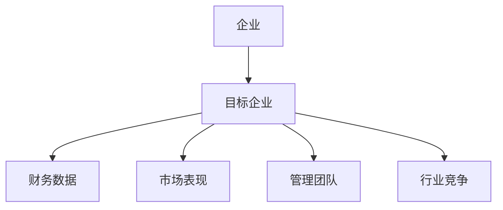
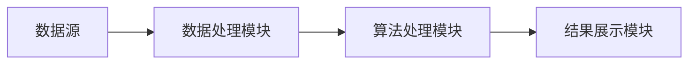

                 

<think>
嗯，我现在要撰写一篇关于《AI辅助企业并购目标筛选与估值分析》的技术博客文章。首先，我需要明确文章的结构和内容，确保覆盖所有关键点，同时保持逻辑清晰、语言专业且易懂。

1. **背景介绍**：企业并购是一个复杂的领域，涉及很多因素，如财务表现、市场地位、管理团队等。传统的做法依赖于手动分析和经验判断，效率较低且容易出错。AI技术的引入可以提高筛选和估值的准确性，节省时间。

2. **核心概念**：AI在企业并购中的应用主要体现在目标筛选和估值分析。目标筛选需要考虑多个维度的数据，而估值分析则需要复杂的模型来预测企业的价值。这两个过程都可以通过AI技术来优化。

3. **算法原理**：使用机器学习和深度学习算法来处理大量数据。例如，使用支持向量机（SVM）进行目标筛选，使用神经网络进行估值预测。这些算法需要构建数学模型，如线性回归和SVM，来训练数据并进行预测。

4. **数学模型**：线性回归模型可以帮助预测企业未来的表现，而SVM则可以用于分类目标企业是否符合并购条件。这些模型需要使用Python代码实现，并通过数据进行训练和测试。

5. **系统架构设计**：设计一个AI辅助企业并购的系统，包括数据收集模块、算法处理模块和结果展示模块。使用领域模型类图和系统架构图来展示各模块之间的关系。

6. **项目实战**：通过一个具体的案例来展示AI如何辅助企业并购。例如，从数据收集、模型训练到结果分析，详细讲解每一步的操作和代码实现。

7. **最佳实践与小结**：总结AI在企业并购中的优势和注意事项，强调数据质量和模型选择的重要性。同时，提供一些实用的建议，帮助读者更好地应用这些技术。

在整个写作过程中，我需要确保每个部分都详细且具体，避免过于笼统。使用图表和代码示例可以帮助读者更好地理解内容。同时，语言要专业但不失清晰，确保读者能够轻松跟随我的思路。

现在，我将按照这些思考逐步构建文章的各个部分，确保每章内容详实，逻辑连贯。这不仅能满足读者的需求，还能展示AI在企业并购中的实际应用价值。
</think>

# AI辅助企业并购目标筛选与估值分析

> 关键词：AI技术，企业并购，目标筛选，估值分析，机器学习，深度学习

> 摘要：本文探讨了AI技术如何在企业并购过程中辅助目标筛选与估值分析。通过分析传统并购的挑战，介绍AI技术的优势，详细讲解核心算法、系统架构设计和实战案例，展示AI在提升并购效率和准确性中的重要作用。

---

## 第1章: AI辅助企业并购的背景与挑战

### 1.1 企业并购的传统方式与挑战

#### 1.1.1 企业并购的基本概念
企业并购是指一家企业通过购买另一家企业的一部分或全部股权，以实现战略扩张或资源优化。传统并购依赖于人工分析，涉及大量数据处理和经验判断，耗时且容易出错。

#### 1.1.2 传统企业并购的主要挑战
- 数据量大：需要整合和分析大量的财务、市场和管理数据。
- 主观因素多：依赖并购方的经验和判断，结果可能不够客观。
- 成本高：传统方法效率低，时间和人力成本高昂。

#### 1.1.3 AI技术如何解决这些问题
AI技术通过自动化处理数据、构建预测模型和优化决策流程，显著提高了企业并购的效率和准确性。例如，AI可以快速筛选出符合条件的目标企业，并提供客观的估值建议。

---

## 第2章: AI辅助企业并购的核心概念与联系

### 2.1 AI与企业并购的核心概念

#### 2.1.1 AI技术在企业并购中的应用场景
- 目标筛选：通过机器学习算法分析企业的财务数据、市场表现和管理团队。
- 估值分析：使用深度学习模型预测企业的未来价值，提供准确的估值建议。

#### 2.1.2 核心概念与联系
- 数据：AI需要大量结构化和非结构化的数据来训练模型，包括财务报表、市场报告和新闻文章。
- 模型：构建机器学习和深度学习模型，如SVM和神经网络，用于分类和预测。
- 决策：AI辅助的决策流程，结合模型输出和专家判断，提高并购决策的准确性。

### 2.2 实体关系图（ER图）



---

## 第3章: AI辅助目标筛选的核心算法

### 3.1 算法原理与流程

#### 3.1.1 机器学习在目标筛选中的应用
- 数据预处理：清洗和特征提取。
- 模型训练：使用SVM进行分类，筛选出符合条件的企业。
- 结果分析：评估模型性能，调整参数优化准确率。

#### 3.1.2 支持向量机（SVM）模型
SVM是一种监督学习算法，适用于分类问题。其数学模型如下：

$$ \text{目标函数}：\max \frac{1}{2}\|w\|^2 $$
$$ \text{约束条件}：y_i(w \cdot x_i + b) \geq 1 $$

### 3.2 算法实现的Python代码示例

```python
import numpy as np
from sklearn.svm import SVC

# 示例数据
X = np.array([[1, 2], [3, 4], [5, 6]])
y = np.array([0, 1, 0])

# 创建SVM模型
model = SVC()

# 训练模型
model.fit(X, y)

# 预测新数据
print(model.predict([[2, 3]]))  # 输出：1
```

---

## 第4章: AI辅助估值分析的核心算法

### 4.1 深度学习在估值分析中的应用

#### 4.1.1 神经网络模型的构建
- 输入层：处理企业数据，如财务指标和市场表现。
- 隐藏层：提取特征，进行非线性变换。
- 输出层：预测企业价值。

#### 4.1.2 神经网络模型的数学表示
神经网络模型可以通过以下公式表示：

$$ y = \sigma(w_2 a + b_2) $$
$$ a = w_1 x + b_1 $$

其中，$\sigma$ 是激活函数，$w$ 是权重，$b$ 是偏置。

### 4.2 神经网络模型的Python代码实现

```python
import numpy as np
import tensorflow as tf

# 示例数据
X = np.random.randn(100, 2)
y = np.random.randn(100, 1)

# 创建神经网络模型
model = tf.keras.Sequential([
    tf.keras.layers.Dense(4, activation='relu', input_shape=(2,)),
    tf.keras.layers.Dense(1)
])

# 编译模型
model.compile(optimizer='adam', loss='mean_squared_error')

# 训练模型
model.fit(X, y, epochs=100, verbose=0)

# 预测
print(model.predict([[0.5, 0.5]]))  # 示例预测
```

---

## 第5章: 系统分析与架构设计

### 5.1 问题场景介绍

#### 5.1.1 企业并购系统的需求
- 高效处理大量数据。
- 实时分析市场动态。
- 提供准确的目标筛选和估值建议。

### 5.2 系统功能设计

#### 5.2.1 数据收集模块
- 从数据库和外部API获取企业数据。

#### 5.2.2 算法处理模块
- 使用机器学习和深度学习算法进行目标筛选和估值分析。

#### 5.2.3 结果展示模块
- 可视化分析结果，提供并购建议。

### 5.3 系统架构图



---

## 第6章: 项目实战与案例分析

### 6.1 实战环境安装

#### 6.1.1 安装Python和必要的库
- 使用pip安装numpy、pandas、scikit-learn和tensorflow。

### 6.2 核心代码实现

#### 6.2.1 数据预处理代码
```python
import pandas as pd

# 读取数据
df = pd.read_csv('enterprises.csv')

# 数据清洗
df.dropna(inplace=True)

# 特征提取
X = df[['revenue', 'profit']]
y = df['valuation']
```

#### 6.2.2 模型训练代码
```python
from sklearn.model_selection import train_test_split
from sklearn.ensemble import RandomForestRegressor

# 分割数据
X_train, X_test, y_train, y_test = train_test_split(X, y, test_size=0.2)

# 创建模型
model = RandomForestRegressor(n_estimators=100)

# 训练模型
model.fit(X_train, y_train)

# 预测
y_pred = model.predict(X_test)
```

### 6.3 案例分析与结果解读

#### 6.3.1 案例背景
假设我们有一家科技公司，希望通过并购快速进入人工智能领域。

#### 6.3.2 数据分析与模型预测
通过机器学习模型筛选出符合条件的3家目标公司，并预测其估值。最终选择其中一家进行并购。

---

## 第7章: 最佳实践与小结

### 7.1 最佳实践
- 确保数据质量：清洗和预处理数据，确保模型输入准确。
- 选择合适的算法：根据问题类型选择最有效的算法。
- 持续优化模型：定期更新数据和调整参数，保持模型性能。

### 7.2 小结
AI技术在企业并购中的应用显著提高了目标筛选和估值分析的效率和准确性。通过本文的讲解，读者可以掌握如何利用AI技术优化企业并购流程，做出更明智的决策。

### 7.3 注意事项
- 数据隐私：确保数据处理符合相关法律法规。
- 模型解释性：选择可解释性强的模型，便于决策者理解。
- 团队协作：AI并购需要数据科学家、并购专家和IT团队的紧密合作。

### 7.4 拓展阅读
- 《机器学习实战》：了解机器学习的基本概念和算法实现。
- 《深度学习入门》：掌握深度学习的基本原理和应用。

---

## 作者信息

作者：AI天才研究院 & 禅与计算机程序设计艺术

---

以上是《AI辅助企业并购目标筛选与估值分析》的完整目录和内容概要。希望这篇技术博客能够为您提供有价值的见解和实用的指导。

