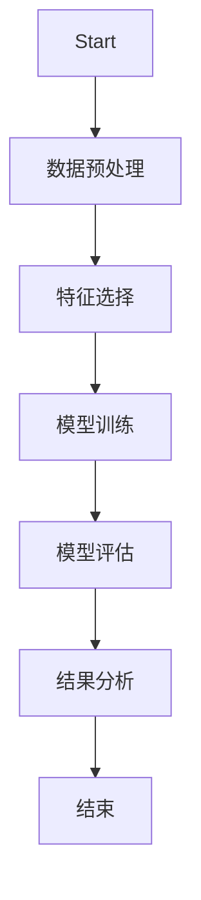
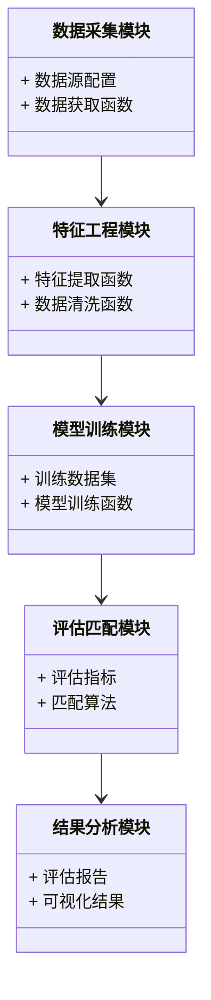
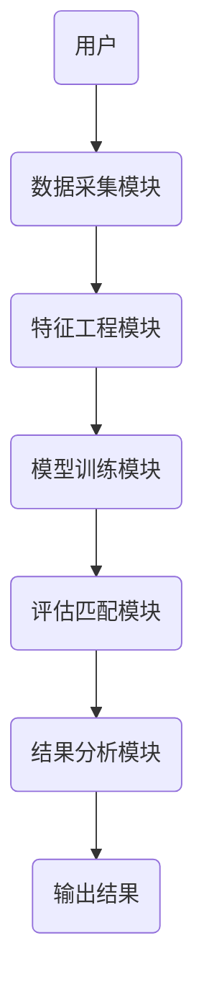

                 

<think>
好，用户让我写一篇关于《AI辅助企业并购目标筛选：多维度评估与匹配》的技术博客文章。我需要先理解用户的需求，然后一步步构建内容。

首先，用户希望文章结构清晰，逻辑严谨，涵盖从背景到系统设计再到项目实战的各个方面。我需要确保每个章节都详细展开，包括核心概念、算法原理、系统架构和实战案例。

我会从背景和核心概念开始，介绍企业并购的基本概念，以及AI在其中的作用。接着，详细讲解多维度评估的要素，如财务指标、市场竞争力和管理团队能力，并用ER图展示实体关系。

接下来是算法部分，选择合适的机器学习算法，用流程图展示整个筛选过程，并提供代码示例。然后，系统设计部分介绍模块架构，用类图和序列图展示系统各部分的关系和交互。

项目实战部分需要具体指导读者如何安装环境，准备数据集，进行特征工程，训练模型，并分析结果。最后，总结最佳实践，给出小结和注意事项。

在写作过程中，我需要确保技术术语准确，内容深入浅出，并且符合用户指定的格式和字数要求。通过这样的思考，我可以构建出一篇结构完整、内容丰富的技术博客文章。
</think>

# AI辅助企业并购目标筛选：多维度评估与匹配

## 关键词：AI，企业并购，目标筛选，多维度评估，机器学习

## 摘要：  
随着企业并购活动的日益复杂化和数据化，AI技术在企业并购目标筛选中的作用日益凸显。本文将从AI辅助企业并购的核心概念、算法原理、系统设计、项目实战等方面展开详细讨论，系统性地解析如何通过多维度评估与匹配实现高效精准的企业并购目标筛选。文章结合实际案例，深入浅出地介绍AI在企业并购中的应用，为相关领域的从业者提供理论与实践指导。

---

# 第一部分: AI辅助企业并购目标筛选的背景与核心概念

## 第1章: 企业并购与AI技术的结合

### 1.1 企业并购的基本概念

#### 1.1.1 企业并购的定义与分类  
企业并购（Mergers and Acquisitions, M&A）是指一家企业通过购买或其他方式获取另一家企业部分或全部资产或股权的行为。企业并购可以分为两类：  
- **合并（Merger）**：两家或更多企业合并为一家新企业，通常不分出明显的被并购方和并购方。  
- **收购（Acquisition）**：一家企业收购另一家企业的全部或部分股权，被并购方仍然保持独立运作。  

#### 1.1.2 并购目标筛选的关键问题  
企业在并购过程中需要考虑以下几个关键问题：  
1. **目标企业的财务状况**：包括盈利能力、资产负债率、现金流等。  
2. **目标企业的市场竞争力**：包括市场份额、品牌影响力、产品线等。  
3. **目标企业的管理团队**：包括团队稳定性、管理能力、战略眼光等。  
4. **行业风险与政策风险**：包括行业周期性、政策变化对企业的影响。  

#### 1.1.3 AI技术在企业并购中的作用  
AI技术可以通过以下方式辅助企业并购目标筛选：  
1. **数据驱动的决策**：利用大数据分析技术，提取企业内外部数据，构建多维度评估模型。  
2. **自动化与智能化**：通过机器学习算法，快速筛选和匹配潜在目标，提高效率。  
3. **风险预测与评估**：基于历史数据和市场趋势，预测目标企业的潜在风险。  

---

## 第2章: AI辅助企业并购的核心概念与联系

### 2.1 AI辅助并购的核心原理

#### 2.1.1 数据驱动的决策模型  
AI辅助企业并购的核心在于通过数据驱动的方式，构建一个多维度评估模型。该模型可以综合考虑企业的财务、市场、管理等多个维度的特征，通过机器学习算法对目标企业进行评分和排序。  

#### 2.1.2 机器学习在目标筛选中的应用  
机器学习算法可以分为两类：  
- **监督学习**：用于分类问题，例如将目标企业分为“可并购”和“不可并购”两类。  
- **无监督学习**：用于聚类问题，例如将目标企业按市场竞争力进行分组。  

#### 2.1.3 多维度评估的数学模型  
多维度评估模型可以表示为：  
$$ \text{综合评分} = \sum_{i=1}^{n} w_i \cdot f_i $$  
其中，$w_i$ 是第 $i$ 个维度的权重，$f_i$ 是第 $i$ 个维度的评估函数。  

---

### 2.2 多维度评估的核心要素

#### 2.2.1 企业财务指标分析  
财务指标是评估企业并购目标的重要维度之一。常用的财务指标包括：  
1. **盈利能力**：如净利润率、ROE（净资产收益率）。  
2. **成长能力**：如营收增长率、净利润增长率。  
3. **偿债能力**：如资产负债率、流动比率。  

#### 2.2.2 市场竞争力评估  
市场竞争力可以从以下几个维度进行评估：  
1. **市场份额**：目标企业在所在市场的占有率。  
2. **品牌影响力**：目标企业的品牌知名度和美誉度。  
3. **产品创新能力**：目标企业的研发投入和新产品推出频率。  

#### 2.2.3 管理团队能力评估  
管理团队的能力直接影响企业的长期发展，可以从以下方面进行评估：  
1. **团队稳定性**：管理团队的人员变动情况。  
2. **管理经验**：团队成员的行业经验和管理能力。  
3. **战略眼光**：团队对市场趋势的把握能力和战略规划能力。  

---

## 第3章: AI辅助企业并购的算法原理

### 3.1 机器学习算法的选择与应用

#### 3.1.1 监督学习与非监督学习的对比  
- **监督学习**：适用于有标签的数据，例如分类任务。  
- **非监督学习**：适用于无标签的数据，例如聚类任务。  

#### 3.1.2 分类算法在目标筛选中的应用  
常用的分类算法包括：  
1. **逻辑回归**：适用于二分类问题，例如判断目标企业是否值得并购。  
2. **随机森林**：适用于多分类问题，例如将目标企业分为高、中、低三类并购价值。  

#### 3.1.3 回归算法在估值预测中的应用  
回归算法可以用于预测目标企业的估值，例如：  
$$ \text{预测估值} = \beta_0 + \beta_1 \cdot \text{营收} + \beta_2 \cdot \text{净利润} $$  

---

### 3.2 算法流程图



---

### 3.3 算法实现代码示例

```python
import pandas as pd
from sklearn.model_selection import train_test_split
from sklearn.ensemble import RandomForestClassifier

# 数据加载
data = pd.read_csv('target_companies.csv')

# 特征与标签分离
X = data.drop('target', axis=1)
y = data['target']

# 数据分割
X_train, X_test, y_train, y_test = train_test_split(X, y, test_size=0.2)

# 模型训练
model = RandomForestClassifier()
model.fit(X_train, y_train)

# 模型预测
y_pred = model.predict(X_test)

# 模型评估
print('准确率:', model.score(X_test, y_test))
```

---

## 第4章: 系统分析与架构设计方案

### 4.1 系统功能设计

#### 4.1.1 系统功能模块  
AI辅助企业并购目标筛选系统主要包括以下几个功能模块：  
1. **数据采集模块**：从多种数据源采集企业数据。  
2. **特征工程模块**：对数据进行清洗、特征提取和特征工程。  
3. **模型训练模块**：基于机器学习算法训练目标筛选模型。  
4. **评估匹配模块**：对目标企业进行多维度评估和匹配。  
5. **结果分析模块**：生成评估报告和可视化结果。  

#### 4.1.2 系统功能模块的类图



---

### 4.2 系统架构设计

#### 4.2.1 系统架构图



---

## 第5章: 项目实战与案例分析

### 5.1 项目环境安装

```bash
# 安装依赖
pip install pandas scikit-learn
```

### 5.2 核心实现代码

```python
import pandas as pd
from sklearn.ensemble import RandomForestClassifier
from sklearn.metrics import classification_report

# 数据加载
data = pd.read_csv('target_companies.csv')

# 特征与标签分离
X = data[['revenue', 'net_profit', 'market_share']]
y = data['target']

# 数据分割
X_train, X_test, y_train, y_test = train_test_split(X, y, test_size=0.2)

# 模型训练
model = RandomForestClassifier()
model.fit(X_train, y_train)

# 模型预测
y_pred = model.predict(X_test)

# 模型评估
print(classification_report(y_test, y_pred))
```

---

## 第6章: 最佳实践与小结

### 6.1 最佳实践 tips  
1. **数据质量**：确保数据的完整性和准确性，数据清洗是关键。  
2. **模型调优**：通过交叉验证和超参数优化提高模型性能。  
3. **结果验证**：结合业务逻辑对模型结果进行验证和调整。  

### 6.2 小结  
AI辅助企业并购目标筛选通过多维度评估与匹配，能够显著提高并购决策的效率和准确性。本文从算法原理、系统设计到项目实战，全面介绍了AI在企业并购中的应用，为相关领域的从业者提供了理论与实践指导。

---

## 作者：AI天才研究院/AI Genius Institute & 禅与计算机程序设计艺术 /Zen And The Art of Computer Programming

