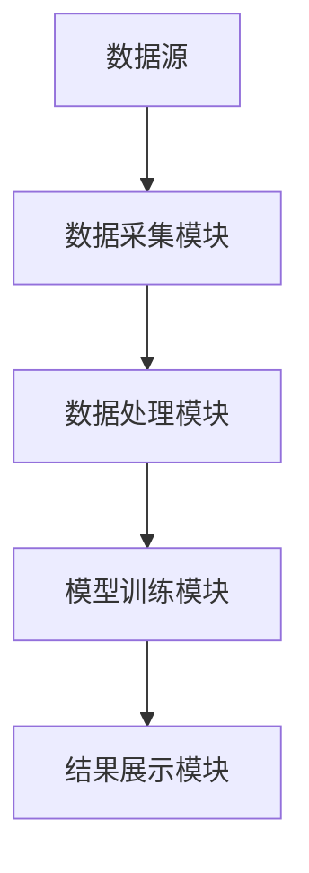
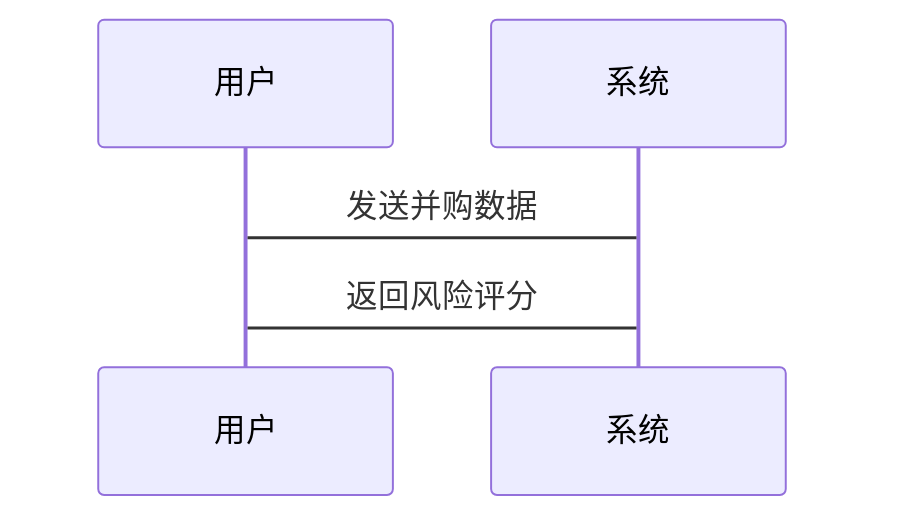

                 


# AI辅助企业并购风险评估：全面识别与量化风险

> 关键词：企业并购、AI技术、风险评估、机器学习、自然语言处理、风险量化

> 摘要：随着企业并购活动的日益频繁，风险评估成为决定并购成功与否的关键因素。本文将详细探讨如何利用AI技术，特别是机器学习和自然语言处理，来全面识别和量化企业并购中的各种风险。通过构建基于AI的评估模型，我们可以更高效地分析和预测并购风险，为企业决策提供科学依据。

---

## 第一章：企业并购与AI技术的结合

### 1.1 企业并购的基本概念

#### 1.1.1 企业并购的定义与类型
企业并购是指一家企业通过购买或合并其他企业，以实现业务扩展、市场扩张或资源整合的过程。常见的并购类型包括：
- **横向并购**：同一行业内的并购。
- **纵向并购**：上下游产业的并购。
- **混合并购**：与主业无关的并购。

#### 1.1.2 企业并购的动机与目标
企业并购的主要动机包括：
- **扩大市场份额**：通过并购快速进入新市场或增强竞争力。
- **获取技术或资源**：通过并购获得关键技术和资源。
- **实现协同效应**：通过整合资源降低成本或提高效率。

#### 1.1.3 企业并购的风险与挑战
并购过程中可能面临的风险包括：
- **产业风险**：目标企业所在行业的不确定性。
- **财务风险**：并购可能带来债务负担或资产减值。
- **法律风险**：并购涉及复杂的法律问题，如反垄断审查。
- **管理风险**：整合后的组织文化冲突或管理不善。

### 1.2 AI技术在企业并购中的应用

#### 1.2.1 AI技术的基本概念与特点
AI（人工智能）是指通过计算机模拟人类智能的技术，其特点包括：
- **数据驱动**：依赖大量数据进行学习和推理。
- **自动化**：能够自动完成复杂任务。
- **适应性**：能够根据反馈不断优化性能。

#### 1.2.2 AI在企业并购中的潜在价值
AI技术在企业并购中的应用价值体现在：
- **数据挖掘与分析**：通过分析海量数据发现潜在风险。
- **模式识别**：利用机器学习识别并购中的规律和模式。
- **预测与决策支持**：通过预测模型辅助并购决策。

#### 1.2.3 当前AI技术在企业并购中的应用现状
目前，AI技术在企业并购中的应用主要包括：
- **文本分析**：通过NLP技术分析并购相关文档。
- **风险预测**：利用机器学习模型预测并购风险。
- **价值评估**：通过数据驱动的方法评估企业价值。

### 1.3 本章小结
本章介绍了企业并购的基本概念和AI技术的基本特点，以及AI在企业并购中的潜在价值和应用现状。接下来，我们将深入探讨并购风险的分类与分析。

---

## 第二章：并购风险的分类与分析

### 2.1 并购风险的分类

#### 2.1.1 产业风险
产业风险是指目标企业所在行业面临的不确定性，例如政策变化、市场需求波动等。

#### 2.1.2 财务风险
财务风险是指并购过程中可能产生的财务问题，例如目标企业的财务状况不佳或并购融资成本过高。

#### 2.1.3 市场风险
市场风险是指并购后目标企业所在市场的不确定性，例如竞争加剧或市场需求下降。

#### 2.1.4 法律风险
法律风险是指并购过程中可能涉及的法律问题，例如反垄断审查或合同纠纷。

#### 2.1.5 管理风险
管理风险是指并购后企业整合过程中可能产生的管理问题，例如文化冲突或管理不善。

### 2.2 并购风险的特征与影响

#### 2.2.1 并购风险的特征分析
并购风险具有以下特征：
- **隐蔽性**：风险往往隐藏在表面现象之后。
- **复杂性**：风险来源多样，涉及多个方面。
- **动态性**：风险会随着市场环境的变化而变化。

#### 2.2.2 并购风险对企业价值的影响
并购风险会影响企业价值的评估，例如：
- **低估目标企业价值**：如果风险过高，目标企业的价值可能被低估。
- **增加并购成本**：为了降低风险，可能需要支付更高的并购溢价。

#### 2.2.3 并购风险的量化方法
量化并购风险的方法包括：
- **概率加权法**：将风险发生的概率与其影响程度相乘，得到风险值。
- **蒙特卡洛模拟**：通过模拟不同的市场情景，评估风险的影响。

### 2.3 本章小结
本章对并购风险进行了分类和分析，并探讨了其对企业价值的影响和量化方法。接下来，我们将探讨AI技术在并购风险评估中的核心原理。

---

## 第三章：AI技术在并购风险评估中的核心原理

### 3.1 机器学习与深度学习概述

#### 3.1.1 机器学习的基本概念
机器学习是一种通过数据训练模型的技术，其核心是通过数据找到规律并进行预测。

#### 3.1.2 深度学习的基本概念
深度学习是一种基于人工神经网络的机器学习技术，其特点是能够处理复杂的数据模式。

#### 3.1.3 机器学习与深度学习的区别与联系
- **区别**：机器学习依赖特征工程，深度学习自动提取特征。
- **联系**：深度学习是机器学习的一种，适用于复杂数据。

### 3.2 自然语言处理（NLP）技术

#### 3.2.1 NLP的基本概念与特点
NLP是人工智能的一个分支，专注于处理人类语言数据。

#### 3.2.2 NLP在企业并购中的应用
NLP可以用于分析并购相关的文本数据，例如新闻报道、财务报告等。

#### 3.2.3 NLP技术的核心算法与实现
- **词嵌入**：将单词转换为向量表示。
- **句法分析**：分析句子的结构和语义。

### 3.3 数据挖掘与分析技术

#### 3.3.1 数据挖掘的基本概念与方法
数据挖掘是从数据中提取有价值信息的技术，常用方法包括聚类、分类和回归。

#### 3.3.2 数据挖掘在并购风险评估中的应用
数据挖掘可以用于识别并购中的风险模式和趋势。

#### 3.3.3 数据挖掘技术的核心算法与实现
- **决策树**：用于分类和预测。
- **随机森林**：用于特征重要性分析。

### 3.4 本章小结
本章介绍了机器学习、深度学习和NLP的基本原理及其在并购风险评估中的应用。接下来，我们将探讨并购风险的AI识别与量化模型。

---

## 第四章：并购风险的AI识别与量化模型

### 4.1 AI识别模型的设计与实现

#### 4.1.1 数据预处理
- **数据清洗**：去除噪声数据。
- **特征提取**：提取关键特征。

#### 4.1.2 模型训练
- **选择算法**：选择合适的机器学习算法。
- **参数调优**：优化模型参数。

#### 4.1.3 模型评估
- **评估指标**：准确率、召回率、F1分数。

### 4.2 并购风险的量化方法

#### 4.2.1 风险评分模型
- **线性回归模型**：用于预测风险评分。
- **概率模型**：用于预测风险发生的概率。

#### 4.2.2 风险分层模型
- **聚类分析**：将风险分为不同层次。

### 4.3 本章小结
本章详细介绍了AI识别模型的设计与实现，以及并购风险的量化方法。接下来，我们将探讨系统架构与实现方案。

---

## 第五章：系统架构与实现方案

### 5.1 系统架构设计

#### 5.1.1 系统功能模块
- **数据采集模块**：采集并购相关数据。
- **数据处理模块**：进行数据清洗和特征提取。
- **模型训练模块**：训练AI识别模型。
- **结果展示模块**：展示风险评估结果。

#### 5.1.2 系统架构图


### 5.2 系统接口设计

#### 5.2.1 API接口设计
- **输入接口**：接收并购相关数据。
- **输出接口**：返回风险评估结果。

#### 5.2.2 接口交互流程


### 5.3 本章小结
本章设计了系统的架构和接口，并通过Mermaid图展示了系统的交互流程。接下来，我们将通过一个实际案例展示项目的实战应用。

---

## 第六章：项目实战与案例分析

### 6.1 项目实战

#### 6.1.1 环境配置
- **Python版本**：3.8以上
- **依赖库安装**：scikit-learn、nltk、pandas

#### 6.1.2 核心代码实现
```python
# 数据预处理
import pandas as pd
from sklearn.preprocessing import StandardScaler
from sklearn.model_selection import train_test_split
from sklearn.linear_model import LogisticRegression

# 加载数据
data = pd.read_csv('并购数据.csv')
# 分割特征与标签
X = data.drop('风险评分', axis=1)
y = data['风险评分']
# 数据标准化
scaler = StandardScaler()
X_scaled = scaler.fit_transform(X)
# 划分训练集与测试集
X_train, X_test, y_train, y_test = train_test_split(X_scaled, y, test_size=0.2)
# 训练模型
model = LogisticRegression()
model.fit(X_train, y_train)
# 评估模型
score = model.score(X_test, y_test)
print(f'模型准确率: {score}')
```

#### 6.1.3 代码解读与分析
- **数据预处理**：对数据进行标准化处理。
- **模型训练**：使用逻辑回归模型进行训练。
- **模型评估**：评估模型的准确率。

### 6.2 案例分析

#### 6.2.1 案例背景
某公司计划并购一家科技公司，希望通过AI技术评估并购风险。

#### 6.2.2 数据收集与分析
收集目标公司的财务数据、市场数据和行业数据，进行清洗和特征提取。

#### 6.2.3 风险评估与结果解读
通过模型预测并购风险，并根据结果制定相应的风险管理策略。

### 6.3 本章小结
本章通过一个实际案例展示了AI技术在企业并购风险评估中的应用，从数据收集到模型部署，详细讲解了整个过程。

---

## 第七章：总结与展望

### 7.1 总结
本文详细探讨了AI技术在企业并购风险评估中的应用，介绍了并购风险的分类与分析，以及基于机器学习和NLP的AI识别与量化模型。通过实际案例展示了系统的实现与应用。

### 7.2 展望
未来，随着AI技术的不断发展，企业并购风险评估将更加智能化和精准化。可以通过引入更复杂的深度学习模型和实时数据流处理技术，进一步提升风险评估的效率和准确性。

### 7.3 注意事项
- **数据质量**：数据质量直接影响模型的性能，需确保数据的准确性和完整性。
- **模型解释性**：复杂的模型可能难以解释，需注重模型的可解释性。
- **法律合规**：在实际应用中，需遵守相关法律法规，确保数据使用的合法性。

---

## 作者：AI天才研究院 & 禅与计算机程序设计艺术

---

通过以上章节内容，我们可以看到，AI技术在企业并购风险评估中的应用前景广阔。从数据处理到模型训练，再到结果展示，AI技术可以帮助企业更高效地识别和量化并购风险，从而做出更明智的决策。

