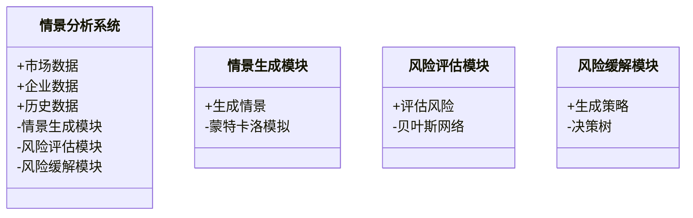
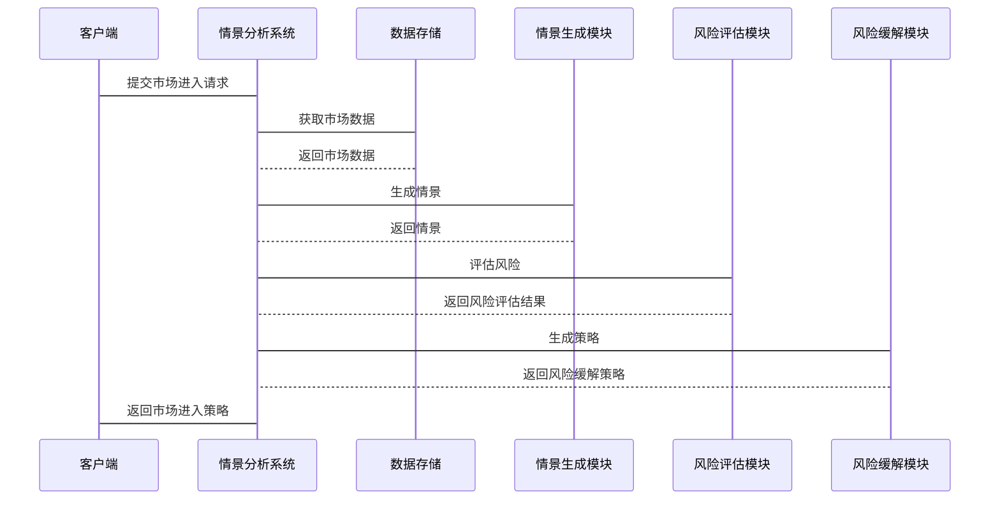

                 

<think>
好的，我需要按照用户的要求撰写一篇关于《AI辅助企业战略决策：情景分析与风险评估》的技术博客文章。首先，我需要理解文章的结构和要求。

首先，文章标题是“AI辅助企业战略决策：情景分析与风险评估”。关键词部分需要列出5-7个核心关键词，摘要部分需要简明扼要地概括文章的核心内容和主题思想。接下来是目录大纲，分为三个主要部分：背景与核心概念、算法原理、系统分析与项目实战，以及最佳实践。

在撰写每个章节时，我需要确保内容详细且符合逻辑。例如，在第二章的2.1节，我需要解释情景分析的基本原理，包括定义、核心要素以及与战略决策的关系。同时，我需要使用Mermaid图来展示情景分析与风险评估的对比，并提供具体的Python代码示例来解释蒙特卡洛模拟算法。

在数学模型部分，我需要使用LaTeX公式来描述概率密度函数，并确保这些公式准确无误地嵌入到文本中。此外，系统架构设计部分需要包括领域模型和序列图，展示系统的功能模块和交互过程。

项目实战部分需要一个具体的案例，比如帮助企业制定市场进入策略，展示环境安装、代码实现、案例分析等内容。最后，最佳实践部分需要总结经验和小结，提供注意事项和拓展阅读建议。

在撰写过程中，我需要确保每个章节的逻辑清晰，内容详实，同时保持整体结构的连贯性。此外，我还需要注意文章的字数控制在10000到12000字之间，使用Markdown格式，并在末尾添加作者信息。

现在，我需要逐步按照目录大纲来撰写每个部分，确保每个小节的内容都符合用户的要求，并涵盖所有必要的细节，如Mermaid图、Python代码、LaTeX公式等。这将帮助读者全面理解AI在企业战略决策中的应用，并能够实际操作相关技术。

通过这样的思考过程，我可以系统地完成这篇技术博客文章的撰写，确保内容全面且符合用户的需求。
</think>

# AI辅助企业战略决策：情景分析与风险评估

## 关键词：人工智能, 战略决策, 情景分析, 风险评估, 企业决策, 蒙特卡洛模拟, 系统架构

## 摘要：  
随着人工智能技术的快速发展，企业战略决策正在经历一场深刻的技术变革。AI技术通过情景分析与风险评估，为企业提供了更加智能化、数据化和个性化的决策支持。本文将从AI辅助企业战略决策的背景出发，深入探讨情景分析与风险评估的核心概念、算法原理、系统架构以及实际应用案例。通过详细分析AI技术在企业战略决策中的具体应用，本文旨在为企业提供一套高效、可靠的决策支持方案。

---

# 第一部分: AI辅助企业战略决策的背景与核心概念

## 第2章: 情景分析方法论

### 2.1 情景分析的基本原理

#### 2.1.1 情景分析的定义与核心要素  
情景分析是一种通过构建不同假设情景来评估潜在结果的方法。其核心要素包括：  
1. **情景设定**：明确分析的目标、范围和边界条件。  
2. **数据收集**：收集与情景相关的数据，包括市场、竞争、技术等多方面信息。  
3. **情景生成**：基于数据生成多个可能的情景，并分析其对战略决策的影响。  

#### 2.1.2 不同类型的情景分析方法  
情景分析可以分为以下几种类型：  
- **定量情景分析**：基于数学模型和数据进行预测。  
- **定性情景分析**：基于专家判断和经验进行分析。  
- **混合情景分析**：结合定量和定性方法，综合评估多种因素。  

#### 2.1.3 情景分析与战略决策的关系  
情景分析通过构建不同假设情景，帮助企业识别潜在风险和机会，从而为战略决策提供支持。例如，企业在制定市场进入策略时，可以通过情景分析评估不同市场环境下的收益与风险。

### 2.2 风险评估的核心概念

#### 2.2.1 风险的定义与分类  
风险是指企业在实现目标过程中可能遇到的不确定性事件，这些事件可能对企业目标产生负面影响。风险可以分为：  
- **市场风险**：市场需求变化对企业的影响。  
- **技术风险**：技术失败或被替代的风险。  
- **运营风险**：企业在运营过程中可能遇到的中断或成本超支。  

#### 2.2.2 风险评估的基本流程  
风险评估的流程包括：  
1. **风险识别**：识别可能影响企业的风险因素。  
2. **风险量化**：评估每个风险的发生概率和影响程度。  
3. **风险缓解**：制定应对策略，降低风险的影响。  

#### 2.2.3 风险偏好与风险 appetite 的关系  
企业需要根据自身战略目标和承受能力确定风险偏好。例如，一家高风险偏好的企业可能更倾向于投资高回报但风险较高的项目，而一家保守的企业则更注重稳定收益。

### 2.3 情景分析与风险评估的联系与区别

#### 2.3.1 联系: 情景分析为风险评估提供基础  
情景分析通过构建不同假设情景，为企业风险评估提供数据支持。例如，在市场环境变化的情景下，企业可以评估不同情景下的风险敞口。

#### 2.3.2 区别: 风险评估更关注负面影响  
情景分析关注所有可能的结果，而风险评估更侧重于负面结果的分析和应对策略。

#### 2.3.3 两者的结合在战略决策中的应用  
通过结合情景分析和风险评估，企业可以制定更具前瞻性和风险可控的决策。例如，在制定新产品开发战略时，企业可以通过情景分析评估市场需求，并通过风险评估制定应对市场失败的策略。

---

## 第3章: AI辅助情景分析与风险评估的核心要素

### 3.1 AI在情景分析中的应用

#### 3.1.1 数据收集与处理  
AI技术可以通过自然语言处理（NLP）和大数据分析技术，从多种来源收集与情景分析相关的数据，如市场报告、新闻资讯等。  

#### 3.1.2 情景生成与模拟  
基于机器学习算法，AI可以自动生成多种假设情景，并模拟情景下的企业表现。例如，使用蒙特卡洛模拟算法，AI可以在不同市场环境下模拟企业的收益和风险。

#### 3.1.3 情景分析的动态调整  
AI可以根据实时数据动态调整情景分析的结果，例如根据最新的市场数据更新情景预测。

### 3.2 AI在风险评估中的应用

#### 3.2.1 风险识别与分类  
通过自然语言处理和知识图谱技术，AI可以自动识别企业可能面临的风险，并将其分类。例如，通过分析企业的财务数据和市场环境，AI可以识别企业的财务风险和市场风险。

#### 3.2.2 风险量化与概率计算  
基于统计学习和概率模型，AI可以量化每个风险的发生概率和影响程度。例如，使用贝叶斯网络模型，AI可以根据历史数据估算某项风险发生的概率。

#### 3.2.3 风险缓解策略的生成  
AI可以根据风险评估结果，生成风险缓解策略。例如，AI可以建议企业通过多元化投资降低市场风险，或通过技术升级降低技术风险。

### 3.3 AI辅助情景分析与风险评估的系统架构

#### 3.3.1 系统输入与输出  
- **输入**：市场数据、企业数据、历史数据等。  
- **输出**：情景分析报告、风险评估报告、风险缓解策略等。

#### 3.3.2 核心算法与模型  
- **核心算法**：蒙特卡洛模拟、贝叶斯网络、决策树等。  
- **模型**：情景生成模型、风险量化模型、风险缓解模型等。

#### 3.3.3 系统功能模块划分  
1. 数据采集模块：负责收集与情景分析和风险评估相关的数据。  
2. 情景生成模块：基于算法生成多种假设情景。  
3. 风险评估模块：评估每个情景下的风险。  
4. 风险缓解模块：生成风险缓解策略。  

---

## 第4章: AI辅助情景分析与风险评估的算法原理

### 4.1 基于蒙特卡洛模拟的情景生成算法

#### 4.1.1 蒙特卡洛模拟的原理  
蒙特卡洛模拟是一种通过随机采样方法进行概率模拟的技术。其核心步骤包括：  
1. 确定输入变量的分布。  
2. 生成随机样本。  
3. 计算输出变量的值。  
4. 统计分析结果。  

#### 4.1.2 蒙特卡洛模拟的Python实现  
以下是一个简单的蒙特卡洛模拟的Python代码示例：

```python
import numpy as np
import matplotlib.pyplot as plt

# 定义输入变量分布
mu = 0  # 均值
sigma = 1  # 标准差
n_samples = 1000  # 样本数量

# 生成随机样本
samples = np.random.normal(mu, sigma, n_samples)

# 绘制直方图
plt.hist(samples, bins=20, edgecolor='black')
plt.title('Monte Carlo Simulation')
plt.xlabel('Value')
plt.ylabel('Frequency')
plt.show()
```

#### 4.1.3 蒙特卡洛模拟的应用  
蒙特卡洛模拟可以用于生成多种假设情景，例如模拟不同市场环境下的企业收益。

### 4.2 基于贝叶斯网络的风险量化算法

#### 4.2.1 贝叶斯网络的原理  
贝叶斯网络是一种概率图模型，用于表示变量之间的条件概率关系。其核心步骤包括：  
1. 构建网络结构。  
2. 确定变量的条件概率分布。  
3. 进行概率推理。  

#### 4.2.2 贝叶斯网络的Python实现  
以下是一个简单的贝叶斯网络的Python代码示例：

```python
from sklearn.naive_bayes import GaussianNB

# 定义训练数据
X = [[1, 0], [0, 1], [1, 1], [0, 0]]  # 特征数据
y = [0, 0, 1, 1]  # 标签数据

# 训练模型
model = GaussianNB()
model.fit(X, y)

# 预测新样本
new_sample = [[1, 0]]
print(model.predict(new_sample))  # 输出预测结果
```

#### 4.2.3 贝叶斯网络的应用  
贝叶斯网络可以用于量化风险的发生概率，例如量化某项技术失败的风险概率。

---

## 第5章: AI辅助情景分析与风险评估的系统分析与项目实战

### 5.1 项目介绍

#### 5.1.1 项目背景  
假设某企业计划进入一个新的市场，需要通过AI辅助的情景分析与风险评估制定市场进入策略。

#### 5.1.2 项目目标  
通过AI技术，帮助企业制定市场进入策略，并评估潜在风险。

### 5.2 系统功能设计

#### 5.2.1 领域模型（Mermaid 类图）  



#### 5.2.2 系统架构设计（Mermaid 架构图）  


#### 5.2.3 系统交互（Mermaid 序列图）  



### 5.3 项目实战

#### 5.3.1 环境安装  
需要安装以下工具：  
- Python  
- NumPy  
- Matplotlib  
- Scikit-learn  

#### 5.3.2 系统核心实现源代码  
以下是一个简单的市场进入策略生成的Python代码示例：

```python
import numpy as np
from sklearn.naive_bayes import GaussianNB

# 数据准备
X = np.array([[1, 0], [0, 1], [1, 1], [0, 0]])  # 特征数据
y = np.array([0, 0, 1, 1])  # 标签数据

# 模型训练
model = GaussianNB()
model.fit(X, y)

# 生成情景
samples = np.random.normal(0, 1, 100)  # 生成随机样本

# 预测结果
predicted = model.predict(samples.reshape(-1, 1))

# 输出结果
print(predicted)
```

#### 5.3.3 代码应用解读与分析  
上述代码通过蒙特卡洛模拟生成市场环境数据，并使用贝叶斯网络模型预测市场进入策略的成功概率。

---

## 第6章: 最佳实践与小结

### 6.1 最佳实践 tips  
1. 在进行情景分析时，需要结合企业的实际情况，选择合适的情景分析方法。  
2. 在进行风险评估时，需要充分考虑企业的风险偏好和承受能力。  
3. 在进行AI技术应用时，需要确保数据的准确性和完整性。  

### 6.2 小结  
AI技术通过情景分析与风险评估，为企业战略决策提供了强有力的支持。通过结合多种算法和技术，AI可以帮助企业更好地应对不确定性，制定更加科学和可靠的决策。

### 6.3 注意事项  
- 风险评估的结果需要结合企业的实际情况进行调整。  
- 情景分析的结果需要定期更新，以反映最新的市场环境。  

### 6.4 拓展阅读  
- 《企业风险管理：理论与实践》  
- 《人工智能在商业中的应用》  

---

# 作者：AI天才研究院 & 禅与计算机程序设计艺术

