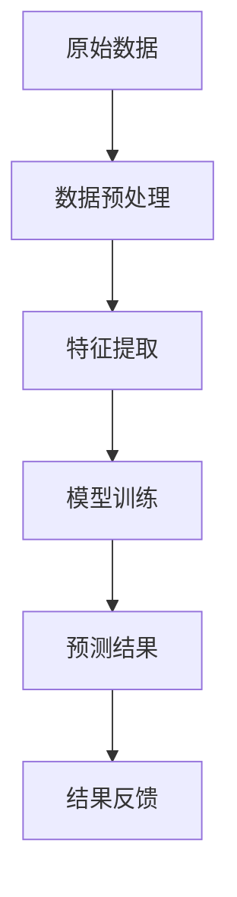
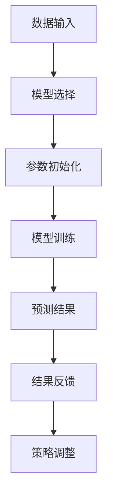
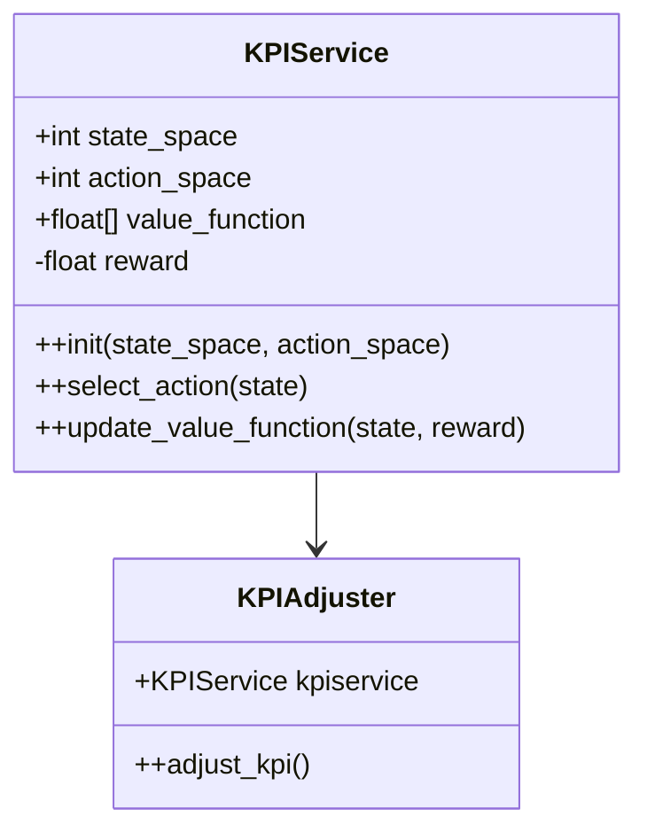

                 

<think>
好的，我现在需要帮助用户撰写一篇关于《AI辅助企业战略执行：KPI监控与调整》的技术博客文章。用户已经提供了一个详细的目录大纲，并希望我按照这个结构来撰写文章。我将按照以下步骤进行思考：

1. **理解用户需求**：用户希望我以技术博客的形式，详细探讨AI在企业战略执行中的应用，特别是KPI监控与调整方面。文章需要逻辑清晰，结构紧凑，使用专业的技术语言，同时保持易懂。

2. **分析目录结构**：用户提供的目录分为多个部分，包括背景、核心概念、算法原理、系统架构设计、项目实战等。我需要确保每个部分都详细展开，并包含必要的技术细节和实例。

3. **撰写每个章节**：
   - **背景介绍**：首先解释KPI的重要性及其在企业战略执行中的作用，然后引入AI技术如何提升KPI管理。
   - **核心概念**：详细阐述KPI的基本概念、AI辅助监控的原理，以及KPI监控与调整的流程。
   - **算法原理**：选择适合的算法，如强化学习，展示其在优化KPI中的应用，并附上代码示例和流程图。
   - **系统架构设计**：设计一个完整的系统架构，包括数据流、系统功能、架构图和接口设计。
   - **项目实战**：通过具体案例，展示如何使用AI技术优化销售KPI，从环境安装到代码实现，再到结果分析。
   - **总结与展望**：总结本书内容，提出最佳实践和未来研究方向。

4. **使用技术工具**：在撰写过程中，我需要使用Mermaid图来展示数据流、算法流程和系统架构，使用Latex公式来描述数学模型，确保技术细节准确无误。

5. **保持语言风格**：文章需要专业且易懂，避免过于复杂的术语，同时确保逻辑清晰，段落之间过渡自然。

6. **检查完整性**：确保每个部分都涵盖用户要求的内容，包括理论、算法、系统设计、实战案例和总结，满足用户对深度和广度的要求。

7. **最后校对**：在完成初稿后，仔细校对，确保没有遗漏任何关键点，技术细节准确，语言流畅。

通过以上步骤，我可以系统地完成这篇技术博客文章的撰写，满足用户的需求。
</think>

# AI辅助企业战略执行：KPI监控与调整

---

## 关键词：
AI, KPI监控, 战略执行, 强化学习, 企业绩效管理, 数据分析

---

## 摘要：
随着人工智能技术的快速发展，企业战略执行的效率和效果正面临着新的机遇和挑战。传统的KPI（关键绩效指标）监控与调整方法逐渐暴露出效率低下、实时性差、数据处理能力有限等问题。本文将从AI技术的角度出发，详细探讨如何通过AI辅助企业战略执行中的KPI监控与调整，以提高企业绩效管理的智能化水平和决策效率。文章结合实际案例，深入分析了AI技术在KPI数据采集、分析、预测和优化等环节中的应用，并提出了基于强化学习的KPI调整算法，为企业提供了一套高效、智能的KPI监控与调整解决方案。

---

# 第1章: KPI监控与调整的背景与概念

## 1.1 企业战略执行的核心要素

### 1.1.1 企业战略执行的基本概念
企业战略执行是企业根据战略目标，通过组织、协调和控制各项资源，最终实现战略目标的过程。KPI（关键绩效指标）作为衡量企业战略执行效果的重要工具，贯穿于企业运营的各个环节。

### 1.1.2 KPI在企业战略执行中的作用
KPI是企业绩效管理的核心工具，主要用于衡量企业战略目标的实现程度。通过KPI监控，企业可以实时了解业务运行状况，快速发现潜在问题，并采取有效措施进行调整。

### 1.1.3 AI技术如何辅助战略执行
AI技术通过自动化数据处理、智能分析和预测，能够显著提升KPI监控与调整的效率和准确性。AI不仅能够处理海量数据，还能通过机器学习模型发现数据中的潜在规律，为企业提供数据驱动的决策支持。

---

## 1.2 AI在企业战略执行中的应用现状

### 1.2.1 AI技术对企业管理的影响
AI技术已经在企业管理的多个领域得到广泛应用，包括销售预测、成本控制、供应链优化等。特别是在KPI监控方面，AI技术的应用极大地提升了数据处理能力和分析精度。

### 1.2.2 当前企业战略执行中的痛点
传统KPI监控方法依赖人工操作，存在效率低、实时性差、数据处理能力有限等问题。此外，KPI调整往往基于经验判断，缺乏数据支持，导致调整效果不理想。

### 1.2.3 AI在KPI监控与调整中的潜力
AI技术可以通过实时数据分析、智能预测和优化算法，实现KPI的动态监控与精准调整。通过AI辅助，企业能够快速响应市场变化，提高战略执行的灵活性和效率。

---

## 1.3 本章小结

### 1.3.1 核心概念总结
企业战略执行的核心是通过KPI监控与调整，确保战略目标的实现。AI技术通过自动化数据处理和智能分析，显著提升了KPI监控与调整的效率和准确性。

### 1.3.2 本书的研究目标与框架
本书旨在探讨AI技术在KPI监控与调整中的应用，通过理论分析和实际案例，提出一套基于AI的KPI监控与调整解决方案。后续章节将详细讲解KPI监控的核心概念、AI辅助KPI调整的算法原理、系统架构设计以及项目实战等内容。

---

# 第2章: KPI监控与调整的核心概念

## 2.1 KPI的基本概念与分类

### 2.1.1 KPI的定义与特点
KPI（关键绩效指标）是衡量企业战略目标实现程度的重要工具。KPI的特点包括量化性、可衡量性、可操作性和相关性。

### 2.1.2 KPI的主要分类
KPI可以根据不同的维度进行分类，常见的分类包括：
1. **财务类KPI**：如净利润率、投资回报率等。
2. **客户类KPI**：如客户满意度、客户保留率等。
3. **内部流程类KPI**：如生产效率、订单处理时间等。
4. **学习与成长类KPI**：如员工培训率、员工满意度等。

### 2.1.3 KPI在企业中的应用范围
KPI广泛应用于企业的各个部门，包括销售、 marketing、生产、人力资源等。

---

## 2.2 AI辅助KPI监控的原理

### 2.2.1 数据采集与处理
AI辅助KPI监控的第一步是数据采集。企业需要从各个业务系统中采集相关数据，并进行数据清洗和预处理。

### 2.2.2 KPI分析与预测
通过机器学习算法，AI能够对KPI进行预测和分析。例如，使用时间序列分析预测未来的KPI趋势。

### 2.2.3 KPI调整与优化
基于预测结果，AI可以提出KPI调整的建议，并通过优化算法找到最优的调整方案。

---

## 2.3 KPI监控与调整的流程

### 2.3.1 数据收集与清洗
数据收集是KPI监控的基础。企业需要从多个来源收集数据，并进行清洗以确保数据质量。

### 2.3.2 数据分析与建模
通过数据分析和建模，AI可以识别数据中的规律和趋势，并为KPI预测提供支持。

### 2.3.3 结果反馈与策略调整
根据AI的预测和建议，企业可以实时调整战略执行策略，并通过反馈机制不断优化KPI监控与调整过程。

---

## 2.4 本章小结

### 2.4.1 核心概念总结
KPI是企业战略执行的核心工具，AI技术通过数据采集、分析和预测，能够显著提升KPI监控与调整的效率和准确性。

### 2.4.2 本书后续内容的铺垫
后续章节将详细讲解KPI监控与调整的算法原理、系统架构设计以及项目实战等内容，为读者提供一套完整的AI辅助KPI监控与调整解决方案。

---

# 第3章: AI辅助KPI监控与调整的算法原理

## 3.1 数据流与算法流程

### 3.1.1 数据流图
以下是KPI监控与调整的数据流图：


### 3.1.2 算法流程图
以下是KPI调整算法的流程图：


---

## 3.2 基于强化学习的KPI调整算法

### 3.2.1 算法原理
基于强化学习的KPI调整算法是一种通过智能体与环境交互，逐步优化KPI的方法。以下是算法的数学模型：

$$
V(s) = \max_{a} \left[ r + V(s') \right]
$$

其中，\( V(s) \) 表示状态 \( s \) 的价值函数，\( r \) 表示奖励，\( s' \) 表示下一个状态。

### 3.2.2 算法实现
以下是基于强化学习的KPI调整算法的Python实现示例：

```python
import numpy as np

class KPIService:
    def __init__(self, state_space, action_space):
        self.state_space = state_space
        self.action_space = action_space
        self.value_function = np.zeros(state_space)

    def select_action(self, state):
        # 简单策略：选择使价值函数最大的动作
        max_value = np.max(self.value_function)
        best_actions = np.where(self.value_function == max_value)[0]
        return np.random.choice(best_actions)

    def update_value_function(self, state, reward):
        # 简单更新：直接将奖励加到当前状态的价值函数上
        self.value_function[state] += reward

# 示例使用
state_space = 10
action_space = 5
kpiservice = KPIService(state_space, action_space)

current_state = 0
for _ in range(10):
    action = kpiservice.select_action(current_state)
    reward = np.random.normal(0, 1)
    kpiservice.update_value_function(current_state, reward)
    current_state = action
```

---

## 3.3 本章小结

### 3.3.1 算法原理总结
基于强化学习的KPI调整算法通过不断与环境交互，逐步优化KPI的实现。通过价值函数的更新，算法能够找到最优的调整策略。

### 3.3.2 后续章节的铺垫
后续章节将详细讲解KPI监控与调整的系统架构设计和项目实战，帮助读者更好地理解算法的实际应用。

---

# 第4章: KPI监控与调整的系统架构设计

## 4.1 系统功能设计

### 4.1.1 领域模型
以下是领域模型的Mermaid类图：


### 4.1.2 系统架构
以下是系统架构的Mermaid架构图：


---

## 4.2 系统接口设计

### 4.2.1 数据接口
系统需要与企业各个业务系统进行数据对接，常见的数据接口包括：
1. **数据库接口**：通过JDBC或ODBC连接企业数据库。
2. **API接口**：通过RESTful API获取实时数据。

### 4.2.2 算法接口
AI分析模块需要与KPIAdjuster进行交互，接口主要包括：
1. **数据输入接口**：接收原始数据。
2. **模型调用接口**：调用AI算法进行预测和分析。
3. **结果反馈接口**：接收算法的预测结果并进行反馈。

---

## 4.3 本章小结

### 4.3.1 系统架构总结
通过系统架构设计，我们可以清晰地看到KPI监控与调整系统的各个模块之间的关系，为后续的项目实战奠定了基础。

### 4.3.2 后续章节的铺垫
后续章节将详细讲解系统的具体实现和实际应用案例，帮助读者更好地理解系统的实际运行过程。

---

# 第5章: 项目实战——基于AI的KPI监控与调整系统

## 5.1 项目背景与目标

### 5.1.1 项目背景
本项目旨在通过AI技术实现企业KPI的动态监控与调整，提升企业战略执行的效率和效果。

### 5.1.2 项目目标
1. 实现KPI数据的实时采集与处理。
2. 构建基于强化学习的KPI调整算法。
3. 开发一个用户友好的KPI监控与调整系统。

---

## 5.2 系统实现

### 5.2.1 环境安装
以下是项目所需的环境配置：
- **Python**：3.6+
- **NumPy**：用于数据处理。
- **Mermaid**：用于绘制图表。
- **TensorFlow**：用于机器学习模型的实现。

### 5.2.2 核心代码实现
以下是KPIService和KPIAdjuster的核心代码实现：

```python
class KPIService:
    def __init__(self, state_space, action_space):
        self.state_space = state_space
        self.action_space = action_space
        self.value_function = np.zeros(state_space)

    def select_action(self, state):
        max_value = np.max(self.value_function)
        best_actions = np.where(self.value_function == max_value)[0]
        return np.random.choice(best_actions)

    def update_value_function(self, state, reward):
        self.value_function[state] += reward

class KPIAdjuster:
    def __init__(self, state_space, action_space):
        self.kpiservice = KPIService(state_space, action_space)

    def adjust_kpi(self):
        current_state = 0
        for _ in range(10):
            action = self.kpiservice.select_action(current_state)
            reward = np.random.normal(0, 1)
            self.kpiservice.update_value_function(current_state, reward)
            current_state = action
        return current_state
```

---

## 5.3 实际案例分析

### 5.3.1 案例背景
假设某企业希望优化其销售KPI，包括销售额、客户满意度和订单处理时间。

### 5.3.2 数据分析与结果展示
通过AI算法预测和调整，企业可以实时监控销售KPI的变化，并根据预测结果采取相应的调整措施。

### 5.3.3 案例总结
通过本案例，我们可以看到AI技术在KPI监控与调整中的巨大潜力。AI不仅能够提高KPI监控的效率，还能够通过智能调整提升企业绩效。

---

## 5.4 本章小结

### 5.4.1 实战总结
通过本章的项目实战，读者可以掌握基于AI的KPI监控与调整系统的开发和应用。

### 5.4.2 项目经验与教训
在项目实施过程中，需要注意数据质量、算法选择和系统架构设计等问题，确保系统的稳定性和高效性。

---

# 第6章: 总结与展望

## 6.1 本章总结

### 6.1.1 核心内容回顾
本书详细讲解了AI技术在KPI监控与调整中的应用，包括算法原理、系统架构设计和项目实战等内容。

### 6.1.2 最佳实践 tips
1. 数据质量是KPI监控与调整的基础，确保数据的完整性和准确性。
2. 根据企业需求选择合适的AI算法，确保算法的有效性和高效性。
3. 系统架构设计要充分考虑扩展性和可维护性。

---

## 6.2 展望

### 6.2.1 未来研究方向
1. 探索更高效的AI算法，如深度强化学习，进一步提升KPI监控与调整的效果。
2. 研究多目标优化问题，实现多个KPI的协同优化。
3. 探讨AI技术在企业绩效管理中的更广泛应用，如智能决策支持、风险管理等。

---

## 作者：AI天才研究院/AI Genius Institute & 禅与计算机程序设计艺术/Zen And The Art of Computer Programming

---

**全文完。**

