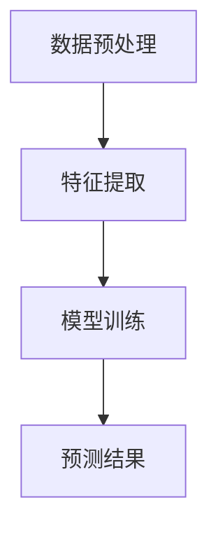
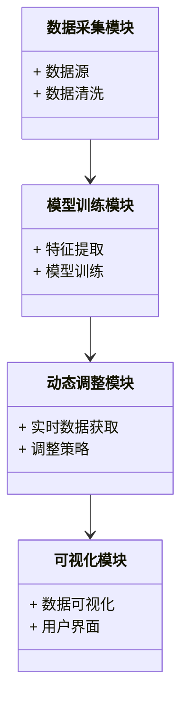
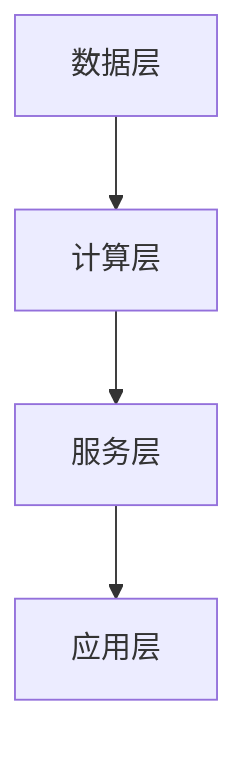

                 


# 《AI辅助企业战略执行：OKR自动化跟踪与动态调整》

## 关键词：AI, OKR, 企业战略, 自动化跟踪, 动态调整, 机器学习, 系统架构

## 摘要：  
随着企业对战略执行效率和精确度的要求不断提高，OKR（目标与关键结果）作为企业战略管理的重要工具，逐渐引入人工智能技术以实现自动化跟踪与动态调整。本文详细探讨了AI如何辅助OKR的管理，从算法原理到系统架构，再到项目实战，为读者提供了全面的视角和实用的方法论。通过结合机器学习、自然语言处理和强化学习等技术，本文展示了如何构建高效的AI辅助OKR管理系统，从而帮助企业实现战略目标的精准达成和动态优化。

---

# 第三部分: AI辅助OKR的算法原理

# 第3章: AI辅助OKR的算法原理

## 3.1 基于机器学习的目标预测

### 3.1.1 算法选择与原理  
机器学习在OKR中的应用主要集中在预测关键结果的达成情况。常用的算法包括线性回归、随机森林和神经网络等。  
- **线性回归**：适用于简单线性关系的预测，公式如下：  
  $$ y = \beta_0 + \beta_1x + \epsilon $$  
  其中，$y$ 是预测值，$x$ 是自变量，$\beta_0$ 和 $\beta_1$ 是回归系数，$\epsilon$ 是误差项。  
- **随机森林**：适用于非线性关系，通过集成学习提高预测准确性。  
- **神经网络**：适用于复杂非线性关系，可以通过深度学习模型（如LSTM）处理时间序列数据。  

### 3.1.2 算法流程图  


### 3.1.3 示例代码  
```python
import numpy as np
from sklearn.linear_model import LinearRegression
from sklearn.ensemble import RandomForestRegressor
from sklearn.metrics import mean_squared_error

# 示例数据
X = np.array([[1], [2], [3], [4], [5]])
y = np.array([2, 4, 5, 4, 7])

# 线性回归模型
lr = LinearRegression()
lr.fit(X, y)
y_pred_lr = lr.predict(X)

# 随机森林模型
rf = RandomForestRegressor(n_estimators=100)
rf.fit(X, y)
y_pred_rf = rf.predict(X)

# 模型评估
print("线性回归 MSE:", mean_squared_error(y, y_pred_lr))
print("随机森林 MSE:", mean_squared_error(y, y_pred_rf))
```

## 3.2 基于自然语言处理的OKR理解

### 3.2.1 NLP技术在OKR中的应用  
自然语言处理技术可以帮助系统理解OKR的描述性文本，提取关键信息。常用的模型包括词嵌入（如Word2Vec）和 transformer 模型（如BERT）。  
- **词嵌入**：将文本转换为向量表示，公式如下：  
  $$ E(w) = v_w $$  
  其中，$E(w)$ 是单词 $w$ 的向量表示，$v_w$ 是预训练的向量。  
- **BERT模型**：通过上下文理解生成更精确的文本表示。  

### 3.2.2 示例代码  
```python
from sentence_transformers import SentenceTransformer
from sklearn.metrics.pairwise import cosine_similarity

# 示例文本
texts = ["Increase sales by 10%", "Improve customer satisfaction"]

# 使用BERT模型生成向量
model = SentenceTransformer('bert-base-nli-mean-tokens')
embeddings = model.encode(texts)

# 计算相似度
similarity_matrix = cosine_similarity(embeddings)
print(similarity_matrix)
```

## 3.3 基于强化学习的动态调整

### 3.3.1 强化学习的应用场景  
强化学习适用于动态调整OKR的过程，通过奖励机制优化决策。  
- **状态**：当前OKR的执行状态。  
- **动作**：调整目标或关键结果。  
- **奖励**：根据实际结果与预期的差距给予奖励或惩罚。  

### 3.3.2 示例代码  
```python
import gym
import numpy as np

# 自定义强化学习环境
class OKREnvironment(gym.Env):
    def __init__(self):
        self.state = 0  # 状态表示当前执行进度
        self.done = False

    def reset(self):
        self.state = 0
        return self.state

    def step(self, action):
        # 动作表示调整的幅度
        new_state = self.state + action
        reward = 1 if new_state > 0.8 else -1  # 简单奖励机制
        self.done = True if new_state >= 1 else False
        return new_state, reward, self.done

# 使用Q-learning算法进行训练
def train_agent():
    env = OKREnvironment()
    episodes = 1000
    for episode in range(episodes):
        state = env.reset()
        total_reward = 0
        while not env.done:
            action = np.random.randint(-1, 2)  # 随机选择动作
            next_state, reward, done = env.step(action)
            total_reward += reward
            print(f" Episode {episode+1}, Action: {action}, Reward: {reward}")
    print(f"训练完成，总奖励：{total_reward}")

train_agent()
```

## 3.4 本章小结  
本章详细介绍了AI辅助OKR的算法原理，包括基于机器学习的目标预测、基于NLP的OKR理解以及基于强化学习的动态调整。通过这些算法的结合，可以实现对OKR的智能预测、理解和优化。

---

# 第四部分: AI辅助OKR的系统架构设计

# 第4章: AI辅助OKR的系统架构设计

## 4.1 系统功能设计

### 4.1.1 功能模块划分  
- **数据采集模块**：收集企业战略目标和关键结果的历史数据。  
- **模型训练模块**：基于机器学习算法训练预测模型。  
- **动态调整模块**：根据实时数据调整OKR。  
- **可视化模块**：展示OKR的执行进度和预测结果。  

### 4.1.2 领域模型设计  


## 4.2 系统架构设计

### 4.2.1 分层架构  
系统采用分层架构，包括数据层、计算层、服务层和应用层。  
- **数据层**：存储企业战略数据和历史记录。  
- **计算层**：执行AI算法和预测任务。  
- **服务层**：提供API接口供上层调用。  
- **应用层**：处理用户请求和展示结果。  

### 4.2.2 架构图  


## 4.3 系统接口设计

### 4.3.1 API接口  
- **数据接口**：用于数据采集模块与数据库的交互。  
  ```python
  import requests

  response = requests.get('http://localhost:8000/api/data')
  print(response.json())
  ```
- **预测接口**：用于模型训练模块与动态调整模块的交互。  
  ```python
  response = requests.post('http://localhost:8000/api/predict', json={'data': data})
  print(response.json())
  ```

### 4.3.2 交互流程  
用户通过可视化模块提交请求，系统通过API接口传递数据，完成预测和调整任务。

## 4.4 本章小结  
本章从系统架构的角度，详细设计了AI辅助OKR的各个功能模块和交互流程，为实际开发提供了清晰的指导。

---

# 第五部分: AI辅助OKR的项目实战

# 第5章: AI辅助OKR的项目实战

## 5.1 环境配置

### 5.1.1 安装依赖  
```bash
pip install numpy scikit-learn sentence-transformers gym
```

## 5.2 核心代码实现

### 5.2.1 数据预处理  
```python
import pandas as pd

# 加载数据
data = pd.read_csv('okr_data.csv')
# 数据清洗
data.dropna(inplace=True)
```

### 5.2.2 模型训练  
```python
from sklearn.model_selection import train_test_split
from sklearn.ensemble import RandomForestRegressor

# 划分数据集
X_train, X_test, y_train, y_test = train_test_split(data.drop('target', axis=1), data['target'], test_size=0.2)

# 训练模型
model = RandomForestRegressor(n_estimators=100)
model.fit(X_train, y_train)
```

### 5.2.3 动态调整  
```python
def adjust_okr(current_progress):
    if current_progress < 0.6:
        return 'Increase efforts'
    elif current_progress < 0.8:
        return 'Maintain current'
    else:
        return 'Achieved'

adjust_result = adjust_okr(0.7)
print(adjust_result)  # 输出：Maintain current
```

## 5.3 实际案例分析

### 5.3.1 案例背景  
某互联网公司希望通过AI辅助OKR来提升季度目标的达成率。通过分析历史数据，预测下一季度的关键结果，并根据实时数据进行动态调整。

### 5.3.2 数据分析  
```python
import matplotlib.pyplot as plt

data['predicted_result'].plot.hist()
plt.show()
```

## 5.4 本章小结  
本章通过实际案例，展示了如何在企业中实施AI辅助OKR，从环境配置到代码实现，再到数据分析，提供了完整的实战指导。

---

# 第六部分: AI辅助OKR的最佳实践与总结

# 第6章: AI辅助OKR的最佳实践与总结

## 6.1 小结

### 6.1.1 核心技术总结  
- 算法：机器学习、NLP、强化学习。  
- 系统：分层架构、模块化设计。  

## 6.2 注意事项

### 6.2.1 数据质量  
确保数据的完整性和准确性，避免模型偏差。  
### 6.2.2 模型调优  
根据实际需求调整模型参数，提升预测精度。  

## 6.3 拓展阅读

### 6.3.1 推荐书目  
- 《机器学习实战》  
- 《深度学习入门：基于Python的CNN、RNN、GAN通俗讲》  
- 《企业战略管理：OKR实践指南》  

---

# 作者：AI天才研究院/AI Genius Institute & 禅与计算机程序设计艺术 /Zen And The Art of Computer Programming  

---

本文通过详细的技术博客形式，从AI辅助OKR的背景、算法原理、系统架构到项目实战，为读者提供了一个全面的视角和实用的指导。希望本文能帮助企业更好地利用AI技术优化OKR管理，提升战略执行效率。

