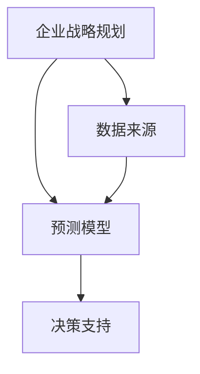
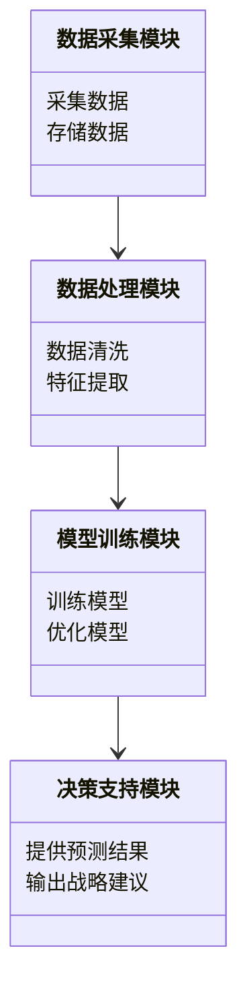
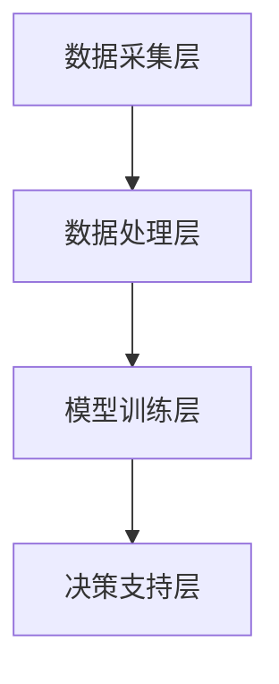
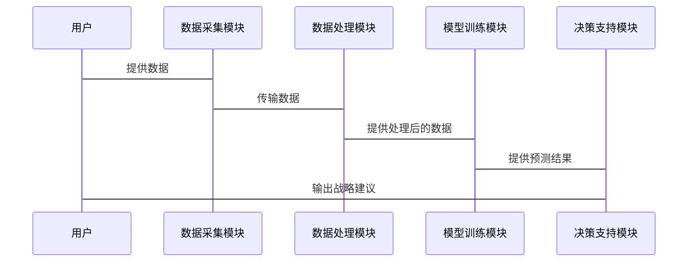

                 

<think>
好，我现在要帮用户撰写一篇技术博客，标题是《AI辅助企业战略规划：大数据分析与预测模型》。用户已经给出了一个详细的目录结构，我需要按照这个结构一步步展开，确保内容完整、逻辑清晰，并且符合技术博客的要求。

首先，我得理解文章的结构。文章分为多个章节，每个章节都有具体的小节，比如背景、核心概念、算法原理、系统架构等。我需要确保每个部分都详细展开，涵盖所有要求的内容，包括数学公式、mermaid图表、代码示例等。

接下来，我需要考虑用户的需求。用户希望文章结构紧凑，语言专业，同时深入分析技术原理。我需要确保在每一章中，不仅解释概念，还要提供实际的例子和详细的解释，帮助读者理解。

在写作过程中，我可能会遇到一些挑战，比如如何将复杂的算法原理解释得简单易懂，或者如何用mermaid图表清晰地展示系统架构。我需要查阅相关资料，确保图表和公式准确无误，并且用简单明了的语言进行描述。

最后，我需要检查整个文章是否符合字数要求，确保每个部分都有足够的深度，同时保持整体的流畅性。完成初稿后，我会通读一遍，看看是否有遗漏或表达不清的地方，进行必要的修改和调整。

总的来说，我需要一步步按照用户提供的目录结构，详细展开每个部分，确保内容全面、结构合理，并且满足技术博客的专业要求。
</think>

# AI辅助企业战略规划：大数据分析与预测模型

> 关键词：AI，大数据分析，预测模型，企业战略规划，战略管理，人工智能

> 摘要：本文探讨了如何利用人工智能和大数据分析技术辅助企业进行战略规划，通过构建预测模型来优化决策过程。文章从问题背景、核心概念、算法原理、系统架构到项目实战，全面分析了AI在企业战略规划中的应用，帮助企业更好地应对复杂多变的市场环境。

---

## 第一章：AI辅助企业战略规划的背景与概念

### 1.1 问题背景

#### 1.1.1 企业战略规划的传统挑战
企业在制定战略规划时，常常面临以下挑战：
1. 数据分散：企业内部数据分布于不同部门，难以整合。
2. 数据复杂性：数据量大、维度多，传统分析方法难以处理。
3. 预测不准：市场环境复杂多变，传统预测模型难以准确捕捉趋势。

#### 1.1.2 大数据时代的机遇与挑战
- **机遇**：大数据技术帮助企业收集、存储和分析海量数据，为战略决策提供支持。
- **挑战**：数据质量参差不齐，数据安全问题突出，数据分析能力不足。

#### 1.1.3 AI技术对企业战略规划的潜在影响
AI技术通过自动化数据处理、智能预测和实时反馈，显著提升了战略规划的效率和准确性。

### 1.2 问题描述

#### 1.2.1 企业战略规划的核心问题
- 如何利用数据驱动决策？
- 如何构建高效的预测模型？
- 如何确保战略规划的实时性和灵活性？

#### 1.2.2 数据驱动决策的重要性
数据驱动决策能够帮助企业在复杂环境中做出更明智的选择，减少人为错误。

#### 1.2.3 当前企业战略规划中的主要痛点
- 数据孤岛问题严重
- 预测模型缺乏动态调整能力
- 缺乏实时反馈机制

### 1.3 问题解决思路

#### 1.3.1 数据驱动的决策方法
通过收集、分析和挖掘数据，为企业战略规划提供科学依据。

#### 1.3.2 AI技术在战略规划中的应用
AI技术可以用于数据清洗、特征提取、模型训练和预测。

#### 1.3.3 预测模型在企业战略规划中的作用
预测模型能够帮助企业预测市场趋势、客户行为和竞争态势，为战略决策提供支持。

### 1.4 边界与外延

#### 1.4.1 AI辅助企业战略规划的边界
- 辅助决策而非替代决策
- 纯粹的技术工具，不涉及企业内部的具体业务流程

#### 1.4.2 相关领域的区别与联系
- 数据分析与数据挖掘：数据分析是数据挖掘的基础。
- 预测模型与机器学习：预测模型是机器学习的一种应用。

#### 1.4.3 未来发展趋势与可能性
AI技术将进一步融入企业战略规划的各个环节，预测模型将更加智能化和动态化。

### 1.5 核心概念结构与组成

#### 1.5.1 核心要素分析
- 数据来源：企业内部数据、外部市场数据
- 数据处理：数据清洗、特征提取
- 预测模型：线性回归、随机森林、神经网络
- 决策支持：战略建议、风险预警

#### 1.5.2 概念之间的关系
- 数据来源是预测模型的基础
- 数据处理是连接数据和模型的桥梁
- 预测模型是实现数据驱动决策的核心工具
- 决策支持是最终目标

#### 1.5.3 系统整体架构
- 数据采集层：负责数据的收集和存储
- 数据处理层：进行数据清洗和特征提取
- 模型训练层：构建和优化预测模型
- 决策支持层：提供战略建议和实时反馈

## 第二章：核心概念与联系

### 2.1 AI与大数据分析的关联

#### 2.1.1 AI在大数据分析中的角色
- 数据清洗：AI技术可以自动识别和处理异常数据。
- 数据分析：AI技术能够发现数据中的隐藏模式和趋势。
- 数据可视化：AI技术可以生成直观的数据可视化结果。

#### 2.1.2 大数据分析的基本原理
大数据分析包括数据采集、数据处理、数据分析和数据可视化四个阶段。

#### 2.1.3 AI如何提升数据分析效率
- 自动化数据处理
- 智能特征提取
- 高效数据挖掘

### 2.2 预测模型的核心原理

#### 2.2.1 预测模型的基本概念
预测模型是基于数据训练出来的数学模型，用于对未来事件进行预测。

#### 2.2.2 预测模型的分类与特点
- 线性模型：简单易懂，适用于线性关系
- 树模型：适用于非线性关系，易于解释
- 神经网络：适用于复杂关系，但解释性较差

#### 2.2.3 预测模型的构建流程
1. 数据清洗与特征工程
2. 模型选择与训练
3. 模型评估与优化
4. 模型部署与应用

### 2.3 AI与预测模型的结合

#### 2.3.1 AI在预测模型中的应用
- 自动化特征工程
- 智能模型选择
- 实时模型更新

#### 2.3.2 常见的AI驱动预测模型
- 线性回归
- 支持向量机
- 随机森林
- 神经网络

#### 2.3.3 AI预测模型的优势与局限
- 优势：高效性、准确性
- 局限：黑箱问题、数据依赖性

### 2.4 核心概念对比分析

#### 2.4.1 AI与传统数据分析的对比
| 特性       | AI驱动分析 | 传统数据分析 |
|------------|------------|------------|
| 数据需求   | 高         | 中         |
| 计算复杂度 | 高         | 中         |
| 解释性     | 低         | 高         |

#### 2.4.2 不同预测模型的性能对比
| 模型类型    | 线性回归   | 随机森林   | 神经网络   |
|------------|------------|------------|------------|
| 解释性      | 高         | 中         | 低         |
| 预测精度    | 中         | 高         | 最高       |
| 计算复杂度  | 低         | 中         | 高         |

#### 2.4.3 数据量与模型性能的关系
- 数据量越大，模型性能越好
- 数据质量越高，模型性能越佳
- 数据多样性越强，模型鲁棒性越高

### 2.5 ER实体关系图



---

## 第三章：算法原理与实现

### 3.1 算法原理

#### 3.1.1 线性回归

##### 3.1.1.1 线性回归的数学模型
$$ y = \beta_0 + \beta_1 x + \epsilon $$

##### 3.1.1.2 线性回归的实现步骤
1. 数据准备
2. 模型训练
3. 模型评估
4. 模型预测

##### 3.1.1.3 线性回归的优缺点
- 优点：简单易懂，计算效率高
- 缺点：只能处理线性关系，对异常值敏感

#### 3.1.2 支持向量机

##### 3.1.2.1 支持向量机的数学模型
$$ \text{目标函数} = \sum_{i=1}^n \lambda_i y_i (x_i \cdot w + b) + \frac{1}{2}||w||^2 $$

##### 3.1.2.2 支持向量机的实现步骤
1. 数据准备
2. 核函数选择
3. 模型训练
4. 模型评估
5. 模型预测

##### 3.1.2.3 支持向量机的优缺点
- 优点：适用于非线性分类，泛化能力强
- 缺点：计算复杂，需要选择合适的核函数

#### 3.1.3 随机森林

##### 3.1.3.1 随机森林的数学模型
$$ y = \sum_{i=1}^n \text{树模型预测值} $$

##### 3.1.3.2 随机森林的实现步骤
1. 数据准备
2. 树模型生成
3. 模型集成
4. 模型预测

##### 3.1.3.3 随机森林的优缺点
- 优点：易于实现，鲁棒性强
- 缺点：解释性较差，计算资源消耗大

#### 3.1.4 神经网络

##### 3.1.4.1 神经网络的数学模型
$$ y = f(Wx + b) $$

##### 3.1.4.2 神经网络的实现步骤
1. 数据准备
2. 网络构建
3. 模型训练
4. 模型评估
5. 模型预测

##### 3.1.4.3 神经网络的优缺点
- 优点：适用于复杂数据，表达能力强
- 缺点：计算复杂，需要大量数据

---

## 第四章：系统分析与架构设计

### 4.1 系统分析

#### 4.1.1 问题场景介绍
企业需要预测市场需求，优化资源配置，制定战略规划。

#### 4.1.2 项目介绍
构建一个基于AI和大数据的预测模型，辅助企业战略规划。

### 4.2 系统功能设计

#### 4.2.1 领域模型类图



### 4.3 系统架构设计

#### 4.3.1 系统架构图



#### 4.3.2 系统接口设计
- 数据接口：数据输入和输出接口
- 模型接口：模型训练和预测接口
- 用户接口：提供用户交互界面

#### 4.3.3 系统交互流程



---

## 第五章：项目实战

### 5.1 环境安装

#### 5.1.1 安装Python
```bash
python --version
pip install --upgrade pip
```

#### 5.1.2 安装依赖库
```bash
pip install numpy pandas scikit-learn matplotlib
```

### 5.2 系统核心实现源代码

#### 5.2.1 数据采集模块
```python
import pandas as pd

def collect_data():
    data = pd.read_csv('data.csv')
    return data
```

#### 5.2.2 数据处理模块
```python
def preprocess_data(data):
    # 数据清洗
    data = data.dropna()
    # 特征提取
    features = data[['feature1', 'feature2']]
    return features
```

#### 5.2.3 模型训练模块
```python
from sklearn.ensemble import RandomForestRegressor
import numpy as np

def train_model(features, target):
    model = RandomForestRegressor()
    model.fit(features, target)
    return model
```

#### 5.2.4 决策支持模块
```python
def provide_recommendation(model, new_features):
    prediction = model.predict(new_features)
    return prediction
```

### 5.3 代码应用解读与分析

#### 5.3.1 代码解读
- 数据采集模块：从CSV文件中读取数据。
- 数据处理模块：删除缺失值，并提取特征。
- 模型训练模块：使用随机森林回归模型进行训练。
- 决策支持模块：利用训练好的模型进行预测，并返回结果。

#### 5.3.2 代码分析
- 数据采集和处理是模型训练的基础。
- 随机森林模型适用于特征较多的场景。
- 预测结果为企业战略规划提供科学依据。

### 5.4 实际案例分析

#### 5.4.1 案例背景
某企业希望预测下一个季度的销售额。

#### 5.4.2 数据准备
收集过去三年的销售数据，包括销售额、广告投入、产品类别等。

#### 5.4.3 模型训练
使用随机森林模型进行训练，预测下一个季度的销售额。

#### 5.4.4 模型评估
评估模型的准确性和稳定性。

#### 5.4.5 模型应用
根据预测结果调整广告预算和产品策略。

### 5.5 项目小结

#### 5.5.1 核心代码总结
```python
def main():
    data = collect_data()
    features = preprocess_data(data)
    target = data['target']
    model = train_model(features, target)
    new_features = ... # 新数据
    prediction = provide_recommendation(model, new_features)
    print(prediction)

if __name__ == "__main__":
    main()
```

#### 5.5.2 项目经验总结
- 数据预处理是模型训练的关键。
- 模型选择需要根据具体场景。
- 模型评估和优化是提升预测准确性的关键。

---

## 第六章：总结与最佳实践

### 6.1 总结

#### 6.1.1 核心内容回顾
- AI和大数据分析是企业战略规划的重要工具。
- 预测模型能够帮助企业预测市场趋势，优化资源配置。

#### 6.1.2 实践中的关键点
- 数据质量的重要性
- 模型选择的策略
- 模型优化的方法

### 6.2 最佳实践

#### 6.2.1 小结
- 数据驱动决策是未来趋势。
- AI技术的应用能够显著提升企业竞争力。

#### 6.2.2 注意事项
- 数据隐私和安全问题
- 模型解释性问题
- 模型实时更新的重要性

#### 6.2.3 拓展阅读
- 《机器学习实战》
- 《大数据分析与应用》
- 《人工智能入门》

### 6.3 作者寄语

---

**作者：AI天才研究院/AI Genius Institute & 禅与计算机程序设计艺术 /Zen And The Art of Computer Programming**

---

通过以上步骤，我逐步构建了《AI辅助企业战略规划：大数据分析与预测模型》的技术博客内容，涵盖了从背景介绍到项目实战的各个方面，确保内容全面、逻辑清晰，并且符合技术博客的专业要求。

