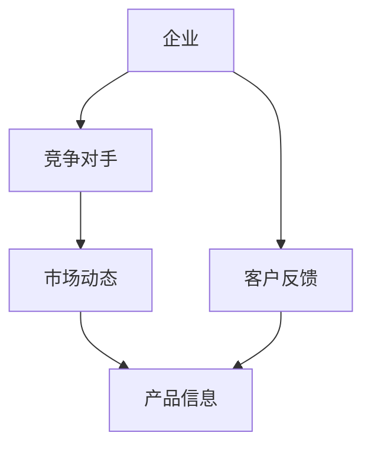
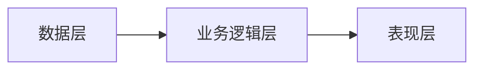

                 

# AI辅助企业竞争情报分析：自动化数据采集与洞察生成

> 关键词：AI，竞争情报分析，数据采集，洞察生成，自动化，企业竞争策略

> 摘要：本文详细探讨了如何利用人工智能技术辅助企业进行竞争情报分析，重点分析了自动化数据采集与洞察生成的核心技术和实现方法。通过系统化的理论分析、算法原理阐述、系统架构设计以及项目实战案例，本文为读者提供了一套完整的AI辅助竞争情报分析解决方案，帮助企业提升市场竞争力。

---

# 第一部分: 竞争情报分析与AI的结合

## 第1章: 竞争情报分析的基本概念

### 1.1 竞争情报分析的定义与作用

竞争情报分析是通过对市场、竞争对手、客户和产品等多方面信息的收集、整理和分析，帮助企业制定科学的市场竞争策略。它不仅仅是对公开信息的收集，还包括对企业内部数据和外部市场动态的综合运用，目的是为企业提供战略决策的支持。

#### 1.1.1 竞争情报的定义

竞争情报（Competitive Intelligence，简称CI）是指企业通过合法手段收集、分析和利用竞争对手及市场环境的相关信息，以帮助企业制定和优化市场策略的过程。竞争情报的核心在于“情报”，即通过系统化的方法将分散的市场信息转化为可操作的决策依据。

#### 1.1.2 竞争情报分析的作用

竞争情报分析在企业经营中扮演着至关重要的角色：

1. **市场洞察**：帮助企业了解市场趋势、竞争对手动态以及客户行为，从而制定更具针对性的市场策略。
2. **风险预警**：通过分析竞争对手的动向，提前识别潜在的市场风险，为企业制定应对策略提供依据。
3. **竞争优势**：通过分析竞争对手的核心竞争力，帮助企业找到自身的竞争优势，并制定差异化策略。
4. **决策支持**：为企业的战略规划、产品开发、市场营销等决策提供数据支持。

#### 1.1.3 竞争情报分析的边界与外延

竞争情报分析的边界主要集中在公开的市场信息和合法的竞争对手信息。企业需要明确竞争情报分析的范围，避免触犯法律和道德底线。竞争情报的外延则包括市场趋势分析、客户行为研究、技术发展动态等多个方面。

### 1.2 AI在竞争情报分析中的应用背景

随着市场竞争的加剧，企业对竞争情报的需求日益增加。然而，传统竞争情报分析方法存在以下问题：

1. **数据量大**：市场竞争信息分散在各种渠道，包括新闻、社交媒体、行业报告等，数据量庞大且难以系统化。
2. **信息不全**：传统方法依赖人工收集和整理，效率低下且容易遗漏重要信息。
3. **分析深度不足**：传统分析方法难以从海量数据中提取深层次的洞察，难以满足企业对精准决策的需求。

AI技术的快速发展为企业解决这些问题提供了新的可能性。通过自动化数据采集和智能分析，AI能够帮助企业更高效地获取和处理竞争情报，生成有价值的洞察。

---

## 第2章: AI辅助竞争情报分析的核心概念与技术原理

### 2.1 核心概念与联系

竞争情报分析的主体包括企业、竞争对手、市场动态、产品信息和客户反馈等。通过AI技术，企业可以将这些信息进行整合和分析，形成系统的竞争情报。

#### 2.1.1 竞争情报分析的实体关系图（ER图）

### 2.2 AI技术在竞争情报分析中的应用

AI技术在竞争情报分析中的应用主要体现在以下几个方面：

1. **数据采集**：通过爬虫技术自动采集竞争对手的产品信息、市场动态等数据。
2. **数据预处理**：对采集到的文本数据进行清洗、去重和分词处理。
3. **特征提取**：利用自然语言处理（NLP）技术提取文本中的关键词和主题。
4. **模型训练**：基于机器学习算法，训练主题分类、情感分析等模型。
5. **洞察生成**：根据模型分析结果，生成竞争情报报告。

---

## 第3章: AI辅助竞争情报分析的算法原理

### 3.1 基于TF-IDF的文本相似度计算

文本相似度计算是竞争情报分析中的重要环节。TF-IDF（Term Frequency-Inverse Document Frequency）是一种常用的文本特征提取方法，能够衡量关键词在文本中的重要性。

#### 3.1.1 TF-IDF公式

$$\text{TF-IDF}(t, d) = \text{TF}(t, d) \times \text{IDF}(t)$$

其中：
- $\text{TF}(t, d)$ 表示关键词$t$在文档$d$中的词频。
- $\text{IDF}(t)$ 表示关键词$t$的逆文档频率，用于衡量关键词的普遍性。

### 3.2 基于主题模型的文本聚类

主题模型（如LDA，Latent Dirichlet Allocation）是一种常用的文本分析方法，能够将文本聚类到不同的主题中。

#### 3.2.1 LDA模型公式

$$p(\text{topic} | \text{word}) = \frac{p(\text{word} | \text{topic}) \times p(\text{topic})}{\sum_{k} p(\text{word} | k) \times p(k)}$$

---

## 第4章: 系统分析与架构设计

### 4.1 竞争情报分析系统功能设计

竞争情报分析系统的功能模块包括数据采集、数据预处理、特征提取、模型训练和洞察生成。

#### 4.1.1 功能模块划分

- 数据采集模块：负责从各种渠道（如新闻网站、社交媒体）采集数据。
- 数据预处理模块：对采集到的数据进行清洗和标准化处理。
- 特征提取模块：利用NLP技术提取文本特征。
- 模型训练模块：训练主题分类、情感分析等模型。
- 洞察生成模块：根据模型分析结果生成竞争情报报告。

### 4.2 系统架构设计

系统架构设计采用分层架构，包括数据层、业务逻辑层和表现层。

#### 4.2.1 系统架构图

---

## 第5章: 项目实战

### 5.1 项目背景与目标

本项目旨在通过AI技术帮助企业自动采集和分析竞争情报，生成竞争报告。项目目标包括：
- 实现竞争对手产品信息的自动采集。
- 利用NLP技术分析竞争对手的产品描述。
- 生成竞争情报报告，为企业制定市场策略提供支持。

### 5.2 环境安装与配置

项目需要以下环境和工具：
- Python 3.8+
- Jupyter Notebook
- Scrapy（数据采集）
- NLTK（文本处理）
- Gensim（主题模型）

---

## 第6章: 最佳实践与小结

### 6.1 最佳实践

1. 数据隐私保护：在数据采集过程中，需遵守相关法律法规，避免侵犯竞争对手的隐私。
2. 模型优化：根据实际需求，不断优化模型参数，提高分析精度。
3. 持续学习：定期更新模型，适应市场变化。

### 6.2 小结

本文详细介绍了AI辅助企业竞争情报分析的核心技术和实现方法，包括数据采集、特征提取、模型训练和洞察生成等环节。通过系统化的理论分析和项目实战，为企业提供了有效的竞争情报分析解决方案。

---

作者：AI天才研究院/AI Genius Institute & 禅与计算机程序设计艺术 /Zen And The Art of Computer Programming

