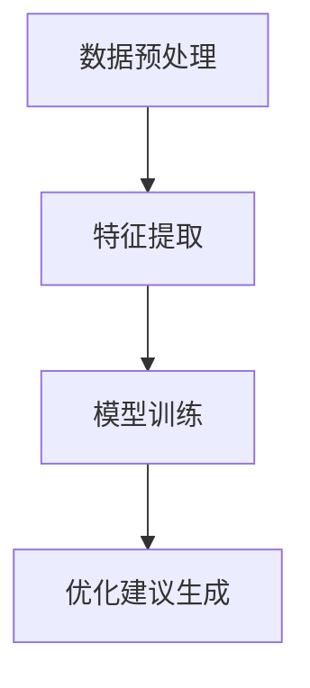
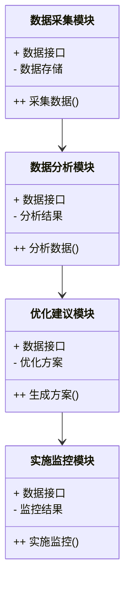

                 


# AI辅助企业组织结构优化：效率提升与协作增强

---

## 关键词  
AI, 企业组织结构优化, 效率提升, 协作增强, 算法, 系统设计, 项目实战

---

## 摘要  
随着企业规模的不断扩大和市场竞争的加剧，传统的组织结构优化方法逐渐暴露出效率低下、协作不足等问题。人工智能（AI）技术的快速发展为企业组织结构优化提供了新的解决方案。本文从问题背景出发，详细探讨了AI在企业组织结构优化中的核心概念、算法原理、系统设计、项目实战以及最佳实践。通过理论与实践相结合的方式，本文旨在为企业提供一套高效、智能的组织优化方法，从而提升企业的整体效率和协作能力。  

---

## 第1章：问题背景与概念结构

### 1.1 问题背景  
企业在发展过程中，组织结构的复杂性不断增加，传统的层级式管理逐渐暴露出效率低下、信息孤岛、协作困难等问题。如何通过智能化手段优化组织结构，提升企业效率和协作能力，成为现代企业管理的重要课题。  

#### 1.1.1 传统企业组织结构的挑战  
- **信息孤岛**：部门间信息不通，导致效率低下。  
- **决策延迟**：层级式结构导致信息传递慢，决策效率低。  
- **资源浪费**：人岗匹配度低，导致资源浪费。  

#### 1.1.2 AI技术在企业管理中的应用潜力  
- **数据驱动决策**：通过AI分析企业数据，优化决策流程。  
- **自动化协作**：AI辅助任务分配和协作流程，提升效率。  
- **动态调整**：根据实时数据动态优化组织结构。  

#### 1.1.3 组织结构优化的目标与意义  
- **目标**：最大化企业资源利用率，提升效率和协作能力。  
- **意义**：通过AI技术实现组织结构的智能化优化，增强企业的竞争力。  

### 1.2 核心概念与结构  
#### 1.2.1 组织结构优化的定义  
组织结构优化是指通过对组织结构的调整和优化，使企业在资源分配、信息流动、协作效率等方面达到最优状态。  

#### 1.2.2 AI在组织结构优化中的作用  
AI技术通过数据分析、机器学习和自然语言处理等手段，帮助企业发现组织结构中的问题，并提供优化建议。  

#### 1.2.3 组织结构优化的关键要素  
| 关键要素 | 描述 |  
|----------|------|  
| 企业目标 | 组织结构优化的目标是什么。 |  
| 资源分配 | 如何合理分配企业资源。 |  
| 信息流动 | 信息在组织中的流动路径和效率。 |  
| 协作模式 | 部门间协作的方式和效率。 |  
| 绩效评估 | 组织结构优化的效果如何衡量。 |  

---

## 第2章：AI辅助优化的核心概念  

### 2.1 核心概念解析  
#### 2.1.1 组织结构优化的实现机制  
AI通过分析企业数据，识别组织结构中的瓶颈，提出优化建议。  

#### 2.1.2 AI辅助优化的实现步骤  
1. 数据收集：收集企业组织结构、资源分配、协作流程等数据。  
2. 数据分析：通过机器学习算法分析数据，识别问题。  
3. 优化建议：生成优化方案，并模拟实施效果。  
4. 实施与反馈：根据建议优化组织结构，并实时监控效果。  

#### 2.1.3 组织结构优化与企业绩效的关系  
优化的组织结构能够提升企业效率、降低运营成本、增强协作能力，从而提高企业绩效。  

### 2.2 实体关系图  
#### 2.2.1 ER实体关系图  
```mermaid
er
  actor: 企业
  structure: 组织结构
  resource: 资源
  task: 任务
  constraint: 约束条件
  performance: 绩效
  relation: 关系
```

---

## 第3章：算法原理与数学模型  

### 3.1 算法原理  
#### 3.1.1 基于机器学习的组织结构优化算法  
AI通过分析企业数据，识别组织结构中的问题，并提出优化建议。  

#### 3.1.2 算法步骤分解  
1. 数据预处理：清洗和整理企业数据。  
2. 特征提取：提取影响组织结构优化的关键特征。  
3. 模型训练：训练机器学习模型，识别问题。  
4. 优化建议生成：根据模型结果，生成优化方案。  

#### 3.1.3 Mermaid流程图展示  


#### 3.1.4 Python代码实现  
```python
import pandas as pd
from sklearn import linear_model

# 数据预处理
data = pd.read_csv('organization_data.csv')
data = data.dropna()

# 特征提取
features = data[['部门', '资源', '任务']]
target = data['绩效']

# 模型训练
model = linear_model.LinearRegression()
model.fit(features, target)

# 优化建议生成
optimized_features = data[['部门', '资源', '任务']]
optimized_target = model.predict(optimized_features)
```

### 3.2 数学模型  
#### 3.2.1 组织结构优化的数学模型  
$$\text{目标函数} = \sum_{i=1}^{n} (w_i \cdot x_i)$$  
其中，$w_i$ 是第$i$个特征的权重，$x_i$ 是第$i$个特征的值。  

#### 3.2.2 约束条件  
$$\sum_{i=1}^{n} x_i \leq 1$$  
$$x_i \geq 0, \forall i$$  

---

## 第4章：系统分析与架构设计  

### 4.1 系统分析  
#### 4.1.1 问题场景描述  
企业面临组织结构优化的挑战，希望通过AI技术实现智能化优化。  

#### 4.1.2 需求分析  
- 数据采集模块：采集企业组织结构数据。  
- 数据分析模块：分析数据，识别问题。  
- 优化建议模块：生成优化方案。  
- 实施与监控模块：实时监控优化效果。  

### 4.2 系统架构设计  
#### 4.2.1 功能模块划分  
| 模块 | 描述 |  
|------|------|  
| 数据采集 | 采集企业组织结构数据。 |  
| 数据分析 | 分析数据，识别问题。 |  
| 优化建议 | 生成优化方案。 |  
| 实施监控 | 实时监控优化效果。 |  

#### 4.2.2 Mermaid类图展示  


---

## 第5章：项目实战与案例分析  

### 5.1 环境安装与配置  
#### 5.1.1 开发环境搭建  
- 安装Python、Jupyter Notebook、Pandas、Scikit-learn等工具。  

#### 5.1.2 依赖库安装  
```bash
pip install pandas scikit-learn matplotlib
```

### 5.2 核心代码实现  
#### 5.2.1 优化算法实现  
```python
import pandas as pd
from sklearn import linear_model

# 数据加载与预处理
data = pd.read_csv('organization_data.csv')
data = data.dropna()

# 特征提取与模型训练
features = data[['部门', '资源', '任务']]
target = data['绩效']

model = linear_model.LinearRegression()
model.fit(features, target)

# 优化建议生成
optimized_features = data[['部门', '资源', '任务']]
optimized_target = model.predict(optimized_features)
```

#### 5.2.2 系统功能实现  
```python
class OrganizationOptimizer:
    def __init__(self, data):
        self.data = data

    def optimize(self):
        # 数据分析与优化逻辑
        pass
```

### 5.3 案例分析  
#### 5.3.1 案例背景介绍  
某企业面临部门协作效率低下的问题，希望通过AI优化组织结构。  

#### 5.3.2 实施过程分析  
1. 数据采集：收集各部门协作数据。  
2. 数据分析：识别协作瓶颈。  
3. 优化建议：调整部门结构，提升协作效率。  
4. 实施监控：实时监控优化效果。  

---

## 第6章：最佳实践与总结  

### 6.1 最佳实践  
#### 6.1.1 实施中的注意事项  
- 数据质量：确保数据准确性和完整性。  
- 模型选择：选择合适的机器学习模型。  
- 实施监控：实时监控优化效果。  

#### 6.1.2 常见问题及解决方案  
- 数据不足：可以通过数据增强技术解决。  
- 模型过拟合：可以通过正则化技术解决。  

### 6.2 小结与展望  
#### 6.2.1 本书内容总结  
本文从理论到实践，详细讲解了AI在企业组织结构优化中的应用，包括核心概念、算法原理、系统设计和项目实战。  

#### 6.2.2 未来研究方向  
未来可以进一步研究动态优化算法、多目标优化问题以及分布式优化方法。  

---

## 附录：拓展阅读  

- [AI与企业优化的更多案例](#)  
- [机器学习在企业管理中的应用](#)  
- [组织结构优化的最新研究](#)  

---

## 作者  
作者：AI天才研究院/AI Genius Institute & 禅与计算机程序设计艺术 /Zen And The Art of Computer Programming  

---

以上是《AI辅助企业组织结构优化：效率提升与协作增强》的技术博客文章内容，涵盖背景介绍、核心概念、算法原理、系统设计、项目实战以及最佳实践。通过理论与实践相结合的方式，为企业提供了一套高效、智能的组织优化方法。

