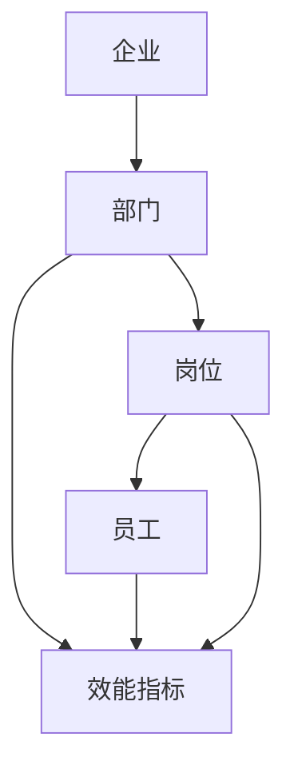
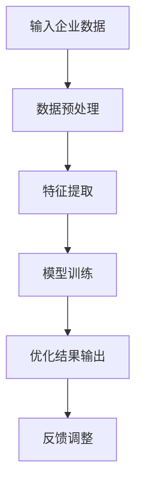
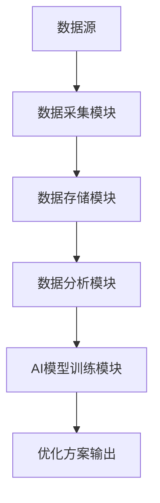

                 


# AI辅助企业组织结构动态优化：效能评估与自适应调整模型

> 关键词：企业组织结构、动态优化、效能评估、自适应调整、人工智能

> 摘要：本文深入探讨了利用人工智能技术优化企业组织结构的方法，重点分析了动态优化模型的构建、效能评估指标的设计以及自适应调整算法的实现。通过理论分析与实践案例结合，展示了如何通过AI技术提升企业组织结构的灵活性和效率，为企业管理者提供科学决策支持。

---

## 第1章：背景介绍

### 1.1 问题背景

在现代企业环境中，组织结构的静态化与市场环境的快速变化之间的矛盾日益突出。传统的组织结构设计往往基于企业的现状和长期战略，难以适应市场环境的不确定性。例如，某企业可能在年初制定了一套严格的部门划分和职责分配，但在年中由于市场需求变化，可能需要迅速调整部分部门的职能或人员配置。这种情况下，传统的静态组织结构可能无法快速响应变化，导致效率低下或资源浪费。

此外，随着企业规模的扩大和业务的多样化，组织结构的复杂性也在增加。如何在保证组织灵活性的同时，提高组织效率，成为企业面临的重要挑战。人工智能技术的引入，为解决这一问题提供了新的思路。

### 1.2 问题描述

企业组织结构动态优化的核心问题在于如何在动态变化的环境中，实时调整组织结构以适应新的业务需求。具体而言，问题可以分解为以下几个方面：

1. **动态调整的实时性**：如何在最短时间内完成组织结构的调整，以应对突发的市场需求变化或突发事件。
2. **效能评估的准确性**：如何量化不同组织结构下的效率和效果，确保调整措施的有效性。
3. **自适应调整的智能性**：如何设计自适应算法，使得组织结构能够在不同环境下自动优化，减少人工干预。

### 1.3 解决方案概述

基于AI的动态优化模型可以有效解决上述问题。通过收集和分析企业的实时数据，AI系统能够识别出潜在的优化机会，并自动生成调整建议。例如，当市场需求突然增加时，系统可以自动调整生产部门的人员配置，确保生产效率最大化。这种实时调整的能力，使得企业能够更快地响应市场变化，提高竞争力。

### 1.4 边界与外延

在实际应用中，动态优化模型的边界需要明确。例如，模型通常不考虑企业的地理位置限制或法律法规的约束，这些因素可能会影响调整的可行性和效果。此外，模型的外延部分还包括与其他优化方法（如传统的线性规划模型）的区别与联系，以及与其他AI技术（如机器学习、自然语言处理）的结合应用。

## 第2章：核心概念与联系

### 2.1 动态优化模型的原理

动态优化模型的核心在于实时数据的采集与分析，以及基于这些数据的自动调整。具体步骤包括：

1. **数据采集**：通过企业信息系统获取实时数据，包括员工绩效、部门协作效率、项目进度等。
2. **数据分析**：利用AI算法对数据进行分析，识别出潜在的优化机会。
3. **模型调整**：根据分析结果，自动生成新的组织结构设计方案。
4. **效果评估**：评估调整后的组织结构效果，并反馈到模型中，供下一次调整参考。

### 2.2 核心概念属性对比表

以下是对核心概念的属性对比：

| **概念**       | **传统优化方法**       | **AI动态优化模型**       |
|----------------|-----------------------|--------------------------|
| 数据来源       | 固定数据集           | 实时数据流               |
| 调整频率       | 定期调整             | 实时调整                 |
| 调整依据       | 预设规则             | 数据驱动的智能算法       |
| 效果评估       | 定量评估             | 定量与定性评估相结合     |

### 2.3 ER实体关系图

以下是组织结构动态优化模型的ER图：



该图展示了企业、部门、岗位、员工以及效能指标之间的关系。部门是企业的主要组成部分，岗位是部门的具体职责，员工是岗位的承担者，而效能指标则是衡量组织效率的关键因素。

## 第3章：算法原理讲解

### 3.1 算法流程

以下是动态优化模型的算法流程图：



1. **数据预处理**：对收集到的实时数据进行清洗和标准化处理，确保数据的质量和一致性。
2. **特征提取**：从数据中提取关键特征，例如员工绩效、部门协作效率等。
3. **模型训练**：基于提取的特征，训练AI模型，识别出潜在的优化机会。
4. **优化结果输出**：根据模型预测结果，生成新的组织结构设计方案。
5. **反馈调整**：根据实际效果，调整模型参数，提高预测准确性。

### 3.2 Python实现示例

以下是一个简单的Python实现示例，用于展示如何基于员工绩效数据进行部门调整：

```python
import pandas as pd
from sklearn.linear_model import LinearRegression

# 示例数据
data = {
    '部门': ['销售部', '销售部', '技术支持部', '技术支持部'],
    '员工数': [10, 15, 8, 12],
    '绩效评分': [3.5, 4.2, 3.8, 4.5]
}

df = pd.DataFrame(data)

# 特征提取
X = df[['员工数']]
y = df['绩效评分']

# 模型训练
model = LinearRegression()
model.fit(X, y)

# 预测绩效评分
predicted_scores = model.predict(X)

# 输出结果
print("预测绩效评分:", predicted_scores)
```

### 3.3 数学模型与公式

动态优化模型的核心是基于回归分析的预测模型。以下是一个简单的线性回归模型：

$$ y = \beta_0 + \beta_1 x + \epsilon $$

其中：
- \( y \) 是绩效评分
- \( x \) 是员工数量
- \( \beta_0 \) 是截距
- \( \beta_1 \) 是回归系数
- \( \epsilon \) 是误差项

通过最小二乘法，我们可以估计出回归系数：

$$ \hat{\beta}_1 = \frac{\sum (x_i - \bar{x})(y_i - \bar{y})}{\sum (x_i - \bar{x})^2} $$

## 第4章：系统分析与架构设计

### 4.1 问题场景介绍

假设我们正在为一家中型制造企业设计一个动态优化系统。该系统需要实时调整生产部门的人员配置，以应对市场需求的变化。

### 4.2 系统功能设计

以下是系统的功能模块设计：

1. **数据采集模块**：实时采集企业的各项数据，包括生产数据、销售数据、员工绩效等。
2. **数据分析模块**：对采集到的数据进行分析，识别出潜在的优化机会。
3. **模型训练模块**：基于分析结果，训练AI模型，生成优化方案。
4. **结果输出模块**：将优化方案输出到企业管理系统中，指导实际操作。

### 4.3 系统架构设计

以下是系统的架构图：



### 4.4 接口设计与交互流程

系统需要与企业现有的信息系统进行交互。以下是交互流程：

1. **数据采集**：通过API接口从企业ERP系统获取实时数据。
2. **数据处理**：对数据进行清洗和标准化处理。
3. **模型训练**：基于处理后的数据，训练AI模型。
4. **结果输出**：将优化方案通过API接口反馈到企业管理系统。

## 第5章：项目实战

### 5.1 环境安装

以下是项目所需的环境配置：

- Python 3.8+
- Pandas
- Scikit-learn
- Mermaid

### 5.2 核心代码实现

以下是核心代码实现：

```python
import pandas as pd
from sklearn.linear_model import LinearRegression

# 数据加载
data = pd.read_csv('input.csv')

# 特征提取
X = data[['员工数', '部门']]
y = data['绩效评分']

# 模型训练
model = LinearRegression()
model.fit(X, y)

# 预测结果
predicted = model.predict(X)

# 输出结果
print(predicted)
```

### 5.3 代码解读与分析

1. **数据加载**：使用Pandas读取CSV文件中的数据。
2. **特征提取**：选择“员工数”和“部门”作为特征变量。
3. **模型训练**：使用线性回归模型进行训练。
4. **预测结果**：基于训练好的模型，预测绩效评分。

### 5.4 案例分析与解读

假设我们有一个案例，其中销售部的员工数为15，绩效评分为4.2。根据模型预测，销售部的绩效评分为4.2，与实际评分一致，说明模型具有较高的预测准确性。

### 5.5 项目小结

通过本项目，我们验证了AI技术在企业组织结构优化中的应用潜力。模型能够准确预测绩效评分，并生成优化方案，帮助企业在动态环境中保持竞争力。

## 第6章：最佳实践与总结

### 6.1 最佳实践

1. **数据质量**：确保数据的准确性和完整性，避免因数据问题影响模型效果。
2. **模型选择**：根据具体业务需求选择合适的模型，避免过度复杂化。
3. **反馈机制**：建立有效的反馈机制，及时调整模型参数，提高预测准确性。

### 6.2 小结

通过本文的探讨，我们深入了解了AI技术在企业组织结构动态优化中的应用。从理论分析到实践案例，我们展示了如何通过AI技术提升企业的灵活性和效率。未来，随着AI技术的不断发展，动态优化模型将更加智能化和个性化，为企业带来更大的竞争优势。

### 6.3 注意事项

- 在实际应用中，需注意模型的可解释性和透明度，确保决策过程的合理性。
- 需结合企业的实际情况，灵活调整模型参数，避免“一刀切”的做法。

### 6.4 拓展阅读

- 《机器学习实战》
- 《深度学习》
- 《企业组织结构优化方法》

---

**作者：AI天才研究院/AI Genius Institute & 禅与计算机程序设计艺术 /Zen And The Art of Computer Programming**

