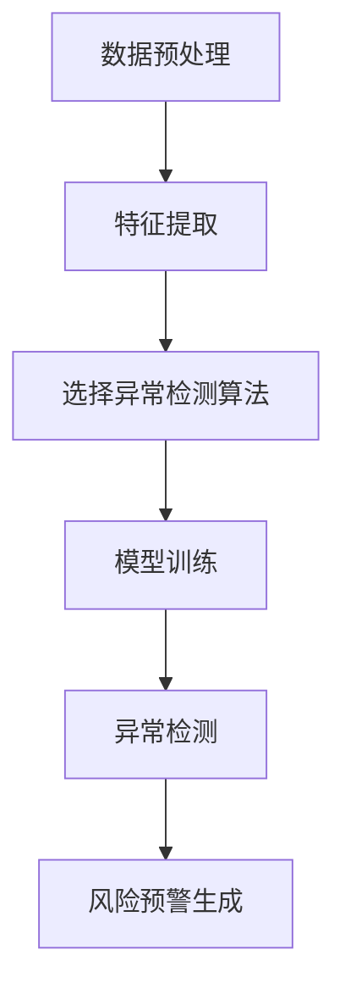
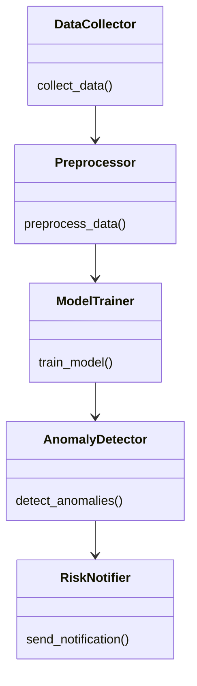
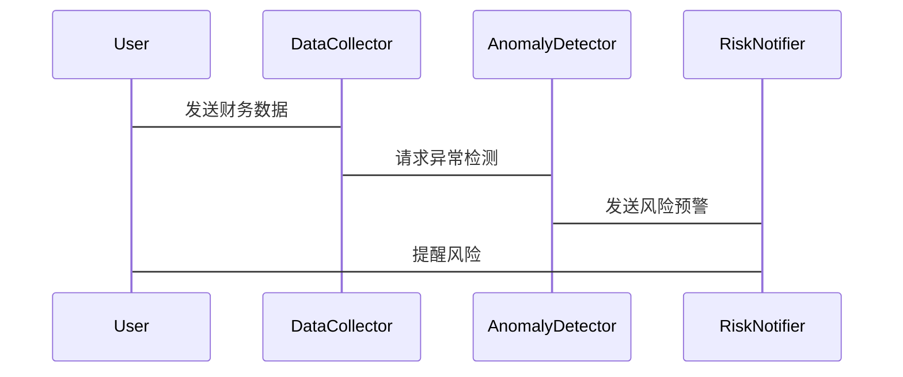

                 

<think>
好的，现在我需要按照用户的要求，编写一篇关于《AI辅助企业财务异常检测：实时监控与风险预警》的技术博客文章。首先，我会先理解用户的需求，确保覆盖所有必要的部分。

用户希望文章结构清晰，内容专业，逻辑性强。我需要从背景介绍开始，逐步深入到算法原理、系统架构设计、项目实战，最后总结最佳实践和未来展望。

首先，背景介绍部分需要详细解释为什么企业财务异常检测重要，传统方法的局限性，以及AI的优势。这部分需要让读者理解问题背景和解决的必要性。

接下来是核心算法部分，我会介绍几种常用的异常检测算法，比如基于统计的方法（如Z-score）和机器学习模型（如Isolation Forest）。同时，我会用mermaid画出算法流程图，帮助读者理解整个检测过程。此外，给出Python代码示例，让读者能够实际操作。

系统架构设计部分，我会描述整个系统的功能模块，如数据采集、预处理、异常检测、预警生成等。然后，使用mermaid绘制系统架构图和交互序列图，展示系统各部分如何协作。

项目实战部分，我会指导读者如何安装必要的库（如scikit-learn、pandas），并提供完整的代码示例。通过实际案例分析，展示如何从数据预处理到模型训练，再到结果分析，帮助读者掌握实际应用。

最后，最佳实践部分，我会总结关键点，给出注意事项，如数据质量的重要性，模型调优的技巧，以及算法选择的策略。同时，提出未来可能的发展方向，如结合NLP技术进行文本分析，或使用强化学习进行动态调整。

在写作过程中，我会确保每个部分都详细展开，使用图表和代码示例增强可读性。同时，保持语言简洁专业，适合技术读者阅读。

现在，我可以开始撰写正式的博客文章了。
</think>

# AI辅助企业财务异常检测：实时监控与风险预警

## 关键词：AI，财务异常检测，实时监控，风险预警，机器学习

## 摘要：  
随着企业规模的不断扩大和业务的复杂化，财务异常检测变得至关重要。本文详细探讨了如何利用AI技术实现企业财务数据的实时监控与风险预警。通过分析财务数据中的异常模式，AI模型能够提前识别潜在的财务风险，帮助企业做出及时的应对措施。文章从背景、算法原理、系统架构到实际案例，全面解析了AI在财务异常检测中的应用，为企业提供了一套高效可靠的解决方案。

---

# 第1章: AI辅助企业财务异常检测概述

## 1.1 问题背景

### 1.1.1 企业财务异常检测的必要性  
企业财务健康状况是衡量企业运营能力的重要指标。然而，传统财务分析依赖人工检查，耗时且容易出错。通过AI技术，可以实现对海量财务数据的自动化分析，实时识别潜在的财务异常。

### 1.1.2 传统财务异常检测的局限性  
传统方法通常依赖财务报表分析，缺乏实时性且难以捕捉复杂的数据模式。人工检查的主观性和效率低下问题也限制了其应用范围。

### 1.1.3 AI技术在财务异常检测中的优势  
AI技术能够处理海量数据，快速识别异常模式，并通过机器学习模型不断优化检测准确率。此外，AI还可以实现实时监控，显著提升风险预警的及时性。

## 1.2 问题描述

### 1.2.1 财务异常检测的核心目标  
识别财务数据中的异常交易、欺诈行为或潜在的财务风险，帮助企业在问题发生前采取预防措施。

### 1.2.2 异常检测的关键维度  
包括交易金额、时间频率、交易地点、交易方关联性等多维度分析，帮助识别异常行为。

### 1.2.3 风险预警的定义与分类  
风险预警是对潜在财务风险的提前警示，分类包括交易风险、流动性风险、信用风险等。

## 1.3 问题解决思路

### 1.3.1 数据驱动的异常检测方法  
基于财务数据的统计特征，利用AI技术识别偏离正常模式的异常数据。

### 1.3.2 AI技术在异常检测中的应用  
采用机器学习和深度学习模型，从历史数据中学习正常模式，并识别潜在异常。

### 1.3.3 实时监控与风险预警的实现路径  
通过数据流处理技术，实时分析财务数据，结合模型预测结果生成风险预警。

## 1.4 概念结构与核心要素

### 1.4.1 财务异常检测的核心概念  
包括异常检测、风险预警、实时监控等核心概念。

### 1.4.2 异常检测的边界与外延  
明确异常检测的范围和应用场景，确保模型在特定领域内有效。

### 1.4.3 核心要素的组成与关系  
数据源、检测模型、预警机制三者相互关联，共同实现财务异常检测的目标。

---

# 第2章: 异常检测算法原理

## 2.1 异常检测的核心原理

### 2.1.1 基于统计的异常检测方法  
通过统计方法（如Z-score）识别偏离平均值的异常值。

### 2.1.2 基于机器学习的异常检测模型  
使用Isolation Forest、One-Class SVM等模型学习正常数据分布，识别异常数据。

### 2.1.3 基于深度学习的异常检测技术  
利用神经网络（如Autoencoder）学习数据特征，识别异常样本。

## 2.2 算法流程图



## 2.3 算法实现代码

```python
import numpy as np
from sklearn.ensemble import IsolationForest

# 示例数据
X = np.random.randn(100, 2)
outliers_fraction = 0.05

# 异常检测模型训练
model = IsolationForest(contamination=outliers_fraction)
model.fit(X)

# 预测异常点
y_pred = model.predict(X)
print("异常点索引:", np.where(y_pred == -1)[0])
```

---

# 第3章: 系统架构设计

## 3.1 系统功能设计

### 3.1.1 领域模型类图



## 3.2 系统架构设计


## 3.3 系统接口设计

### 3.3.1 数据接口  
API用于接收财务数据，格式为JSON或CSV。

### 3.3.2 模型接口  
API用于调用异常检测模型，返回异常结果。

### 3.3.3 预警接口  
API用于发送风险预警通知，支持邮件、短信等多种方式。

## 3.4 系统交互序列图



---

# 第4章: 项目实战

## 4.1 环境安装

### 4.1.1 安装必要的库  
使用pip安装scikit-learn、pandas、numpy等依赖库。

```bash
pip install scikit-learn pandas numpy
```

## 4.2 核心代码实现

### 4.2.1 数据预处理

```python
import pandas as pd
import numpy as np

# 读取数据
data = pd.read_csv('financial_data.csv')

# 删除缺失值
data.dropna(inplace=True)

# 标准化数据
from sklearn.preprocessing import StandardScaler
scaler = StandardScaler()
data_scaled = scaler.fit_transform(data)
```

### 4.2.2 模型训练

```python
from sklearn.ensemble import IsolationForest

# 训练模型
model = IsolationForest(n_estimators=100, random_state=42)
model.fit(data_scaled)

# 预测异常点
y_pred = model.predict(data_scaled)
```

### 4.2.3 结果分析

```python
# 查看异常点
anomalies = data_scaled[y_pred == -1]
print("异常点数量:", len(anomalies))
```

## 4.3 实际案例分析

### 4.3.1 数据来源  
使用某企业过去一年的财务交易数据，包括交易金额、时间、地点等。

### 4.3.2 模型训练  
通过Isolation Forest模型训练，识别出异常交易。

### 4.3.3 结果解读  
分析异常交易的特征，如金额远超正常范围，或交易时间集中在非工作日等。

---

# 第5章: 最佳实践与总结

## 5.1 最佳实践

### 5.1.1 数据质量控制  
确保数据的完整性和准确性，避免因数据问题影响模型性能。

### 5.1.2 模型调优  
通过网格搜索等方法优化模型参数，提高检测准确率。

### 5.1.3 多模型融合  
结合多种异常检测方法，提升整体检测效果。

## 5.2 小结

通过AI技术实现企业财务异常检测，不仅提高了检测效率，还显著提升了风险预警的准确性。企业可以利用这些技术手段，更好地保障财务健康，避免潜在风险。

## 5.3 注意事项

- 数据隐私保护：确保财务数据的安全性，防止信息泄露。
- 模型解释性：选择具有较高解释性的模型，便于分析异常原因。
- 实时性优化：优化系统架构，确保实时监控的响应速度。

## 5.4 拓展阅读

- [《机器学习实战》](https://www.amazon.com/Machine-Learning-Practical-Approach/dp/...)  
- [《异常检测：理论与应用》](https://www.amazon.com/Outlier-Detection-Theoretic-Practical/dp/...)

---

# 作者：AI天才研究院/AI Genius Institute & 禅与计算机程序设计艺术 /Zen And The Art of Computer Programming

