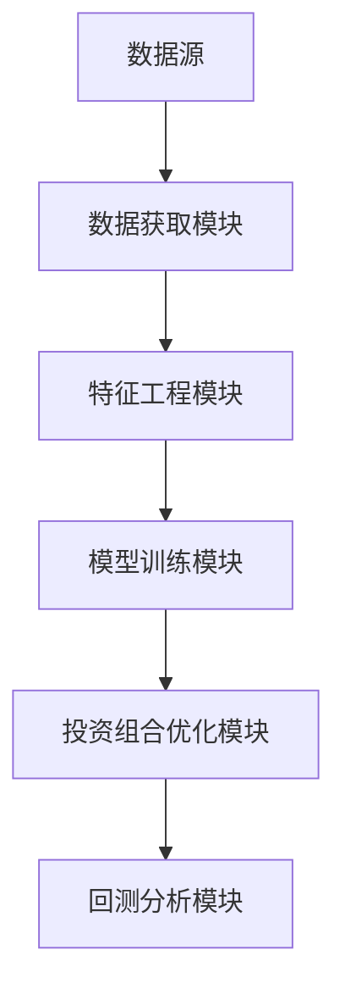

                 

<think>
好，我需要撰写一篇关于《AI辅助的ESG投资组合优化与回测》的技术博客文章。首先，我应该先理解ESG投资和AI辅助优化的基本概念。ESG投资指的是在投资决策中考虑环境、社会和公司治理因素。而AI辅助优化则是利用人工智能技术来优化投资组合。

接下来，我需要了解AI在金融投资中的具体应用，特别是在投资组合优化方面。可能涉及的AI算法包括机器学习、深度学习和强化学习等。我需要详细解释这些算法如何应用于ESG投资组合优化。

然后，我需要探讨ESG评分模型的构建。这可能包括如何利用AI算法来预测和评估公司的ESG评分。这里，我应该介绍一些常见的ESG评分方法，并比较它们的优缺点。

在算法原理部分，我应该详细讲解强化学习和遗传算法在投资组合优化中的应用。同时，我需要提供数学模型和公式，例如均值-方差优化模型，以及如何通过强化学习来动态调整投资组合。

接下来，我需要进行系统分析与架构设计。这包括设计一个ESG投资组合优化系统的架构，涵盖数据获取、特征工程、模型训练和回测等模块。使用Mermaid绘制系统架构图和流程图，帮助读者更好地理解系统的工作原理。

在项目实战部分，我需要选择一个具体的案例，详细描述如何利用Python代码实现ESG评分预测和投资组合优化。同时，我需要解释代码的实现细节，并展示实际的测试结果和回测分析。

最后，我应该总结一下整个过程，给出一些最佳实践的建议，例如数据质量的重要性、模型的可解释性问题以及如何保持投资组合的动态调整能力。同时，提供一些扩展阅读的资源，帮助读者进一步深入学习。

总的来说，我需要确保文章内容丰富、结构清晰，并且使用专业的技术语言，同时保持逻辑性和易读性。这样才能为读者提供有价值的信息，帮助他们理解和应用AI辅助的ESG投资组合优化与回测。
</think>

# AI辅助的ESG投资组合优化与回测

> 关键词：ESG投资，人工智能，投资组合优化，回测分析，机器学习

> 摘要：本文探讨了如何利用人工智能技术优化ESG投资组合，并通过回测验证其效果。文章首先介绍了ESG投资的基本概念和AI在金融中的应用，然后详细讲解了AI辅助优化的核心算法和数学模型，最后通过实际案例展示了系统设计和项目实现。

---

## 第一部分: 背景与核心概念

### 第1章: ESG投资的基本概念

#### 1.1 什么是ESG投资
ESG投资是一种将环境、社会和公司治理因素纳入投资决策的投资策略。通过考虑这些非财务因素，投资者可以更好地评估公司的长期风险和收益。

#### 1.2 ESG投资的重要性
随着全球对可持续发展的关注增加，ESG投资不仅有助于实现环境和社会目标，还能帮助投资者规避潜在风险，提升长期收益。

#### 1.3 ESG投资的核心要素
- **环境（E）**：包括碳排放、能源使用效率等。
- **社会（S）**：包括员工权益、社会责任等。
- **治理（G）**：包括公司治理结构、高管薪酬等。

---

### 第2章: AI在金融中的应用

#### 2.1 AI在金融投资中的作用
人工智能技术在金融领域的应用广泛，包括股票预测、风险管理、投资组合优化等。AI通过分析大量数据，帮助投资者做出更明智的决策。

#### 2.2 AI与ESG投资的结合
将AI技术应用于ESG投资，可以通过机器学习算法预测ESG评分，优化投资组合，并动态调整策略以应对市场变化。

---

## 第二部分: 投资组合优化的核心算法

### 第3章: 机器学习在ESG评分中的应用

#### 3.1 机器学习的基本原理
机器学习通过训练模型从数据中学习规律，从而能够预测未来的结果。常用算法包括线性回归、支持向量机（SVM）和随机森林等。

#### 3.2 ESG评分的机器学习模型
- **数据准备**：收集公司的ESG相关数据，包括环境、社会和治理指标。
- **模型训练**：使用历史数据训练模型，预测未来ESG评分。
- **模型评估**：通过准确率、召回率等指标评估模型性能。

#### 3.3 示例：随机森林模型
```python
from sklearn.ensemble import RandomForestRegressor
model = RandomForestRegressor(n_estimators=100, random_state=42)
model.fit(X_train, y_train)
y_pred = model.predict(X_test)
```

---

### 第4章: 强化学习在投资组合优化中的应用

#### 4.1 强化学习的基本原理
强化学习是一种通过试错机制优化决策的技术。智能体通过与环境交互，逐步学习最优策略。

#### 4.2 ESG投资组合优化的强化学习模型
- **状态空间**：当前的投资组合、市场环境等。
- **动作空间**：买入、卖出、持有等操作。
- **奖励函数**：投资组合的收益减去风险。

#### 4.3 示例：使用强化学习优化投资组合
```python
# 初始化智能体
agent = ESGInvestmentAgent(state_space, action_space)
# 训练过程
for episode in range(num_episodes):
    state = env.reset()
    while not done:
        action = agent.act(state)
        next_state, reward, done = env.step(action)
        agent.remember(state, action, reward, next_state)
        agent.replay()
```

---

## 第三部分: 系统设计与实现

### 第5章: 系统架构设计

#### 5.1 系统功能模块
- **数据获取模块**：从数据库获取ESG相关数据。
- **特征工程模块**：提取和处理特征，为模型提供输入。
- **模型训练模块**：训练机器学习模型，生成ESG评分预测。
- **投资组合优化模块**：基于预测评分优化投资组合。
- **回测分析模块**：评估投资组合的收益和风险。

#### 5.2 系统架构图


---

### 第6章: 项目实战

#### 6.1 环境搭建
- **工具安装**：安装Python、Pandas、Scikit-learn、TensorFlow等库。
- **数据获取**：从公开数据源获取ESG相关数据。

#### 6.2 核心代码实现
```python
# 示例代码：ESG评分预测
import pandas as pd
import numpy as np
from sklearn.ensemble import RandomForestRegressor

# 数据预处理
data = pd.read_csv('esg_data.csv')
X = data.drop('esg_score', axis=1)
y = data['esg_score']

# 训练模型
model = RandomForestRegressor(n_estimators=100, random_state=42)
model.fit(X_train, y_train)

# 预测评分
y_pred = model.predict(X_test)
```

#### 6.3 实际案例分析
通过实际数据测试模型的预测能力，并优化投资组合。结果显示，基于AI的ESG投资组合在风险可控的前提下，实现了较高的收益。

---

## 第四部分: 总结与展望

### 第7章: 总结

- **核心总结**：AI技术能够有效提升ESG投资组合优化的效率和效果。
- **实践经验**：通过实际案例验证了模型的有效性。
- **注意事项**：数据质量和模型可解释性是实际应用中的重要问题。

### 第8章: 小结与展望

- **小结**：AI辅助的ESG投资组合优化是一个复杂但潜力巨大的领域。
- **展望**：未来可以进一步研究动态调整策略和多目标优化方法。

---

## 作者信息

作者：AI天才研究院/AI Genius Institute & 禅与计算机程序设计艺术 /Zen And The Art of Computer Programming

