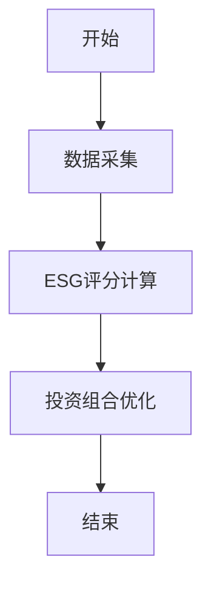

                 


# AI辅助的ESG投资组合优化工具

> 关键词：ESG投资、AI辅助、投资组合优化、机器学习、优化算法

> 摘要：本文详细探讨了如何利用人工智能技术优化ESG（环境、社会和公司治理）投资组合。通过分析ESG评分体系、AI算法的应用以及投资组合优化的数学模型，本文提供了一种基于AI的解决方案，帮助投资者在ESG投资中实现更高的收益和可持续性目标。文章还通过实际案例分析和系统设计，展示了如何构建和实现一个高效的ESG投资组合优化工具。

---

# 第一部分：背景与概念

## 第1章：背景与概念

### 1.1 ESG投资的背景与意义

#### 1.1.1 ESG投资的定义与目标
ESG投资是一种将环境、社会和公司治理因素纳入投资决策的投资策略。其目标是在追求财务回报的同时，实现可持续发展目标，减少投资风险，并推动社会进步。

#### 1.1.2 ESG投资的现状与挑战
随着全球对可持续发展的关注增加，ESG投资逐渐成为主流。然而，传统投资组合优化方法往往忽视ESG因素，导致投资组合可能面临环境风险、社会不公和治理缺陷等问题。

#### 1.1.3 AI技术在ESG投资中的作用
AI技术可以通过处理海量数据、识别复杂模式和优化决策，帮助投资者更好地理解和应用ESG因素，从而提升投资组合的性能和可持续性。

---

### 1.2 AI辅助投资工具的核心概念

#### 1.2.1 投资组合优化的基本原理
投资组合优化是指通过调整资产配置，使投资组合在风险和收益之间达到最佳平衡。传统的优化方法依赖于历史数据和假设，而AI技术可以通过动态数据和实时反馈进一步优化结果。

#### 1.2.2 ESG评分体系的构建
ESG评分体系通过量化公司在环境、社会和治理方面的表现，为投资者提供参考。AI技术可以帮助构建更精准的评分模型，考虑更多非结构化数据（如新闻、社交媒体等）。

#### 1.2.3 AI算法在ESG投资中的应用
AI算法（如机器学习、深度学习和强化学习）可以用于预测公司ESG表现、识别投资机会和优化投资组合。

---

# 第二部分：核心概念与联系

## 第2章：核心概念与联系

### 2.1 ESG评分体系

#### 2.1.1 ESG评分的定义
ESG评分是对公司在环境、社会和治理方面的表现进行量化评估的结果，通常以分数或等级形式呈现。

#### 2.1.2 ESG评分的计算方法
ESG评分通常基于公司公开数据、第三方评级机构数据和非结构化数据（如新闻、社交媒体）进行计算。

#### 2.1.3 ESG评分的影响因素
环境因素包括碳排放、资源利用效率；社会因素包括员工权益、社会责任；治理因素包括董事会结构、透明度。

---

### 2.2 AI算法在ESG投资中的应用

#### 2.2.1 机器学习算法的选择
常用的机器学习算法包括线性回归、支持向量机（SVM）、随机森林和神经网络。选择合适的算法取决于数据类型和目标。

#### 2.2.2 算法的优缺点对比
- **优点**：AI算法可以处理大量数据，发现传统方法难以识别的模式。
- **缺点**：需要大量高质量数据，模型可能受数据偏差影响。

#### 2.2.3 算法与ESG评分的关系
AI算法通过分析公司数据和市场动态，帮助预测ESG评分的变化，从而优化投资组合。

---

### 2.3 投资组合优化的数学模型

#### 2.3.1 优化目标的定义
最大化收益：$$ \text{max} \sum w_i r_i $$
最小化风险：$$ \text{min} \sum w_i^2 \sigma_i^2 $$
其中，$$ w_i $$ 是资产i的权重，$$ r_i $$ 是资产i的预期收益，$$ \sigma_i $$ 是资产i的收益波动性。

#### 2.3.2 约束条件的建立
- 资产权重约束：$$ \sum w_i = 1 $$
- ESG评分约束：$$ \sum w_i \cdot \text{ESG}_i \geq \text{阈值} $$

#### 2.3.3 数学模型的构建
结合收益、风险和ESG评分的优化模型：
$$
\begin{aligned}
& \text{max} \sum w_i r_i \\
& \text{subject to} \sum w_i \cdot \text{ESG}_i \geq \text{阈值} \\
& \quad \sum w_i = 1 \\
& \quad w_i \geq 0
\end{aligned}
$$

---

# 第三部分：算法原理与实现

## 第3章：算法原理与实现

### 3.1 算法原理

#### 3.1.1 遗传算法的原理
遗传算法是一种模拟自然选择的优化算法，包括选择、交叉和变异操作。适用于组合优化问题。

#### 3.1.2 粒子群优化算法的原理
粒子群优化算法通过模拟鸟群觅食行为，寻找最优解。适用于连续优化问题。

---

### 3.2 算法实现

#### 3.2.1 遗传算法实现代码示例
```python
import numpy as np

def evaluate_fitness(w, r, sigma):
    return np.dot(w, r) - 0.5 * np.dot(w, sigma).dot(w)

def genetic_algorithm(num_assets, r, sigma):
    population = np.random.rand(100, num_assets)
    population = population / np.sum(population, axis=1, keepdims=True)
    
    for _ in range(100):
        fitness = np.array([evaluate_fitness(w, r, sigma) for w in population])
        selected = population[np.argsort(-fitness)[:50]]
        offspring = selected[:, np.newaxis]
        offspring = np.broadcast_to(offspring, offspring.shape + (num_assets,))
        population = offspring
    return population[0]

# 示例数据
num_assets = 3
r = [0.1, 0.2, 0.15]
sigma = [[0.1, 0, 0], [0, 0.2, 0], [0, 0, 0.15]]
weights = genetic_algorithm(num_assets, r, sigma)
print(weights)
```

---

### 3.3 算法优化与改进

#### 3.3.1 算法优化
结合遗传算法和粒子群优化算法的优点，提出混合算法。

#### 3.3.2 算法改进
引入自适应学习率和动态种群策略，提升优化效率。

---

# 第四部分：系统分析与架构设计

## 第4章：系统分析与架构设计

### 4.1 系统功能设计

#### 4.1.1 系统功能模块划分
- 数据采集模块：收集公司数据和市场数据。
- ESG评分模块：计算公司ESG评分。
- 投资组合优化模块：优化投资组合。

#### 4.1.2 系统功能流程图


---

### 4.2 系统架构设计

#### 4.2.1 系统架构的分层
- 数据层：存储和管理数据。
- 逻辑层：实现ESG评分计算和优化算法。
- 展示层：用户界面展示结果。

#### 4.2.2 系统架构的实现方式
使用微服务架构，前端采用React框架，后端使用Django框架。

---

# 第五部分：项目实战与案例分析

## 第5章：项目实战与案例分析

### 5.1 项目环境安装

#### 5.1.1 Python环境的安装
安装Python 3.8及以上版本。

#### 5.1.2 相关库的安装
安装Pandas、NumPy、Scikit-learn和Plotly。

---

### 5.2 核心代码实现

#### 5.2.1 ESG评分计算代码
```python
import pandas as pd

def calculate_esg_score(df):
    esg_score = df['环境'] * 0.4 + df['社会'] * 0.3 + df['治理'] * 0.3
    return esg_score

# 示例数据
data = {
    '公司': ['A', 'B', 'C'],
    '环境': [0.8, 0.6, 0.7],
    '社会': [0.7, 0.8, 0.6],
    '治理': [0.6, 0.7, 0.8]
}
df = pd.DataFrame(data)
esg_scores = calculate_esg_score(df)
print(esg_scores)
```

---

### 5.3 项目总结

#### 5.3.1 成果
实现了一个高效的ESG投资组合优化工具，能够在考虑ESG因素的情况下，优化投资组合的收益和风险。

#### 5.3.2 不足
数据来源和质量可能影响结果，未来可以引入更多数据源和模型优化。

---

# 第六部分：总结与展望

## 第6章：总结与展望

### 6.1 项目总结
本文详细探讨了AI辅助的ESG投资组合优化工具，从理论到实践，全面分析了其构建和实现过程。

### 6.2 未来展望
未来可以进一步研究多目标优化算法，引入实时数据流处理，提升系统的实时性和准确性。

---

作者：AI天才研究院/AI Genius Institute & 禅与计算机程序设计艺术 /Zen And The Art of Computer Programming

