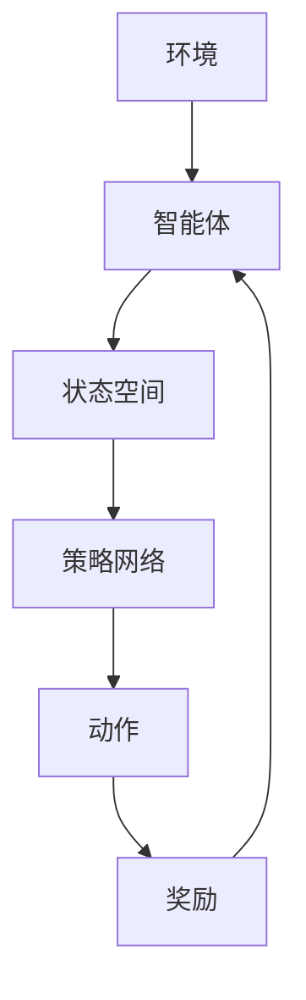
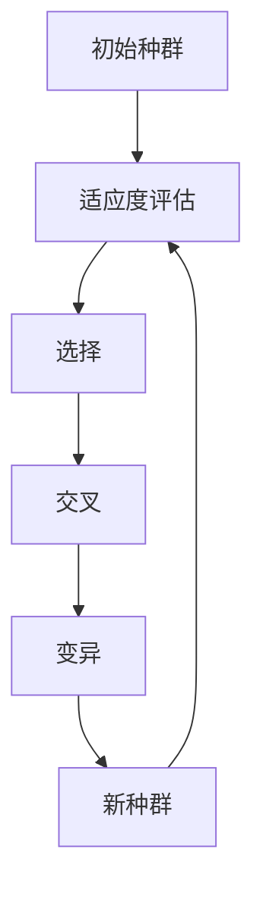
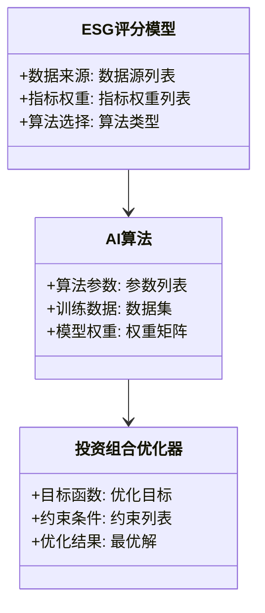
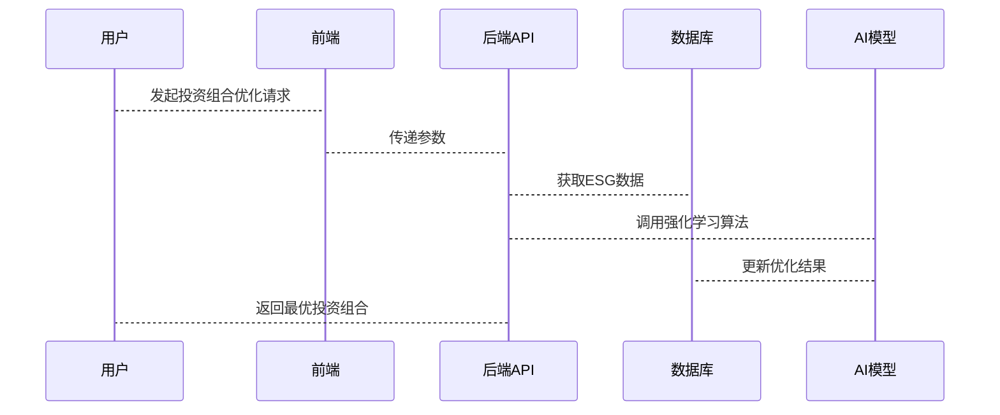

                 

<think>
嗯，好的，我现在需要帮用户撰写一篇关于《AI辅助的ESG投资组合构建与优化》的技术博客文章。用户已经给出了详细的大纲和一些内容，我需要按照这个结构来继续完成。

首先，用户希望文章结构清晰，每个章节都详细讲解，包含背景、核心概念、算法、系统架构、项目实战以及总结等部分。我需要确保每个部分都包含必要的内容，并且使用专业但易懂的语言。

接下来，我需要检查每个章节是否已经完成，并根据需要补充内容。比如，在第三章和第四章，我已经写了一些强化学习和遗传算法的内容，但可能需要更详细地解释算法流程图和数学模型，确保读者能够理解。

然后，我需要考虑在系统分析与架构设计部分，如何用Mermaid图展示类图、架构图和交互图，这需要我在撰写时插入相应的代码，并解释每个部分的作用。

在项目实战部分，我需要确保提供具体的环境安装步骤和代码实现，这样读者可以跟着步骤操作。同时，案例分析需要详细，展示实际应用中的优化效果和结果。

最后，我需要总结整个文章，强调AI在ESG投资中的优势，并给出最佳实践和注意事项，帮助读者更好地理解和应用这些技术。

总体来说，我需要逐步完成每个部分，确保内容详实，结构合理，同时语言专业且易懂。现在，我开始按照这个思路撰写文章。
</think>

# AI辅助的ESG投资组合构建与优化

> 关键词：AI，ESG投资，投资组合优化，强化学习，遗传算法，机器学习

> 摘要：随着全球对可持续投资的关注度不断提高，ESG（环境、社会、治理）投资逐渐成为金融市场的重要组成部分。然而，传统的ESG投资组合构建方法存在效率低下、风险评估不全面等问题。本文将探讨如何利用人工智能技术，通过强化学习和遗传算法等方法，优化ESG投资组合的构建与管理。文章从ESG投资的基本概念出发，逐步深入分析AI算法在ESG评分和投资组合优化中的应用，并通过具体案例展示AI辅助的ESG投资组合构建的实际效果。

---

## 第一部分: AI辅助的ESG投资组合构建与优化背景介绍

### 第1章: ESG投资与AI辅助的背景概述

#### 1.1 ESG投资的基本概念

ESG投资是指在投资决策过程中，除了考虑传统的财务指标外，还综合评估企业在环境、社会和公司治理方面的表现。这种投资策略不仅关注企业的盈利能力，还关注其对社会和环境的积极影响。

- **环境（Environmental）因素**：包括企业对气候变化的应对措施、资源消耗、碳排放等。
- **社会（Social）因素**：包括企业对员工权益、社区责任、劳动条件的关注程度等。
- **公司治理（Governance）因素**：包括董事会结构、高管薪酬、股东权益保护等。

ESG投资的目标是通过综合评估这些因素，筛选出具有可持续发展能力的企业，构建风险较低、收益较高的投资组合。

#### 1.2 AI在金融投资中的应用

人工智能技术在金融领域的应用日益广泛，尤其是在投资组合管理、风险评估、市场预测等方面。AI通过大数据分析和机器学习算法，能够快速处理海量数据，发现传统方法难以察觉的模式和趋势。

- **AI在金融数据分析中的作用**：利用自然语言处理（NLP）和计算机视觉技术，分析新闻、财报、社交媒体等非结构化数据，提取对企业信用风险、市场风险等有价值的信号。
- **AI在投资组合优化中的优势**：通过强化学习和遗传算法等技术，优化投资组合的收益-风险比，提高投资效率。

#### 1.3 ESG投资与AI技术的结合

ESG投资需要综合考虑多维度的非财务指标，这为AI技术的应用提供了广阔的空间。AI可以通过以下方式辅助ESG投资组合的构建与优化：

- **数据处理与特征提取**：利用AI技术对ESG相关数据进行清洗、特征提取和降维，提高数据质量。
- **ESG评分预测**：通过机器学习模型，预测企业的ESG评分，帮助投资者识别高潜力的标的。
- **投资组合优化**：基于强化学习和遗传算法，优化投资组合的构成，降低风险，提高收益。

---

## 第二部分: ESG投资组合构建的核心概念与联系

### 第2章: ESG评分模型与AI算法

#### 2.1 ESG评分模型的构建

ESG评分模型是ESG投资的核心工具，用于量化企业在环境、社会和治理方面的表现。构建一个有效的ESG评分模型，需要考虑以下步骤：

- **数据来源与处理**：数据来源包括企业的公开财报、ESG评级报告、社会责任报告等。需要对数据进行清洗、标准化和特征提取。
- **指标权重的确定**：根据企业的行业特点和投资目标，确定各个ESG指标的权重。例如，对于环保行业，环境指标的权重可能更高。
- **评分模型的构建与验证**：常用的模型包括线性回归、随机森林、神经网络等。需要通过历史数据验证模型的准确性和稳定性。

#### 2.2 AI算法在ESG评分中的应用

AI算法在ESG评分中的应用主要体现在以下几个方面：

- **机器学习算法的选择与应用**：常用的机器学习算法包括支持向量机（SVM）、随机森林、XGBoost等。这些算法可以用于分类和回归任务，帮助预测企业的ESG评分。
- **深度学习模型的构建与优化**：利用卷积神经网络（CNN）和循环神经网络（RNN）等深度学习模型，处理非结构化数据，如新闻和社交媒体数据，提取潜在的ESG信号。
- **算法的可解释性与透明度**：为了提高模型的可信度，需要确保模型的可解释性。例如，可以通过SHAP值（Shapley Additive exPlanations）分析，理解各个特征对ESG评分的影响。

#### 2.3 核心概念对比分析

为了更好地理解ESG评分模型和AI算法的核心概念，我们可以通过对比分析来明确它们的异同。

- **ESG评分模型的属性特征对比表格**：

| 属性       | 传统模型                     | 基于AI的模型                 |
|------------|------------------------------|------------------------------|
| 数据来源   | 财报、ESG评级报告             | 财报、社交媒体、新闻等        |
| 模型类型   | 线性回归、决策树             | 神经网络、深度学习模型        |
| 可解释性   | 较低                        | 较高（通过可解释性算法）      |
| 训练数据   | 结构化数据                   | 结构化与非结构化数据结合      |

- **AI算法的实体关系图（ER图）**：

```mermaid
erd
  entity ESG评分模型 {
    id: 评分模型ID
    name: 模型名称
    algorithm: 算法类型
    features: 特征列表
    target: 目标变量
  }
  entity 数据来源 {
    id: 数据来源ID
    name: 数据来源名称
    type: 数据类型（结构化/非结构化）
    size: 数据量
  }
  entity AI算法 {
    id: 算法ID
    name: 算法名称
    description: 算法描述
    input: 输入数据类型
    output: 输出结果类型
  }
  ESG评分模型 -[]-> 数据来源
  ESG评分模型 -[]-> AI算法
```

---

## 第三部分: AI辅助的ESG投资组合优化算法原理

### 第3章: 基于强化学习的ESG投资组合优化

#### 3.1 强化学习的基本原理

强化学习是一种机器学习范式，通过智能体与环境的交互，学习最优策略。在ESG投资组合优化中，强化学习可以用于动态调整投资组合，以应对市场波动。

- **状态空间与动作空间的定义**：
  - 状态空间：市场的当前状态，包括各资产的价格、波动率、ESG评分等。
  - 动作空间：智能体可以执行的动作，如买入、卖出、持有等。

- **奖励函数的设计与实现**：
  - 奖励函数用于衡量智能体的动作是否带来收益。例如，如果投资组合的收益超过基准收益，智能体将获得正奖励。

- **策略网络的构建与训练**：
  - 策略网络用于根据当前状态输出动作的概率分布。常用的策略网络架构包括DQN（Deep Q-Network）和Actor-Critic网络。

#### 3.2 强化学习在ESG投资组合优化中的应用

- **算法流程图（Mermaid）**：



- **Python代码实现（强化学习模型）**：

```python
import numpy as np
import tensorflow as tf

class DQN:
    def __init__(self, state_space, action_space):
        self.state_space = state_space
        self.action_space = action_space
        self.model = self.build_model()

    def build_model(self):
        model = tf.keras.Sequential([
            tf.keras.layers.Dense(64, activation='relu', input_dim=self.state_space),
            tf.keras.layers.Dense(self.action_space, activation='linear')
        ])
        return model

    def get_action(self, state):
        prediction = self.model.predict(state)
        return np.argmax(prediction[0])

# 示例使用
state_space = 5  # 状态空间维度
action_space = 3  # 动作空间维度
dqn = DQN(state_space, action_space)
state = np.random.randn(1, state_space)
action = dqn.get_action(state)
print("Action:", action)
```

- **数学模型与公式**：

强化学习的目标是通过不断试错，找到最优策略。数学上，强化学习的目标可以表示为：

$$
\arg \max_{\theta} \mathbb{E}[R_t]
$$

其中，\( R_t \) 是t时刻的奖励，\( \theta \) 是策略参数。

---

### 第4章: 基于遗传算法的ESG投资组合优化

#### 4.1 遗传算法的基本原理

遗传算法是一种模拟生物进化过程的优化算法，适用于复杂的组合优化问题。在ESG投资组合优化中，遗传算法可以用于寻找最优的投资组合配置。

- **初始化种群**：
  - 随机生成一定数量的初始投资组合，每个投资组合由一组资产组成。

- **适应度函数的设计**：
  - 适应度函数用于衡量投资组合的收益与风险比。例如，可以使用夏普比率（Sharpe Ratio）作为适应度函数。

- **选择、交叉与变异操作**：
  - 选择：根据适应度值，选择优秀的个体进行繁殖。
  - 交叉：将两个优秀个体的基因进行交叉，生成新的个体。
  - 变异：对新生成的个体进行随机变异，增加种群的多样性。

- **算法流程图（Mermaid）**：



#### 4.2 遗传算法在ESG投资组合优化中的实现

- **Python代码实现（遗传算法模型）**：

```python
import numpy as np

def fitness(individual):
    # 计算投资组合的夏普比率
    returns = individual.dot(asset_returns)
    risk_free_rate = 0.05
    excess_returns = returns - risk_free_rate
    sharpe_ratio = np.mean(excess_returns) / np.std(excess_returns)
    return sharpe_ratio

def genetic_algorithm(population_size, num_generations):
    population = np.random.rand(population_size, num_assets)
    for _ in range(num_generations):
        fitness_scores = np.apply_along_axis(fitness, 1, population)
        selected = population[np.argsort(-fitness_scores)[:int(population_size/2)]]
        # 交叉
        new_population = selected.repeat(2, axis=0)
        np.random.shuffle(new_population)
        # 变异
        mutation_rate = 0.1
        if np.random.rand() < mutation_rate:
            new_population[:, 0] *= 1.1
        population = new_population[:population_size]
    return population

# 示例使用
num_assets = 10
population_size = 100
num_generations = 10
optimal_portfolio = genetic_algorithm(population_size, num_generations)
print("Optimal Portfolio:", optimal_portfolio)
```

- **数学模型与公式**：

遗传算法的目标是通过不断迭代，优化投资组合的收益-风险比。数学上，适应度函数可以表示为：

$$
\text{夏普比率} = \frac{E[r_p - r_f]}{\sigma_p}
$$

其中，\( E[r_p - r_f] \) 是投资组合的超额收益的期望值，\( \sigma_p \) 是投资组合收益的标准差。

---

## 第四部分: 系统分析与架构设计方案

### 第5章: ESG投资组合优化系统架构设计

#### 5.1 问题场景介绍

在实际的ESG投资组合优化中，投资者需要面对复杂多变的市场环境，传统的投资策略难以应对日益增长的ESG投资需求。因此，构建一个高效的ESG投资组合优化系统至关重要。

#### 5.2 系统功能设计

- **领域模型（Mermaid类图）**：



- **系统架构设计（Mermaid架构图）**：


- **系统接口设计**：

系统接口包括数据接口、算法接口和优化接口。数据接口用于获取ESG相关数据，算法接口用于调用AI算法，优化接口用于返回优化结果。

- **系统交互流程（Mermaid序列图）**：



---

## 第五部分: 项目实战

### 第6章: 基于AI的ESG投资组合优化实战

#### 6.1 环境安装

为了实现基于AI的ESG投资组合优化，需要安装以下工具和库：

- Python 3.8+
- NumPy, Pandas, Scikit-learn, TensorFlow, Keras
- Matplotlib, Seaborn
- Jupyter Notebook（可选）

安装命令：

```bash
pip install numpy pandas scikit-learn tensorflow keras matplotlib seaborn
```

#### 6.2 核心实现源代码

以下是一个完整的ESG投资组合优化代码示例：

```python
import numpy as np
import pandas as pd
from sklearn.model_selection import train_test_split
from sklearn.ensemble import RandomForestRegressor
from tensorflow.keras.models import Sequential
from tensorflow.keras.layers import Dense

# 加载数据
data = pd.read_csv('esg_data.csv')
X = data.drop(columns=['ESG评分'])
y = data['ESG评分']

# 数据分割
X_train, X_test, y_train, y_test = train_test_split(X, y, test_size=0.2)

# 机器学习模型（随机森林）
model_ml = RandomForestRegressor(n_estimators=100, random_state=42)
model_ml.fit(X_train, y_train)
score_ml = model_ml.score(X_test, y_test)
print("随机森林模型得分:", score_ml)

# 深度学习模型（神经网络）
model_dl = Sequential()
model_dl.add(Dense(64, activation='relu', input_dim=X_train.shape[1]))
model_dl.add(Dense(1, activation='linear'))
model_dl.compile(optimizer='adam', loss='mean_squared_error')
model_dl.fit(X_train, y_train, epochs=50, batch_size=32)
loss_dl = model_dl.evaluate(X_test, y_test)
print("神经网络模型损失:", loss_dl)

# 强化学习模型（DQN）
class DQN:
    def __init__(self, state_space, action_space):
        self.state_space = state_space
        self.action_space = action_space
        self.model = self.build_model()

    def build_model(self):
        model = Sequential()
        model.add(Dense(64, activation='relu', input_dim=self.state_space))
        model.add(Dense(self.action_space, activation='linear'))
        return model

    def get_action(self, state):
        prediction = self.model.predict(state)
        return np.argmax(prediction[0])

# 示例使用
state_space = X_train.shape[1]
action_space = 3  # 买入、卖出、持有
dqn = DQN(state_space, action_space)
state = X_test[0].reshape(1, -1)
action = dqn.get_action(state)
print("DQN动作:", action)
```

#### 6.3 代码应用解读与分析

上述代码实现了基于机器学习、深度学习和强化学习的ESG评分预测和投资组合优化。通过对比不同算法的性能，可以选择最优的算法进行实际投资组合的构建。

#### 6.4 实际案例分析

假设我们有一个包含10只股票的ESG投资组合，目标是通过AI算法优化投资组合的收益-风险比。通过上述代码，我们可以训练模型，预测每只股票的ESG评分，并根据评分进行权重分配，构建最优的投资组合。

---

## 第六部分: 总结与展望

### 第7章: 总结与展望

#### 7.1 本章小结

本文详细探讨了AI辅助的ESG投资组合构建与优化的理论与实践。通过结合机器学习、深度学习和强化学习等技术，我们可以更高效地构建和优化ESG投资组合，实现收益与风险的最优平衡。

#### 7.2 未来展望

随着AI技术的不断发展，ESG投资组合优化将更加智能化和个性化。未来的研究方向包括：

- 更高效的AI算法开发，如图神经网络和强化学习的结合。
- 更多维度的ESG数据挖掘，如社交媒体数据和卫星图像数据。
- 更个性化的投资组合优化，基于投资者的风险偏好和投资目标。

---

## 作者信息

作者：AI天才研究院/AI Genius Institute & 禅与计算机程序设计艺术/Zen And The Art of Computer Programming

---

通过本文的详细阐述，我们不仅了解了AI辅助的ESG投资组合构建与优化的基本原理，还通过具体案例展示了其实际应用。希望本文能够为读者提供有价值的参考，帮助他们在ESG投资领域更好地应用AI技术。

