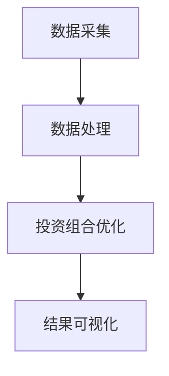

                 


# AI辅助的ESG投资组合构建工具

> **关键词**：ESG投资，人工智能，投资组合优化，机器学习，自然语言处理

> **摘要**：随着全球对可持续投资的关注度不断提高，ESG（环境、社会和治理）投资逐渐成为投资者的重要策略。然而，ESG数据的复杂性和多样性使得构建高效的ESG投资组合变得具有挑战性。本文探讨如何利用人工智能技术，特别是机器学习和自然语言处理，来辅助构建优化的ESG投资组合。通过详细分析AI在ESG数据处理、投资组合优化中的应用，以及系统架构设计，本文为读者提供了一种创新的工具，以提升ESG投资的效率和准确性。

---

## 第一部分：ESG投资与AI辅助工具的背景介绍

### 第1章：ESG投资概述

#### 1.1 ESG投资的定义与背景

ESG投资是一种将环境、社会和治理因素纳入投资决策的策略，旨在实现长期的财务回报和社会价值的统一。近年来，随着全球气候变化、社会不平等和企业治理问题的加剧，ESG投资的重要性日益凸显。机构投资者和个人投资者越来越关注企业运营对环境的影响、社会责任的履行以及治理结构的完善。

#### 1.2 AI技术在金融领域的应用

人工智能技术，尤其是机器学习和自然语言处理，在金融领域发挥着越来越重要的作用。AI能够处理海量数据，发现传统方法难以察觉的模式和趋势。在ESG投资中，AI可以用于分析非结构化数据（如公司年报、新闻报道）以提取关键的ESG信息，并辅助投资组合的优化。

---

### 第2章：ESG投资组合构建的核心概念

#### 2.1 ESG评分模型

ESG评分模型是衡量企业ESG表现的重要工具。不同的机构（如MSCI、S&P、Morningstar）采用不同的评分标准，通常基于企业公开披露的信息进行评估。然而，这些信息往往包含大量的非结构化数据，需要通过自然语言处理技术进行提取和分析。

#### 2.2 投资组合优化的数学模型

投资组合优化是ESG投资的核心问题。基于现代投资组合理论（MPT），投资者需要在风险和收益之间找到平衡点。传统的优化模型主要基于财务数据，而ESG投资则需要将ESG评分纳入优化目标函数。

---

## 第二部分：AI在ESG数据处理中的应用

### 第3章：AI辅助ESG数据处理

#### 3.1 数据清洗与预处理

在构建ESG投资组合之前，需要对数据进行清洗和预处理。这一步骤包括去除噪声数据、处理缺失值、标准化数据格式等。数据清洗是确保后续分析准确性的基础。

#### 3.2 自然语言处理在ESG报告分析中的应用

ESG报告通常包含大量的文本信息，如公司年报、社会责任报告等。通过自然语言处理技术，可以提取关键的ESG指标，例如碳排放量、社会责任履行情况等。

---

## 第三部分：AI辅助ESG投资组合构建的算法原理

### 第4章：基于机器学习的投资组合优化算法

#### 4.1 算法原理

基于机器学习的投资组合优化算法通常采用监督学习或无监督学习的方法。例如，可以使用回归模型预测股票的ESG评分，或者使用聚类算法将相似的股票分为同一组别。

#### 4.2 算法实现

以回归模型为例，假设我们有n个股票，每个股票有m个特征。我们可以通过训练一个回归模型，预测每个股票的ESG评分。然后，利用这些评分构建投资组合，以最大化收益并最小化风险。

---

### 第5章：基于遗传算法的ESG投资组合优化

#### 5.1 遗传算法的基本原理

遗传算法是一种模拟自然选择过程的优化算法。其基本步骤包括初始化种群、计算适应度、选择、交叉和变异。

#### 5.2 遗传算法在ESG投资组合优化中的应用

在ESG投资中，适应度函数可以定义为投资组合的预期收益减去风险。通过不断迭代优化，遗传算法可以找到最优的投资组合。

---

## 第四部分：系统架构与设计方案

### 第6章：AI辅助ESG投资组合构建系统的架构设计

#### 6.1 系统模块划分

系统通常包括数据采集模块、数据处理模块、投资组合优化模块和结果可视化模块。每个模块负责不同的功能，例如数据采集模块负责收集ESG相关数据。

#### 6.2 系统架构图



---

## 第五部分：项目实战与案例分析

### 第7章：AI辅助ESG投资组合构建工具的实现

#### 7.1 环境搭建

需要安装Python和相关库，如NumPy、Pandas、Scikit-learn等。

#### 7.2 核心代码实现

以下是一个简单的回归模型实现：

```python
import numpy as np
from sklearn.linear_model import LinearRegression

# 假设X是特征矩阵，y是目标向量
model = LinearRegression()
model.fit(X, y)
```

---

### 第8章：实际案例分析

#### 8.1 案例背景介绍

以某资产管理公司为例，我们可以通过AI工具优化其ESG投资组合，提升收益并降低风险。

#### 8.2 代码解读与分析

通过对数据的清洗、特征提取和模型训练，可以得到一个优化的投资组合，具体包括各股票的权重和预期收益。

---

## 第六部分：总结与展望

### 第9章：总结与展望

#### 9.1 总结

通过本文的介绍，我们了解了如何利用AI技术辅助构建ESG投资组合。从数据处理到算法优化，再到系统实现，每一步都至关重要。

#### 9.2 展望

未来，随着AI技术的不断发展，ESG投资组合优化将更加智能化和高效化。同时，更多的机构将采用ESG投资策略，推动全球经济的可持续发展。

---

**作者：AI天才研究院/AI Genius Institute & 禅与计算机程序设计艺术 /Zen And The Art of Computer Programming**

