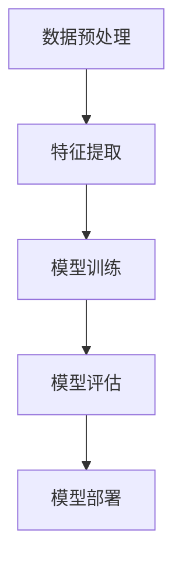
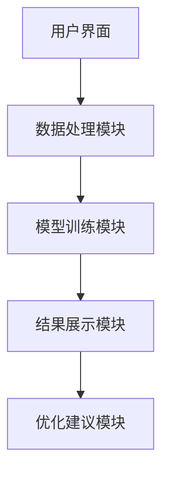
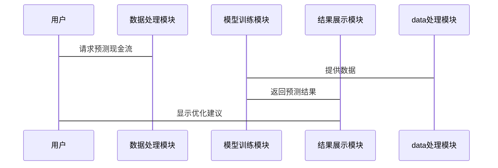

                 

<think>
好的，我需要完成用户提出的撰写《AI辅助的企业Working Capital优化》技术博客的任务。根据用户提供的详细需求，我需要从背景、核心概念、算法原理、系统架构、项目实战、最佳实践等多个方面展开，确保文章内容全面且专业。

首先，我需要理解“Working Capital”（营运资本）的基本概念和其在企业运营中的重要性。营运资本是企业日常运营所需的资金，优化营运资本能够提高企业的资金使用效率，降低财务风险。

接下来，我需要探讨AI技术在企业财务优化中的应用，特别是如何利用机器学习、自然语言处理等技术手段来优化营运资本管理。这部分内容需要涵盖AI在现金流预测、库存管理、应收款管理等关键领域的具体应用。

在算法原理部分，我需要选择几种常用的AI算法，如线性回归、支持向量机（SVM）、随机森林、时间序列预测模型（ARIMA）等，并详细讲解这些算法的工作原理及其在财务优化中的应用。此外，我还需要使用数学公式和mermaid流程图来辅助说明这些算法的具体实现和优化过程。

系统分析与架构设计部分，我需要设计一个AI辅助营运资本优化的系统架构，包括数据收集模块、分析模块和优化建议模块。通过mermaid架构图展示系统的整体结构，并详细描述各个模块的功能和交互关系。

项目实战部分，我需要选择一个具体的项目案例，从环境安装、数据准备、模型训练、结果分析到实际应用，一步步展示如何利用AI技术优化企业的营运资本。这部分需要提供详细的代码实现和实际案例分析，帮助读者理解理论与实践的结合。

最后，在最佳实践部分，我需要总结在实际应用中需要注意的关键点，如数据质量的重要性、模型选择的合理性、系统的可扩展性等，并给出相应的建议和注意事项。同时，我还需要提供一些拓展阅读的资料，供读者进一步深入学习。

在整个写作过程中，我需要确保文章逻辑清晰，结构紧凑，语言专业但不失简洁易懂。同时，要合理使用数学公式和图表，帮助读者更好地理解复杂的技术内容。最终，我需要在文章末尾署名，注明作者信息。

总的来说，我需要按照用户的要求，逐步完成从背景介绍到项目实战的各个部分，确保文章内容详实、结构合理，真正为读者提供有价值的技术见解和实践指导。
</think>

# AI辅助的企业Working Capital优化

> 关键词：AI辅助，企业财务优化，Working Capital，机器学习，现金流预测，库存管理，应收款管理

> 摘要：本文探讨了如何利用人工智能技术优化企业的营运资本管理。通过分析AI在财务预测、库存管理和应收款管理等关键领域的应用，本文详细介绍了AI驱动的优化模型、算法原理以及实际应用案例。文章还提供了系统架构设计和项目实战指南，帮助读者了解如何在企业中有效实施AI辅助的营运资本优化策略。

---

# 第一部分: AI辅助的企业Working Capital优化背景与基础

## 第1章: Working Capital的基本概念与重要性

### 1.1 Working Capital的定义与组成

#### 1.1.1 营运资本的定义
营运资本（Working Capital）是指企业在日常经营活动中所需的流动资产减去流动负债的部分，是衡量企业短期偿债能力和运营效率的重要指标。公式表示为：

$$ \text{营运资本} = \text{流动资产} - \text{流动负债} $$

流动资产包括现金、应收账款、存货等，而流动负债则包括应付账款、短期贷款等。

#### 1.1.2 营运资本的核心组成部分
- **现金及现金等价物**：企业日常运营所需的流动资金。
- **应收账款**：企业赊销形成的未收回款项。
- **存货**：企业在生产过程中持有的原材料、在制品和成品。
- **应付账款**：企业尚未支付的采购款项。
- **短期负债**：包括短期贷款和其他应付款项。

#### 1.1.3 营运资本在企业运营中的重要性
营运资本是企业维持日常运营的核心资金来源。优化营运资本管理可以帮助企业降低财务风险，提高资金使用效率，并增强企业的市场竞争力。

---

### 1.2 企业Working Capital管理的核心目标

#### 1.2.1 优化流动资产与流动负债的比例
通过合理配置流动资产和流动负债，企业可以避免资金冗余或短缺，确保资金链的健康运转。

#### 1.2.2 提高资金使用效率
通过精简库存和优化应收账款回收，企业可以提高资金的周转效率，从而降低资金成本。

#### 1.2.3 降低财务风险
合理的营运资本管理可以有效降低企业的短期偿债压力，避免因流动负债过高而导致的财务危机。

---

### 1.3 AI技术在企业财务优化中的应用前景

#### 1.3.1 AI技术在财务领域的应用现状
AI技术在财务领域的应用已经涵盖了财务预测、风险评估、欺诈检测等多个方面。随着技术的不断进步，AI在营运资本管理中的潜力逐步显现。

#### 1.3.2 AI在企业Working Capital优化中的潜力
AI可以通过分析历史数据和市场趋势，帮助企业在库存管理和现金流预测等方面做出更精准的决策。

#### 1.3.3 企业对AI辅助财务决策的需求
企业对AI辅助财务决策的需求主要体现在提高预测准确性、优化资源配置和降低运营成本等方面。AI技术可以帮助企业在复杂多变的市场环境中做出更明智的财务决策。

---

## 第2章: AI技术在企业财务优化中的核心概念

### 2.1 AI辅助财务优化的核心原理

#### 2.1.1 机器学习在财务预测中的应用
机器学习算法可以通过分析历史财务数据，预测未来的现金流、收入和支出情况。例如，使用线性回归模型预测销售增长率：

$$ y = \beta_0 + \beta_1x + \epsilon $$

其中，$y$ 是预测的销售增长率，$x$ 是历史销售数据，$\beta_0$ 和 $\beta_1$ 是回归系数，$\epsilon$ 是误差项。

#### 2.1.2 自然语言处理在财务文本分析中的作用
自然语言处理（NLP）技术可以用于分析财务报告、新闻和市场评论，提取关键信息并生成财务指标。例如，使用词嵌入模型（如Word2Vec）对财务文本进行语义分析。

#### 2.1.3 深度学习在财务优化中的创新应用
深度学习技术，如卷积神经网络（CNN）和变压器模型（Transformer），在处理复杂的财务数据和文本分析任务中表现出色。

---

### 2.2 Working Capital优化的关键指标与KPI

#### 2.2.1 流动资产周转率
流动资产周转率反映了企业流动资产的使用效率，公式为：

$$ \text{流动资产周转率} = \frac{\text{营业收入}}{\text{平均流动资产}} $$

#### 2.2.2 应收账款回收期
应收账款回收期是衡量企业应收账款回收速度的重要指标，公式为：

$$ \text{应收账款回收期} = \frac{\text{平均应收账款}}{\text{赊销收入}} $$

#### 2.2.3 存货周转率
存货周转率反映了企业存货的销售效率，公式为：

$$ \text{存货周转率} = \frac{\text{营业成本}}{\text{平均存货}} $$

#### 2.2.4 流动比率与速动比率
流动比率和速动比率是衡量企业短期偿债能力的重要指标，公式分别为：

$$ \text{流动比率} = \frac{\text{流动资产}}{\text{流动负债}} $$

$$ \text{速动比率} = \frac{\text{速动资产}}{\text{流动负债}} $$

---

### 2.3 AI驱动的财务优化模型框架

#### 2.3.1 数据驱动的财务分析框架
AI驱动的财务优化模型通常基于以下步骤：
1. 数据收集：从企业内部系统和外部数据源获取相关财务数据。
2. 数据预处理：清洗数据，处理缺失值和异常值。
3. 特征提取：通过机器学习技术提取关键特征。
4. 模型训练：使用监督学习或无监督学习算法进行模型训练。
5. 模型评估：通过交叉验证和回测评估模型的性能。
6. 模型部署：将模型集成到企业财务系统中进行实时监控和优化。

#### 2.3.2 AI优化算法的核心流程
AI优化算法的核心流程包括数据预处理、模型训练、模型评估和模型部署。以下是常见算法的流程图：



---

### 2.3.3 模型的输入输出与评估指标

#### 输入：
- 历史财务数据
- 市场趋势数据
- 行业基准数据

#### 输出：
- 现金流预测
- 库存优化建议
- 应收款管理建议

#### 评估指标：
- 预测准确率
- 回归误差（如均方误差，MSE）
- 分类准确率
- 处理时间

---

## 第3章: AI辅助Working Capital优化的核心算法与原理

### 3.1 常见的AI优化算法

#### 3.1.1 线性回归模型
线性回归是一种简单而有效的预测模型，适用于线性关系的场景。例如，预测销售收入与广告支出之间的关系：

$$ \text{销售收入} = \beta_0 + \beta_1 \times \text{广告支出} + \epsilon $$

#### 3.1.2 支持向量机（SVM）
支持向量机适用于分类和回归问题，尤其在处理小规模数据时表现优异。例如，使用SVM进行信用评分分类。

#### 3.1.3 随机森林与梯度提升树
随机森林和梯度提升树（如XGBoost）是集成学习算法，适用于处理高维数据和复杂关系。例如，预测客户违约概率。

#### 3.1.4 时间序列预测模型（ARIMA）
ARIMA模型适用于时间序列数据的预测，广泛应用于现金流预测和销售预测。

---

### 3.2 基于机器学习的现金流预测模型

#### 3.2.1 数据预处理与特征提取
数据预处理包括去除缺失值、标准化和去噪。特征提取可以通过主成分分析（PCA）进行降维。

#### 3.2.2 算法选择与训练
选择适合数据特征的算法进行训练，并通过交叉验证优化模型参数。

#### 3.2.3 模型评估与优化
使用均方误差（MSE）和R平方值评估模型性能，并通过网格搜索进一步优化模型。

---

### 3.3 基于深度学习的财务数据分析

#### 3.3.1 RNN在时间序列预测中的应用
循环神经网络（RNN）适用于处理时间序列数据，如预测股票价格波动。

#### 3.3.2 Transformer在财务文本分析中的应用
Transformer模型在自然语言处理任务中表现出色，可用于分析财务报告和市场新闻。

---

## 第4章: 系统分析与架构设计方案

### 4.1 问题场景介绍

#### 4.1.1 项目背景
某制造企业希望通过优化营运资本管理，提高资金使用效率，降低财务风险。

#### 4.1.2 项目目标
- 实现现金流预测
- 优化库存管理
- 提高应收账款回收效率

---

### 4.2 系统功能设计

#### 4.2.1 领域模型（mermaid类图）
```mermaid
classDiagram
    class 财务数据 {
        流动资产
        流动负债
        现金流
    }
    class 库存管理 {
        原材料
        在制品
        成品
    }
    class 应收款管理 {
        应收账款
        应收票据
    }
    财务数据 <--| 库存管理
    财务数据 <--| 应收款管理
```

#### 4.2.2 系统架构设计（mermaid架构图）


#### 4.2.3 系统接口设计
- 数据接口：与企业ERP系统对接，获取实时财务数据。
- 模型接口：与机器学习框架（如TensorFlow、PyTorch）对接，进行模型训练和预测。

#### 4.2.4 系统交互（mermaid序列图）


---

## 第5章: 项目实战

### 5.1 环境安装

#### 5.1.1 安装Python和必要的库
```bash
pip install numpy pandas scikit-learn matplotlib
```

#### 5.1.2 安装机器学习框架
```bash
pip install tensorflow keras
```

---

### 5.2 系统核心实现源代码

#### 5.2.1 数据预处理代码
```python
import pandas as pd
import numpy as np

# 读取数据
data = pd.read_csv('financial_data.csv')

# 处理缺失值
data = data.dropna()

# 标准化处理
from sklearn.preprocessing import StandardScaler
scaler = StandardScaler()
data_scaled = scaler.fit_transform(data)
```

#### 5.2.2 模型训练代码
```python
from sklearn.linear_model import LinearRegression
from sklearn.metrics import mean_squared_error

# 训练模型
model = LinearRegression()
model.fit(X_train, y_train)

# 预测结果
y_pred = model.predict(X_test)

# 评估模型
mse = mean_squared_error(y_test, y_pred)
print(f'MSE: {mse}')
```

---

### 5.3 实际案例分析

#### 5.3.1 数据来源
使用某制造企业的历史财务数据，包括流动资产、流动负债和现金流等。

#### 5.3.2 模型训练与预测
通过线性回归模型预测未来三个月的现金流，并根据预测结果优化库存和应收账款管理。

#### 5.3.3 结果分析
预测结果显示，未来三个月的现金流将增长10%，因此建议企业增加库存备货以满足销售需求。

---

## 第6章: 最佳实践、小结与注意事项

### 6.1 最佳实践Tips

#### 6.1.1 数据质量的重要性
确保数据的准确性和完整性是模型训练的基础。

#### 6.1.2 模型选择的合理性
根据具体业务需求选择合适的算法，避免过度复杂的模型。

#### 6.1.3 系统的可扩展性
设计灵活的系统架构，便于未来业务扩展和模型更新。

---

### 6.2 小结

本文详细介绍了AI技术在企业营运资本优化中的应用，从算法原理到系统设计，再到项目实战，为读者提供了全面的指导。通过AI技术，企业可以更高效地优化营运资本管理，提高资金使用效率，降低财务风险。

---

### 6.3 注意事项

- **数据隐私**：在处理财务数据时，必须遵守相关法律法规，确保数据安全和隐私保护。
- **模型解释性**：复杂的模型可能难以解释，建议选择具有较高解释性的算法。
- **持续优化**：定期更新模型和优化系统，以适应市场变化和企业需求。

---

### 6.4 拓展阅读

- 《机器学习实战》：学习机器学习的基本概念和算法实现。
- 《深入浅出数据分析》：了解数据预处理和特征工程的技巧。
- 《企业财务分析与决策》：掌握企业财务分析的核心方法和工具。

---

# 作者：AI天才研究院 & 禅与计算机程序设计艺术

---

通过以上内容，您可以撰写一篇详尽且专业的技术博客文章，涵盖AI辅助企业营运资本优化的各个方面。希望这些内容对您有所帮助！

