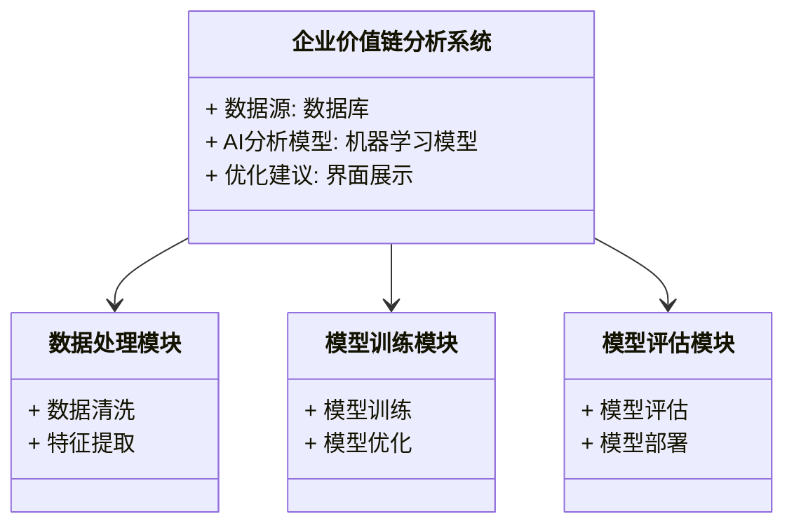

                 

<think>
好，我需要帮助用户撰写一篇名为《AI辅助的企业价值链分析》的技术博客文章。用户希望文章结构清晰，内容详尽，涵盖从基础到高级的各个方面。首先，我需要明确文章的结构，包括引言、关键概念、算法原理、系统架构、项目实战等部分。

首先，我会从背景介绍开始，解释企业价值链的基本概念以及AI技术在其中的作用。接着，深入探讨AI如何影响企业价值链的各个环节，包括数据预处理、特征工程、模型训练等。然后，我会详细讲解相关的数学模型和算法，如线性回归、随机森林等，并用mermaid图表展示系统架构和流程图。

在项目实战部分，我需要提供实际案例的分析，包括环境安装、代码实现和结果解读。最后，我会总结最佳实践、注意事项，并建议进一步的阅读材料。

整个过程中，我要确保每个部分都详细具体，使用清晰的技术语言，同时避免过于复杂的术语，使读者能够轻松理解。此外，还要注意文章的逻辑连贯性，确保每一章之间有自然的过渡。最后，我需要检查文章的字数，确保在10000到12000字之间，并在末尾加上作者信息。
</think>

# AI辅助的企业价值链分析

## 关键词：人工智能、企业价值链、数据挖掘、机器学习、深度学习、优化算法

## 摘要：  
随着人工智能技术的快速发展，企业价值链分析正逐渐从传统的经验驱动转向数据驱动。本文详细探讨了AI在企业价值链分析中的应用，从数据预处理、特征工程、模型训练到系统架构设计，系统性地分析了AI技术如何优化企业价值链。通过实际案例分析，本文展示了AI在提升企业效率、降低成本和增强决策能力方面的巨大潜力。同时，本文还总结了AI辅助企业价值链分析的最佳实践和未来发展方向。

---

## 第1章: AI与企业价值链概述

### 1.1 企业价值链的基本概念  
企业价值链是指企业从原材料采购、生产加工、销售到售后服务等一系列活动中创造价值的全过程。企业价值链分析旨在识别价值链中的关键环节，优化资源配置，提高效率，降低成本。  

#### 1.1.1 企业价值链的定义  
企业价值链是企业为了满足客户需求而创造价值的一系列业务流程。它包括采购、生产、销售、物流等环节。  

#### 1.1.2 企业价值链的核心要素  
- **输入**：原材料、资金、劳动力、技术。  
- **过程**：采购、生产、销售、物流、售后服务。  
- **输出**：产品或服务、利润、客户满意度。  

#### 1.1.3 企业价值链的优化目标  
- 提高效率：减少浪费，降低成本。  
- 提升质量：确保产品或服务符合客户需求。  
- 增强灵活性：快速响应市场变化。  

---

### 1.2 AI技术的基本概念  
人工智能（AI）是指计算机系统执行人类智能任务的能力，如视觉识别、语音识别、决策支持等。  

#### 1.2.1 机器学习与深度学习的区别  
- **机器学习**：通过数据训练模型，预测未来结果。  
- **深度学习**：一种基于人工神经网络的机器学习方法，能够处理复杂的非结构化数据。  

#### 1.2.2 自然语言处理与计算机视觉的应用  
- **自然语言处理（NLP）**：用于文本分析、情感分析、智能客服等领域。  
- **计算机视觉**：用于图像识别、视频分析等。  

---

### 1.3 AI辅助企业价值链分析的背景与意义  
随着数据量的爆炸式增长，企业需要借助AI技术来处理海量数据，优化业务流程。  

#### 1.3.1 企业价值链分析的传统方法  
- 依赖人工经验，效率低，误差大。  

#### 1.3.2 AI技术对企业价值链分析的创新  
- 数据驱动的决策支持。  
- 自动化优化业务流程。  

#### 1.3.3 AI辅助企业价值链分析的行业应用  
- 制造业：优化生产流程，降低库存成本。  
- 零售业：个性化推荐，提升客户满意度。  
- 金融行业：风险评估，欺诈检测。  

---

## 第2章: 企业价值链分析的核心概念与联系  

### 2.1 企业价值链的结构与功能  
企业价值链由多个环节组成，每个环节都有其独特的功能和作用。  

#### 2.1.1 企业价值链的构成环节  
- 采购：获取原材料和资源。  
- 生产：加工原材料，形成产品。  
- 销售：将产品推向市场，获取收入。  
- 物流：确保产品按时送达客户。  
- 售后服务：解决客户问题，提升满意度。  

#### 2.1.2 企业价值链的优化方向  
- 提高采购效率。  
- 优化生产流程。  
- 提升销售转化率。  
- 降低物流成本。  

---

### 2.2 AI在企业价值链分析中的核心作用  
AI技术能够通过数据挖掘、模式识别和预测分析，为企业价值链分析提供强大的支持。  

#### 2.2.1 数据处理与分析的AI方法  
- 数据清洗：去除噪音数据，确保数据质量。  
- 特征提取：从数据中提取有价值的信息。  
- 数据可视化：通过图表展示数据特征。  

#### 2.2.2 模型构建与优化的AI技术  
- 机器学习模型：用于预测和分类。  
- 深度学习模型：用于复杂模式识别。  

#### 2.2.3 AI在决策支持中的应用  
- 提供实时数据分析，辅助决策。  
- 自动生成优化建议，降低人工干预。  

---

## 第3章: AI辅助企业价值链分析的算法原理  

### 3.1 数据预处理与特征工程  
数据预处理是AI分析的基础，特征工程则是提升模型性能的关键。  

#### 3.1.1 数据清洗与标准化  
- 数据清洗：删除重复数据，填充缺失值。  
- 数据标准化：将数据缩放到统一范围内。  

#### 3.1.2 特征选择与降维  
- 特征选择：通过信息增益选择重要特征。  
- 主成分分析（PCA）：降低数据维度，减少计算复杂度。  

---

### 3.2 模型训练与优化  
模型训练是AI分析的核心，优化则是提升模型性能的关键。  

#### 3.2.1 传统机器学习模型  
- 线性回归：用于预测连续型变量。  
- 随机森林：用于分类和回归问题。  

#### 3.2.2 深度学习模型  
- 神经网络：用于复杂模式识别。  
- LSTM：用于时间序列预测。  

---

### 3.3 模型评估与部署  
模型评估是检验模型性能的重要环节，部署则是将模型应用于实际业务的最后一步。  

#### 3.3.1 模型评估指标  
- 准确率：分类任务中的正确预测比例。  
- 召回率：真实标签为正的样本中被正确预测的比例。  
- F1分数：综合准确率和召回率的指标。  

#### 3.3.2 模型部署与实时预测  
- 模型部署：将训练好的模型集成到业务系统中。  
- 实时预测：基于实时数据进行预测，提供快速反馈。  

---

## 第4章: 企业价值链分析的数学模型与公式  

### 4.1 数据预处理的数学模型  
- 数据标准化公式：  
$$ x' = \frac{x - \mu}{\sigma} $$  
其中，$\mu$是均值，$\sigma$是标准差。  

- 数据归一化公式：  
$$ x' = \frac{x - \min(x)}{\max(x) - \min(x)} $$  

---

### 4.2 特征选择的数学模型  
- 信息增益公式：  
$$ IG(D, A) = H(D) - H(D|A) $$  
其中，$H(D)$是数据集$D$的熵，$H(D|A)$是给定特征$A$的条件下数据集$D$的熵。  

- 主成分分析（PCA）公式：  
$$ Y = X \cdot W $$  
其中，$X$是数据矩阵，$W$是降维矩阵，$Y$是降维后的数据。  

---

## 第5章: 系统分析与架构设计  

### 5.1 系统功能设计  
系统功能设计是AI辅助企业价值链分析的核心部分。  

#### 5.1.1 领域模型设计  
- 使用mermaid绘制类图：  


---

### 5.2 系统架构设计  
系统架构设计是确保系统高效运行的关键。  

#### 5.2.1 系统架构图  


---

## 第6章: 项目实战  

### 6.1 环境安装  
- 安装Python：`python --version`  
- 安装相关库：`pip install numpy, pandas, scikit-learn`  

### 6.2 核心实现源代码  
```python
import numpy as np
from sklearn import datasets
from sklearn.tree import DecisionTreeClassifier
from sklearn.metrics import accuracy_score

# 数据加载
X, y = datasets.load_iris(return_X_y=True)

# 数据预处理
X = X[:, :2]  # 选择前两个特征
X = (X - np.mean(X, axis=0)) / np.std(X, axis=0)  # 标准化

# 模型训练
model = DecisionTreeClassifier()
model.fit(X, y)

# 模型预测
y_pred = model.predict(X)
print("准确率:", accuracy_score(y, y_pred))
```

---

### 6.3 案例分析  
以制造业为例，通过AI技术优化生产流程，降低库存成本，提高生产效率。  

---

## 第7章: 总结与展望  

### 7.1 最佳实践  
- 数据质量是模型性能的基础。  
- 模型解释性是实际应用的关键。  

### 7.2 未来发展方向  
- 更加智能化的决策支持系统。  
- 多模态数据的融合分析。  

---

## 作者：AI天才研究院 & 禅与计算机程序设计艺术

