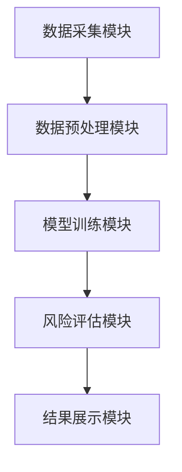

                 


# AI辅助的企业价值链风险分析

## 关键词：企业价值链、风险分析、人工智能、机器学习、风险管理

## 摘要：随着人工智能技术的快速发展，企业价值链中的风险分析变得越来越重要。本文将探讨如何利用AI技术来优化企业价值链中的风险识别、评估和管理。通过分析企业价值链的各个环节，结合机器学习算法，我们能够更有效地识别潜在风险，并采取相应的措施来降低风险对企业的影响。本文将从理论到实践，详细讲解AI在企业价值链风险分析中的应用，包括算法原理、系统架构设计和实际案例分析。

---

# 目录

1. [企业价值链与风险分析概述](#企业价值链与风险分析概述)
   - 1.1 企业价值链的基本概念
     - 1.1.1 企业价值链的定义
     - 1.1.2 价值链的构成要素
     - 1.1.3 价值链中的风险类型
   - 1.2 AI在企业价值链中的作用
     - 1.2.1 AI技术如何优化价值链
     - 1.2.2 AI在风险分析中的应用
     - 1.2.3 企业价值链与AI的结合

2. [AI辅助风险分析的核心概念](#ai辅助风险分析的核心概念)
   - 2.1 数据驱动的风险分析
     - 2.1.1 数据收集与处理
     - 2.1.2 数据特征提取
   - 2.2 机器学习与风险预测
     - 2.2.1 监督学习与无监督学习
     - 2.2.2 常见算法介绍

3. [算法原理与数学模型](#算法原理与数学模型)
   - 3.1 机器学习算法
     - 3.1.1 决策树
     - 3.1.2 随机森林
     - 3.1.3 支持向量机
   - 3.2 深度学习算法
     - 3.2.1 神经网络
     - 3.2.2 LSTM网络
   - 3.3 数学模型与公式
     - 3.3.1 机器学习模型
       - 线性回归公式：$$y = \beta_0 + \beta_1x + \epsilon$$
       - 逻辑回归公式：$$P(y=1|x) = \frac{1}{1 + e^{-\beta x}}$$
     - 3.3.2 深度学习模型
       - 神经网络结构：输入层 → 隐藏层 → 输出层

4. [系统架构与设计](#系统架构与设计)
   - 4.1 系统功能设计
     - 数据采集模块
     - 数据预处理模块
     - 模型训练模块
     - 风险评估模块
     - 结果展示模块
   - 4.2 系统架构图
     - 使用Mermaid绘制系统架构图

5. [项目实战与案例分析](#项目实战与案例分析)
   - 5.1 环境安装与配置
     - 安装Python与相关库
     - 安装机器学习框架（如TensorFlow、Scikit-learn）
   - 5.2 核心代码实现
     - 数据预处理代码
     - 模型训练代码
     - 风险评估代码
   - 5.3 案例分析
     - 数据收集与清洗
     - 模型训练与优化
     - 结果分析与总结
   - 5.4 项目总结
     - 成果展示
     - 经验教训
     - 拓展建议

6. [最佳实践与小结](#最佳实践与小结)
   - 6.1 总结与回顾
     - 文章核心内容回顾
     - AI在企业价值链中的应用前景
   - 6.2 最佳实践与注意事项
     - 数据质量的重要性
     - 模型选择与调优
     - 结果解释与可视化
   - 6.3 未来展望
     - 新兴技术对风险分析的影响
     - AI技术的进一步应用潜力

---

# 正文

## 1. 企业价值链与风险分析概述

### 1.1 企业价值链的基本概念

#### 1.1.1 企业价值链的定义
企业价值链是指企业从原材料采购、生产加工、销售到售后服务的完整过程。这一过程涵盖了企业的所有业务活动，每个环节都可能对企业整体绩效产生影响。

#### 1.1.2 价值链的构成要素
企业价值链由以下几个关键要素构成：
- 采购与供应链管理
- 生产与制造
- 销售与市场
- 客户服务与支持

#### 1.1.3 价值链中的风险类型
在企业价值链中，常见的风险类型包括：
- 供应链风险：原材料短缺或供应商延迟交货
- 生产风险：设备故障或生产事故
- 市场风险：市场需求波动或价格变化
- 客户风险：客户信用风险或退货风险

### 1.2 AI在企业价值链中的作用

#### 1.2.1 AI技术如何优化价值链
AI技术可以通过数据分析和预测，优化企业的采购、生产和销售流程，降低运营成本，提高效率。

#### 1.2.2 AI在风险分析中的应用
AI可以帮助企业识别潜在风险，预测风险发生的概率，并提供应对策略。例如，通过机器学习模型预测供应链中断的可能性。

#### 1.2.3 企业价值链与AI的结合
企业价值链与AI的结合主要体现在数据驱动的决策、自动化流程优化和实时风险监控等方面。

---

## 2. AI辅助风险分析的核心概念

### 2.1 数据驱动的风险分析

#### 2.1.1 数据收集与处理
数据收集是风险分析的第一步。企业需要从多个来源收集数据，包括内部系统数据、市场数据和客户反馈等。数据处理包括清洗、转换和集成。

#### 2.1.2 数据特征提取
特征提取是将数据转化为能够反映风险的关键特征。例如，从销售数据中提取季节性波动特征。

### 2.2 机器学习与风险预测

#### 2.2.1 监督学习与无监督学习
- 监督学习：基于有标签的数据进行分类或回归预测。
- 无监督学习：发现数据中的潜在结构，如聚类分析。

#### 2.2.2 常见算法介绍
常用的机器学习算法包括线性回归、逻辑回归、决策树和随机森林等。

---

## 3. 算法原理与数学模型

### 3.1 机器学习算法

#### 3.1.1 决策树
决策树是一种基于树状结构的分类方法。每个内部节点代表一个判断条件，叶子节点代表最终结果。

#### 3.1.2 随机森林
随机森林是一种集成学习方法，通过构建多棵决策树并进行投票或平均来提高模型的准确性和稳定性。

#### 3.1.3 支持向量机
支持向量机是一种监督学习算法，用于分类和回归问题。其核心思想是将数据映射到高维空间，并寻找最优分割超平面。

### 3.2 深度学习算法

#### 3.2.1 神经网络
神经网络是一种模仿人脑结构的深度学习模型，包含输入层、隐藏层和输出层。

#### 3.2.2 LSTM网络
LSTM（长短期记忆网络）是一种特殊的循环神经网络，适用于处理序列数据，如时间序列预测。

### 3.3 数学模型与公式

#### 3.3.1 机器学习模型
- 线性回归公式：$$y = \beta_0 + \beta_1x + \epsilon$$
- 逻辑回归公式：$$P(y=1|x) = \frac{1}{1 + e^{-\beta x}}$$

#### 3.3.2 深度学习模型
- 神经网络结构：输入层 → 隐藏层 → 输出层

---

## 4. 系统架构与设计

### 4.1 系统功能设计

#### 数据采集模块
负责从企业内部系统和其他数据源收集数据。

#### 数据预处理模块
对收集到的数据进行清洗、转换和集成。

#### 模型训练模块
使用机器学习算法训练风险预测模型。

#### 风险评估模块
基于训练好的模型，评估潜在风险并生成预警。

#### 结果展示模块
以可视化的方式展示风险评估结果和预测报告。

### 4.2 系统架构图

使用Mermaid绘制的系统架构图如下：



---

## 5. 项目实战与案例分析

### 5.1 环境安装与配置

#### 安装Python与相关库
```bash
pip install python numpy pandas scikit-learn tensorflow
```

#### 安装机器学习框架
```bash
pip install scikit-learn tensorflow
```

### 5.2 核心代码实现

#### 数据预处理代码
```python
import pandas as pd
from sklearn.preprocessing import StandardScaler

# 数据加载
data = pd.read_csv('data.csv')

# 数据清洗
data.dropna(inplace=True)

# 特征提取
features = data[['feature1', 'feature2', 'feature3']]
labels = data['label']
```

#### 模型训练代码
```python
from sklearn.model_selection import train_test_split
from sklearn.ensemble import RandomForestClassifier
from sklearn.metrics import accuracy_score

# 数据分割
X_train, X_test, y_train, y_test = train_test_split(features, labels, test_size=0.2)

# 模型训练
model = RandomForestClassifier()
model.fit(X_train, y_train)

# 模型评估
y_pred = model.predict(X_test)
print("准确率:", accuracy_score(y_test, y_pred))
```

### 5.3 案例分析

#### 数据收集与清洗
从企业销售数据中提取关键特征，如销售额、客户反馈和市场趋势。

#### 模型训练与优化
使用随机森林算法训练风险预测模型，并通过网格搜索优化模型参数。

#### 结果分析与总结
通过模型预测，识别出潜在的供应链中断风险，并制定相应的应对策略。

### 5.4 项目总结

#### 成果展示
展示了如何利用AI技术优化企业价值链中的风险分析流程。

#### 经验教训
数据质量对模型性能影响重大，特征选择和模型调优是关键。

#### 拓展建议
未来可以引入更多先进的AI技术，如强化学习和自监督学习，进一步提升风险预测的准确性。

---

## 6. 最佳实践与小结

### 6.1 总结与回顾

本文详细介绍了AI在企业价值链风险分析中的应用，从理论到实践，全面讲解了如何利用机器学习算法优化企业风险管理流程。

### 6.2 最佳实践与注意事项

- 数据质量是模型性能的基础，需确保数据的完整性和准确性。
- 模型选择应基于实际业务需求和数据特征，避免盲目追求复杂模型。
- 结果解释与可视化是模型应用的关键，需注重用户体验。

### 6.3 未来展望

随着AI技术的不断进步，企业价值链中的风险分析将更加智能化和自动化。新兴技术如强化学习和自监督学习将为企业风险管理带来更多可能性。

---

# 结语

AI技术正在改变企业价值链的风险分析方式，通过数据驱动的决策和智能算法的应用，企业能够更高效地识别和应对潜在风险。希望本文能够为企业在AI辅助的风险管理领域提供有价值的参考。

---

# 作者

**作者：AI天才研究院/AI Genius Institute & 禅与计算机程序设计艺术 /Zen And The Art of Computer Programming**

--- 

> 本文由AI天才研究院和“禅与计算机程序设计艺术”联合撰写，转载请注明出处。

