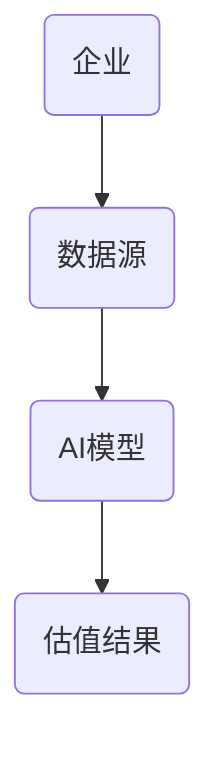
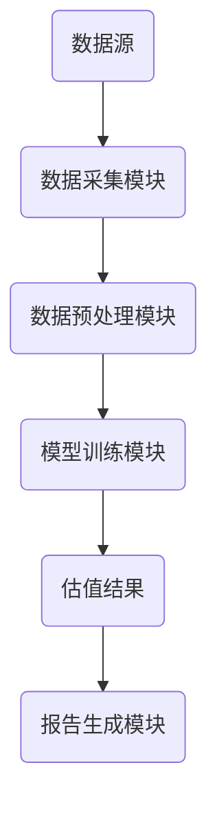

                 


# AI辅助的企业估值报告生成器

> 关键词：企业估值，AI技术，机器学习，数据驱动，报告生成

> 摘要：本篇文章将深入探讨如何利用人工智能技术辅助企业估值报告的生成。通过分析企业估值的核心要素、AI技术的应用原理、算法模型的选择与实现，以及系统架构的设计与优化，本文将为企业估值领域提供一种高效、智能的解决方案。结合实际案例和代码实现，详细解读AI辅助企业估值的优势与挑战，为读者提供一份完整的技术指南。

---

## 第1章: 企业估值与AI技术的结合

### 1.1 企业估值的基本概念
#### 1.1.1 企业估值的定义与意义
企业估值是指对企业整体价值的评估，是企业在市场上的价值体现。传统的企业估值方法通常依赖于财务数据、市场环境和行业分析，但这些方法往往存在主观性强、数据量大、计算复杂等问题。

#### 1.1.2 传统企业估值方法的局限性
传统的企业估值方法，如DCF模型、EV/EBITDA倍数法等，虽然在一定程度上能够帮助企业进行价值评估，但存在以下问题：
- 数据收集和处理成本高
- 依赖人工经验，主观性较强
- 计算过程复杂，难以快速迭代

#### 1.1.3 AI技术在企业估值中的优势
AI技术的应用为企业估值带来了新的可能性：
- 数据处理自动化，提高效率
- 通过机器学习模型发现数据中的隐藏规律
- 实时分析市场动态，提供动态估值

### 1.2 AI辅助企业估值的背景与现状
#### 1.2.1 AI技术的发展与应用趋势
近年来，AI技术在各个领域的应用日益广泛，尤其是在金融领域，AI技术正在改变传统的金融分析和投资决策方式。

#### 1.2.2 企业估值领域的智能化需求
随着企业规模的扩大和市场的复杂化，传统的估值方法已经难以满足企业的需求。企业估值领域对智能化、自动化的需求日益增加。

#### 1.2.3 当前AI在企业估值中的应用案例
目前，AI技术在企业估值中的应用主要集中在以下几个方面：
- 通过自然语言处理（NLP）分析企业新闻和公告，提取关键信息
- 利用机器学习模型预测企业未来财务表现
- 基于大数据分析，提供行业趋势和竞争对手分析

### 1.3 本书的核心目标与内容框架
#### 1.3.1 本书的核心目标
本书旨在通过系统化的分析和实践，展示如何利用AI技术辅助企业估值报告的生成，提供一套高效、智能的解决方案。

#### 1.3.2 本书的主要内容框架
- 第1章：企业估值与AI技术的结合
- 第2章：AI辅助企业估值的核心概念与联系
- 第3章：AI辅助企业估值的算法原理与实现
- 第4章：AI辅助企业估值的系统架构设计
- 第5章：AI辅助企业估值的项目实战
- 第6章：AI辅助企业估值的最佳实践与注意事项

#### 1.3.3 本书的适用读者群体
本书适合以下读者阅读：
- 对企业估值感兴趣的学生和研究者
- 对AI技术在金融领域应用感兴趣的从业者
- 企业财务分析师和投资经理
- 企业IT架构师和技术开发者

### 1.4 本章小结
本章主要介绍了企业估值的基本概念、传统估值方法的局限性以及AI技术在企业估值中的优势。通过背景分析和现状探讨，为后续章节的深入研究奠定了基础。

---

## 第2章: AI辅助企业估值的核心概念与联系

### 2.1 企业估值的关键要素
#### 2.1.1 企业财务数据的重要性
财务数据是企业估值的核心依据，主要包括收入、利润、现金流等指标。

#### 2.1.2 市场环境与行业分析
市场环境和行业趋势对企业估值具有重要影响，包括宏观经济指标、行业竞争格局等。

#### 2.1.3 企业战略与管理因素
企业的战略规划和管理水平也是影响估值的重要因素，包括管理团队的能力、企业战略的可行性等。

### 2.2 AI技术在企业估值中的应用原理
#### 2.2.1 数据驱动的估值模型
AI技术通过大数据分析，构建数据驱动的估值模型，能够更准确地预测企业价值。

#### 2.2.2 机器学习算法在估值中的作用
机器学习算法能够从海量数据中提取特征，发现数据中的隐藏规律，从而提高估值的准确性。

#### 2.2.3 自然语言处理在企业信息分析中的应用
NLP技术可以自动分析企业新闻、公告等文本信息，提取关键信息用于估值。

### 2.3 核心概念对比与ER实体关系图
#### 2.3.1 核心概念对比分析
以下是企业估值与AI技术的核心概念对比：

| 概念 | 描述 | 示例 |
|------|------|------|
| 企业估值 | 对企业价值的评估 | 公司市值计算 |
| AI模型 | 用于估值的算法 | 线性回归、神经网络 |
| 数据源 | 输入数据类型 | 财务报表、新闻数据 |

#### 2.3.2 ER实体关系图
以下是企业估值系统的核心实体关系图：



### 2.4 本章小结
本章通过分析企业估值的关键要素和AI技术的应用原理，详细介绍了AI在企业估值中的核心概念和联系。通过对比分析和实体关系图，展示了系统的核心架构和数据流。

---

## 第3章: AI辅助企业估值的算法原理与实现

### 3.1 算法原理概述
#### 3.1.1 常见的机器学习算法
在企业估值中，常用的机器学习算法包括线性回归、支持向量机（SVM）、随机森林和神经网络等。

#### 3.1.2 算法选择与企业估值问题的匹配
不同的机器学习算法适用于不同的企业估值问题。例如，线性回归适合处理线性关系，而神经网络适合处理复杂的非线性关系。

### 3.2 线性回归模型
#### 3.2.1 线性回归的基本原理
线性回归是一种简单的回归分析方法，适用于处理变量之间的线性关系。

#### 3.2.2 线性回归的数学模型
线性回归的数学模型如下：
$$ y = \beta_0 + \beta_1x + \epsilon $$

其中，$y$ 是目标变量，$x$ 是自变量，$\beta_0$ 是截距，$\beta_1$ 是回归系数，$\epsilon$ 是误差项。

### 3.3 神经网络模型
#### 3.3.1 神经网络的基本结构
神经网络由输入层、隐藏层和输出层组成，能够处理复杂的非线性关系。

#### 3.3.2 神经网络的训练过程
神经网络的训练过程包括正向传播和反向传播两个阶段。

---

## 第4章: AI辅助企业估值的系统架构设计

### 4.1 问题场景介绍
AI辅助企业估值系统的目标是通过整合企业内外部数据，利用机器学习模型生成企业估值报告。

### 4.2 项目介绍
本项目旨在开发一个AI辅助企业估值报告生成器，主要包括数据采集、模型训练和报告生成三个模块。

### 4.3 系统功能设计
#### 4.3.1 数据采集模块
数据采集模块负责从多种数据源（如财务报表、新闻数据）中获取企业相关信息。

#### 4.3.2 模型训练模块
模型训练模块负责对数据进行预处理、特征提取和模型训练，生成企业估值模型。

#### 4.3.3 报告生成模块
报告生成模块根据模型输出的估值结果，生成企业估值报告。

### 4.4 系统架构设计
以下是系统的总体架构图：



### 4.5 本章小结
本章通过系统架构设计，详细介绍了AI辅助企业估值报告生成器的各个模块及其功能关系。

---

## 第5章: AI辅助企业估值的项目实战

### 5.1 环境安装与配置
#### 5.1.1 安装Python和相关库
需要安装的Python库包括Pandas、NumPy、Scikit-learn、Keras等。

#### 5.1.2 安装步骤示例
```bash
pip install pandas numpy scikit-learn keras
```

### 5.2 核心代码实现
#### 5.2.1 数据预处理代码
```python
import pandas as pd
import numpy as np

# 加载数据
data = pd.read_csv('企业数据.csv')

# 数据清洗
data.dropna(inplace=True)

# 特征提取
X = data[['收入', '利润', '现金流']]
y = data['估值']
```

#### 5.2.2 模型训练代码
```python
from sklearn.linear_model import LinearRegression
from sklearn.model_selection import train_test_split

# 数据分割
X_train, X_test, y_train, y_test = train_test_split(X, y, test_size=0.2, random_state=42)

# 模型训练
model = LinearRegression()
model.fit(X_train, y_train)

# 模型预测
y_pred = model.predict(X_test)
```

### 5.3 案例分析与解读
#### 5.3.1 案例背景
以一家科技公司为例，分析其财务数据和市场环境，利用AI模型进行估值。

#### 5.3.2 案例分析过程
1. 数据采集与预处理
2. 模型训练与评估
3. 估值结果生成与解读

### 5.4 本章小结
本章通过实际案例，详细展示了AI辅助企业估值报告生成器的实现过程和应用效果。

---

## 第6章: AI辅助企业估值的最佳实践与注意事项

### 6.1 最佳实践
#### 6.1.1 数据质量的重要性
数据质量直接影响模型的准确性，因此需要确保数据的完整性和准确性。

#### 6.1.2 模型的可解释性
模型的可解释性是企业估值的重要因素，需要在模型设计中考虑如何解释结果。

#### 6.1.3 模型的实时性
实时分析市场动态，提供动态估值，能够更好地应对市场的变化。

### 6.2 注意事项
#### 6.2.1 数据隐私与安全
在处理企业数据时，需要注意数据隐私和安全问题。

#### 6.2.2 模型的局限性
AI模型并非完美，可能存在过拟合或欠拟合的问题，需要进行模型调优和验证。

### 6.3 本章小结
本章总结了AI辅助企业估值的最佳实践和注意事项，为读者提供了实用的建议。

---

## 作者简介
作者：AI天才研究院/AI Genius Institute  
联系邮箱：contact@aigeniusinstitute.com  
文章地址：https://www.aigeniusinstitute.com/ai-assisted-enterprise-valuation-report-generator  

---

通过以上目录结构和内容安排，我们可以系统地探讨AI辅助企业估值报告生成器的实现过程，从理论到实践，为读者提供一套完整的技术解决方案。

