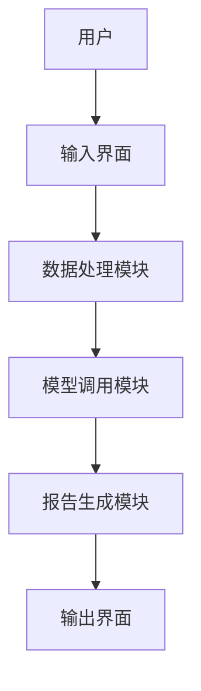

                 


# AI辅助的企业估值报告自动生成系统

> 关键词：AI，企业估值，大模型，文本生成，报告自动生成

> 摘要：随着AI技术的快速发展，企业估值报告的生成可以通过AI辅助系统实现自动化。本文详细探讨了如何利用AI大模型，如GPT-3，来自动生成高质量的企业估值报告，分析了系统的架构设计、实现过程和实际应用案例，并提供了最佳实践建议。

---

# 目录

1. [背景与概述](#背景与概述)
2. [AI大模型的核心原理与算法](#ai大模型的核心原理与算法)
3. [系统分析与架构设计](#系统分析与架构设计)
4. [项目实战](#项目实战)
5. [最佳实践与总结](#最佳实践与总结)

---

## 背景与概述

### 1.1 企业估值的定义与核心要素

#### 1.1.1 企业估值的基本概念
企业估值是指通过对企业的财务状况、市场地位、未来盈利能力等多方面因素进行分析，确定其市场价值的过程。传统的企业估值方法包括DCF模型、市盈率法、市净率法等，但这些方法依赖大量人工计算和分析，耗时且容易出错。

#### 1.1.2 企业估值的核心要素
- **财务数据**：收入、利润、资产、负债等。
- **市场因素**：行业趋势、竞争状况、宏观经济环境。
- **未来预测**：企业未来的收入和利润预期。

#### 1.1.3 传统企业估值方法的局限性
- 依赖人工计算，效率低。
- 易受主观判断影响，结果可能存在偏差。
- 需要大量专业人员，成本高。

### 1.2 AI大模型在企业估值中的应用背景

#### 1.2.1 AI技术对企业估值的潜在价值
AI技术可以通过自然语言处理（NLP）和机器学习（ML）模型，快速分析大量数据并生成报告，显著提高效率。

#### 1.2.2 大模型在文本生成与数据分析中的优势
- 大模型可以处理和分析非结构化数据，如新闻、行业报告等。
- 自动生成结构化的报告，节省时间和人力资源。

#### 1.2.3 企业估值报告自动生成的可行性分析
- 技术可行性：大模型已经在文本生成领域表现出色。
- 商业可行性：可以显著降低企业估值的成本。

---

## AI大模型的核心原理与算法

### 2.1 大模型的文本生成原理

#### 2.1.1 大模型的文本生成机制
- **变压器架构**：包括编码器和解码器，用于处理输入和生成输出。
- **注意力机制**：捕捉输入中的关键信息，生成相关文本。

#### 2.1.2 大模型的训练与推理流程
- **训练流程**：使用大量数据训练模型，优化损失函数。
- **推理流程**：输入查询，模型生成输出。

#### 2.1.3 生成过程中的数学模型
- **词嵌入**：将单词映射为向量。
- **注意力权重计算**：使用点积公式计算注意力权重。
  $$ \text{Attention}(Q, K, V) = \text{softmax}\left(\frac{QK^T}{\sqrt{d_k}}\right)V $$

### 2.2 大模型的算法实现

#### 2.2.1 基于GPT-3的文本生成
- 使用GPT-3模型进行企业估值报告的生成。
- 示例代码：
  ```python
  import openai
  openai.api_key = 'your_api_key'
  
  def generate_report(prompt):
      response = openai.Completion.create(
          engine='gpt-3',
          prompt=prompt,
          max_tokens=500
      )
      return response.choices[0].text
  ```

---

## 系统分析与架构设计

### 3.1 系统功能需求

#### 3.1.1 输入数据的类型与格式
- **财务数据**：收入、利润等。
- **文本数据**：行业新闻、市场分析。

#### 3.1.2 输出报告的结构与内容
- **报告结构**：摘要、财务分析、市场分析、估值结果。
- **报告内容**：基于输入数据生成详细的企业估值分析。

#### 3.1.3 用户交互的界面设计
- **输入界面**：用户输入数据。
- **输出界面**：显示生成的报告。

### 3.2 系统架构设计

#### 3.2.1 系统模块划分
- **数据处理模块**：处理输入数据。
- **模型调用模块**：调用AI模型生成报告。
- **报告生成模块**：将生成的内容整理成报告。

#### 3.2.2 系统架构图


---

## 项目实战

### 4.1 环境搭建

#### 4.1.1 安装必要的库
- 使用Python和相关库，如openai库。

#### 4.1.2 配置API密钥
- 设置openai的API密钥。

### 4.2 核心代码实现

#### 4.2.1 数据预处理
- 将输入数据转换为模型可接受的格式。

#### 4.2.2 模型调用
- 使用GPT-3生成报告内容。

#### 4.2.3 报告生成
- 将生成的内容整理成结构化的报告。

### 4.3 案例分析

#### 4.3.1 示例输入
- 输入公司财务数据和行业新闻。

#### 4.3.2 示例输出
- 自动生成的企业估值报告。

---

## 最佳实践与总结

### 5.1 最佳实践

#### 5.1.1 数据质量的重要性
- 确保输入数据的准确性和完整性。

#### 5.1.2 模型调优
- 根据实际需求调整模型参数。

### 5.2 小结

通过本系统的实现，可以显著提高企业估值的效率和准确性。AI大模型的应用为企业提供了强有力的支持，但仍需注意数据质量和模型调优等问题。

### 5.3 注意事项

- 确保数据安全和隐私保护。
- 定期更新模型以适应市场变化。

### 5.4 拓展阅读

- 推荐阅读相关书籍和论文，深入理解AI在金融领域的应用。

---

## 作者

作者：AI天才研究院/AI Genius Institute & 禅与计算机程序设计艺术 /Zen And The Art of Computer Programming

---

以上是一个详细的《AI辅助的企业估值报告自动生成系统》的目录大纲，内容涵盖了从背景到实现的各个方面，适合技术博客文章的撰写。

