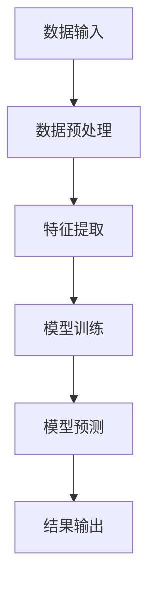
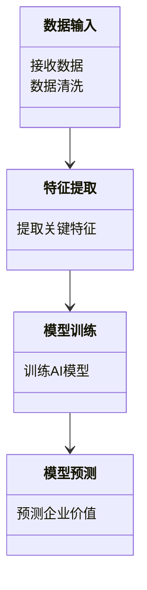

                 


```markdown
# AI辅助的企业估值模型

> 关键词：企业估值、人工智能、机器学习、数据驱动、AI算法、企业风险管理、动态估值

> 摘要：本文将详细介绍AI辅助的企业估值模型，从基本概念到实际应用，结合算法原理和系统架构设计，探讨如何利用AI技术提升企业估值的准确性、效率和动态性。通过数据驱动的方法，结合传统估值模型，构建一个智能化的企业估值系统，为企业决策提供有力支持。

---

## 第一部分: 企业估值的基本概念

### 第1章: 企业估值的定义与重要性

#### 1.1 企业估值的定义
企业估值是指对企业整体价值的评估，通常用于企业并购、融资、上市等场景。传统估值方法依赖于财务数据和人工分析，存在主观性强、效率低、易受人为干扰等问题。

#### 1.2 企业估值的重要性
- 企业并购：准确评估企业价值是并购决策的关键。
- 融资活动：估值结果直接影响融资金额和条件。
- 上市公司：合理的估值有助于股价稳定和投资者信心。

#### 1.3 企业估值的常见方法
- 市盈率法（P/E ratio）
- 市净率法（P/B ratio）
- 现金流折现法（DCF model）
- 企业价值倍数（EV/EBITDA）

---

### 第2章: AI在企业估值中的作用

#### 2.1 AI技术的基本概念
- 人工智能（AI）：模拟人类智能的计算机系统，包括学习、推理、自适应等能力。
- 机器学习：通过数据训练模型，使其能够从数据中学习并做出预测。
- 深度学习：基于人工神经网络的机器学习方法，适用于复杂模式识别。

#### 2.2 AI在企业估值中的应用
- 数据分析与预测：利用AI处理大量非结构化数据，提取潜在价值。
- 风险评估与管理：通过AI模型识别和预测潜在风险，优化估值结果。
- 企业价值的动态评估：实时更新企业估值，反映市场变化和内部动态。

---

### 第3章: 企业估值模型的核心要素

#### 3.1 企业财务数据的收集与处理
- 数据来源：财务报表、市场数据、行业报告等。
- 数据清洗：处理缺失值、异常值和重复数据。
- 数据特征提取：提取关键财务指标，如收入增长率、净利润率等。

#### 3.2 企业外部环境的分析
- 宏观经济指标：GDP增长率、利率、通货膨胀率等。
- 行业发展趋势：市场规模、竞争格局、政策变化。
- 市场竞争状况：市场份额、竞争对手分析、品牌影响力。

#### 3.3 企业内部管理的评估
- 经营效率分析：资产周转率、管理团队能力等。
- 财务健康状况：资产负债率、流动比率、速动比率。
- 管理团队能力：领导力、战略规划、执行力。

---

## 第二部分: AI辅助企业估值模型的核心概念与联系

### 第4章: 数据驱动的企业估值模型

#### 4.1 数据驱动的定义与特点
- 数据驱动：基于大量数据进行分析和决策，强调数据的准确性和完整性。
- 特点：实时性强、准确性高、适应性强。

#### 4.2 数据驱动在企业估值中的应用
- 数据驱动的预测模型：利用历史数据预测未来价值。
- 数据驱动的风险评估：通过数据识别潜在风险因素。
- 数据驱动的动态估值：实时更新估值结果，反映市场变化。

---

### 第5章: AI算法在企业估值中的应用

#### 5.1 常见AI算法简介
- 线性回归：适用于线性关系的预测，公式为 $y = \beta_0 + \beta_1x + \epsilon$。
- 支持向量机（SVM）：适用于分类和回归问题，通过构建超平面分割数据。
- 随机森林：基于决策树的集成学习方法，适用于复杂数据。
- 神经网络：通过多层神经元模拟人类大脑，适用于非线性关系。

#### 5.2 算法原理与流程图


---

## 第三部分: 系统分析与架构设计

### 第6章: 企业估值系统的构建

#### 6.1 项目介绍
- 项目目标：构建一个基于AI的企业估值系统，提高估值效率和准确性。
- 项目范围：涵盖数据收集、模型训练、结果输出等模块。
- 项目团队：数据工程师、AI开发人员、业务分析师。

#### 6.2 系统功能设计


#### 6.3 系统架构设计


---

## 第四部分: 项目实战与最佳实践

### 第7章: 项目实战

#### 7.1 环境安装
- 安装Python、TensorFlow、Scikit-learn等工具。

#### 7.2 核心实现代码
```python
import pandas as pd
from sklearn.linear_model import LinearRegression

# 数据加载
data = pd.read_csv('企业估值数据.csv')

# 特征提取
features = data[['收入', '净利润', '资产周转率']]
target = data['企业价值']

# 模型训练
model = LinearRegression()
model.fit(features, target)

# 模型预测
predicted_value = model.predict(features)
```

#### 7.3 案例分析
- 实际案例：某科技公司估值。
- 分析过程：数据收集、模型训练、结果解读。

#### 7.4 项目小结
- 成功经验：AI模型提高了估值效率和准确性。
- 改进建议：引入更多数据源，优化模型结构。

---

### 第8章: 最佳实践与注意事项

#### 8.1 最佳实践
- 数据预处理：确保数据质量和完整性。
- 模型调优：通过交叉验证优化模型参数。
- 持续改进：定期更新模型，适应市场变化。

#### 8.2 注意事项
- 数据隐私：确保数据安全和合规性。
- 模型解释性：选择可解释性好的模型，便于业务人员理解。
- 业务结合：AI估值结果需结合业务背景，避免片面性。

---

## 第五部分: 总结与展望

### 第9章: 总结

#### 9.1 核心收获
- 理解AI在企业估值中的作用。
- 掌握常见AI算法及其应用。
- 学习企业估值系统的构建方法。

#### 9.2 展望
- AI技术的进一步发展将推动企业估值模型的创新。
- 更多数据源的引入将提升估值结果的准确性。
- 个性化估值模型将为企业提供更精准的支持。

---

## 作者

作者：AI天才研究院/AI Genius Institute & 禅与计算机程序设计艺术 /Zen And The Art of Computer Programming
```

