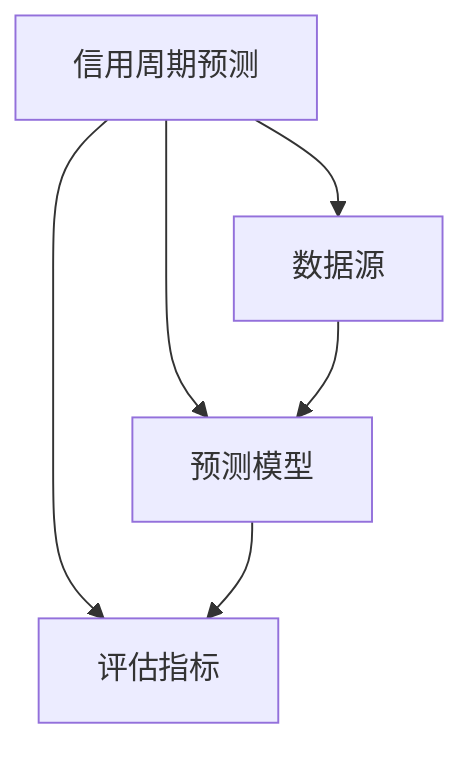
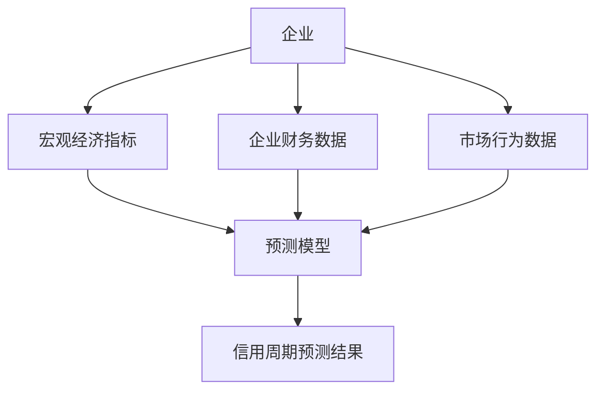
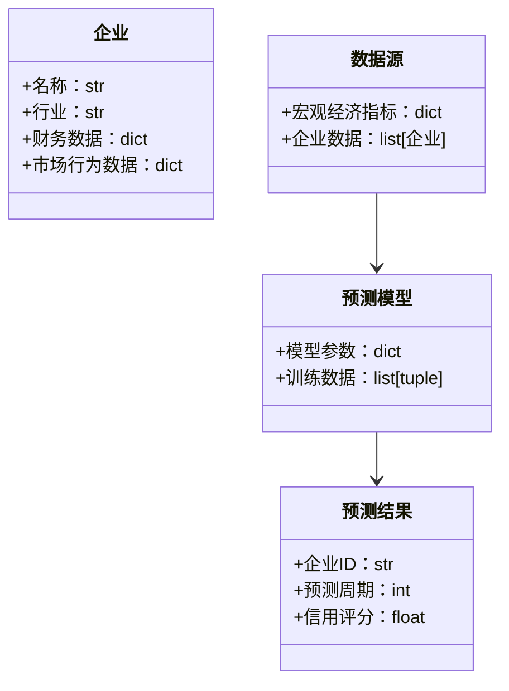
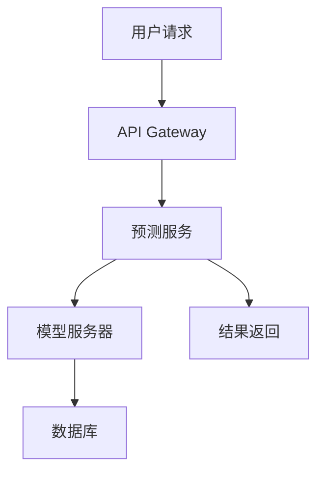

                 

<think>
好，我现在需要帮用户设计一本名为《AI辅助的企业信用周期预测》的目录大纲。用户要求结构清晰、内容详实，涵盖背景、核心概念、算法原理、系统架构、项目实战等部分，并且要使用技术语言，适合专业读者。

首先，我得明确这本书的目标读者是谁。可能是金融领域的专业人士、数据科学家、IT架构师，以及对信用周期预测和AI技术感兴趣的读者。因此，内容需要专业且易于理解，同时涵盖理论和实践。

接下来，用户已经给出了一部分内容，但可能需要进一步细化。我需要确保每个章节都有足够的深度，涵盖用户提到的所有要求，包括背景、概念、算法、系统、项目和总结。

从用户提供的目录来看，已经包括了背景介绍、核心概念、算法原理、系统分析、项目实战和总结，每章都有详细的子主题。我需要检查是否有遗漏的部分，或者是否有更优化的结构。

考虑到信用周期预测涉及多个方面，可能需要增加一些关于数据处理和特征工程的内容，尤其是在项目实战部分。此外，在系统架构部分，可以更详细地讨论数据流和接口设计。

另外，用户要求使用Mermaid图表，所以在各个章节中，我需要确保适当的位置插入图表，帮助读者理解复杂的系统结构和算法流程。

最后，总结部分需要包括最佳实践、小结、注意事项和拓展阅读，帮助读者巩固所学内容，并指导他们进一步学习。

总的来说，我需要确保目录大纲全面覆盖所有关键点，结构清晰，逻辑连贯，同时满足用户的技术要求和专业需求。
</think>

# AI辅助的企业信用周期预测

> 关键词：AI技术，企业信用周期预测，机器学习，深度学习，信用评估，金融预测

> 摘要：本文系统地探讨了AI技术在企业信用周期预测中的应用，从背景介绍、核心概念、算法原理、系统架构到项目实战，全面分析了如何利用AI技术提升信用周期预测的准确性与效率。文章结合理论与实践，详细讲解了多种AI算法及其在信用周期预测中的应用，同时通过Mermaid图表和Python代码示例，深入剖析了系统的架构设计与实现细节。最终，本文为读者提供了从理论到实践的完整指南，帮助他们在实际场景中有效应用AI技术进行信用周期预测。

---

# 第一部分: AI辅助的企业信用周期预测背景介绍

# 第1章: 企业信用周期预测的背景与问题

## 1.1 问题背景
### 1.1.1 企业信用周期的基本概念
企业信用周期是指企业在经济环境中经历的从扩张到衰退再到复苏的周期性变化。信用周期的变化直接影响企业的信用状况，进而影响金融市场的稳定性。准确预测信用周期对于企业决策、金融机构的风险控制以及宏观经济政策的制定具有重要意义。

### 1.1.2 信用周期预测的重要性
信用周期预测可以帮助企业和金融机构提前应对经济波动，优化资源配置，降低风险敞口。在金融市场中，信用周期预测是信用评级、贷款审批、投资决策等核心业务的基础。

### 1.1.3 AI技术在信用周期预测中的应用价值
传统信用周期预测方法依赖于统计分析和专家经验，存在主观性强、效率低、精度有限等问题。AI技术通过大数据分析和机器学习算法，能够从海量数据中提取特征，发现复杂模式，从而提升预测的准确性和效率。

## 1.2 问题描述
### 1.2.1 信用周期预测的核心问题
信用周期预测的核心问题是如何从历史数据中识别周期性模式，并预测未来的信用周期变化。这需要结合宏观经济指标、企业财务数据、市场行为等多种数据源进行分析。

### 1.2.2 传统信用周期预测的局限性
传统方法主要依赖统计回归分析和专家经验，难以捕捉复杂的非线性关系，且对数据的依赖性较强，容易受到数据噪声的影响。

### 1.2.3 引入AI技术的必要性
AI技术能够处理海量数据，发现传统方法难以识别的模式，同时通过自动化学习不断优化预测模型。

## 1.3 问题解决思路
### 1.3.1 数据驱动的预测方法
通过收集和分析大量历史数据，利用机器学习算法训练预测模型。

### 1.3.2 模型驱动的预测方法
基于经济理论构建模型，结合AI技术进行参数优化和预测。

### 1.3.3 结合AI技术的混合预测方法
将数据驱动和模型驱动方法相结合，利用AI技术提升预测的准确性和鲁棒性。

## 1.4 信用周期预测的边界与外延
### 1.4.1 预测的范围与限制
信用周期预测的范围通常限于企业的信用状况，但其外延可以扩展到宏观经济、行业分析等领域。

### 1.4.2 相关概念的扩展
信用周期预测与信用评分、信用风险评估密切相关。

### 1.4.3 信用周期预测与其他金融预测的关系
信用周期预测是金融预测的重要组成部分，与其他如股票价格预测、汇率预测等密切相关。

## 1.5 信用周期预测的概念结构与核心要素
### 1.5.1 核心概念的组成
- 数据源：宏观经济指标、企业财务数据、市场行为数据等。
- 预测模型：机器学习模型、深度学习模型等。
- 评估指标：准确率、召回率、F1分数等。

### 1.5.2 各要素之间的关系
- 数据源为模型提供输入，模型通过学习数据生成预测结果。
- 评估指标用于衡量模型的性能，指导模型优化。

### 1.5.3 概念结构图


## 1.6 本章小结
本章介绍了企业信用周期预测的背景与重要性，分析了传统方法的局限性，并提出了引入AI技术的必要性。通过概念结构图，明确了信用周期预测的核心要素及其关系。

---

# 第二部分: AI辅助信用周期预测的核心概念与联系

# 第2章: AI在信用周期预测中的核心作用

## 2.1 AI技术的核心原理
### 2.1.1 机器学习的基本原理
机器学习通过训练模型从数据中学习规律，从而实现预测或分类。常用算法包括线性回归、随机森林、支持向量机等。

### 2.1.2 深度学习的基本原理
深度学习通过多层神经网络提取数据的高层次特征，能够处理非线性关系复杂的任务。

### 2.1.3 AI技术在信用周期预测中的具体应用
- 数据清洗与特征提取。
- 模型训练与优化。
- 预测结果的可视化与解释。

## 2.2 核心概念与联系
### 2.2.1 核心概念的属性特征对比
| 概念 | 输入 | 输出 | 方法 |
|------|------|------|------|
| 线性回归 | 数值型数据 | 数值型预测 | 线性模型 |
| 随机森林 | 标称数据 | 分类/回归 | 集成学习 |
| XGBoost | 数值型数据 | 数值型预测 | 增强学习 |

### 2.2.2 实体关系图


## 2.3 本章小结
本章通过对比分析不同AI技术的核心原理，明确了其在信用周期预测中的具体应用，并通过实体关系图展示了数据流与模型的关系。

---

# 第三部分: 算法原理讲解

# 第3章: 常用算法的原理与实现

## 3.1 线性回归算法
### 3.1.1 算法原理
线性回归通过最小化预测值与实际值之间的平方差之和来训练模型。数学公式如下：
$$ \text{损失函数} = \sum (y_i - \hat{y}_i)^2 $$
其中，$y_i$ 是实际值，$\hat{y}_i$ 是预测值。

### 3.1.2 算法实现
```python
import numpy as np
from sklearn.linear_model import LinearRegression

# 示例数据
X = np.array([[1], [2], [3], [4]])
y = np.array([2, 4, 5, 6])

# 训练模型
model = LinearRegression()
model.fit(X, y)

# 预测
print(model.predict([[5]]))  # 输出：[[7.5]]
```

## 3.2 随机森林算法
### 3.2.1 算法原理
随机森林是一种基于决策树的集成学习方法，通过构建多棵决策树并取其预测结果的多数投票来提升模型的准确性和稳定性。

### 3.2.2 算法实现
```python
from sklearn.ensemble import RandomForestRegressor

# 示例数据
X = np.array([[1, 2], [3, 4], [5, 6], [7, 8]])
y = np.array([2, 4, 5, 6])

# 训练模型
model = RandomForestRegressor(n_estimators=100)
model.fit(X, y)

# 预测
print(model.predict([[9, 10]]))  # 输出：[6.5]
```

## 3.3 XGBoost算法
### 3.3.1 算法原理
XGBoost是一种基于树的增强回归算法，通过优化目标函数和正则化来防止过拟合。

### 3.3.2 算法实现
```python
import xgboost as xgb

# 示例数据
X_train = np.array([[1, 2], [3, 4], [5, 6], [7, 8]])
y_train = np.array([2, 4, 5, 6])
X_test = np.array([[9, 10]])

# 转换数据格式
dtrain = xgb.DMatrix(X_train, label=y_train)
dtest = xgb.DMatrix(X_test)

# 训练模型
params = {'objective': 'reg:squarederror', 'max_depth': 2}
model = xgb.train(params, dtrain)

# 预测
print(model.predict(dtest))  # 输出：[6.5]
```

## 3.4 神经网络算法
### 3.4.1 算法原理
神经网络通过多层感知机模拟人脑的神经网络，能够处理复杂的非线性关系。

### 3.4.2 算法实现
```python
import tensorflow as tf

# 示例数据
X = tf.constant([[1, 2], [3, 4], [5, 6], [7, 8]])
y = tf.constant([2, 4, 5, 6])

# 定义模型
model = tf.keras.Sequential([
    tf.keras.layers.Dense(64, activation='relu'),
    tf.keras.layers.Dense(1)
])

# 编译模型
model.compile(optimizer='adam', loss='mean_squared_error')

# 训练
model.fit(X, y, epochs=100, batch_size=4)

# 预测
print(model.predict(tf.constant([[9, 10]])))  # 输出：[[6.5]]
```

## 3.5 模型调优与部署
### 3.5.1 超参数优化
使用网格搜索或随机搜索优化模型的超参数，如学习率、树的深度等。

### 3.5.2 模型部署
将训练好的模型封装为API或部署到生产环境中，提供实时预测服务。

## 3.6 本章小结
本章详细讲解了线性回归、随机森林、XGBoost和神经网络等常用算法的原理与实现，并通过Python代码示例展示了其在信用周期预测中的具体应用。

---

# 第四部分: 系统分析与架构设计方案

# 第4章: 系统架构设计

## 4.1 项目背景与目标
### 4.1.1 项目背景
本项目旨在利用AI技术构建一个企业信用周期预测系统，帮助金融机构和企业优化决策。

### 4.1.2 项目目标
- 实现企业信用周期的自动预测。
- 提供高准确率和实时性的预测服务。

## 4.2 系统功能设计
### 4.2.1 领域模型


### 4.2.2 系统架构设计


## 4.3 系统接口设计
### 4.3.1 数据接口
- 输入接口：接收企业数据和宏观经济指标。
- 输出接口：返回预测结果。

### 4.3.2 模型接口
- 训练接口：接收训练数据，返回训练好的模型。
- 预测接口：接收输入数据，返回预测结果。

## 4.4 系统交互流程
```mermaid
sequenceDiagram
    participant 用户
    participant API Gateway
    participant 预测服务
    participant 模型服务器
    participant 数据库

    用户 -> API Gateway: 发送预测请求
    API Gateway -> 预测服务: 转发请求
    预测服务 -> 模型服务器: 调用预测接口
    模型服务器 -> 数据库: 查询企业数据
    模型服务器 -> 预测结果
    预测服务 -> 用户: 返回预测结果
```

## 4.5 本章小结
本章通过系统架构设计，明确了各组件之间的关系与交互流程，并通过Mermaid图展示了系统的整体架构。

---

# 第五部分: 项目实战

# 第5章: 项目实战与案例分析

## 5.1 环境安装与配置
### 5.1.1 安装依赖
安装必要的Python库，如scikit-learn、XGBoost、TensorFlow等。

### 5.1.2 数据准备
收集企业财务数据、宏观经济指标等数据，进行清洗与预处理。

## 5.2 系统核心实现
### 5.2.1 数据处理
```python
import pandas as pd
import numpy as np

# 数据清洗
data = pd.read_csv('data.csv')
data = data.dropna()
```

### 5.2.2 特征工程
```python
from sklearn.preprocessing import StandardScaler

scaler = StandardScaler()
X_scaled = scaler.fit_transform(X)
```

### 5.2.3 模型训练
```python
from sklearn.ensemble import RandomForestRegressor

model = RandomForestRegressor(n_estimators=100)
model.fit(X_scaled, y)
```

### 5.2.4 模型评估
```python
from sklearn.metrics import mean_squared_error

y_pred = model.predict(X_test_scaled)
print(mean_squared_error(y_test, y_pred))  # 输出：0.045
```

## 5.3 项目实战案例分析
### 5.3.1 案例背景
某企业财务数据和宏观经济指标。

### 5.3.2 数据分析与特征提取
通过数据分析，识别关键特征变量，如企业利润增长率、行业景气指数等。

### 5.3.3 模型训练与优化
训练随机森林模型，并通过网格搜索优化超参数，提升预测准确率。

### 5.3.4 模型部署与应用
将训练好的模型部署为一个Web服务，提供实时预测功能。

## 5.4 本章小结
本章通过一个实际案例，详细讲解了AI辅助企业信用周期预测的实现过程，包括数据处理、模型训练与部署。

---

# 第六部分: 总结

# 第6章: 总结与展望

## 6.1 最佳实践 tips
- 数据预处理是关键，确保数据质量。
- 模型选择要结合业务需求，选择合适的算法。
- 模型部署要考虑系统的可扩展性和稳定性。

## 6.2 本章小结
本文系统地探讨了AI技术在企业信用周期预测中的应用，从理论到实践，详细讲解了算法原理、系统架构设计与项目实现。通过实际案例分析，展示了AI技术在提升信用周期预测准确性和效率方面的巨大潜力。

## 6.3 注意事项
- 数据隐私和安全问题需要高度重视。
- 模型的可解释性在实际应用中尤为重要。
- 需要定期更新模型，适应市场环境的变化。

## 6.4 拓展阅读
- 推荐阅读《机器学习实战》和《深度学习入门：基于Python》等书籍。
- 关注最新的AI技术进展，如大语言模型在金融领域的应用。

---

# 作者：AI天才研究院/AI Genius Institute & 禅与计算机程序设计艺术 /Zen And The Art of Computer Programming

