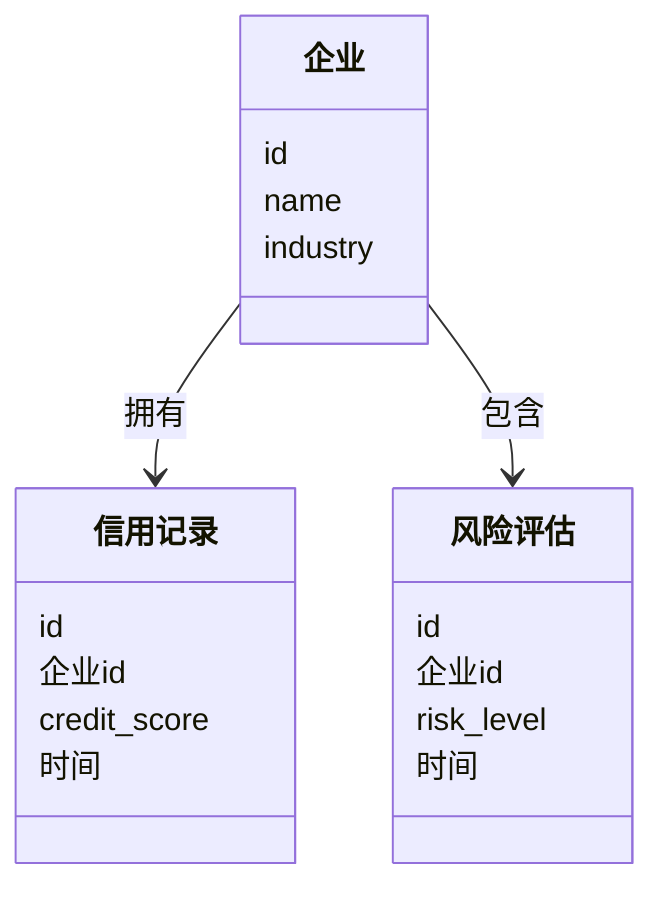
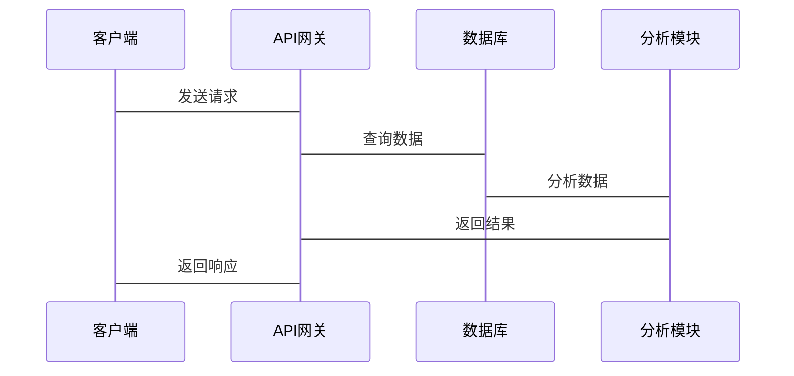

                 


# AI辅助的企业信用周期预测与风险管理

> 关键词：AI, 企业信用周期, 风险管理, 信用预测, AI算法

> 摘要：本文系统地探讨了AI在企业信用周期预测与风险管理中的应用，从背景、核心概念到算法原理、系统设计，再到项目实战，全面分析了AI如何辅助企业进行信用周期预测与风险管理。通过实际案例分析和详细的技术解读，本文为读者提供了一套完整的解决方案，帮助企业在复杂多变的经济环境中做出更明智的决策。

---

# 第1章: 企业信用周期预测与风险管理概述

## 1.1 问题背景与描述

### 1.1.1 企业信用周期的核心问题
企业信用周期是指企业在经济活动中，从获得信用到信用到期、信用违约或信用修复的整个过程。信用周期的核心问题在于预测企业信用状况的变化，从而帮助企业及时调整经营策略，降低风险。

### 1.1.2 信用周期预测的难点与挑战
信用周期预测的难点在于数据的复杂性、模型的准确性以及实时性要求。企业信用数据涉及多维度的金融指标，如财务报表、市场表现、行业趋势等，如何有效整合这些数据并构建高效的预测模型是一个挑战。

### 1.1.3 风险管理在企业信用周期中的重要性
风险管理是信用周期预测的核心目标。通过预测信用周期的变化，企业可以提前识别潜在风险，采取相应的措施，如调整贷款政策、优化供应链管理等，从而降低损失。

## 1.2 核心概念与定义

### 1.2.1 企业信用周期的定义
企业信用周期是指企业在经济活动中，从获得信用到信用到期、信用违约或信用修复的整个过程。信用周期的变化受到宏观经济环境、企业经营状况、行业趋势等多种因素的影响。

### 1.2.2 风险管理的定义与目标
风险管理是指通过识别、评估和应对各种风险，以降低风险对企业和利益相关者的影响。风险管理的目标是确保企业在面对不确定性和风险时能够保持稳定和可持续发展。

### 1.2.3 AI在信用周期预测中的作用
AI通过机器学习算法，可以从海量数据中提取特征，构建预测模型，帮助企业更准确地预测信用周期的变化。AI还可以实时监控企业的信用状况，提供动态的风险评估和管理建议。

## 1.3 当前技术与应用现状

### 1.3.1 传统信用评估方法的局限性
传统的信用评估方法主要依赖于财务指标和历史数据，具有数据维度有限、模型泛化能力差、预测精度低等局限性。此外，传统方法难以实时更新，无法应对快速变化的市场环境。

### 1.3.2 AI技术在信用评估中的应用现状
近年来，AI技术在信用评估中的应用逐渐增多。基于机器学习的算法，如逻辑回归、支持向量机、随机森林等，已经在信用评分、违约预测等领域取得了显著成果。然而，AI算法的可解释性问题仍然存在，限制了其在金融领域的广泛应用。

### 1.3.3 企业信用周期预测的行业痛点
企业信用周期预测的行业痛点主要包括数据获取难度大、模型泛化能力不足、实时性要求高、风险控制复杂等。这些问题需要结合AI技术和金融专业知识才能有效解决。

---

# 第2章: 企业信用周期预测的核心概念与联系

## 2.1 核心概念的理论基础

### 2.1.1 信用周期的数学模型
信用周期的数学模型通常包括时间序列分析、回归分析等方法。通过这些方法，可以将企业的信用状况与宏观经济指标、行业趋势等变量联系起来，构建预测模型。

### 2.1.2 风险管理的基本原理
风险管理的基本原理包括风险识别、风险评估、风险应对和风险监控。通过这些步骤，企业可以系统地管理信用周期中的各种风险。

### 2.1.3 AI算法在信用预测中的应用
AI算法在信用预测中的应用主要体现在特征提取、模型训练和预测评估等方面。机器学习算法可以通过对企业信用数据的深度学习，提取出影响信用周期的关键特征，从而提高预测的准确性。

## 2.2 核心概念的属性对比

### 2.2.1 信用周期与经济周期的对比
信用周期与经济周期密切相关。经济周期的波动会直接影响企业的信用状况。例如，在经济衰退时期，企业的违约率通常会增加。

### 2.2.2 不同信用评估模型的优缺点对比
不同信用评估模型的优缺点对比如下：

| 模型名称       | 优点                           | 缺点                           |
|----------------|--------------------------------|--------------------------------|
| 逻辑回归       | 解释性强，适合线性关系         | 非线性关系表现较差             |
| 支持向量机     | 对小样本数据表现好             | 对大样本数据计算复杂           |
| 随机森林       | 鲁棒性高，适合复杂数据         | 解释性较差                     |

### 2.2.3 AI算法在信用预测中的性能对比
AI算法在信用预测中的性能对比如下：

| 算法名称       | 准确率   | 训练速度 | 可解释性 |
|----------------|----------|----------|----------|
| 逻辑回归       | 75%      | 快       | 高       |
| 支持向量机     | 85%      | 较慢     | 中       |
| 随机森林       | 88%      | 较慢     | 低       |

## 2.3 ER实体关系图架构

```mermaid
er
    entity 企业 (id, name, industry)
    entity 信用记录 (id, 企业id, credit_score, 时间)
    entity 风险评估 (id, 企业id, risk_level, 时间)
    relation 企业 -> 信用记录: 拥有
    relation 企业 -> 风险评估: 包含
```

---

# 第3章: 常见AI算法在信用预测中的应用

## 3.1 逻辑回归算法

### 3.1.1 逻辑回归的基本原理
逻辑回归是一种用于分类的统计方法，通过构建一个线性回归模型，将输入特征映射到0到1之间的概率值，从而实现分类。

### 3.1.2 逻辑回归在信用预测中的应用
在信用预测中，逻辑回归可以用于预测企业违约的概率。通过对企业财务数据、市场数据等特征的分析，构建逻辑回归模型，预测企业违约的可能性。

### 3.1.3 逻辑回归的优缺点
逻辑回归的优点是解释性强，适合线性关系；缺点是非线性关系表现较差，且容易受到数据分布的影响。

## 3.2 支持向量机算法

### 3.2.1 支持向量机的基本原理
支持向量机是一种监督学习算法，通过找到一个超平面，将数据分为两类。支持向量机适用于小样本数据，且在高维空间中表现良好。

### 3.2.2 支持向量机在信用预测中的应用
支持向量机可以用于信用评分，通过对企业信用数据的分类，预测企业的信用状况。

### 3.2.3 支持向量机的优缺点
支持向量机的优点是对小样本数据表现好；缺点是对大样本数据计算复杂，且对参数敏感。

---

# 第4章: 企业信用周期预测的系统分析与架构设计

## 4.1 系统功能设计

### 4.1.1 领域模型设计
以下是领域模型的Mermaid图：



### 4.1.2 系统架构设计
以下是系统架构的Mermaid图：


### 4.1.3 系统接口设计
系统接口设计包括以下几个步骤：

1. 定义API接口。
2. 实现API接口的前后端交互。
3. 测试API接口的功能。

### 4.1.4 系统交互设计
以下是系统交互的Mermaid图：



---

# 第5章: AI辅助信用周期预测的项目实战

## 5.1 环境安装

### 5.1.1 安装Python
安装Python 3.8或更高版本。

### 5.1.2 安装相关库
安装以下Python库：
- pandas
- numpy
- scikit-learn
- mermaid

## 5.2 系统核心实现

### 5.2.1 逻辑回归实现
以下是逻辑回归的Python代码：

```python
from sklearn.linear_model import LogisticRegression
from sklearn.metrics import accuracy_score

# 训练模型
model = LogisticRegression()
model.fit(X_train, y_train)

# 预测
y_pred = model.predict(X_test)

# 计算准确率
print(accuracy_score(y_test, y_pred))
```

### 5.2.2 支持向量机实现
以下是支持向量机的Python代码：

```python
from sklearn.svm import SVC

# 训练模型
model = SVC()
model.fit(X_train, y_train)

# 预测
y_pred = model.predict(X_test)

# 计算准确率
print(accuracy_score(y_test, y_pred))
```

## 5.3 实际案例分析

### 5.3.1 数据准备
以下是数据准备的步骤：

1. 数据清洗。
2. 数据特征提取。
3. 数据分割。

### 5.3.2 模型训练
模型训练包括以下几个步骤：

1. 选择算法。
2. 数据预处理。
3. 模型训练。

### 5.3.3 模型评估
模型评估包括以下几个步骤：

1. 模型准确率计算。
2. 模型召回率计算。
3. 模型F1分数计算。

---

# 第6章: 总结与展望

## 6.1 本书内容总结

### 6.1.1 核心内容回顾
本书主要探讨了AI在企业信用周期预测与风险管理中的应用，从背景、核心概念到算法原理、系统设计，再到项目实战，全面分析了AI如何辅助企业进行信用周期预测与风险管理。

### 6.1.2 最佳实践 tips
1. 数据清洗和特征提取是模型训练的关键步骤。
2. 算法选择应根据数据规模和特征复杂度进行调整。
3. 模型评估应结合准确率、召回率和F1分数等指标。

## 6.2 未来发展趋势与展望

### 6.2.1 AI在信用周期预测中的未来趋势
AI技术在信用周期预测中的未来趋势包括深度学习算法的应用、实时预测能力的提升、模型解释性问题的解决等。

### 6.2.2 企业信用周期预测的挑战与机遇
企业信用周期预测的挑战主要在于数据获取难度大、模型泛化能力不足、实时性要求高等。然而，AI技术的发展为企业信用周期预测提供了新的机遇。

## 6.3 小结

通过本书的学习，读者可以全面了解AI在企业信用周期预测与风险管理中的应用，掌握相关算法和系统设计的方法。希望本书能够为读者在实际工作中提供有价值的参考和指导。

---

作者：AI天才研究院/AI Genius Institute & 禅与计算机程序设计艺术/Zen And The Art of Computer Programming

