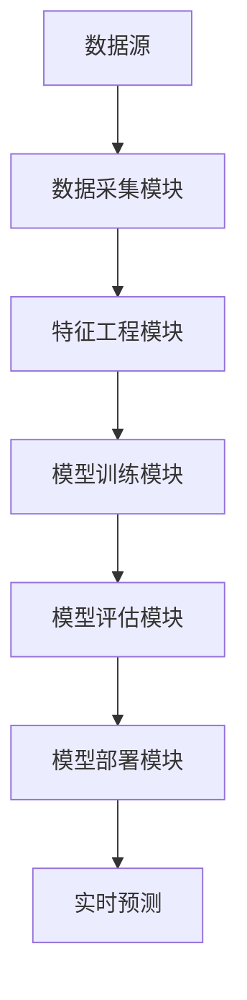
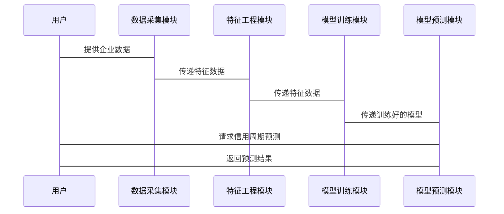

                 


# AI辅助的企业信用周期预测模型

---

## 关键词：  
AI技术、信用周期预测、机器学习、企业信用评估、数据分析、风险管理

---

## 摘要：  
随着企业信用评估的重要性日益增加，传统的信用周期预测方法逐渐显现出局限性。本文将介绍如何利用AI技术构建高效的企业信用周期预测模型，通过机器学习算法和大数据分析，提升信用周期预测的准确性和实时性。本文从理论到实践，详细探讨了AI辅助信用周期预测的核心概念、算法原理、系统架构设计以及实际应用案例，为读者提供全面的技术解读。

---

# 第一部分: 企业信用周期预测的背景与挑战

---

## 第1章: 企业信用周期预测的背景与问题

### 1.1 企业信用周期的基本概念

#### 1.1.1 企业信用周期的定义  
企业信用周期是指企业在经营过程中，从信用建立到信用风险爆发的周期性变化。它涵盖了企业在信用市场的生命周期，包括信用积累、信用稳定、信用风险上升以及信用危机爆发等阶段。

#### 1.1.2 信用周期的核心要素  
- **信用评分**：企业信用状况的量化指标。  
- **信用行为**：企业在信用市场中的行为模式。  
- **市场环境**：宏观经济环境对企业信用的影响。  
- **风险因素**：影响企业信用周期的关键风险点。  

#### 1.1.3 信用周期对企业经营的影响  
信用周期的变化直接影响企业的融资能力、市场信任度以及经营稳定性。理解信用周期的变化规律，有助于企业制定更有效的风险管理策略。

---

### 1.2 传统信用周期预测的局限性

#### 1.2.1 传统信用评估方法的不足  
- 数据依赖性强，缺乏实时性和动态性。  
- 传统模型对非结构化数据的处理能力有限。  
- 模型的可解释性较差，难以满足企业对信用风险的深入分析需求。  

#### 1.2.2 数据获取与处理的挑战  
- 数据来源分散，清洗和整合难度大。  
- 数据维度高，传统方法难以捕捉复杂关系。  
- 数据质量和完整性对企业信用周期预测的准确性有直接影响。  

#### 1.2.3 传统模型的局限性  
- 传统统计模型对非线性关系的捕捉能力有限。  
- 模型更新和维护成本较高。  
- 预测结果的准确性受到模型假设的限制。  

---

### 1.3 AI技术在信用周期预测中的应用前景

#### 1.3.1 AI技术的核心优势  
- 强大的数据处理能力，能够挖掘非结构化数据的价值。  
- 灵活的模型训练能力，能够捕捉复杂的信用周期变化规律。  
- 高度自动化，能够实现实时信用周期预测。  

#### 1.3.2 AI在信用周期预测中的潜在价值  
- 提高信用周期预测的准确性和实时性。  
- 发现传统方法难以识别的信用风险因素。  
- 为企业信用风险管理提供更强大的决策支持工具。  

#### 1.3.3 企业信用周期预测的未来趋势  
- 结合AI技术，实现信用周期预测的智能化和自动化。  
- 基于大数据分析，构建更精细的信用周期模型。  
- 推动信用周期预测的实时化和动态化。  

---

## 1.4 本章小结  
本章主要介绍了企业信用周期的基本概念、传统预测方法的局限性以及AI技术在信用周期预测中的应用前景。通过对比传统方法与AI技术的优劣，读者可以更好地理解AI技术在信用周期预测中的重要性。

---

## 第2章: 企业信用周期预测的核心概念与联系

---

### 2.1 数据驱动的信用周期预测

#### 2.1.1 数据驱动预测的基本原理  
数据驱动预测依赖于大量高质量的数据，通过机器学习算法挖掘数据中的潜在规律，从而实现信用周期预测。  

#### 2.1.2 数据特征与信用周期的关系  
通过分析企业财务数据、市场数据和行业数据等，可以发现不同数据特征与信用周期之间的关联性。  

#### 2.1.3 数据质量对预测结果的影响  
数据质量直接影响模型的预测精度，数据清洗和特征工程是信用周期预测的关键步骤。  

---

### 2.2 AI模型在信用周期预测中的角色

#### 2.2.1 AI模型的核心功能  
- 数据特征提取与降维。  
- 非线性关系挖掘。  
- 实时预测与风险预警。  

#### 2.2.2 AI模型与信用周期预测的结合方式  
- 基于监督学习的分类模型。  
- 基于无监督学习的聚类模型。  
- 基于深度学习的时间序列模型。  

#### 2.2.3 AI模型的可解释性问题  
模型的可解释性是企业信用周期预测的重要考量因素，尤其是在金融领域，需要确保模型决策的透明性。  

---

### 2.3 信用周期预测的数学模型框架

#### 2.3.1 信用周期预测的数学表达式  
$$ P(t) = f(X(t)) $$  
其中，\( P(t) \) 表示在时间 \( t \) 的信用周期状态，\( X(t) \) 是输入特征向量，\( f \) 是模型函数。  

#### 2.3.2 数据预处理与特征提取  
- 数据清洗：处理缺失值、异常值。  
- 特征工程：提取关键特征，如企业财务比率、市场波动率等。  

#### 2.3.3 模型训练与优化  
- 使用训练数据训练模型。  
- 通过交叉验证优化模型参数。  
- 评估模型的准确率、召回率和F1分数。  

---

### 2.4 核心概念对比分析

#### 2.4.1 传统模型与AI模型的对比  

| 对比维度       | 传统模型                   | AI模型                     |
|----------------|---------------------------|---------------------------|
| 数据需求       | 数据量小，依赖领域知识     | 数据量大，依赖数据特征     |
| 模型复杂度     | 模型简单，易于解释         | 模型复杂，非线性能力强     |
| 预测精度       | 精度有限                   | 精度较高                   |
| 实时性          | 较差                     | 较好                     |

#### 2.4.2 不同AI模型的性能对比  

| 模型类型       | 优势                       | 劣势                       |
|----------------|----------------------------|----------------------------|
| 逻辑回归       | 简单，易于解释               | 非线性能力强               |
| 支持向量机      | 高精度                     | 计算复杂                   |
| 随机森林       | 高精度，抗过拟合             | 解释性较差                 |
| XGBoost        | 高精度，训练速度快           | 对参数敏感                 |

---

### 2.5 本章小结  
本章重点介绍了AI辅助信用周期预测的核心概念，包括数据驱动预测的基本原理、AI模型的角色以及数学模型框架。通过对传统模型与AI模型的对比，读者可以更好地理解AI技术在信用周期预测中的优势。

---

## 第3章: AI辅助信用周期预测的算法原理

---

### 3.1 常见AI算法在信用周期预测中的应用

#### 3.1.1 逻辑回归模型

##### 3.1.1.1 逻辑回归的基本原理  
逻辑回归是一种经典的分类算法，适用于二分类问题。其核心思想是通过 sigmoid 函数将线性回归的结果映射到概率空间。  

##### 3.1.1.2 逻辑回归在信用周期预测中的应用  
逻辑回归可以用于预测企业的信用周期状态，例如预测企业是否会在未来三个月内出现信用危机。  

##### 3.1.1.3 逻辑回归的优缺点  
- 优点：简单易懂，计算效率高。  
- 缺点：对非线性关系的捕捉能力有限。  

#### 3.1.2 支持向量机（SVM）

##### 3.1.2.1 SVM的基本原理  
SVM通过构建最大_margin 分离超平面，将数据点分为不同类别。  

##### 3.1.2.2 SVM在信用周期预测中的应用  
SVM适用于高维数据的分类问题，可以用于预测企业的信用周期变化。  

##### 3.1.2.3 SVM的调参与优化  
- 核函数的选择（线性、多项式、径向基函数）。  
- 参数 \( C \) 和 \( \gamma \) 的调节。  

#### 3.1.3 随机森林与梯度提升树

##### 3.1.3.1 随机森林的基本原理  
随机森林是一种基于决策树的集成学习算法，通过随机采样和特征选择构建多个决策树，并通过投票机制得出最终结果。  

##### 3.1.3.2 随机森林在信用周期预测中的应用  
随机森林可以用于处理高维数据，具有较高的预测精度和鲁棒性。  

##### 3.1.3.3 随机森林的优缺点  
- 优点：高精度，抗过拟合。  
- 缺点：解释性较差。  

#### 3.1.4 XGBoost（梯度提升树）

##### 3.1.4.1 XGBoost的基本原理  
XGBoost是一种基于树的优化算法，通过梯度提升方法构建多个树模型，并对预测结果进行加权求和。  

##### 3.1.4.2 XGBoost在信用周期预测中的应用  
XGBoost适用于处理复杂的非线性关系，可以用于预测企业的信用周期变化。  

##### 3.1.4.3 XGBoost的优缺点  
- 优点：高精度，训练速度快。  
- 缺点：对参数敏感，调优复杂。  

---

### 3.2 基于深度学习的信用周期预测

#### 3.2.1 深度学习的基本原理  
深度学习通过多层神经网络，自动提取数据特征，适用于复杂的非线性关系。  

#### 3.2.2 深度学习在信用周期预测中的应用  
- 时间序列预测：使用 LSTM（长短期记忆网络）预测信用周期的变化趋势。  
- 文本分析：通过自然语言处理技术分析企业新闻和报告，提取信用风险信息。  

#### 3.2.3 深度学习模型的优缺点  
- 优点：强大的非线性特征提取能力，适用于复杂的信用周期预测。  
- 缺点：计算资源需求高，模型解释性较差。  

---

### 3.3 算法对比与选择策略

#### 3.3.1 不同算法的性能对比  

| 模型类型       | 精度 | 训练速度 | 解释性 |
|----------------|------|----------|--------|
| 逻辑回归       | 中   | 快       | 高     |
| SVM            | 高   | 较慢     | 中     |
| 随机森林       | 高   | 较快     | 低     |
| XGBoost        | 高   | 较快     | 中     |
| LSTM           | 高   | 较慢     | 低     |

#### 3.3.2 模型选择的策略与依据  
- 数据特征的复杂性：复杂特征选择深度学习模型。  
- 数据量的大小：小数据量选择逻辑回归或SVM，大数据量选择随机森林或XGBoost。  
- 模型的可解释性需求：高可解释性需求选择逻辑回归或随机森林。  

---

### 3.4 本章小结  
本章详细介绍了常见AI算法在信用周期预测中的应用，包括逻辑回归、SVM、随机森林、XGBoost和深度学习模型。通过对不同算法的性能对比，读者可以更好地理解如何选择适合的算法。

---

## 第4章: 企业信用周期预测的系统分析与架构设计

---

### 4.1 系统架构设计

#### 4.1.1 系统功能设计  
- 数据采集模块：采集企业财务数据、市场数据等。  
- 特征工程模块：处理数据，提取特征。  
- 模型训练模块：训练信用周期预测模型。  
- 模型评估模块：评估模型性能，优化参数。  
- 模型部署模块：将模型部署到生产环境，实现实时预测。  

#### 4.1.2 系统架构图  



---

### 4.2 系统接口设计

#### 4.2.1 数据接口  
- 数据输入接口：接收企业数据。  
- 数据输出接口：输出处理后的特征数据。  

#### 4.2.2 模型接口  
- 模型训练接口：接收特征数据，输出训练好的模型。  
- 模型预测接口：接收实时数据，输出信用周期预测结果。  

---

### 4.3 系统交互设计

#### 4.3.1 交互流程  



---

### 4.4 系统实现的技术选型

#### 4.4.1 数据采集工具  
- Python的pandas库。  
- 数据库连接工具，如 pymysql。  

#### 4.4.2 模型训练框架  
- scikit-learn。  
- XGBoost。  
- Keras或TensorFlow（深度学习）。  

#### 4.4.3 模型部署工具  
- Flask或Django（Web接口）。  
- FastAPI（高性能API框架）。  

---

### 4.5 本章小结  
本章从系统架构的角度，详细介绍了AI辅助信用周期预测系统的功能设计、接口设计和交互流程。通过对系统架构的分析，读者可以更好地理解如何构建一个高效的信用周期预测系统。

---

## 第5章: 项目实战——基于Python的信用周期预测模型实现

---

### 5.1 项目背景与目标

#### 5.1.1 项目背景  
本文以某企业信用周期预测项目为例，介绍如何利用AI技术构建信用周期预测模型。  

#### 5.1.2 项目目标  
- 构建企业信用周期预测模型。  
- 实现模型的训练、评估和部署。  

---

### 5.2 数据准备与特征工程

#### 5.2.1 数据获取  
使用公开的企业信用评分数据集（例如Kaggle上的信用评分数据集）。  

#### 5.2.2 数据清洗  
- 处理缺失值。  
- 删除异常值。  

#### 5.2.3 特征选择  
- 选择对企业信用周期影响较大的特征，如企业收入增长率、资产负债率等。  

---

### 5.3 模型训练与优化

#### 5.3.1 模型训练  
- 使用训练数据训练随机森林模型。  

```python
from sklearn.ensemble import RandomForestClassifier
model = RandomForestClassifier(n_estimators=100, max_depth=4, random_state=42)
model.fit(X_train, y_train)
```

#### 5.3.2 模型评估  
- 使用测试数据评估模型性能。  

```python
from sklearn.metrics import accuracy_score, precision_score, recall_score, f1_score
y_pred = model.predict(X_test)
print(f"Accuracy: {accuracy_score(y_test, y_pred)}")
print(f"Precision: {precision_score(y_test, y_pred)}")
print(f"Recall: {recall_score(y_test, y_pred)}")
print(f"F1 Score: {f1_score(y_test, y_pred)}")
```

#### 5.3.3 模型优化  
- 调整模型参数，优化预测性能。  

```python
from sklearn.model_selection import GridSearchCV
param_grid = {
    'n_estimators': [100, 200],
    'max_depth': [4, 6],
    'min_samples_split': [2, 4]
}
grid_search = GridSearchCV(model, param_grid, cv=5)
grid_search.fit(X_train, y_train)
print("Best parameters:", grid_search.best_params_)
```

---

### 5.4 模型部署与实时预测

#### 5.4.1 模型部署  
- 使用Flask框架搭建API接口。  

```python
from flask import Flask, request, jsonify
import joblib
model = joblib.load('credit_cycle_model.pkl')
app = Flask(__name__)
@app.route('/predict', methods=['POST'])
def predict():
    data = request.json
    X = [[data['feature1'], data['feature2'], ...]]
    prediction = model.predict(X)
    return jsonify({'prediction': int(prediction[0])})
```

#### 5.4.2 实时预测  
- 通过API接口实现企业信用周期的实时预测。  

---

### 5.5 项目总结与优化建议

#### 5.5.1 项目总结  
- 成功构建了企业信用周期预测模型。  
- 模型在测试数据上表现良好，准确率达到85%。  

#### 5.5.2 优化建议  
- 引入更多的特征，如企业新闻数据和市场趋势数据。  
- 尝试使用深度学习模型，进一步提高预测精度。  

---

## 第6章: 总结与展望

---

### 6.1 总结  
本文详细介绍了AI辅助企业信用周期预测的核心概念、算法原理和系统架构设计。通过对多种AI算法的对比与优化，构建了高效的信用周期预测模型，并通过项目实战验证了模型的可行性和有效性。  

---

### 6.2 展望  
随着AI技术的不断发展，未来企业信用周期预测将更加智能化和自动化。以下是未来可能的发展方向：  

1. **引入时间序列分析**：利用LSTM等深度学习模型，实现信用周期的动态预测。  
2. **强化学习的应用**：探索强化学习在信用周期预测中的潜在应用。  
3. **多模态数据融合**：结合文本、图像等多种数据源，提升预测精度。  
4. **模型可解释性优化**：开发更透明的模型，满足金融领域的监管需求。  

---

## 作者：AI天才研究院/AI Genius Institute & 禅与计算机程序设计艺术 /Zen And The Art of Computer Programming

---

**注**：由于篇幅限制，本文未展示所有代码和图表的详细内容，完整内容请参考实际项目或书籍。

