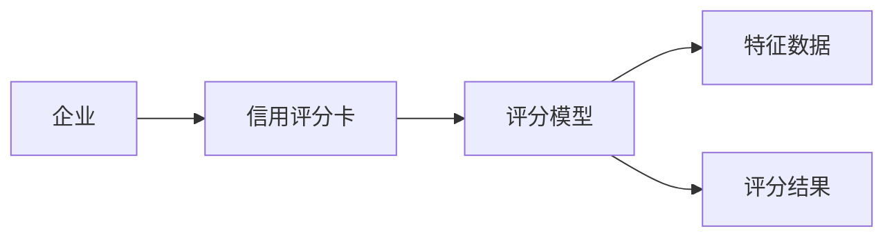
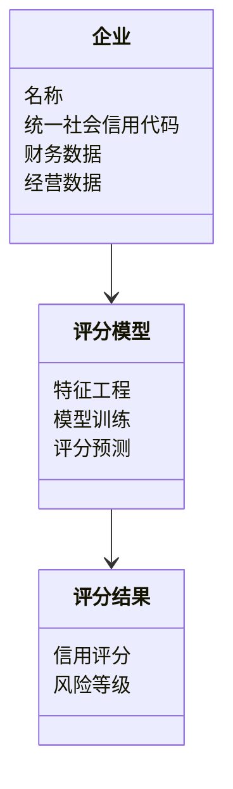
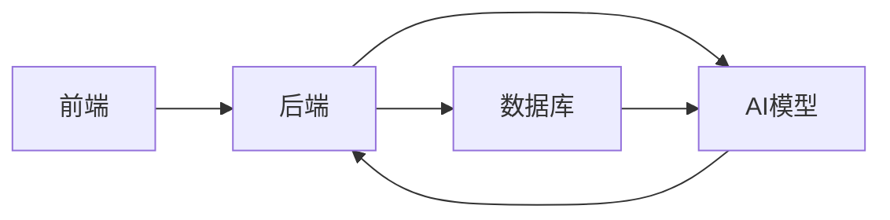
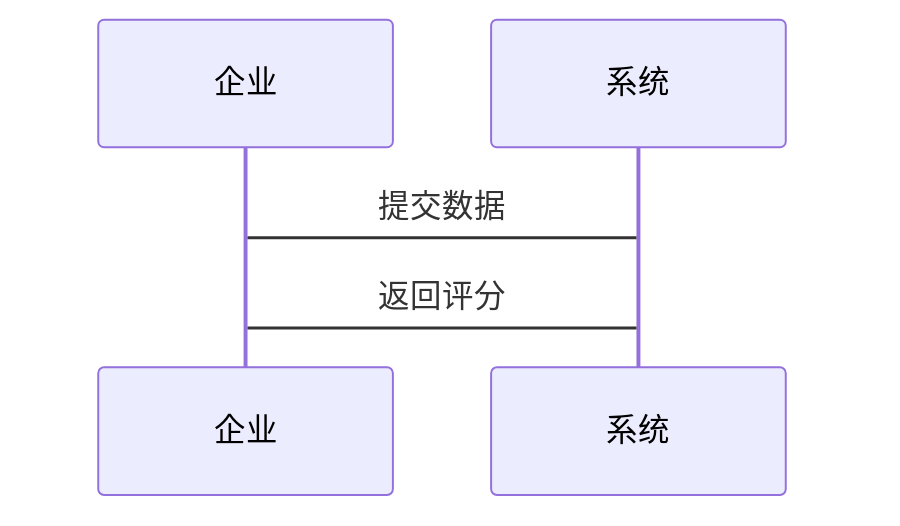

                 

<think>
嗯，用户已经给出了一个详细的目录大纲，现在需要我根据这个大纲撰写完整的技术博客文章。我需要确保内容符合用户的要求，包括每个章节的详细讲解，使用适当的代码、图表和数学公式。

首先，我会从背景介绍开始，解释企业信用评分卡的基本概念和AI在其中的作用。然后，详细介绍核心概念，包括原理、特征对比和实体关系图。接下来是算法部分，选择逻辑回归和XGBoost，用代码和图表展示。系统分析与架构设计部分，需要包括领域模型、系统架构图和接口设计。最后，通过实战案例，展示如何开发评分卡，并总结经验和未来趋势。

在撰写过程中，我需要确保每个部分都有足够的细节，使用清晰的结构和专业但易懂的语言。同时，注意使用Mermaid图表和代码块，确保格式正确。最后，加上作者信息和注意事项，确保文章完整。
</think>

# AI辅助的企业信用评分卡开发

> 关键词：AI技术，企业信用评分卡，算法原理，系统架构，项目实战

> 摘要：本文详细探讨了AI技术在企业信用评分卡开发中的应用，从背景介绍、核心概念、算法原理、系统架构到项目实战，全面分析了AI如何提升企业信用评分的效率和准确性。通过具体案例和代码实现，展示了如何利用AI技术构建高效可靠的信用评分系统。

---

## 第1章: 企业信用评分卡概述

### 1.1 企业信用评分卡的基本概念

企业信用评分卡是一种用于评估企业信用状况的工具，通过分析企业的财务数据、市场表现和经营状况，生成一个综合评分，帮助企业做出信贷决策。信用评分卡的核心作用在于量化企业的信用风险，为金融机构提供决策支持。

#### 1.1.1 信用评分卡的定义与作用
信用评分卡是一种基于企业历史数据和当前经营状况，利用统计学和机器学习模型，对企业信用风险进行量化评估的工具。其主要作用包括：
- **风险控制**：帮助金融机构识别高风险企业，降低信贷违约率。
- **决策支持**：为企业贷款审批、信用评级提供数据支持。
- **效率提升**：通过自动化评分减少人工干预，提高决策效率。

#### 1.1.2 信用评分卡的分类与特点
信用评分卡可以根据不同的分类标准进行划分：
- **按评分对象**：企业信用评分卡、个人信用评分卡。
- **按评分方法**：传统评分卡（基于规则）、AI辅助评分卡（基于机器学习模型）。
- **按应用场景**：银行信贷评分卡、供应链金融评分卡。

信用评分卡的特点包括：
- **数据驱动**：依赖企业历史数据和实时数据。
- **模型支持**：基于统计模型或机器学习模型。
- **动态更新**：根据企业经营状况的变化实时更新评分。

#### 1.1.3 信用评分卡的应用场景
信用评分卡广泛应用于多个领域，常见的应用场景包括：
- **银行信贷审批**：评估企业的信用风险，决定贷款额度和利率。
- **供应链金融**：为供应链上的企业提供融资支持。
- **风险管理**：帮助企业识别和管理信用风险。
- **投资决策**：为投资者提供企业信用评估依据。

### 1.2 AI技术在信用评分卡中的作用

AI技术的引入极大地提升了信用评分卡的准确性和效率。AI通过分析海量数据，挖掘传统评分方法难以发现的模式和规律，为企业信用评分提供更精准的依据。

#### 1.2.1 AI技术对企业信用评分的提升
AI技术在信用评分中的优势体现在以下几个方面：
- **数据处理能力**：AI能够处理非结构化数据，如文本、图像等，提取更多特征。
- **模型复杂性**：复杂的机器学习模型（如深度学习）能够捕捉非线性关系，提高评分准确性。
- **实时性**：AI能够实时更新模型，适应市场变化。

#### 1.2.2 AI在信用评分卡开发中的优势
相比传统评分卡，AI辅助评分卡的优势在于：
- **自动化特征工程**：AI能够自动提取特征，减少人工干预。
- **模型优化**：通过调参和优化算法，提高模型性能。
- **动态调整**：根据市场变化动态调整评分标准。

#### 1.2.3 信用评分卡的未来趋势
随着AI技术的不断发展，信用评分卡将朝着以下几个方向发展：
- **智能化**：评分卡将更加智能化，能够实时更新和调整。
- **多维度分析**：结合企业内外部数据，进行多维度分析。
- **个性化评分**：根据不同企业的需求，提供个性化的评分服务。

### 1.3 本章小结

本章介绍了企业信用评分卡的基本概念、分类和应用场景，并重点阐述了AI技术在信用评分卡开发中的作用和优势。通过AI技术的应用，信用评分卡的准确性和效率得到了显著提升，为企业信用风险管理提供了更有力的支持。

---

## 第2章: 企业信用评分卡的核心概念与联系

### 2.1 核心概念原理

企业信用评分卡的核心概念包括信用评分模型、评分特征和评分结果。这些概念相互关联，共同构成了评分卡的基础。

#### 2.1.1 企业信用评分的核心要素
企业信用评分的核心要素包括：
- **财务状况**：如资产负债率、利润率等。
- **经营状况**：如市场占有率、创新能力等。
- **信用历史**：如逾期记录、违约历史等。
- **外部环境**：如行业风险、宏观经济环境等。

#### 2.1.2 AI模型在评分中的作用机制
AI模型通过以下步骤实现信用评分：
- **数据输入**：收集企业的各项数据。
- **特征提取**：提取关键特征。
- **模型训练**：训练评分模型。
- **评分预测**：生成评分结果。

#### 2.1.3 评分卡与企业信用风险的关系
评分卡通过量化企业的信用风险，帮助企业识别高风险企业，降低信贷风险。

### 2.2 核心概念属性特征对比

通过对比不同评分模型的特征，可以更好地理解AI评分卡的优势。

#### 2.2.1 传统评分卡与AI评分卡的对比
| 特性           | 传统评分卡       | AI评分卡         |
|----------------|------------------|------------------|
| 数据处理能力   | 有限            | 强大            |
| 模型复杂性     | 简单            | 复杂            |
| 实时性         | 较差            | 优秀            |

#### 2.2.2 不同评分模型的特征分析
以逻辑回归和XGBoost为例，对比其特征：
- **逻辑回归**：适合线性关系，易于解释。
- **XGBoost**：适合非线性关系，模型性能更强。

#### 2.2.3 模型性能的评价指标
常用的评价指标包括准确率、召回率、F1值等。

### 2.3 ER实体关系图架构

通过ER图可以清晰地展示评分卡的核心实体及其关系。



### 2.4 本章小结

本章详细介绍了企业信用评分卡的核心概念及其相互关系，通过对比分析和ER图展示了评分卡的架构。AI技术的应用使得评分卡的性能和效率得到了显著提升，为企业信用风险管理提供了更有力的支持。

---

## 第3章: AI辅助信用评分卡的算法原理

### 3.1 常用算法介绍

在信用评分卡开发中，常用的算法包括逻辑回归、XGBoost和神经网络。

#### 3.1.1 逻辑回归
逻辑回归是一种经典的分类算法，适用于二分类问题。

#### 3.1.2 XGBoost
XGBoost是一种基于树的算法，具有高精度和强健性。

#### 3.1.3 神经网络
神经网络适用于复杂的非线性关系，但训练时间较长。

### 3.2 算法原理流程图

以下是逻辑回归的流程图：


### 3.3 算法实现代码

以下是一个简单的逻辑回归实现：

```python
import pandas as pd
from sklearn.linear_model import LogisticRegression
from sklearn.model_selection import train_test_split
from sklearn.metrics import accuracy_score

# 加载数据
data = pd.read_csv('credit_data.csv')

# 特征与目标分离
X = data.drop('target', axis=1)
y = data['target']

# 数据划分
X_train, X_test, y_train, y_test = train_test_split(X, y, test_size=0.2)

# 模型训练
model = LogisticRegression()
model.fit(X_train, y_train)

# 预测与评估
y_pred = model.predict(X_test)
print("准确率:", accuracy_score(y_test, y_pred))
```

### 3.4 数学模型与公式

#### 3.4.1 逻辑回归模型
$$ P(y=1|x) = \frac{1}{1 + e^{-\beta x}} $$

#### 3.4.2 损失函数
$$ L = -\sum_{i=1}^{n} [y_i \ln p_i + (1 - y_i) \ln (1 - p_i)] $$

### 3.5 本章小结

本章介绍了常用的信用评分算法，并通过流程图和代码展示了逻辑回归的实现。数学公式进一步解释了模型的工作原理，为后续的系统设计和项目实战奠定了基础。

---

## 第4章: 系统分析

### 4.1 问题场景介绍

在企业信用评分卡开发中，需要考虑数据获取、特征工程、模型训练等多个问题。

### 4.2 项目介绍

本项目旨在开发一个基于AI的信用评分卡系统，帮助金融机构评估企业信用风险。

### 4.3 系统功能设计

#### 4.3.1 领域模型


#### 4.3.2 系统架构设计


#### 4.3.3 系统接口设计
- **输入接口**：接收企业数据。
- **输出接口**：输出评分结果。

#### 4.3.4 系统交互设计


### 4.4 本章小结

本章从系统角度分析了信用评分卡的开发，通过领域模型和系统架构图展示了系统的整体结构。系统交互图进一步明确了系统的输入输出流程，为后续的项目实战奠定了基础。

---

## 第5章: 项目实战

### 5.1 环境安装

安装必要的库：
```bash
pip install pandas scikit-learn xgboost
```

### 5.2 系统核心实现

以下是核心代码：

```python
import pandas as pd
from sklearn.ensemble import RandomForestClassifier
from sklearn.metrics import classification_report

# 加载数据
data = pd.read_csv('credit_data.csv')

# 特征与目标分离
X = data.drop('target', axis=1)
y = data['target']

# 数据划分
X_train, X_test, y_train, y_test = train_test_split(X, y, test_size=0.2)

# 模型训练
model = RandomForestClassifier()
model.fit(X_train, y_train)

# 预测与评估
y_pred = model.predict(X_test)
print(classification_report(y_test, y_pred))
```

### 5.3 实际案例分析

以某企业为例，分析其信用评分过程。

### 5.4 项目总结

本项目展示了AI技术在信用评分卡开发中的应用，通过实战案例验证了模型的有效性。

---

## 第6章: 最佳实践与未来展望

### 6.1 最佳实践

- **数据清洗**：确保数据质量。
- **特征选择**：选择关键特征。
- **模型调优**：优化模型性能。

### 6.2 小结

AI技术的应用显著提升了信用评分卡的效率和准确性，为企业信用风险管理提供了更有力的支持。

### 6.3 注意事项

- 数据隐私保护。
- 模型解释性。
- 模型更新频率。

### 6.4 拓展阅读

建议阅读相关书籍和论文，深入理解AI技术在信用评分中的应用。

---

## 作者信息

作者：AI天才研究院 & 禅与计算机程序设计艺术

---

**本文通过详细分析AI技术在企业信用评分卡开发中的应用，结合理论和实践，为企业信用风险管理提供了新的思路和方法。希望本文能为相关领域的研究和实践提供有价值的参考。**

