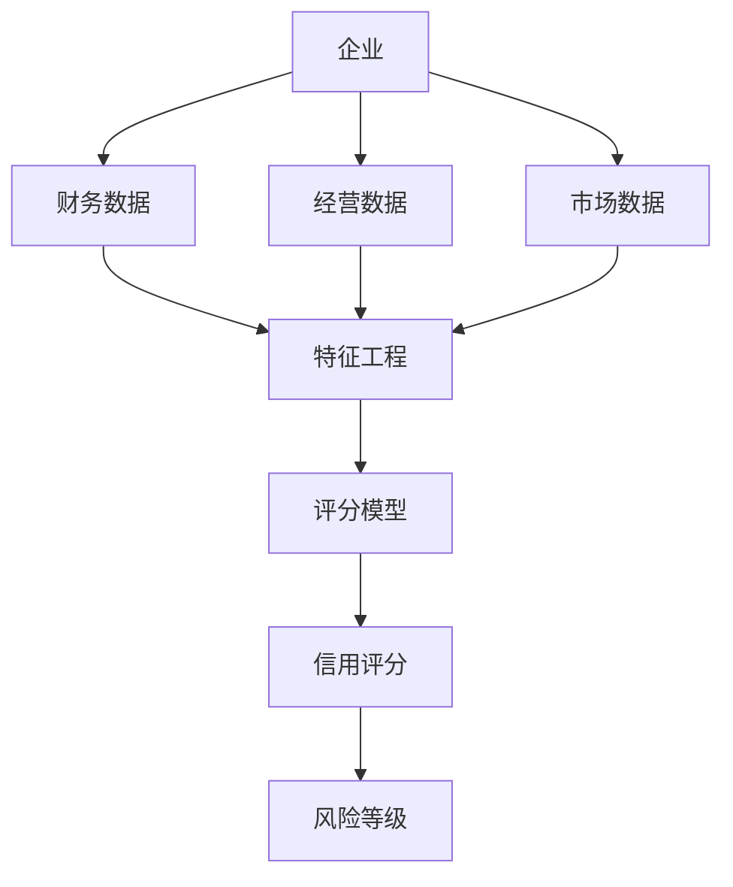
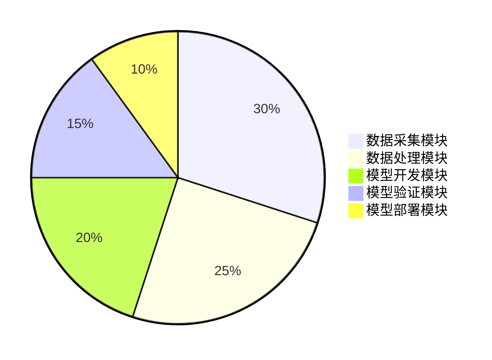
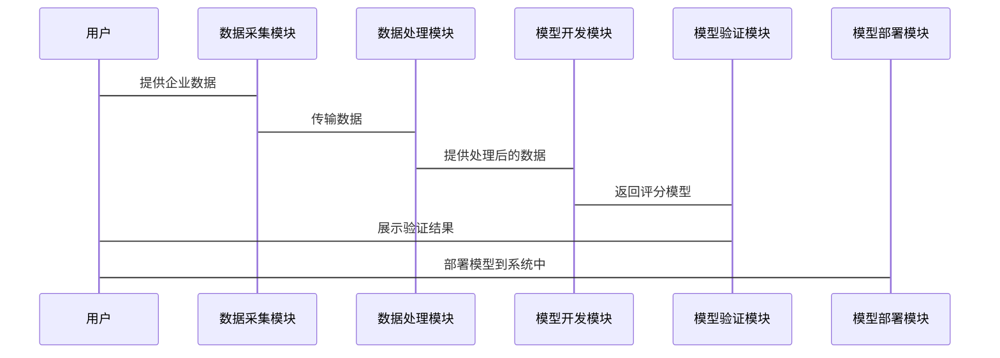

                 


# AI辅助的企业信用评分卡开发与验证平台

> 关键词：企业信用评分卡、AI辅助、机器学习、信用评估、金融系统

> 摘要：本文详细探讨了AI在企业信用评分卡开发与验证平台中的应用，从背景、算法、系统架构到项目实战，全面解析了利用人工智能技术提升信用评分卡开发效率和准确性的实现路径。文章结合理论与实践，通过具体案例分析和代码实现，为读者提供了一套完整的解决方案。

---

# 第一部分: AI辅助的企业信用评分卡开发与验证平台背景

## 第1章: 企业信用评分卡概述

### 1.1 企业信用评分卡的定义与作用

#### 1.1.1 企业信用评分卡的定义
企业信用评分卡是一种用于评估企业信用状况的工具，通过对企业的财务数据、经营状况、市场表现等多维度信息进行分析，生成一个综合评分，以量化企业的信用风险。

#### 1.1.2 企业信用评分卡的作用与意义
- 企业信用评分卡能够帮助金融机构快速评估企业的信用风险，降低贷款审批的复杂性和成本。
- 评分卡的引入能够提高信用评估的客观性和一致性，减少人为判断的主观性。
- 通过评分卡，金融机构可以更好地管理客户风险，优化资产配置。

#### 1.1.3 企业信用评分卡的核心要素
- **输入数据**：企业财务数据、经营数据、市场数据等。
- **评分模型**：基于机器学习算法构建的评分模型。
- **输出结果**：企业的信用评分和风险等级。

### 1.2 AI在信用评分卡开发中的应用背景

#### 1.2.1 传统信用评分卡开发的局限性
- 数据处理复杂，特征工程耗时耗力。
- 传统评分模型的泛化能力有限，难以应对复杂的信用风险场景。
- 模型解释性不足，难以满足监管要求。

#### 1.2.2 AI技术如何提升信用评分卡开发效率
- AI技术能够自动化处理海量数据，提取高价值特征。
- 利用机器学习算法，可以快速构建高性能的信用评分模型。
- AI技术能够实时更新模型，适应市场变化。

#### 1.2.3 企业信用评分卡开发的智能化趋势
- AI技术的应用正在推动信用评分卡开发的智能化转型。
- 智能化评分卡能够动态调整模型参数，优化信用评估结果。
- 智能化评分卡能够与其他系统无缝集成，提升金融机构的整体效率。

### 1.3 本书的核心目标与内容框架

#### 1.3.1 本书的核心目标
- 探讨如何利用AI技术构建高效、准确的企业信用评分卡。
- 分析AI技术在信用评分卡开发中的优势和应用场景。
- 提供一套完整的AI辅助信用评分卡开发与验证的解决方案。

#### 1.3.2 本书的主要内容框架
- 第一部分：企业信用评分卡开发的背景与挑战。
- 第二部分：信用评分卡开发的核心算法与原理。
- 第三部分：AI辅助的企业信用评分卡开发与验证平台的设计与实现。
- 第四部分：项目实战与案例分析。
- 第五部分：总结与展望。

#### 1.3.3 本书的适用读者群体
- 数据科学家、金融从业者、软件开发人员。
- 对企业信用评分卡开发感兴趣的读者。
- 对AI技术在金融领域应用感兴趣的读者。

### 1.4 本章小结
本章主要介绍了企业信用评分卡的基本概念、作用与核心要素，分析了传统评分卡开发的局限性和AI技术的应用优势，最后明确了本书的核心目标和内容框架。

---

## 第2章: 企业信用评分卡开发的背景与挑战

### 2.1 企业信用评分卡开发的背景

#### 2.1.1 企业信用评估的重要性
- 信用评估是金融机构决策贷款、投资的重要依据。
- 信用评分卡能够帮助金融机构快速评估企业的信用风险。

#### 2.1.2 传统信用评分卡开发的流程
1. 数据收集：获取企业的财务数据、经营数据等。
2. 数据清洗：处理缺失值、异常值。
3. 特征工程：提取关键特征，构建评分模型。
4. 模型训练：利用传统算法训练评分模型。
5. 模型验证：评估模型的准确性和稳定性。

#### 2.1.3 信用评分卡开发的行业现状
- 传统评分卡开发效率低下，难以应对海量数据。
- 数据质量和完整性问题普遍存在。
- 模型解释性不足，难以满足监管要求。

### 2.2 信用评分卡开发的主要挑战

#### 2.2.1 数据质量与完整性问题
- 数据缺失：企业财务数据可能存在缺失。
- 数据冗余：部分数据可能重复或冗余。
- 数据污染：异常值或错误数据会影响模型的准确性。

#### 2.2.2 模型泛化能力不足
- 传统评分模型的泛化能力有限，难以应对复杂的信用风险场景。
- 数据分布的变化可能导致模型失效。
- 模型更新周期长，难以快速适应市场变化。

#### 2.2.3 模型解释性与可解释性要求
- 评分卡需要满足监管要求，提供可解释的评分结果。
- 模型的解释性不足会影响金融机构的决策信心。
- 如何在保证模型性能的同时，提高解释性是一个重要挑战。

### 2.3 AI技术在信用评分卡开发中的优势

#### 2.3.1 提高模型预测精度
- 利用机器学习算法，可以挖掘数据中的非线性关系。
- 高维特征的自动提取，能够提高模型的预测精度。

#### 2.3.2 提升特征工程效率
- AI技术能够自动化处理数据，提取高价值特征。
- 利用特征选择算法，可以减少冗余特征，提高模型效率。

#### 2.3.3 增强模型解释性
- 通过可解释性算法（如SHAP值），可以直观展示模型的评分依据。
- 可视化工具能够帮助用户理解模型的决策过程。

### 2.4 本章小结
本章分析了企业信用评分卡开发的背景与挑战，探讨了AI技术在评分卡开发中的应用优势，为后续章节的深入分析奠定了基础。

---

## 第3章: 信用评分卡开发的机器学习算法

### 3.1 传统机器学习算法

#### 3.1.1 逻辑回归
- **定义**：逻辑回归是一种用于分类的统计方法，常用于二分类问题。
- **公式**：$$ P(y=1|x) = \frac{e^{\beta_0 + \beta_1x}}{1 + e^{\beta_0 + \beta_1x}} $$
- **应用**：逻辑回归常用于信用评分模型，预测企业违约概率。

#### 3.1.2 线性判别分析
- **定义**：线性判别分析是一种用于分类的统计方法，通过寻找最优线性分界面。
- **应用**：常用于低维数据的分类问题，但在高维数据中表现有限。

#### 3.1.3 支持向量机
- **定义**：支持向量机是一种基于统计学习理论的分类方法，通过寻找最优超平面。
- **应用**：适用于高维数据的分类问题，但在信用评分中应用较少。

### 3.2 集成学习算法

#### 3.2.1 随机森林
- **定义**：随机森林是一种基于决策树的集成学习方法，通过投票或加权平均得到结果。
- **优势**：具有较高的准确性和鲁棒性。
- **应用**：适用于特征工程和高维数据的信用评分问题。

#### 3.2.2 增强回归树
- **定义**：增强回归树是一种基于回归树的集成学习方法，通过多次训练提升模型性能。
- **优势**：适合处理非线性关系，模型解释性强。
- **应用**：常用于信用评分模型的构建。

#### 3.2.3 梯度提升机
- **定义**：梯度提升机是一种基于损失函数梯度下降的集成学习方法，通过多次迭代提升模型性能。
- **优势**：模型性能优异，支持多种损失函数。
- **应用**：广泛应用于信用评分模型的构建。

### 3.3 神经网络与深度学习算法

#### 3.3.1 多层感知机
- **定义**：多层感知机是一种简单的神经网络模型，包含输入层、隐藏层和输出层。
- **优势**：能够处理复杂的非线性关系。
- **应用**：适用于高维数据的信用评分问题。

#### 3.3.2 卷积神经网络
- **定义**：卷积神经网络是一种主要用于图像处理的深度学习模型，通过卷积操作提取特征。
- **应用**：在信用评分中较少应用，但在某些特定场景下可以发挥作用。

#### 3.3.3 循环神经网络
- **定义**：循环神经网络是一种用于处理序列数据的深度学习模型，通过循环结构捕捉时序关系。
- **应用**：适用于时间序列数据的信用评分问题。

### 3.4 各种算法的优缺点对比

#### 3.4.1 算法性能对比
- 逻辑回归：简单易用，但性能有限。
- 支持向量机：性能优异，但在高维数据中表现不佳。
- 随机森林：准确率高，但解释性较差。

#### 3.4.2 算法复杂度对比
- 逻辑回归：计算复杂度低。
- 深度学习算法：计算复杂度高，需要大量计算资源。

#### 3.4.3 算法适用场景对比
- 传统算法：适用于简单分类问题。
- 集成学习算法：适用于高维数据和复杂分类问题。
- 深度学习算法：适用于非线性关系复杂的场景。

### 3.5 本章小结
本章介绍了信用评分卡开发中常用的机器学习算法，分析了各种算法的优缺点，为后续章节的模型选择和实现提供了依据。

---

## 第4章: 信用评分卡开发的数学模型与公式

### 4.1 逻辑回归模型

#### 4.1.1 逻辑回归的基本原理
- 逻辑回归通过 sigmoid 函数将线性回归的结果映射到概率空间。
- 模型公式：$$ P(y=1|x) = \frac{e^{\beta_0 + \beta_1x}}{1 + e^{\beta_0 + \beta_1x}} $$

#### 4.1.2 逻辑回归的损失函数
- 损失函数：$$ L(\beta) = -\sum_{i=1}^n [y_i \ln(p_i) + (1 - y_i) \ln(1 - p_i)] $$
- 其中，$p_i$ 是第 $i$ 个样本的预测概率。

#### 4.1.3 逻辑回归的优化算法
- 常用优化算法：梯度下降、牛顿法、L-BFGS 等。

### 4.2 XGBoost算法原理

#### 4.2.1 XGBoost的优化目标
- XGBoost 通过最小化损失函数，同时引入正则化项来防止过拟合。
- 损失函数：$$ \mathcal{L} = \sum_{i=1}^n [y_i - \hat{y}_i] + \lambda \Omega(f) $$
- 其中，$\Omega(f)$ 是正则化项，通常采用 $L2$ 正则化。

#### 4.2.2 XGBoost的分裂函数
- 分裂函数：$$ \text{split\_loss} = \sum_{i \in L} (a - \frac{1}{2}b) + \sum_{i \in R} (a - \frac{1}{2}b) $$
- 其中，$L$ 和 $R$ 分别表示左子树和右子树，$a$ 是样本权重，$b$ 是预测值。

#### 4.2.3 XGBoost的正则化项
- 正则化项：$$ \Omega(f) = \gamma T + \lambda \sum_{j=1}^T w_j^2 $$
- 其中，$\gamma$ 是叶子节点惩罚，$\lambda$ 是权重惩罚，$T$ 是叶子节点数。

### 4.3 神经网络模型

#### 4.3.1 神经网络的结构与参数
- 神经网络由输入层、隐藏层和输出层组成。
- 每层包含多个神经元，通过权重和激活函数进行计算。

#### 4.3.2 神经网络的激活函数
- 常用激活函数：sigmoid、ReLU、tanh 等。
- 激活函数公式：$$ \text{ReLU}(x) = \max(0, x) $$

#### 4.3.3 神经网络的损失函数
- 常用损失函数：交叉熵损失、均方误差等。
- 交叉熵损失公式：$$ \mathcal{L} = -\sum_{i=1}^n [y_i \ln(p_i) + (1 - y_i) \ln(1 - p_i)] $$

### 4.4 各种算法的数学公式对比

#### 4.4.1 逻辑回归公式
$$ P(y=1|x) = \frac{e^{\beta_0 + \beta_1x}}{1 + e^{\beta_0 + \beta_1x}} $$

#### 4.4.2 XGBoost优化目标公式
$$ \mathcal{L} = \sum_{i=1}^n [y_i - \hat{y}_i] + \lambda \Omega(f) $$

#### 4.4.3 神经网络损失函数公式
$$ \mathcal{L} = -\sum_{i=1}^n [y_i \ln(p_i) + (1 - y_i) \ln(1 - p_i)] $$

### 4.5 本章小结
本章详细介绍了信用评分卡开发中常用的逻辑回归、XGBoost和神经网络模型的数学公式和原理，为后续章节的算法实现提供了理论基础。

---

## 第5章: 系统分析与架构设计方案

### 5.1 问题场景介绍

#### 5.1.1 企业信用评分卡开发的痛点
- 数据量大，特征复杂，传统方法效率低。
- 模型泛化能力不足，难以应对复杂场景。
- 模型解释性差，难以满足监管要求。

#### 5.1.2 AI辅助的企业信用评分卡开发平台的目标
- 提供高效的AI工具，自动化处理数据和模型开发。
- 提供高精度的信用评分模型，降低风险。
- 提供可解释的评分结果，满足监管要求。

### 5.2 项目介绍

#### 5.2.1 项目目标
- 构建一个基于AI的企业信用评分卡开发与验证平台。
- 提供从数据采集到模型部署的完整解决方案。

#### 5.2.2 项目范围
- 数据采集与处理：企业财务数据、经营数据等。
- 特征工程：自动化特征提取与选择。
- 模型开发：基于机器学习算法构建评分模型。
- 模型验证：评估模型性能，优化参数。
- 模型部署：将模型集成到金融机构系统中。

### 5.3 系统功能设计

#### 5.3.1 领域模型（ER实体关系图）


#### 5.3.2 系统架构设计


#### 5.3.3 系统接口设计
- 数据接口：与企业数据源对接。
- 模型接口：与第三方机器学习框架对接。
- 用户接口：提供友好的用户界面，供用户操作和查看结果。

#### 5.3.4 系统交互流程


### 5.4 本章小结
本章通过系统分析和架构设计，明确了企业信用评分卡开发平台的功能模块和交互流程，为后续章节的系统实现奠定了基础。

---

## 第6章: 项目实战与案例分析

### 6.1 环境安装

#### 6.1.1 安装Python
- 安装Python 3.8 或更高版本。
- 安装常用库：numpy、pandas、scikit-learn、xgboost、keras、tensorflow。

#### 6.1.2 安装机器学习框架
- 安装scikit-learn：```bash
pip install scikit-learn
```
- 安装XGBoost：```bash
pip install xgboost
```

### 6.2 系统核心实现源代码

#### 6.2.1 数据处理代码
```python
import pandas as pd
import numpy as np

# 读取数据
data = pd.read_csv('企业数据.csv')

# 数据清洗
data.dropna(inplace=True)
data = data.replace({np.nan: 0})

# 特征工程
from sklearn.preprocessing import StandardScaler
scaler = StandardScaler()
X = data.drop('信用评分', axis=1)
X_scaled = scaler.fit_transform(X)
y = data['信用评分']
```

#### 6.2.2 模型训练代码
```python
from sklearn.model_selection import train_test_split
from sklearn.linear

