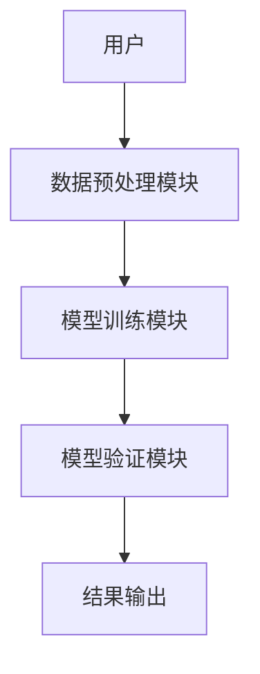

                 


---

# AI辅助的企业信用评分卡验证

## 关键词：AI技术、企业信用评分卡、信用风险、机器学习、模型验证

## 摘要：本文详细探讨了AI技术在企业信用评分卡验证中的应用，分析了传统信用评分卡的局限性以及AI技术带来的优势。通过介绍多种AI算法，如逻辑回归、支持向量机和随机森林，阐述了它们在信用评分中的具体应用。同时，本文还设计了一个完整的系统架构，并通过实际案例展示了如何利用AI技术优化信用评分卡的验证过程，为读者提供了一个从理论到实践的全面指南。

---

## 第1章: 企业信用评分卡的基本概念

### 1.1 企业信用评分卡的定义与作用

#### 1.1.1 信用评分卡的基本概念

信用评分卡是一种用于评估企业和个人信用风险的工具。它通过收集和分析企业的财务数据、市场表现、管理状况等信息，量化企业的信用风险，帮助企业做出信贷决策。信用评分卡的核心在于将复杂的信用评估过程转化为一个可量化的指标，从而提高评估的效率和准确性。

#### 1.1.2 信用评分卡在企业信用管理中的作用

1. **风险控制**：通过信用评分卡，企业可以识别潜在的违约风险，从而在信贷决策中做出更明智的选择。
2. **提高效率**：传统的信用评估过程通常依赖于人工判断，耗时且容易出错。信用评分卡通过自动化的方式快速评估信用风险，显著提高了评估效率。
3. **支持决策**：信用评分卡为企业的信贷决策提供了科学依据，帮助企业在信贷分配和风险管理方面做出更准确的判断。

#### 1.1.3 信用评分卡的分类与应用场景

信用评分卡可以根据不同的标准进行分类，常见的分类方式包括：

1. **按评估对象分类**：
   - 企业信用评分卡
   - 个人信用评分卡
2. **按评分方法分类**：
   - 统计模型评分卡
   - 机器学习模型评分卡
3. **按应用场景分类**：
   - 银行信贷评分卡
   - 供应链金融评分卡
   - 投资决策评分卡

信用评分卡的应用场景广泛，主要包括银行信贷、供应链管理、投资决策等领域。

---

### 1.2 AI在信用评分卡中的应用背景

#### 1.2.1 传统信用评分卡的局限性

传统信用评分卡主要依赖于统计模型，如逻辑回归模型。虽然这些模型在一定程度上能够评估信用风险，但也存在以下局限性：

1. **特征选择的局限性**：传统的统计模型通常依赖于少量的关键特征，而忽略了其他可能影响信用风险的复杂因素。
2. **模型的泛化能力有限**：统计模型在面对数据分布变化或新类型的数据时，可能表现不佳，泛化能力有限。
3. **计算复杂度高**：对于大规模数据，传统模型的计算复杂度较高，难以实时处理。

#### 1.2.2 AI技术在信用评分中的优势

AI技术的引入为信用评分卡的验证带来了诸多优势：

1. **非线性关系捕捉**：AI算法，如支持向量机、随机森林和深度学习模型，能够捕捉数据中的非线性关系，提高模型的准确性。
2. **特征工程自动化**：AI技术可以通过自动化的方式提取和生成特征，减少人工干预，提高特征的丰富性和有效性。
3. **实时处理能力**：AI算法通常具有较强的计算能力，能够处理大规模数据，并实现实时信用评估。

#### 1.2.3 企业信用评分卡验证的必要性

信用评分卡的验证是确保评分卡准确性和可靠性的关键步骤。通过验证，可以评估模型的性能，发现潜在的问题，并进行模型优化。AI技术的引入使得信用评分卡的验证过程更加高效和精准。

---

## 第2章: AI辅助信用评分卡验证的核心算法

### 2.1 逻辑回归模型

#### 2.1.1 逻辑回归的基本原理

逻辑回归是一种常用的分类算法，主要用于二分类问题。其基本思想是通过一个线性组合来预测事件发生的概率，并通过sigmoid函数将线性组合映射到0到1的范围内。

$$ P(y=1|x) = \frac{e^{\beta_0 + \beta_1 x}}{1 + e^{\beta_0 + \beta_1 x}} $$

其中，$\beta_0$和$\beta_1$是模型的参数，$x$是输入特征。

#### 2.1.2 逻辑回归在信用评分中的应用

在信用评分中，逻辑回归模型常用于预测客户违约的概率。通过将客户特征输入模型，可以得到一个违约概率，从而为信贷决策提供依据。

#### 2.1.3 逻辑回归的优缺点

- **优点**：
  - 模型简单，易于解释。
  - 训练速度快，适合大规模数据。
- **缺点**：
  - 仅适用于线性关系，无法捕捉复杂的数据分布。
  - 对异常值敏感。

---

### 2.2 支持向量机（SVM）

#### 2.2.1 SVM的基本原理

SVM是一种基于统计学习理论的支持向量机算法，主要用于分类和回归问题。其基本思想是通过找到一个超平面，将数据分为两类，并最大化两类之间的间隔。

$$ \text{最大化} \ \frac{1}{\gamma} \ \text{，使得} \ \gamma \text{最小化} \ \sum_{i=1}^{n} \alpha_i y_i y_j \langle x_i, x_j \rangle + \alpha_i C $$

其中，$\alpha_i$是拉格朗日乘子，$C$是惩罚参数。

#### 2.2.2 SVM在信用评分中的应用

SVM在信用评分中的应用主要体现在非线性分类和高维数据处理方面。通过核函数，SVM可以将数据映射到高维空间，从而捕捉复杂的模式。

#### 2.2.3 SVM的优缺点

- **优点**：
  - 能够处理高维数据，捕捉非线性关系。
  - 对噪声数据具有较强的鲁棒性。
- **缺点**：
  - 参数选择敏感，需要调整核函数和惩罚参数。
  - 训练时间较长，不适合大规模数据。

---

### 2.3 随机森林与梯度提升树

#### 2.3.1 随机森林的基本原理

随机森林是一种基于决策树的集成算法，通过随机选择特征和样本进行树的构建，并通过投票或加权的方式进行预测。

$$ \text{预测结果} = \sum_{i=1}^{n} \text{树}_i \cdot \text{权重} $$

#### 2.3.2 随机森林在信用评分中的应用

随机森林在信用评分中的应用主要体现在特征重要性分析和模型的稳定性方面。通过随机森林，可以识别出对信用评分影响最大的特征，并评估模型的泛化能力。

#### 2.3.3 随机森林的优缺点

- **优点**：
  - 对噪声数据具有较强的鲁棒性。
  - 能够处理高维数据，捕捉复杂关系。
- **缺点**：
  - 计算复杂度较高，训练时间较长。
  - 特征重要性解释较为复杂。

---

## 第3章: 企业信用评分卡验证的AI技术基础

### 3.1 机器学习在信用评分中的应用

#### 3.1.1 监督学习与非监督学习

- **监督学习**：在监督学习中，模型通过标注数据进行训练，预测目标变量。常用的监督学习算法包括逻辑回归、支持向量机和随机森林。
- **非监督学习**：在非监督学习中，模型通过无标注数据进行训练，发现数据中的潜在结构。常用的非监督学习算法包括聚类和降维技术。

#### 3.1.2 分类算法在信用评分中的应用

在信用评分中，分类算法主要用于预测客户违约的概率。常用的分类算法包括逻辑回归、支持向量机和随机森林。

#### 3.1.3 回归算法在信用评分中的应用

回归算法主要用于预测连续型变量，如违约概率。常用的回归算法包括线性回归、岭回归和Lasso回归。

---

### 3.2 深度学习在信用评分中的应用

#### 3.2.1 神经网络在信用评分中的应用

神经网络是一种由人工神经元组成的计算模型，能够通过多层非线性变换捕捉数据中的复杂模式。在信用评分中，神经网络常用于处理高维数据和非线性关系。

#### 3.2.2 长短期记忆网络（LSTM）的应用

LSTM是一种特殊的循环神经网络，能够有效捕捉时间序列数据中的长期依赖关系。在信用评分中，LSTM可用于分析企业的历史财务数据，预测未来的信用风险。

#### 3.2.3 图神经网络在信用评分中的应用

图神经网络是一种基于图结构的数据处理方法，能够捕捉数据中的复杂关系。在信用评分中，图神经网络可用于分析企业之间的关联关系，评估整体信用风险。

---

## 第4章: 系统分析与架构设计

### 4.1 系统功能设计

#### 4.1.1 数据预处理模块

数据预处理是信用评分卡验证的基础，主要包括数据清洗、特征提取和数据转换。

#### 4.1.2 模型训练模块

模型训练是通过算法对数据进行训练，得到一个能够预测信用风险的模型。

#### 4.1.3 模型验证模块

模型验证是通过测试数据评估模型的性能，包括准确率、召回率和F1值等指标。

---

### 4.2 系统架构设计

#### 4.2.1 系统架构图



#### 4.2.2 系统交互流程

用户输入数据，经过数据预处理模块清洗和转换后，进入模型训练模块进行训练，生成模型后进入模型验证模块，最后输出验证结果。

---

## 第5章: 项目实战

### 5.1 环境安装

安装Python和必要的库，如scikit-learn、xgboost和keras。

### 5.2 核心代码实现

```python
import pandas as pd
from sklearn.model_selection import train_test_split
from sklearn.metrics import accuracy_score

# 数据加载
data = pd.read_csv('credit_data.csv')

# 数据分割
X = data.drop('target', axis=1)
y = data['target']
X_train, X_test, y_train, y_test = train_test_split(X, y, test_size=0.2)

# 模型训练
from sklearn.ensemble import RandomForestClassifier
model = RandomForestClassifier()
model.fit(X_train, y_train)

# 模型预测
y_pred = model.predict(X_test)

# 模型评估
print(accuracy_score(y_test, y_pred))
```

### 5.3 案例分析

通过实际案例分析，展示如何利用AI技术优化信用评分卡的验证过程，并总结经验教训。

---

## 第6章: 最佳实践

### 6.1 小结

本文详细探讨了AI技术在企业信用评分卡验证中的应用，分析了传统信用评分卡的局限性以及AI技术带来的优势。通过介绍多种AI算法，如逻辑回归、支持向量机和随机森林，阐述了它们在信用评分中的具体应用。

### 6.2 注意事项

在实际应用中，需要注意数据质量和模型选择，避免过拟合和欠拟合问题。

### 6.3 拓展阅读

推荐阅读《机器学习实战》、《深度学习》等书籍，深入学习AI技术在信用评分中的应用。

---

## 作者：AI天才研究院 & 禅与计算机程序设计艺术

---

本文通过系统地介绍AI技术在企业信用评分卡验证中的应用，为读者提供了一个从理论到实践的全面指南。希望本文能够帮助读者更好地理解AI在信用评分中的作用，并为实际应用提供参考。

