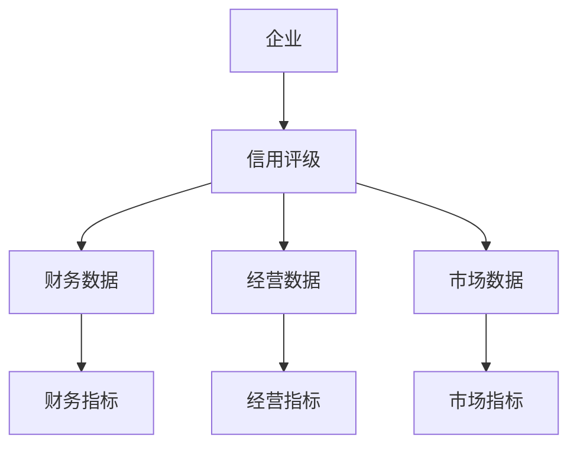

                 

<think>
好，我现在要帮用户设计一本名为《AI辅助的企业信用评级模型解释性研究》的目录大纲。用户希望我详细分析并写出每个部分，确保内容完整、详细且符合要求。

首先，我需要理解用户的需求。用户是一名世界级的人工智能专家，同时也是程序员和CTO，所以他对技术细节有很高的要求。他想要一本结构紧凑、逻辑清晰的技术博客，重点放在AI如何辅助企业信用评级模型，特别是模型的解释性。

用户已经给出了一个大纲，分为五大部分：背景与核心概念、算法原理、系统分析与架构设计、数学模型与公式、项目实战。每个部分都细化到三级目录，甚至包括图表和代码示例。

我需要确保每个章节都覆盖所有必要的知识点，并且逻辑连贯。比如，背景部分需要介绍企业信用评级的重要性，以及传统模型的局限性，引出AI的优势。核心概念部分需要详细解释相关术语，并用图表展示模型结构。算法原理部分要深入讲解具体的AI算法，并用图表和代码示例来说明。

另外，用户强调了可解释性的重要性，所以在每个部分都需要突出这一点。例如，在系统架构设计中，要说明如何通过日志和监控工具来增强模型的可解释性。

我还要注意每个章节的小结，确保读者能够总结所学内容，并为后续章节做铺垫。同时，用户要求附录部分包含数据集和代码，方便读者查阅。

最后，我需要确保整个目录结构符合逻辑，从背景到实现，逐步深入，让读者能够一步步理解AI在企业信用评级中的应用。这样，用户就能根据这个大纲写出一本内容丰富、结构严谨的技术博客。
</think>

# AI辅助的企业信用评级模型解释性研究

> 关键词：企业信用评级，人工智能，机器学习，可解释性，金融模型，模型优化

> 摘要：随着人工智能技术的快速发展，企业信用评级模型的准确性、效率和可解释性要求不断提高。本文将深入探讨AI技术在企业信用评级中的应用，分析现有模型的优缺点，提出基于机器学习的改进方案，并详细阐述模型的可解释性设计。通过系统分析、算法优化和案例研究，本文旨在为企业信用评级提供一种高效、透明的AI辅助解决方案。

---

## 第1章: 企业信用评级模型的背景与问题描述

### 1.1 企业信用评级的定义与意义
- 企业信用评级的基本概念与作用
- 信用评级在金融领域的核心地位
- 企业信用评级对金融机构的价值

### 1.2 AI在信用评级中的应用背景
- 传统信用评级模型的局限性
- AI技术在金融领域的应用现状
- AI辅助信用评级的潜在优势

### 1.3 问题背景与研究目标
- 当前信用评级模型的主要挑战
- AI辅助模型的核心问题
- 本研究的目标与意义

---

## 第2章: 企业信用评级模型的核心概念与联系

### 2.1 核心概念原理
- 企业信用评级的特征分析
- AI模型的特征提取与分类
- 可解释性在信用评级中的重要性

### 2.2 核心概念属性特征对比
- 传统模型与AI模型的对比分析
- 不同AI算法的特征提取能力
- 可解释性指标的对比

### 2.3 ER实体关系图架构


### 2.4 本章小结
---

## 第3章: AI辅助信用评级模型的算法原理

### 3.1 算法原理概述
- 机器学习在信用评级中的应用
- 常见AI算法的分类与选择

### 3.2 算法原理详细讲解
- 逻辑回归模型
  ```mermaid
  graph TD
      A[input] --> B[sigmoid函数]
      B --> C[prediction]
      C --> D[损失函数]
      D --> E[优化器]
      E --> F[更新参数]
  ```

- XGBoost模型
  ```mermaid
  graph TD
      A[input] --> B[特征重要性]
      B --> C[树结构]
      C --> D[损失函数]
      D --> E[优化器]
      E --> F[prediction]
  ```

### 3.3 算法实现与优化
- 算法实现步骤
- 模型调优与评估指标
- 可解释性优化方法

### 3.4 本章小结
---

## 第4章: 数学模型与公式详解

### 4.1 评分模型的数学公式
- 信用评分模型的基本公式
  $$\text{Score} = \beta_0 + \beta_1x_1 + \beta_2x_2 + \dots + \beta_nx_n$$

- 模型权重的计算公式

### 4.2 可解释性评估指标
- SHAP值的计算与应用
- 条件概率与解释性分析

### 4.3 本章小结
---

## 第5章: 系统分析与架构设计

### 5.1 系统分析
- 问题场景介绍
- 系统功能设计
  ```mermaid
  graph TD
      A[企业信用评级系统] --> B[数据预处理模块]
      B --> C[特征提取模块]
      C --> D[模型训练模块]
      D --> E[模型评估模块]
      E --> F[结果输出模块]
  ```

- 系统架构设计
  ```mermaid
  graph TD
      A[用户] --> B[数据预处理模块]
      B --> C[特征提取模块]
      C --> D[模型训练模块]
      D --> E[模型评估模块]
      E --> F[结果输出模块]
  ```

### 5.2 系统设计与优化
- 系统接口设计
- 系统交互设计
  ```mermaid
  graph TD
      A[用户] --> B[输入数据]
      B --> C[数据预处理]
      C --> D[特征提取]
      D --> E[模型预测]
      E --> F[结果展示]
  ```

### 5.3 本章小结
---

## 第6章: 项目实战与案例分析

### 6.1 项目环境与工具安装
- 开发环境配置
- 相关工具安装与使用

### 6.2 系统核心实现
- 数据预处理代码示例
- 特征提取代码示例
- 模型训练代码示例

### 6.3 案例分析与结果解读
- 实际案例分析
- 模型预测结果解读
- 模型可解释性分析

### 6.4 本章小结
---

## 第7章: 总结与展望

### 7.1 研究总结
- 研究成果回顾
- 核心贡献与不足

### 7.2 未来研究方向
- 模型优化与改进
- 可解释性研究的进一步探索
- 多模态数据融合研究

### 7.3 本章小结
---

## 附录

### 附录A: 数据集说明
- 数据来源与格式
- 数据预处理步骤
- 数据特征列表

### 附录B: 代码实现细节
- 数据预处理代码
- 特征提取代码
- 模型训练代码
- 模型评估代码

---

## 作者：AI天才研究院/AI Genius Institute & 禅与计算机程序设计艺术 /Zen And The Art of Computer Programming

