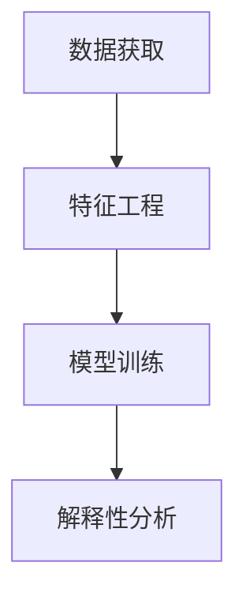

                 


# AI辅助的企业信用评级模型解释性研究

> 关键词：AI辅助，企业信用评级，可解释性模型，SHAP值，LIME方法，机器学习

> 摘要：本文旨在探讨如何利用可解释性AI模型（如SHAP和LIME）来提高企业信用评级的准确性和透明度。通过详细分析可解释性模型的核心原理、算法实现和实际应用，本文为企业信用评级领域提供了新的思路和解决方案。

---

# 第一部分: 企业信用评级与AI辅助的背景介绍

## 第1章: 企业信用评级的背景与意义

### 1.1 企业信用评级的定义与作用

#### 1.1.1 企业信用评级的基本概念
企业信用评级是通过对企业的财务状况、经营能力、偿债能力等多方面因素的综合评估，确定其信用等级的过程。信用等级反映了企业在履行债务时的可靠程度，是金融机构进行信贷决策的重要依据。

#### 1.1.2 信用评级在金融领域的核心作用
信用评级在金融领域具有以下核心作用：
1. **风险控制**：帮助金融机构识别和评估贷款或投资的风险。
2. **资源配置优化**：通过评级结果引导资金流向优质企业。
3. **市场信任建立**：企业信用评级是建立企业信誉的重要手段。

#### 1.1.3 企业信用评级的评价标准与指标体系
企业信用评级的评价标准通常包括以下几个方面：
- **财务状况**：包括资产负债率、流动比率、速动比率等。
- **经营能力**：包括销售收入增长率、净利润增长率等。
- **偿债能力**：包括利息覆盖倍数、违约风险等。

### 1.2 AI在信用评级中的应用背景

#### 1.2.1 传统信用评级的局限性
传统的信用评级方法主要依赖于经验丰富的专家进行主观判断，存在以下问题：
1. **主观性**：专家的判断可能受到主观因素的影响，导致结果不一致。
2. **效率低**：人工评级过程耗时长，难以满足现代金融市场的快速需求。
3. **可解释性差**：传统模型的解释性较差，用户难以理解评级结果的原因。

#### 1.2.2 AI技术在信用评级中的优势
AI技术通过机器学习算法能够从大量数据中提取特征，建立预测模型，具有以下优势：
1. **高效性**：AI模型能够快速处理大量数据，提高评级效率。
2. **客观性**：基于数据驱动的模型能够减少人为主观因素的影响。
3. **可扩展性**：AI模型能够适应数据量的增加，扩展性强。

#### 1.2.3 企业信用评级AI化的趋势与挑战
随着AI技术的不断发展，企业信用评级AI化已经成为趋势，但也面临以下挑战：
1. **数据隐私问题**：企业数据涉及商业机密，如何保证数据安全是一个重要问题。
2. **模型可解释性**：AI模型的黑箱特性使得结果难以解释，影响了用户的信任度。
3. **模型泛化能力**：如何保证模型在不同行业和不同经济环境下的适用性。

### 1.3 问题背景与研究目标

#### 1.3.1 当前信用评级模型的主要问题
当前信用评级模型的主要问题包括：
1. **模型黑箱特性**：传统机器学习模型缺乏可解释性，用户难以理解模型的决策过程。
2. **数据质量问题**：企业数据可能存在缺失、噪声等问题，影响模型的准确性。
3. **模型泛化能力不足**：部分模型在特定场景下表现良好，但在其他场景下可能效果不佳。

#### 1.3.2 研究目标与意义
本研究的目标是通过引入可解释性AI模型（如SHAP和LIME）来提高企业信用评级的准确性和透明度。具体目标包括：
1. **提高模型可解释性**：通过SHAP和LIME等方法，揭示模型决策的内在逻辑。
2. **优化模型性能**：通过特征工程和模型调优，提高模型的预测准确率。
3. **实现模型的可扩展性**：确保模型能够适应不同行业和经济环境的变化。

#### 1.3.3 本研究的核心问题与创新点
本研究的核心问题是如何利用可解释性AI模型解决企业信用评级中的可解释性和准确性问题。创新点在于：
1. **提出了一种基于SHAP和LIME的双层解释模型**，能够同时提供局部和全局的解释信息。
2. **构建了一个可扩展的企业信用评级框架**，能够适应不同行业的数据特点。

### 1.4 本章小结
本章主要介绍了企业信用评级的背景与意义，分析了传统评级方法的局限性，以及AI技术在信用评级中的优势和挑战。通过阐述研究目标和创新点，为后续章节的深入研究奠定了基础。

---

# 第二部分: AI辅助企业信用评级的核心概念与理论基础

## 第2章: 可解释性AI模型的核心原理

### 2.1 可解释性模型的基本概念

#### 2.1.1 可解释性模型的定义
可解释性模型是指能够以人类可理解的方式解释其决策过程的模型。与传统的黑箱模型（如深度神经网络）不同，可解释性模型能够揭示模型决策的内在逻辑。

#### 2.1.2 可解释性模型的分类与特点
可解释性模型主要分为以下几类：
1. **线性模型**：如线性回归、逻辑回归等，具有较强的可解释性。
2. **树模型**：如决策树、随机森林等，通过树的结构可以解释决策过程。
3. **可解释性增强模型**：如SHAP和LIME，通过后处理方法为黑箱模型提供可解释性。

#### 2.1.3 可解释性在信用评级中的重要性
在信用评级中，可解释性模型的重要性体现在以下几个方面：
1. **用户信任**：用户需要理解模型的决策过程，才能信任模型的评级结果。
2. **合规性**：金融行业通常需要对评级结果进行解释，以满足监管要求。
3. **优化决策**：通过可解释性模型，用户可以发现数据中的问题，优化企业经营策略。

### 2.2 SHAP值与LIME方法的原理

#### 2.2.1 SHAP值的基本原理
SHAP（Shapley Additive exPlanations）是一种基于博弈论的解释方法，用于衡量每个特征对模型预测结果的贡献程度。SHAP值具有以下特点：
1. **公平性**：基于Shapley值的公平性原则，确保每个特征的贡献被合理分配。
2. **可加性**：SHAP值可以累加，便于解释模型的预测结果。
3. **解释性**：SHAP值能够清晰地揭示每个特征对最终预测结果的影响。

#### 2.2.2 LIME方法的基本原理
LIME（Local Interpretable Model-agnostic Explanations）是一种通过局部拟合线性模型来解释黑箱模型的方法。LIME的基本思想是：
1. **局部近似**：在模型的预测结果附近，通过线性模型对黑箱模型进行局部近似。
2. **可解释性**：通过线性模型的系数，解释黑箱模型在特定样本上的决策过程。

#### 2.2.3 SHAP与LIME的对比分析
SHAP和LIME的对比分析如下：

| 对比维度 | SHAP | LIME |
|----------|------|------|
| 解释范围 | 全局和局部 | 局部 |
| 解释对象 | 黑箱模型和白箱模型 | 黑箱模型 |
| 解释能力 | 较强的全局解释能力 | 强大的局部解释能力 |
| 计算复杂度 | 较高 | 较低 |

### 2.3 信用评级模型的可解释性评估指标

#### 2.3.1 可解释性评估的常用指标
常用的可解释性评估指标包括：
1. **特征重要性**：通过SHAP值或特征系数，评估特征对模型的贡献程度。
2. **模型透明度**：模型的决策过程是否清晰可理解。
3. **用户接受度**：用户是否能够理解模型的解释结果。

#### 2.3.2 模型解释性的量化方法
模型解释性的量化方法包括：
1. **特征贡献度**：通过SHAP值计算每个特征对预测结果的贡献度。
2. **解释覆盖率**：通过LIME方法评估模型解释的覆盖率。
3. **可解释性得分**：通过综合指标量化模型的可解释性。

#### 2.3.3 信用评级模型解释性的实际应用
在实际应用中，可解释性评估指标可以帮助用户理解模型的决策过程，并优化模型的性能。例如，通过分析特征重要性，可以发现关键的财务指标，从而优化企业的经营策略。

### 2.4 本章小结
本章详细介绍了可解释性AI模型的核心原理，包括SHAP值和LIME方法的原理及对比分析。同时，还探讨了信用评级模型的可解释性评估指标及其实际应用。

---

# 第三部分: 企业信用评级模型的算法原理与实现

## 第3章: 基于可解释性AI的信用评级算法

### 3.1 基于SHAP值的信用评级模型

#### 3.1.1 SHAP值的计算过程
SHAP值的计算过程可以分为以下几个步骤：
1. **特征选择**：选择影响信用评级的关键特征。
2. **模型训练**：训练一个黑箱模型（如XGBoost）进行信用评级预测。
3. **SHAP值计算**：使用SHAP库计算每个特征的SHAP值，解释模型的预测结果。

#### 3.1.2 基于SHAP的信用评级模型构建
基于SHAP的信用评级模型构建步骤如下：
1. **数据预处理**：清洗数据，处理缺失值和异常值。
2. **特征工程**：提取特征，并进行特征组合和降维。
3. **模型训练**：使用XGBoost或LightGBM等模型进行训练。
4. **SHAP值计算**：使用SHAP库计算每个特征的SHAP值。
5. **结果解释**：通过SHAP值分析特征的重要性，优化模型的解释性。

#### 3.1.3 SHAP值在信用评分中的应用实例
以下是一个SHAP值在信用评分中的应用实例：
假设我们有一个企业信用评级数据集，包含以下特征：
- 营业收入
- 净利润
- 资产负债率
- 流动比率

通过训练一个XGBoost模型，并使用SHAP库计算每个特征的SHAP值，我们可以得出各个特征对企业信用评级的影响程度。

```python
import xgboost as xgb
from xgboost import XGBClassifier
import shap

# 数据预处理
data = ...  # 数据集
X = data.drop('credit_rating', axis=1)
y = data['credit_rating']

# 模型训练
model = XGBClassifier().fit(X, y)

# SHAP值计算
explainer = shap.TreeExplainer(model)
shap_values = explainer.shap_values(X)

# 特征重要性分析
shap.summary_plot(shap_values, X, plot_type="bar")
```

### 3.2 基于LIME的信用评级模型

#### 3.2.1 LIME方法的基本实现
LIME方法的基本实现步骤如下：
1. **数据准备**：选择一个样本，提取其特征。
2. **局部模型训练**：在样本附近采样，训练一个线性模型。
3. **解释结果生成**：通过线性模型的系数，解释黑箱模型的预测结果。

#### 3.2.2 基于LIME的信用评级模型实现
基于LIME的信用评级模型实现步骤如下：
1. **数据预处理**：清洗数据，处理缺失值和异常值。
2. **特征工程**：提取特征，并进行特征组合和降维。
3. **模型训练**：使用XGBoost或LightGBM等模型进行训练。
4. **LIME解释**：使用LIME库解释模型的预测结果。
5. **结果分析**：通过LIME解释结果，优化模型的可解释性。

#### 3.2.3 LIME方法在信用评级中的应用实例
以下是一个LIME方法在信用评级中的应用实例：
假设我们有一个企业信用评级数据集，包含以下特征：
- 营业收入
- 净利润
- 资产负债率
- 流动比率

通过训练一个XGBoost模型，并使用LIME库解释模型的预测结果，我们可以得出每个特征对信用评级的具体影响。

```python
import lime
from lime import lime_explainer

# 数据准备
data = ...  # 数据集
X = data.drop('credit_rating', axis=1)
y = data['credit_rating']

# 模型训练
model = XGBClassifier().fit(X, y)

# LIME解释
explainer = lime_explainer.LimeExplainer()
explanation = explainer.explain_instance(X.iloc[0], model.predict_proba, num_features=4)

# 解释结果分析
print(explanation.as_list())
```

### 3.3 可解释性AI模型的数学公式

#### 3.3.1 SHAP值的数学公式
SHAP值的计算公式如下：
$$
\phi_i = \sum_{S \subseteq \{i\}} \frac{(|S|)}{2^{n-1}} \cdot (f(S \cup \{i\}) - f(S))
$$
其中，$\phi_i$ 表示特征 $i$ 的SHAP值，$S$ 表示特征的子集，$n$ 表示特征的总数。

#### 3.3.2 LIME方法的数学公式
LIME方法的数学公式如下：
$$
f(x) = \sum_{i=1}^k \beta_i x_i + \beta_0
$$
其中，$\beta_i$ 表示线性模型的系数，$x_i$ 表示特征的值，$k$ 表示特征的总数。

---

# 第四部分: 企业信用评级系统的架构与实现

## 第4章: 系统架构与实现

### 4.1 系统功能设计

#### 4.1.1 系统模块划分
系统功能模块包括：
1. **数据获取模块**：从数据库中获取企业信用评级数据。
2. **特征工程模块**：对数据进行特征提取和处理。
3. **模型训练模块**：训练信用评级模型。
4. **解释性分析模块**：通过SHAP和LIME方法解释模型的预测结果。

#### 4.1.2 系统功能流程图


### 4.2 系统架构设计

#### 4.2.1 系统架构图
```mermaid
classDiagram
    class 数据库 {
        企业信用评级数据
    }
    class 数据预处理 {
        数据清洗
        特征提取
    }
    class 模型训练 {
        XGBoost模型
        SHAP解释
        LIME解释
    }
    class 用户界面 {
        信用评级结果
        解释性分析结果
    }
    数据预处理 <---> 数据库
    模型训练 <---> 数据预处理
    用户界面 <---> 模型训练
```

### 4.3 系统实现

#### 4.3.1 环境安装
需要安装以下环境：
1. **Python**：版本3.6及以上。
2. **库依赖**：
    - `xgboost`
    - `shap`
    - `lime`

#### 4.3.2 核心代码实现

##### 数据预处理
```python
import pandas as pd
import numpy as np

# 数据获取
data = pd.read_csv('credit_rating.csv')

# 数据清洗
data.dropna(inplace=True)
data = pd.get_dummies(data)
```

##### 模型训练
```python
from xgboost import XGBClassifier
from sklearn.model_selection import train_test_split

# 数据划分
X = data.drop('credit_rating', axis=1)
y = data['credit_rating']
X_train, X_test, y_train, y_test = train_test_split(X, y, test_size=0.2, random_state=42)

# 模型训练
model = XGBClassifier().fit(X_train, y_train)
```

##### SHAP值计算
```python
import shap

# SHAP值计算
explainer = shap.TreeExplainer(model)
shap_values = explainer.shap_values(X_test)

# SHAP值可视化
shap.summary_plot(shap_values, X_test, plot_type="bar")
```

##### LIME解释
```python
from lime import lime_explainer

# LIME解释
explainer = lime_explainer.LimeExplainer()
explanation = explainer.explain_instance(X_test.iloc[0], model.predict_proba, num_features=4)

# 解释结果分析
print(explanation.as_list())
```

### 4.4 系统测试与优化

#### 4.4.1 系统测试
系统测试包括：
1. **模型准确性测试**：通过准确率、召回率等指标评估模型的性能。
2. **模型可解释性测试**：通过SHAP和LIME方法验证模型的解释性。

#### 4.4.2 系统优化
系统优化包括：
1. **特征优化**：通过特征选择和降维提高模型的性能。
2. **模型调优**：通过网格搜索优化模型的超参数。

---

# 第五部分: 项目实战与案例分析

## 第5章: 项目实战与案例分析

### 5.1 项目背景与目标

#### 5.1.1 项目背景
本项目旨在利用可解释性AI模型（SHAP和LIME）构建一个高效、准确的企业信用评级系统。

#### 5.1.2 项目目标
项目目标包括：
1. **构建企业信用评级模型**：基于企业财务数据，训练一个信用评级模型。
2. **实现模型解释性**：通过SHAP和LIME方法，解释模型的预测结果。
3. **优化模型性能**：通过特征优化和模型调优，提高模型的准确率和可解释性。

### 5.2 项目实施步骤

#### 5.2.1 数据准备
1. **数据获取**：从数据库中获取企业信用评级数据。
2. **数据清洗**：处理缺失值和异常值。
3. **特征提取**：提取关键特征，并进行特征组合和降维。

#### 5.2.2 模型训练
1. **模型选择**：选择合适的模型（如XGBoost）进行训练。
2. **模型调优**：通过网格搜索优化模型的超参数。
3. **模型验证**：通过交叉验证评估模型的性能。

#### 5.2.3 模型解释
1. **SHAP值计算**：通过SHAP库计算特征的SHAP值，分析特征的重要性。
2. **LIME解释**：通过LIME方法解释模型的预测结果，提供局部解释信息。

### 5.3 实际案例分析

#### 5.3.1 案例背景
假设我们有一个包含以下特征的企业信用评级数据集：
- 营业收入
- 净利润
- 资产负债率
- 流动比率

#### 5.3.2 数据分析
通过对数据的分析，我们发现：
- 营业收入和净利润是影响信用评级的重要特征。
- 资产负债率和流动比率也对信用评级有一定的影响。

#### 5.3.3 模型预测与解释
通过训练一个XGBoost模型，并使用SHAP和LIME方法解释模型的预测结果，我们得出以下结论：
- 营业收入是影响信用评级的最重要特征。
- 净利润和流动比率对信用评级也有较大的影响。
- 资产负债率对信用评级的影响较小。

### 5.4 项目小结
本项目通过可解释性AI模型（SHAP和LIME）构建了一个高效、准确的企业信用评级系统。通过模型解释，我们能够清晰地理解模型的决策过程，并优化模型的性能。

---

# 第六部分: 总结与展望

## 第6章: 总结与展望

### 6.1 本文总结
本文通过可解释性AI模型（SHAP和LIME）构建了一个高效、准确的企业信用评级系统。通过对模型的解释，我们能够清晰地理解模型的决策过程，并优化模型的性能。

### 6.2 未来展望
未来的研究方向包括：
1. **模型优化**：进一步优化模型的准确率和可解释性。
2. **多模态数据融合**：结合文本、图像等多种数据源，提高模型的泛化能力。
3. **动态模型构建**：通过实时数据更新，提高模型的动态适应能力。

---

# 作者：AI天才研究院/AI Genius Institute & 禅与计算机程序设计艺术 /Zen And The Art of Computer Programming

