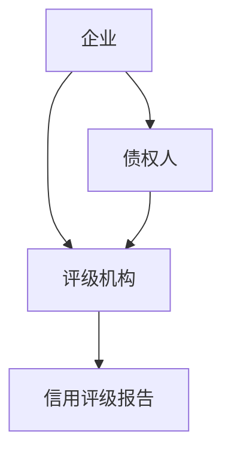
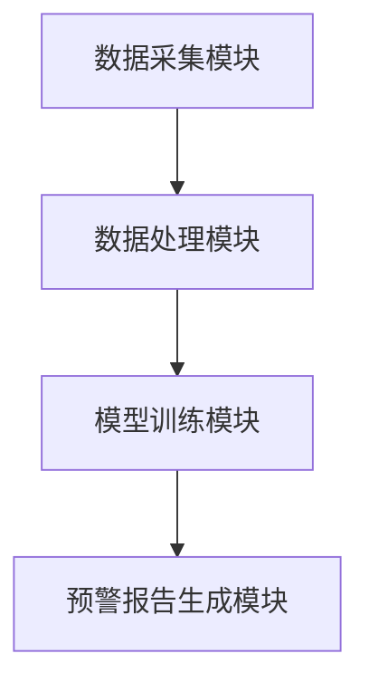

                 


# AI辅助的企业信用评级预警

## 关键词：人工智能、企业信用评级、信用预警、机器学习、风险管理、金融数据分析

## 摘要：本文探讨了人工智能在企业信用评级预警中的应用，详细分析了传统信用评级方法的局限性，以及AI技术如何通过机器学习模型提高信用评级的准确性和及时性。文章从背景、核心概念、算法原理、系统架构到项目实战，全面解析了AI辅助信用评级预警的实现过程，为企业风险管理提供了新的思路和解决方案。

---

## 正文

### 第1章: 企业信用评级预警的背景与挑战

#### 1.1 企业信用评级的定义与重要性
企业信用评级是对企业信用状况进行评估的过程，旨在衡量企业在偿还债务时的可靠性和能力。信用评级结果直接影响企业的融资成本和市场信任度。

- **信用评级的重要性**：信用评级是企业获取贷款、发行债券等融资活动的重要依据。良好的信用评级可以帮助企业以更低的成本获得资金，而差的信用评级则可能导致融资困难。
- **信用评级的主体**：主要包括企业、金融机构（如银行、债券发行人）和评级机构。评级机构负责对企业进行信用评级，并提供专业的评级报告。

#### 1.2 企业信用评级预警的必要性
企业信用评级预警是指通过监测企业的财务状况和经营环境的变化，及时发现潜在的信用风险，并采取相应的措施进行预警。预警机制能够有效降低信用风险，保护债权人的利益。

- **信用风险的来源**：包括企业财务状况恶化、市场环境变化、管理问题等。例如，企业销售额下降、利润率下滑可能导致信用评级下调。
- **传统信用评级方法的局限性**：传统方法主要依赖财务数据和人工分析，存在主观性强、效率低、覆盖面窄等问题。例如，人工分析可能遗漏一些非财务因素，如管理团队的稳定性。

#### 1.3 AI技术在信用评级中的应用前景
人工智能（AI）技术通过机器学习算法能够从海量数据中提取有用信息，发现潜在的信用风险。AI技术的应用可以显著提高信用评级的准确性和效率。

- **AI的优势**：AI能够处理结构化和非结构化数据，发现传统方法难以捕捉的复杂模式。例如，自然语言处理（NLP）可以分析企业新闻、社交媒体等文本数据，提取潜在风险信号。
- **信用评级预警的未来趋势**：随着AI技术的不断进步，信用评级将更加智能化、自动化。实时监测和动态调整将成为信用评级预警的重要特征。

### 第2章: 企业信用评级预警的核心概念与联系

#### 2.1 企业信用评级的实体关系分析
为了更好地理解信用评级的核心概念，我们需要明确涉及的主要实体及其关系。

- **实体关系图**：

- **核心要素**：企业信用评级的核心要素包括财务状况、经营能力、市场环境、管理团队等。例如，财务状况包括收入、利润、负债等指标；经营能力包括市场份额、创新能力等。

#### 2.2 AI辅助信用评级的原理
AI辅助信用评级的原理是通过机器学习算法对海量数据进行分析，提取有用的特征，并建立预测模型，从而实现信用评级的自动化和智能化。

- **数据采集与特征提取**：数据来源包括财务报表、市场数据、新闻媒体等。特征提取需要考虑相关性、重要性和可解释性。
- **模型训练与预测**：使用机器学习算法（如逻辑回归、支持向量机、神经网络等）对特征进行建模，训练模型并进行预测。
- **结果解释与反馈**：模型预测结果需要能够被解释，并根据实际结果调整模型参数，优化模型性能。

#### 2.3 信用评级预警的数学模型
逻辑回归是一种常用的信用评分模型，其数学公式如下：
$$ P(y=1|x) = \frac{1}{1 + e^{-\beta x}} $$
其中，$x$ 是输入特征向量，$\beta$ 是模型参数。

- **模型实现步骤**：
  1. 数据预处理：清洗数据、处理缺失值、标准化等。
  2. 特征选择：根据特征的重要性选择关键特征。
  3. 模型训练：使用训练数据训练逻辑回归模型。
  4. 模型评估：使用测试数据评估模型性能，如准确率、召回率等。

### 第3章: AI辅助信用评级预警的算法原理

#### 3.1 逻辑回归算法
- **算法原理**：逻辑回归是一种用于分类的统计方法，通过logistic函数将线性回归的结果映射到概率空间。
- **算法实现步骤**：
  1. 数据预处理：确保数据质量，处理缺失值和异常值。
  2. 特征选择：选择对信用评级影响较大的特征。
  3. 模型训练：使用训练数据训练逻辑回归模型。
  4. 模型评估：计算准确率、召回率、F1分数等指标。
- **优缺点**：优点是简单易懂、计算效率高；缺点是假设特征之间独立，可能不适用于复杂场景。

#### 3.2 支持向量机算法
- **算法原理**：支持向量机（SVM）通过构建超平面将数据点分到不同类别，适用于高维数据分类。
- **算法实现步骤**：
  1. 数据预处理：对数据进行标准化或归一化处理。
  2. 特征选择：选择对信用评级影响较大的特征。
  3. 模型训练：使用训练数据训练SVM模型。
  4. 模型评估：计算准确率、召回率、F1分数等指标。
- **优缺点**：优点是适用于高维数据，泛化能力强；缺点是计算复杂度高，适合小规模数据。

#### 3.3 神经网络算法
- **算法原理**：神经网络通过多层感知机模拟人脑神经网络的工作方式，能够处理非线性关系。
- **算法实现步骤**：
  1. 数据预处理：对数据进行归一化或标准化处理。
  2. 特征选择：选择对信用评级影响较大的特征。
  3. 模型训练：使用训练数据训练神经网络模型。
  4. 模型评估：计算准确率、召回率、F1分数等指标。
- **优缺点**：优点是能够处理复杂的非线性关系，适合大规模数据；缺点是计算复杂，需要大量的训练数据。

### 第4章: 系统分析与架构设计

#### 4.1 项目背景与目标
本项目旨在利用AI技术构建一个企业信用评级预警系统，通过实时监测企业的财务状况和市场环境，及时发现潜在的信用风险，帮助债权人和评级机构做出决策。

- **项目目标**：开发一个基于机器学习的企业信用评级预警系统。
- **项目范围**：涵盖数据采集、特征提取、模型训练、预警报告生成等功能。

#### 4.2 系统功能设计
- **数据采集模块**：从多种数据源（如财务报表、新闻媒体）获取企业数据。
- **模型训练模块**：使用机器学习算法训练信用评级模型。
- **预警报告生成模块**：根据模型预测结果生成预警报告。

#### 4.3 系统架构设计
- **分层架构**：系统分为数据层、业务逻辑层和用户界面层。
- **模块交互关系**：


#### 4.4 系统实现的注意事项
- **数据预处理**：确保数据质量和一致性，处理缺失值和异常值。
- **模型调优**：通过交叉验证和网格搜索优化模型参数。
- **系统安全性**：确保系统数据的安全性，防止数据泄露。

### 第5章: 项目实战

#### 5.1 环境安装
- **Python版本**：建议使用Python 3.6以上版本。
- **依赖库安装**：安装numpy、pandas、scikit-learn、tensorflow等库。

#### 5.2 系统核心实现源代码
以下是一个基于逻辑回归的信用评级预警系统的实现代码示例：

```python
import numpy as np
import pandas as pd
from sklearn.linear_model import LogisticRegression
from sklearn.metrics import accuracy_score, recall_rate_score, f1_score

# 数据加载
data = pd.read_csv('企业信用数据.csv')

# 数据预处理
# 假设 'label' 是目标变量，其余是特征
X = data.drop('label', axis=1)
y = data['label']

# 特征选择
# 假设选择 ' revenue', 'profit', 'debt' 作为特征
selected_features = ['revenue', 'profit', 'debt']
X = X[selected_features]

# 模型训练
model = LogisticRegression()
model.fit(X, y)

# 模型预测
y_pred = model.predict(X)

# 模型评估
print('准确率:', accuracy_score(y, y_pred))
print('召回率:', recall_rate_score(y, y_pred))
print('F1分数:', f1_score(y, y_pred))
```

#### 5.3 案例分析
假设我们有一个企业数据集，包含企业的收入、利润、负债等特征，以及信用评级标签。通过训练逻辑回归模型，我们可以对企业的信用评级进行预测，并生成预警报告。

#### 5.4 项目小结
通过项目实战，我们掌握了AI辅助信用评级预警系统的基本实现方法，包括数据预处理、特征选择、模型训练和结果评估。

---

## 第六章: 结论与展望

### 6.1 本文总结
本文详细探讨了AI辅助的企业信用评级预警系统的实现过程，从背景分析到算法实现，再到系统设计和项目实战，全面解析了AI技术在信用评级中的应用。

### 6.2 未来展望
随着AI技术的不断进步，信用评级预警系统将更加智能化和自动化。未来的研究方向包括：
- 更加复杂的模型（如深度学习模型）的应用。
- 多模态数据（如文本、图像）的融合。
- 实时监测和动态调整的实现。

---

## 作者：AI天才研究院 & 禅与计算机程序设计艺术

---

以上是《AI辅助的企业信用评级预警》的技术博客文章的完整目录和内容框架。

