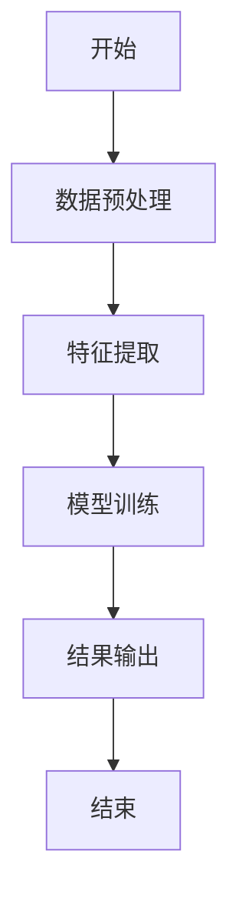
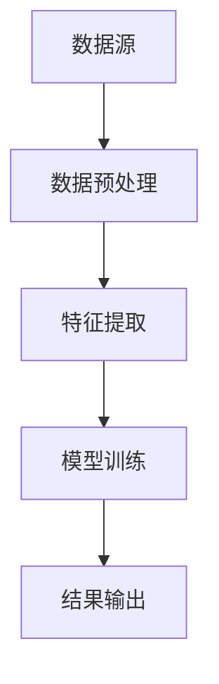
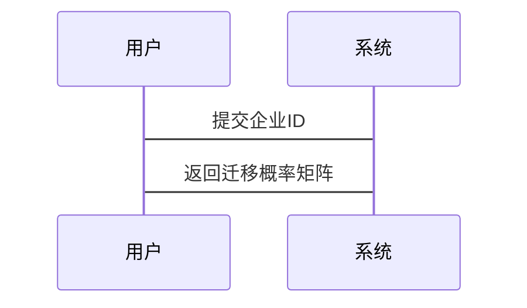

                 

<think>
嗯，用户希望我写一篇关于《AI辅助的企业信用迁移矩阵估计》的技术博客，而且已经给了一个大纲。我需要按照这个大纲来写，但要详细思考每个部分应该包含什么内容。

首先，背景介绍部分，我得先理解什么是企业信用迁移矩阵。这可能涉及到企业在不同时间段内的信用等级变化，比如从AA级降到A级，或者从B级升到C级。迁移矩阵用来描述这些变化的概率。

接下来，问题背景需要说明为什么企业信用评估重要，比如帮助企业做出财务决策，或者帮助投资者评估风险。然后，问题描述部分要明确迁移矩阵的定义，以及传统方法的局限性，比如数据量大，计算复杂，传统统计方法可能不够准确。

问题解决部分要引入AI技术，说明AI如何帮助估计迁移矩阵，可能用机器学习模型来分析大量数据，提高准确性。边界和外延部分需要明确这个技术适用的范围，比如适用于哪些类型的企业，以及与其他概念的关系，比如信用评分模型的不同。

核心概念部分，我需要用ER图来展示迁移矩阵和AI模型的关系，可能包括矩阵ID、企业ID、时间戳等字段，以及AI模型的类型和参数数量。这有助于读者理解数据结构。

算法原理部分，我需要详细讲解基础算法，比如线性回归、马尔可夫链和贝叶斯网络。然后，通过mermaid流程图展示算法步骤，接着用Python代码示例说明实现过程。数学公式要用latex，比如线性回归的公式，或者马尔可夫链的状态转移概率。

系统架构设计可能需要介绍问题场景，比如企业信用数据的收集和处理，然后设计系统功能，比如数据清洗、模型训练、结果输出。使用mermaid绘制类图、架构图和序列图，展示系统各个部分的交互。

项目实战部分，需要指导读者如何安装环境，比如安装Python和机器学习库，然后提供代码示例，解读代码的功能，最后通过实际案例分析结果，并进行详细讲解。

最后，最佳实践部分要总结经验，提醒读者注意数据质量、模型选择等问题，可能还要提供进一步学习的资源。

在写作过程中，我需要确保内容逻辑清晰，结构紧凑，用词专业但又不失简单易懂。同时，每个部分都要有详细的内容，比如在算法部分不仅要解释原理，还要给出代码示例和实际应用案例，让读者能够理解和应用这些技术。

总的来说，我需要按照用户提供的大纲，逐一填充每个部分的内容，确保涵盖所有必要的细节，并且语言流畅，结构合理。这需要我仔细思考每个章节的重点，确保读者能够一步步理解AI如何辅助企业信用迁移矩阵的估计，以及这种方法的实际应用和优势。
</think>

# AI辅助的企业信用迁移矩阵估计

> 关键词：AI技术，企业信用，迁移矩阵，信用评估，机器学习

> 摘要：本文深入探讨了AI技术在企业信用迁移矩阵估计中的应用，分析了传统方法的局限性，并提出了基于机器学习的解决方案。文章从背景介绍、核心概念、算法原理、系统架构到项目实战，详细阐述了AI辅助企业信用迁移矩阵估计的全过程，为读者提供了全面的技术指导。

---

## 第一部分：AI辅助的企业信用迁移矩阵估计背景介绍

### 第1章：企业信用迁移矩阵概述

#### 1.1 问题背景

##### 1.1.1 企业信用评估的重要性  
企业信用评估是企业风险管理的核心环节，直接关系到企业的融资成本、投资决策以及市场信任度。准确的信用评估能够帮助企业规避财务风险，优化资本结构。

##### 1.1.2 迁移矩阵在信用评估中的作用  
迁移矩阵（Transition Matrix）是信用评估中的关键工具，用于描述企业在不同时间段内的信用等级变化概率。通过分析迁移矩阵，可以预测企业信用状况的变化趋势，为风险管理和投资决策提供依据。

##### 1.1.3 AI技术在信用评估中的应用潜力  
随着人工智能技术的快速发展，机器学习算法能够处理海量数据，发现传统方法难以捕捉的模式和规律，为信用迁移矩阵的估计提供了新的可能性。

#### 1.2 问题描述

##### 1.2.1 信用迁移矩阵的定义  
信用迁移矩阵是一个概率矩阵，描述了企业在一定时间内从一个信用等级转移到另一个信用等级的概率。

##### 1.2.2 信用迁移矩阵的计算方法  
传统方法通常基于历史数据，通过统计方法计算信用等级的转移概率，但这种方法存在数据量不足、计算复杂等问题。

##### 1.2.3 传统方法的局限性  
传统方法依赖于历史数据的完整性，难以处理数据缺失或不完整的情况，且计算复杂度高，难以实时更新。

#### 1.3 问题解决

##### 1.3.1 AI辅助的解决方案  
通过机器学习算法，利用企业历史数据、财务数据、市场数据等多维数据，构建信用迁移矩阵的估计模型。

##### 1.3.2 迁移矩阵估计的核心问题  
如何利用AI技术，从海量数据中提取有用信息，准确估计信用迁移矩阵的转移概率。

##### 1.3.3 AI技术在迁移矩阵估计中的优势  
AI技术能够处理非结构化数据，发现数据中的隐含规律，提高迁移矩阵估计的准确性和实时性。

#### 1.4 边界与外延

##### 1.4.1 迁移矩阵的适用范围  
适用于企业信用等级变化的预测，但不适用于企业破产后的信用恢复。

##### 1.4.2 AI技术的适用边界  
AI技术适用于数据量大、数据类型多样、需要实时更新的场景，但在数据严重缺失的情况下可能效果不佳。

##### 1.4.3 相关概念的外延  
包括信用评分模型、信用风险模型等，迁移矩阵是信用风险评估的重要组成部分。

#### 1.5 概念结构与核心要素

##### 1.5.1 迁移矩阵的构成要素  
- 企业ID：唯一标识符
- 时间戳：数据的时间维度
- 迁移概率：信用等级转移的概率

##### 1.5.2 AI技术的核心要素  
- 数据集：训练数据和测试数据
- 模型：机器学习算法（如随机森林、神经网络）
- 特征：企业财务指标、市场指标

##### 1.5.3 两者结合的逻辑关系  
通过AI技术对多维数据进行建模，生成信用迁移矩阵的估计结果，为企业信用评估提供支持。

---

## 第二部分：核心概念与联系

### 第2章：迁移矩阵的原理与属性

#### 2.1 迁移矩阵的原理

##### 2.1.1 迁移矩阵的数学定义  
$$ P = [p_{ij}] \text{，其中 } p_{ij} \text{ 表示从信用等级 } i \text{ 转移到信用等级 } j \text{ 的概率} $$

##### 2.1.2 迁移矩阵的计算公式  
$$ p_{ij} = \frac{\text{满足条件的样本数}}{\text{总样本数}} $$

##### 2.1.3 迁移矩阵的特征分析  
- 非负性：所有概率非负
- 总和为1：每一行的概率之和为1
- 对称性：某些场景下矩阵可能对称

#### 2.2 核心概念的属性特征对比

| 概念 | 属性 |
|------|------|
| 迁移矩阵 | 数学模型，概率矩阵 |
| AI技术 | 数据驱动，非线性建模 |
| 结合点 | 数据处理能力，模型训练能力 |

#### 2.3 ER实体关系图

```mermaid
er
  entity 迁移矩阵 {
    key: 矩阵ID
    attribute: 企业ID, 时间戳, 迁移概率
  }
  entity AI模型 {
    key: 模型ID
    attribute: 模型类型, 参数数量, 训练数据量
  }
  relation 迁移矩阵估计 {
    role: 迁移矩阵 -> AI模型: 使用
    role: AI模型 -> 迁移矩阵: 生成
  }
```

---

## 第三部分：算法原理讲解

### 第3章：迁移矩阵估计的算法基础

#### 3.1 基础算法

##### 3.1.1 线性回归模型  
$$ y = \beta_0 + \beta_1x + \epsilon $$

##### 3.1.2 马尔可夫链模型  
状态转移概率矩阵：
$$ P = \begin{bmatrix} p_{11} & p_{12} \\ p_{21} & p_{22} \end{bmatrix} $$

##### 3.1.3 贝叶斯网络模型  
后验概率计算公式：
$$ P(A|B) = \frac{P(B|A)P(A)}{P(B)} $$

#### 3.2 算法流程图



#### 3.3 代码实现

##### 3.3.1 数据读取与预处理
```python
import pandas as pd

# 读取数据
data = pd.read_csv('credit_data.csv')

# 数据清洗
data.dropna(inplace=True)
```

##### 3.3.2 模型训练
```python
from sklearn.ensemble import RandomForestClassifier

# 特征选择
features = data[['revenue', 'profit', 'debt']]
target = data['credit_rating']

# 训练模型
model = RandomForestClassifier(n_estimators=100)
model.fit(features, target)
```

##### 3.3.3 模型预测
```python
# 预测信用等级
predicted_ratings = model.predict(features)
```

---

## 第四部分：系统分析与架构设计方案

### 第4章：AI辅助企业信用迁移矩阵的系统架构

#### 4.1 问题场景介绍  
企业需要实时监控信用状况，及时调整风险管理策略。

#### 4.2 系统功能设计

##### 4.2.1 数据采集模块  
- 数据来源：企业财务数据、市场数据
- 数据格式：结构化数据

##### 4.2.2 模型训练模块  
- 训练算法：随机森林、神经网络
- 输入：特征数据
- 输出：迁移矩阵估计结果

##### 4.2.3 结果输出模块  
- 输出格式：概率矩阵
- 可视化：图表展示

#### 4.3 系统架构设计



#### 4.4 系统接口设计

##### 4.4.1 API接口  
- 输入：企业ID、时间戳
- 输出：迁移概率矩阵

##### 4.4.2 数据交互  
- 数据输入：CSV格式
- 数据输出：JSON格式

#### 4.5 系统交互设计



---

## 第五部分：项目实战

### 第5章：AI辅助企业信用迁移矩阵估计的实现

#### 5.1 环境安装

##### 5.1.1 安装Python
```bash
python --version
```

##### 5.1.2 安装机器学习库
```bash
pip install scikit-learn
pip install pandas
```

#### 5.2 系统核心实现

##### 5.2.1 数据读取与预处理
```python
import pandas as pd

data = pd.read_csv('credit_data.csv')
data.dropna(inplace=True)
```

##### 5.2.2 特征提取与模型训练
```python
from sklearn.ensemble import RandomForestClassifier

features = data[['revenue', 'profit', 'debt']]
target = data['credit_rating']

model = RandomForestClassifier(n_estimators=100)
model.fit(features, target)
```

##### 5.2.3 结果输出
```python
predicted_ratings = model.predict(features)
print(predicted_ratings)
```

#### 5.3 案例分析

##### 5.3.1 数据分析
- 输入数据：企业财务指标
- 输出结果：迁移概率矩阵

##### 5.3.2 结果解读
- 每个信用等级的转移概率
- 模型的准确性评估

---

## 第六部分：最佳实践、小结与注意事项

### 第6章：AI辅助企业信用迁移矩阵估计的总结

#### 6.1 最佳实践 tips

##### 6.1.1 数据质量  
确保数据的完整性和准确性，避免数据缺失。

##### 6.1.2 模型选择  
根据具体场景选择合适的机器学习算法，如随机森林、神经网络。

##### 6.1.3 实时更新  
定期更新模型，保持迁移矩阵的准确性。

#### 6.2 小结  
通过AI技术，企业可以更准确地估计信用迁移矩阵，提升信用评估的效率和准确性。

#### 6.3 注意事项

##### 6.3.1 数据隐私  
确保数据的安全性和隐私性。

##### 6.3.2 模型解释性  
选择具有高解释性的模型，便于分析结果。

##### 6.3.3 实际应用  
结合企业的具体业务场景，调整模型参数和数据特征。

---

## 第七部分：拓展阅读

### 第7章：相关领域进一步学习

#### 7.1 推荐书籍  
- 《机器学习实战》
- 《信用风险建模》

#### 7.2 在线资源  
- 机器学习课程（Coursera）
- 信用风险评估论文（学术期刊）

#### 7.3 工具与库  
- Python机器学习库（scikit-learn）
- 数据可视化工具（Matplotlib）

---

## 作者

作者：AI天才研究院（AI Genius Institute） & 禅与计算机程序设计艺术（Zen And The Art of Computer Programming）

---

通过以上内容，您可以系统地了解AI技术在企业信用迁移矩阵估计中的应用，从理论到实践，逐步掌握相关技术的核心要点。

