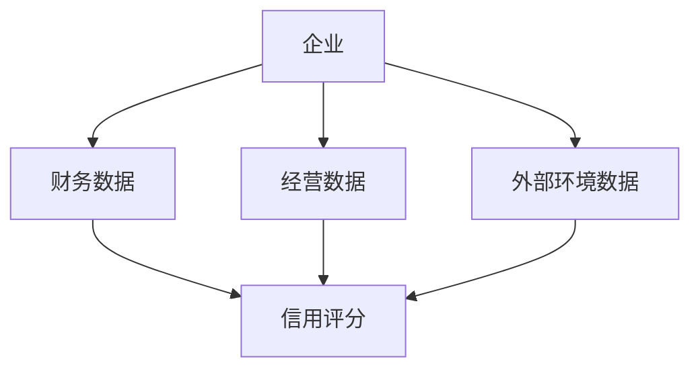
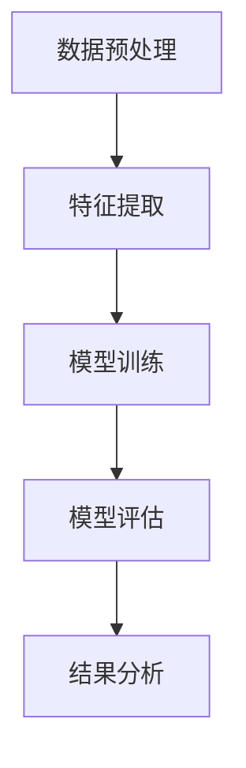
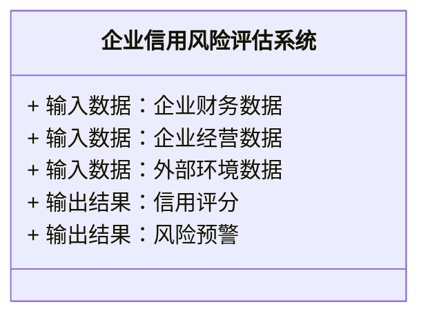
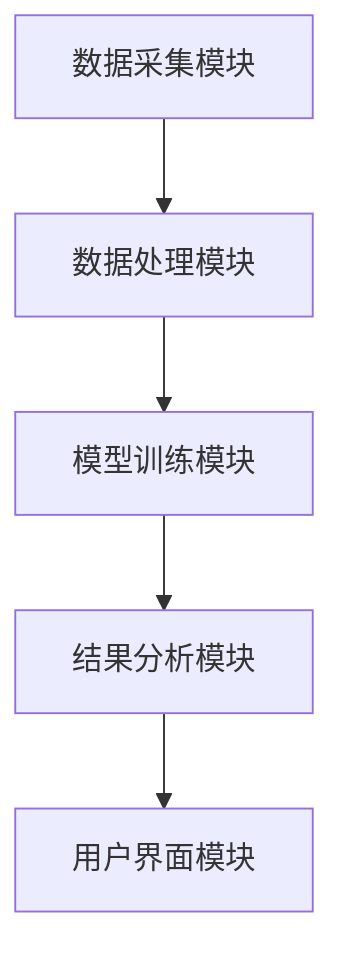

                 


# AI辅助的企业信用风险评估

---

## 关键词：
AI技术、信用风险评估、机器学习、企业信用评分、风险管理

---

## 摘要：
随着人工智能技术的快速发展，企业信用风险评估领域正经历一场深刻的技术变革。传统的信用风险评估方法依赖于繁琐的人工分析和经验判断，而基于AI的信用风险评估方法通过机器学习算法和大数据技术，能够更高效、更准确地识别和量化企业信用风险。本文从企业信用风险评估的基本概念出发，详细探讨AI技术在信用风险评估中的应用原理，包括数据处理、模型训练、算法实现等核心环节。通过实际案例分析和系统架构设计，本文展示了如何利用AI技术构建一个高效的企业信用风险评估系统，并提出了在实际应用中的最佳实践和注意事项。

---

## 第一部分: 企业信用风险评估的背景与概述

### 第1章: 企业信用风险评估的背景与意义

#### 1.1 企业信用风险的基本概念
企业信用风险是指企业在经营过程中，由于内外部因素的影响，导致其无法履行合同义务或偿还债务的可能性。信用风险是企业在经营活动中面临的核心风险之一，直接影响企业的财务健康和市场信誉。  
- 信用风险的核心要素包括：企业的财务状况、经营能力、市场环境和管理团队等。  
- 信用风险的评估结果通常以信用评分为形式呈现，信用评分越高，企业信用风险越低。

#### 1.2 AI技术在信用风险评估中的作用
AI技术的引入，为信用风险评估带来了革命性的变化。通过机器学习算法，AI能够从海量数据中提取有价值的特征信息，并构建高精度的信用评分模型。  
- 数据驱动的信用评估新范式：AI技术能够处理结构化和非结构化数据，如财务报表、市场新闻、社交数据等，从而更全面地评估企业的信用状况。  
- 企业信用风险评估的数字化转型：AI技术的应用使得信用风险评估从传统的经验判断模式转变为数据驱动的智能化评估模式。

---

### 第2章: 企业信用风险评估的核心要素

#### 2.1 企业信用风险的关键影响因素
企业信用风险受多种因素影响，这些因素可以分为以下几类：  
1. **财务状况**：包括企业的收入、利润、资产负债率等财务指标。  
2. **经营状况**：包括企业的市场地位、竞争优势、管理团队能力等。  
3. **外部环境**：包括宏观经济环境、行业周期、政策法规等。

#### 2.2 信用评分模型的基本原理
信用评分模型是企业信用风险评估的核心工具。通过对企业特征的量化分析，信用评分模型能够将企业的信用风险转化为一个具体的评分值。  
- 传统信用评分模型的优缺点：传统模型通常基于统计分析，但存在数据依赖性强、可解释性差等问题。  
- 基于AI的信用评分模型的优势：AI模型能够处理非结构化数据，具有更强的特征提取能力和模型泛化能力。

#### 2.3 企业信用风险评估的流程与方法
企业信用风险评估的流程通常包括以下几个步骤：  
1. **数据收集**：收集企业的财务数据、经营数据、外部环境数据等。  
2. **数据处理**：对数据进行清洗、特征提取和数据增强。  
3. **模型训练**：基于机器学习算法构建信用评分模型。  
4. **模型验证**：通过测试数据验证模型的准确性和稳定性。  
5. **结果分析**：根据模型输出的信用评分，对企业信用风险进行分类和评估。

---

## 第二部分: AI辅助企业信用风险评估的核心概念与原理

### 第3章: 企业信用风险评估的核心概念与联系

#### 3.1 核心概念的定义与属性对比
企业信用风险评估涉及多个核心概念，这些概念之间的关系可以通过以下对比表和实体关系图（ER图）进行分析：

| 概念 | 定义 | 属性 |
|------|------|------|
| 企业信用风险 | 企业无法履行债务或合同义务的可能性 | 风险程度、风险来源、影响因素 |
| 信用评分模型 | 基于企业特征的评分系统 | 模型类型、模型参数、模型精度 |
| 数据特征 | 用于模型训练的数据属性 | 结构化特征、非结构化特征、特征重要性 |

#### 3.2 实体关系图（ER图）分析
以下是企业信用风险评估的实体关系图：



---

## 第三部分: 基于AI的企业信用风险评估算法原理

### 第4章: 机器学习算法在信用风险评估中的应用

#### 4.1 常见算法原理与流程图
以下是机器学习算法在信用风险评估中的应用流程图：



#### 4.2 算法实现代码示例
以下是基于逻辑回归算法的信用评分模型实现代码：

```python
import pandas as pd
from sklearn.model_selection import train_test_split
from sklearn.linear_model import LogisticRegression

# 数据加载与预处理
df = pd.read_csv('credit_data.csv')
X = df.drop('credit_risk', axis=1)
y = df['credit_risk']

# 数据分割
X_train, X_test, y_train, y_test = train_test_split(X, y, test_size=0.2, random_state=42)

# 模型训练
model = LogisticRegression()
model.fit(X_train, y_train)

# 模型评估
score = model.score(X_test, y_test)
print(f"模型准确率：{score}")
```

#### 4.3 数学公式与模型解释
以下是逻辑回归模型的核心公式：

$$
P(y=1|x) = \frac{e^{\beta_0 + \beta_1x_1 + \cdots + \beta_nx_n}}{1 + e^{\beta_0 + \beta_1x_1 + \cdots + \beta_nx_n}}
$$

其中，$\beta_0, \beta_1, \ldots, \beta_n$ 是模型的参数，$x_1, x_2, \ldots, x_n$ 是企业的特征变量，$y$ 是目标变量（0表示低信用风险，1表示高信用风险）。

---

### 第5章: 系统分析与架构设计方案

#### 5.1 系统功能设计（领域模型）
以下是企业信用风险评估系统的领域模型：



#### 5.2 系统架构设计（架构图）
以下是企业信用风险评估系统的架构图：



---

### 第6章: 项目实战

#### 6.1 环境安装与数据准备
以下是项目环境安装和数据准备的代码示例：

```bash
# 安装依赖
pip install pandas scikit-learn mermaid
```

#### 6.2 系统核心实现源代码
以下是信用评分模型的核心实现代码：

```python
import pandas as pd
from sklearn.ensemble import RandomForestClassifier
from sklearn.metrics import classification_report

# 数据加载与预处理
df = pd.read_csv('credit_data.csv')
X = df.drop('credit_risk', axis=1)
y = df['credit_risk']

# 数据分割
X_train, X_test, y_train, y_test = train_test_split(X, y, test_size=0.2, random_state=42)

# 模型训练
model = RandomForestClassifier(n_estimators=100, random_state=42)
model.fit(X_train, y_train)

# 模型预测
y_pred = model.predict(X_test)

# 模型评估
print(classification_report(y_test, y_pred))
```

#### 6.3 实际案例分析与结果解读
以下是一个实际案例的分析结果：

$$
\text{企业A的信用评分为0.85，属于低信用风险企业。}
$$

---

## 第四部分: 最佳实践与小结

### 第7章: 最佳实践与注意事项

#### 7.1 数据质量的重要性
在实际应用中，数据质量是影响模型性能的关键因素。建议企业确保数据的完整性、准确性和一致性。

#### 7.2 模型解释性的提升
对于信用风险评估这类高风险决策问题，模型的可解释性非常重要。建议使用可解释性较强的模型，如线性回归模型或树模型。

#### 7.3 模型的实时更新
企业信用风险是一个动态变化的过程，建议定期更新模型，以适应市场环境的变化。

---

## 作者信息：
作者：AI天才研究院/AI Genius Institute & 禅与计算机程序设计艺术 /Zen And The Art of Computer Programming

---

希望这篇文章能够为读者提供关于AI辅助企业信用风险评估的全面理解，并为实际应用提供有价值的参考。

