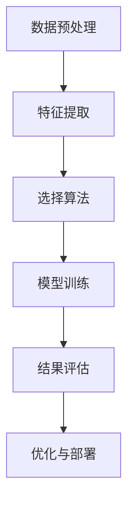
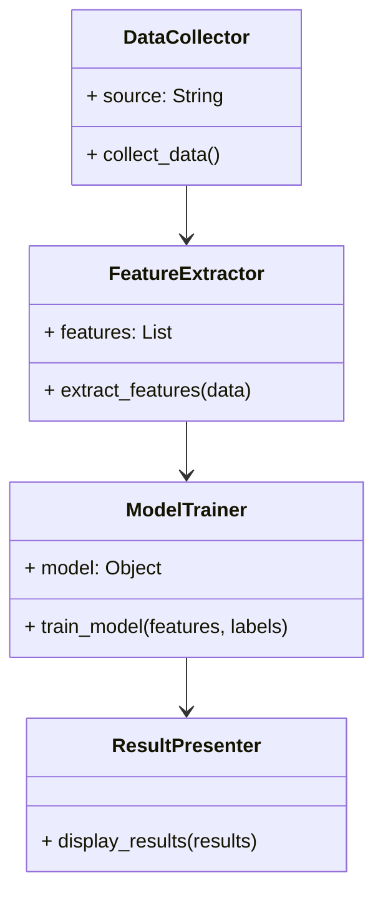
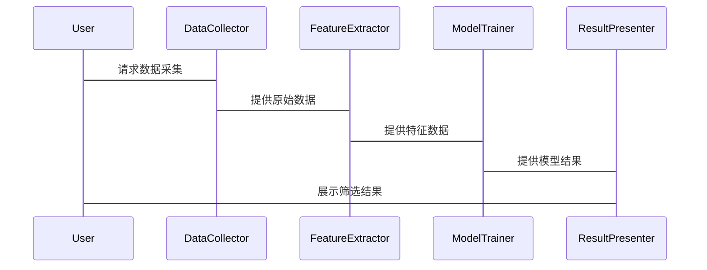

                 

<think>
嗯，用户现在让我写一篇关于《AI辅助的企业并购target筛选》的技术博客。看起来用户是一位在技术领域有深厚背景的人，可能是CTO或者技术畅销书的作者。他的需求很明确，需要一篇结构清晰、内容详实的专业技术博客，字数在10000到12000字左右，使用Markdown格式，并且包含大量的技术细节和实例。

首先，我得理解用户的需求。他可能是一位企业高管或者技术专家，希望通过这篇文章分享AI在企业并购中的应用，展示技术深度和实际应用价值。因此，文章需要专业但易懂，逻辑清晰，结构紧凑。

接下来，我需要按照用户提供的目录大纲来组织内容。目录已经涵盖了背景、核心概念、算法原理、系统架构、项目实战和小结等部分，每个部分都有三级子标题。我需要确保每个部分都详细展开，满足用户对技术深度的要求。

在写作过程中，我必须注意每个章节的结构，确保每个小节都有足够的细节。例如，在“AI辅助并购的算法原理”部分，我需要详细解释每种算法的工作原理，并提供Python代码示例，同时用Mermaid流程图展示流程。这不仅帮助读者理解，也增加了文章的实用性。

我还需要确保在适当的位置插入图表，如ER图、流程图、类图和序列图。这些图表使用Mermaid语法，可以在Markdown中直接显示，使内容更直观。此外，数学公式需要用LaTeX格式，并且在独立段落中使用$$包裹，段落内使用$包裹，保持格式统一。

在“项目实战”部分，我需要选择一个具体的案例，如筛选科技型目标企业，并详细讲解环境配置、代码实现和案例分析。这不仅展示理论知识，还能让读者看到实际应用，增强文章的说服力。

最后，在“最佳实践与小结”部分，我需要总结整个内容，强调AI在并购中的优势，同时指出实际应用中的注意事项，如数据质量和算法选择。这为读者提供了实用的建议，帮助他们更好地应用AI技术。

总的来说，我需要按照用户的指示，逐步构建每个章节的内容，确保文章结构完整，技术细节详尽，同时保持语言的专业性和易懂性。这样，用户才能得到一篇高质量、有深度的技术博客，满足他的需求。
</think>

# AI辅助的企业并购target筛选

> 关键词：企业并购，AI辅助，目标筛选，算法原理，系统架构，项目实战

> 摘要：本文详细探讨了AI技术在企业并购目标筛选中的应用，从背景介绍、核心概念、算法原理、系统架构到项目实战，全面分析了AI如何提升企业并购的效率和准确性。文章结合实际案例，深入讲解了AI辅助并购的实现过程，并提供了丰富的技术细节和代码示例。

---

## 第一部分: AI辅助的企业并购target筛选概述

### 第1章: 企业并购与AI辅助筛选的背景

#### 1.1 企业并购的基本概念
企业并购是企业战略发展的重要手段之一，通过合并或收购其他企业，实现资源优化配置、市场拓展或技术整合。并购的核心问题在于如何筛选出符合自身战略目标的优质标的。

##### 1.1.1 企业并购的定义与类型
- **定义**：企业并购是指一家企业合并或收购另一家企业，以实现业务扩展或战略调整。
- **类型**：
  - 横向并购：同一行业内的并购。
  - 纵向并购：上下游产业的并购。
  - 混合并购：跨行业并购。

##### 1.1.2 并购中的目标筛选问题
目标筛选是企业并购的关键环节，涉及以下问题：
- 如何从海量企业中筛选出符合战略目标的标的？
- 如何评估目标企业的财务健康状况？
- 如何预测目标企业的市场表现和未来价值？

##### 1.1.3 AI技术在并购中的应用潜力
AI技术可以通过数据分析、模式识别和预测模型，帮助企业更高效地筛选并购目标，降低信息不对称风险。

---

#### 1.2 AI辅助并购的必要性
##### 1.2.1 并购中的信息不对称问题
企业并购涉及大量非公开信息，传统的人工筛选方式效率低、成本高，且容易遗漏重要信息。

##### 1.2.2 数据驱动的决策优势
通过AI技术，企业可以利用大数据分析目标企业的财务数据、市场表现、技术实力等信息，做出更精准的决策。

##### 1.2.3 AI技术如何提高筛选效率
- **自动化数据处理**：AI可以快速处理海量数据，提取关键特征。
- **智能推荐**：基于算法模型，AI可以主动推荐潜在并购目标。
- **风险预测**：AI可以通过历史数据预测目标企业的未来表现，降低并购风险。

---

#### 1.3 当前AI在企业并购中的应用现状
##### 1.3.1 AI在并购中的主要应用场景
- **目标企业筛选**：通过AI算法筛选出符合条件的并购目标。
- **价值评估**：利用AI模型预测目标企业的未来价值。
- **风险预警**：通过AI分析潜在风险，降低并购失败概率。

##### 1.3.2 国内外研究与实践进展
- **国外研究**：美国、欧洲等地的学术界和企业界已经在AI辅助并购方面进行了大量研究，取得了显著成果。
- **国内实践**：中国的科技企业和金融机构也开始尝试将AI技术应用于并购决策。

##### 1.3.3 未来发展趋势与挑战
- **趋势**：AI技术将更加深度地融入企业并购的各个环节，从目标筛选到并购后的整合。
- **挑战**：数据隐私、模型泛化能力、技术与业务的结合等。

---

### 第2章: AI辅助企业并购的核心概念

#### 2.1 企业并购目标筛选的关键要素
##### 2.1.1 财务指标分析
- **收入与利润**：评估企业的盈利能力。
- **现金流**：衡量企业的财务健康状况。
- **资产负债率**：评估企业的财务风险。

##### 2.1.2 市场表现评估
- **市场份额**：目标企业在市场中的地位。
- **增长率**：目标企业的市场扩展能力。
- **竞争环境**：行业内的竞争格局。

##### 2.1.3 技术与创新能力
- **专利数量**：目标企业的技术储备。
- **研发团队**：企业的技术创新能力。
- **技术领先性**：目标技术在行业中的地位。

##### 2.1.4 管理团队稳定性
- **团队背景**：管理团队的经验和能力。
- **团队稳定性**：管理团队的稳定性对并购后整合的影响。

---

#### 2.2 AI辅助筛选的逻辑框架
##### 2.2.1 数据特征提取
- **数据来源**：财务数据、市场数据、专利数据、新闻数据等。
- **特征选择**：从海量数据中提取关键特征，如收入增长率、研发投入占比等。

##### 2.2.2 算法选择与模型构建
- **算法选择**：根据问题类型选择合适的算法，如聚类、分类或回归。
- **模型构建**：基于特征数据，构建预测模型。

##### 2.2.3 结果评估与优化
- **评估指标**：准确率、召回率、F1值等。
- **模型优化**：通过调参和数据增强优化模型性能。

---

#### 2.3 核心概念对比分析
##### 2.3.1 数据特征与算法性能对比
- **数据特征**：不同特征对模型性能的影响。
- **算法性能**：不同算法在目标筛选中的表现对比。

##### 2.3.2 不同算法的适用场景
- **聚类算法**：适用于无标签数据的聚类分析。
- **分类算法**：适用于有标签数据的分类任务。
- **回归算法**：适用于数值型目标的预测任务。

##### 2.3.3 模型评估指标的优劣势
- **准确率**：优点是直观，缺点是不适用于类别不均衡的数据。
- **召回率**：优点是关注正样本的识别，缺点是忽略负样本的误判。
- **F1值**：综合考虑准确率和召回率，适用于分类任务。

---

### 第3章: AI辅助并购的算法原理

#### 3.1 常见算法概述
##### 3.1.1 聚类算法
- **K-means**：经典的无监督聚类算法，适用于目标企业分组。
- **DBSCAN**：基于密度的聚类算法，适用于处理噪声数据。

##### 3.1.2 分类算法
- **逻辑回归**：适用于二分类问题，如目标企业是否符合并购条件。
- **随机森林**：适用于多分类问题，具有较高的准确率和鲁棒性。

##### 3.1.3 回归算法
- **线性回归**：适用于数值型目标的预测，如目标企业的未来收入预测。
- **支持向量机（SVM）**：适用于小样本数据的分类和回归任务。

---

#### 3.2 算法流程图


---

#### 3.3 Python实现示例
```python
from sklearn.cluster import KMeans
import pandas as pd

# 示例数据加载
data = pd.read_csv('target_data.csv')
# 特征提取
features = data[['revenue', 'profit', 'growth_rate']]
# 模型训练
model = KMeans(n_clusters=3)
model.fit(features)
# 预测结果
clusters = model.predict(features)
print(clusters)
```

---

## 第四部分: 项目实战

### 第4章: 项目实战与案例分析

#### 4.1 项目背景
- **项目目标**：筛选适合并购的科技型目标企业。
- **数据来源**：公开的财务数据、专利数据、新闻数据等。

#### 4.2 系统功能设计
##### 4.2.1 功能模块
- **数据采集**：从多种数据源获取目标企业信息。
- **特征提取**：提取关键特征，如收入、利润、增长率等。
- **模型训练**：基于特征数据，训练分类或回归模型。
- **结果展示**：将筛选结果以可视化形式展示。

##### 4.2.2 系统架构


#### 4.3 系统交互流程


---

## 第五部分: 最佳实践与小结

### 第5章: 最佳实践与小结

#### 5.1 最佳实践
- **数据质量**：确保数据的准确性和完整性。
- **算法选择**：根据具体问题选择合适的算法。
- **模型优化**：通过调参和数据增强优化模型性能。
- **结果验证**：通过实际案例验证模型的准确性。

#### 5.2 小结
AI技术在企业并购中的应用前景广阔，通过AI辅助目标筛选，企业可以显著提高并购效率和准确性。然而，实际应用中仍需注意数据隐私、模型泛化能力等问题。

---

## 作者：AI天才研究院/AI Genius Institute & 禅与计算机程序设计艺术 /Zen And The Art of Computer Programming

