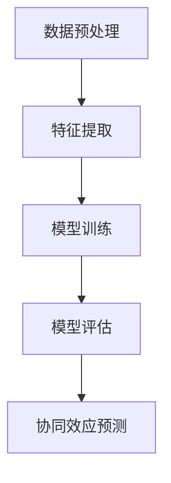

                 


# AI辅助的企业并购协同效应量化

> 关键词：企业并购、协同效应、人工智能、量化分析、系统架构

> 摘要：本文将详细探讨如何利用人工智能技术量化企业并购中的协同效应。通过分析协同效应的定义、分类及其对企业发展的影响，结合AI算法和数学模型，提供一种创新的方法来评估和预测并购后的协同效应。文章从背景介绍、核心概念、算法原理、系统架构到项目实战，全面解析AI在企业并购中的应用，为读者提供理论支持和实践指导。

---

# 第1章: 企业并购与协同效应概述

## 1.1 企业并购的基本概念
### 1.1.1 企业并购的定义与类型
企业并购是指一家企业通过购买或合并其他企业来扩大规模、优化资源或进入新市场。常见的并购类型包括横向并购、纵向并购和混合并购。

### 1.1.2 协同效应的定义与分类
协同效应是指并购后企业之间在资源整合、成本节约、收入增长等方面的协同效果。协同效应可分为财务协同、战略协同和技术协同。

### 1.1.3 协同效应的重要性
协同效应是企业并购成功的关键因素，直接影响企业的价值和长期发展。

## 1.2 AI在企业并购中的应用背景
### 1.2.1 传统企业并购中的挑战
传统协同效应评估方法主观性强，难以量化。

### 1.2.2 AI技术在企业并购中的优势
AI技术能够通过大数据分析和机器学习模型提高协同效应评估的准确性和客观性。

### 1.2.3 协同效应量化的意义
量化协同效应能够帮助企业在并购决策中更科学地评估潜在收益。

## 1.3 本章小结
本章介绍了企业并购的基本概念和协同效应的重要性，以及AI技术在协同效应量化中的应用背景。

---

# 第2章: 协同效应的量化方法

## 2.1 协同效应的分类与计算
### 2.1.1 财务协同效应
包括成本节约、收入增长等财务指标。

### 2.1.2 战略协同效应
包括市场扩展、品牌价值提升等战略层面的协同。

### 2.1.3 技术协同效应
包括技术整合、研发资源共享等技术层面的协同。

## 2.2 协同效应的量化指标
### 2.2.1 财务指标
如EBITDA、净利润等。

### 2.2.2 非财务指标
如市场份额、品牌价值等。

## 2.3 协同效应的量化模型
### 2.3.1 简单加法模型
$$协同效应 = 协同效应A + 协同效应B$$

### 2.3.2 加权平均模型
$$协同效应 = w_1 \times 协同效应A + w_2 \times 协同效应B$$

### 2.3.3 回归分析模型
$$协同效应 = \beta_0 + \beta_1 \times X_1 + \beta_2 \times X_2$$

## 2.4 本章小结
本章介绍了协同效应的分类和量化方法，为后续的AI辅助量化奠定了基础。

---

# 第3章: AI辅助协同效应量化的核心概念

## 3.1 协同效应的多维度分析
### 3.1.1 数据来源与特征提取
通过分析企业的财务数据、市场数据和技术创新数据来提取特征。

### 3.1.2 AI模型在协同效应预测中的作用
利用机器学习模型（如随机森林、神经网络）预测协同效应。

## 3.2 协同效应的动态变化
### 3.2.1 并购后的协同效应演变
协同效应在并购后会随着时间推移逐渐显现。

### 3.2.2 协同效应的短期与长期影响
短期影响包括成本节约，长期影响包括市场扩展和技术创新。

## 3.3 协同效应的不确定性与风险
### 3.3.1 协同效应的不确定性
由于市场变化和企业战略调整，协同效应具有不确定性。

### 3.3.2 协同效应的风险管理
通过建立风险管理模型来降低协同效应的不确定性。

---

# 第4章: 协同效应量化的核心算法原理

## 4.1 机器学习模型的应用
### 4.1.1 线性回归模型
$$y = \beta_0 + \beta_1 x_1 + \beta_2 x_2 + \epsilon$$

### 4.1.2 随机森林模型
通过特征重要性分析确定协同效应的关键因素。

### 4.1.3 神经网络模型
使用深度学习模型捕捉非线性关系。

## 4.2 算法流程图


## 4.3 算法实现
### 4.3.1 数据预处理
```python
import pandas as pd
df = pd.read_csv('data.csv')
df.dropna(inplace=True)
```

### 4.3.2 特征提取
```python
from sklearn.feature_selection import SelectKBest
selector = SelectKBest(k=10)
X_selected = selector.fit_transform(X, y)
```

### 4.3.3 模型训练
```python
from sklearn.ensemble import RandomForestRegressor
model = RandomForestRegressor(n_estimators=100)
model.fit(X_selected, y)
```

## 4.4 本章小结
本章详细讲解了协同效应量化的核心算法原理，包括线性回归、随机森林和神经网络模型的应用。

---

# 第5章: 协同效应量化的数学模型

## 5.1 协同效应的加权平均模型
$$协同效应 = \sum_{i=1}^{n} w_i \times x_i$$

## 5.2 协同效应的回归分析模型
$$协同效应 = \beta_0 + \beta_1 \times X_1 + \beta_2 \times X_2$$

## 5.3 模型的验证与评估
### 5.3.1 模型评估指标
如R²、平均绝对误差（MAE）、均方误差（MSE）。

### 5.3.2 模型验证
通过交叉验证和网格搜索优化模型参数。

## 5.4 本章小结
本章介绍了协同效应量化的数学模型及其验证方法。

---

# 第6章: 系统架构与实现

## 6.1 系统功能设计
### 6.1.1 数据输入模块
用户输入企业并购数据。

### 6.1.2 数据处理模块
对数据进行清洗和特征提取。

### 6.1.3 模型计算模块
利用机器学习模型计算协同效应。

### 6.1.4 结果展示模块
以可视化方式展示协同效应评估结果。

## 6.2 系统架构设计


## 6.3 系统接口设计
### 6.3.1 API接口
提供RESTful API供其他系统调用。

### 6.3.2 数据接口
支持CSV和数据库导入。

## 6.4 本章小结
本章详细描述了协同效应量化系统的架构设计和实现方法。

---

# 第7章: 项目实战与最佳实践

## 7.1 项目实战
### 7.1.1 环境安装
安装Python、TensorFlow、Scikit-learn等工具。

### 7.1.2 数据准备
收集企业并购数据并进行预处理。

### 7.1.3 模型实现
训练随机森林模型并评估协同效应。

## 7.2 实际案例分析
以某企业并购案例为例，详细分析协同效应的量化过程。

## 7.3 最佳实践
### 7.3.1 数据质量的重要性
确保数据的完整性和准确性。

### 7.3.2 模型选择的策略
根据具体问题选择合适的机器学习模型。

## 7.4 小结
本章通过实际案例展示了AI辅助协同效应量化的具体实现，并总结了最佳实践。

---

# 第8章: 总结与展望

## 8.1 本章总结
本文详细介绍了AI辅助的企业并购协同效应量化方法，涵盖了背景、算法、系统架构和项目实战。

## 8.2 未来展望
未来可以进一步研究协同效应的动态变化，并探索更先进的AI技术（如深度学习和强化学习）在协同效应量化中的应用。

---

# 作者：AI天才研究院/AI Genius Institute & 禅与计算机程序设计艺术 /Zen And The Art of Computer Programming

---

通过以上目录，我们可以看到，文章从理论到实践，从背景到技术实现，全面探讨了AI辅助的企业并购协同效应量化方法。每个章节都详细展开，确保读者能够深入理解并掌握相关内容。

