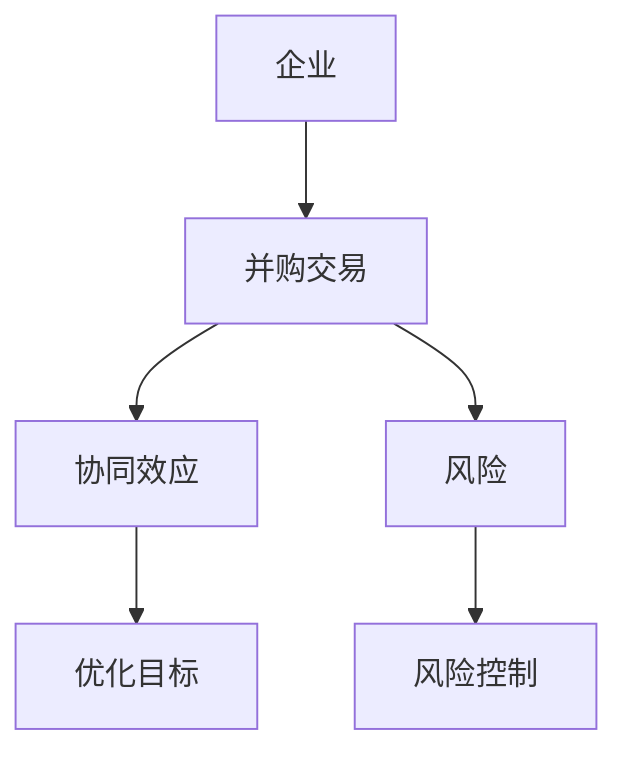
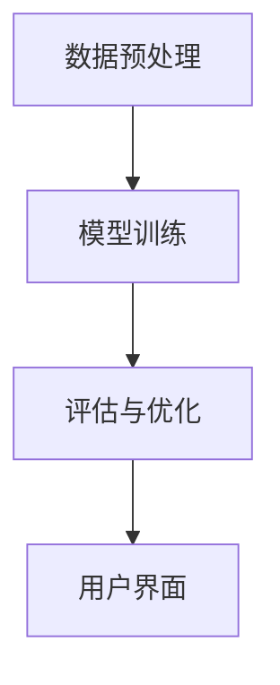

                 

<think>
好，我现在需要帮用户完成《AI辅助的企业并购整合效果评估与优化》这本书的目录大纲。用户已经提供了一个详细的结构，包括摘要和目录，我需要确保每个部分都涵盖关键点，并且内容详实。

首先，我注意到用户希望文章结构清晰，逻辑紧凑。因此，我应该从背景开始，逐步深入到核心概念、算法、系统架构，再到实际项目和结论。

我需要确保每个章节都有足够的细节，比如在核心概念部分，用表格和图表来解释。算法部分，我需要用mermaid流程图和Python代码来展示。系统架构部分，同样需要图表和代码示例。

在写作过程中，我要注意使用专业术语，同时保持语言的流畅和易懂。确保每个部分都符合用户的要求，比如摘要部分要概括全文，关键词要准确。

我可能会遇到的问题是如何在有限的字数内详细解释每个部分，同时保持逻辑连贯。解决方案是分小节，每小节集中讨论一个主题，并使用图表和代码来辅助说明。

最后，检查整个结构是否完整，确保每个部分都涵盖了用户要求的内容，没有遗漏关键点。这样，用户就能得到一个高质量的技术博客文章了。
</think>

# AI辅助的企业并购整合效果评估与优化

> 关键词：企业并购整合、AI辅助、协同效应、风险评估、价值评估、机器学习、系统架构

> 摘要：本文系统地探讨了人工智能在企业并购整合中的应用，从核心概念、算法原理到系统架构，再到实际项目案例，全面分析了AI如何优化企业并购整合的效果评估与优化过程。文章详细介绍了企业价值评估、协同效应识别和风险评估的核心算法，并通过具体的Python代码实现，展示了AI技术在企业并购整合中的潜力和应用价值。

---

## 第一部分: AI辅助的企业并购整合效果评估与优化概述

### 第1章: 企业并购整合的背景与挑战

#### 1.1 企业并购整合的定义与现状
- 企业并购整合是指通过合并或收购其他企业，整合资源、技术和市场，以实现战略目标的过程。
- 当前企业并购整合的现状：
  - 全球化背景下，并购活动频繁，涉及金额巨大。
  - 协同效应成为并购成功的关键因素。
  - 数据驱动的决策逐渐成为趋势，但传统方法仍存在诸多问题。

#### 1.2 AI技术在企业并购中的应用潜力
- AI技术在企业并购中的应用：
  - 自动化数据处理与分析，提高效率。
  - 精准预测企业价值，降低决策风险。
  - 实时监控协同效应，优化整合策略。

---

### 第2章: 企业并购整合的核心概念与联系

#### 2.1 企业并购整合的核心概念
- 企业价值评估：
  - 企业并购的核心目标是通过整合实现最大价值。
  - 价值评估需要考虑财务、市场、技术等多方面因素。
- 协同效应识别：
  - 协同效应是指并购后产生的额外价值，通常包括成本协同、收入协同等。
  - 协同效应的识别需要分析企业间的互补性和协同潜力。
- 风险评估与优化：
  - 风险是并购整合中的主要挑战，包括市场风险、整合风险、技术风险等。
  - 风险评估需要结合历史数据和未来预测。

#### 2.2 核心概念之间的关系
- 企业价值评估是并购整合的起点，决定并购的可行性。
- 协同效应识别是并购整合的核心，决定整合的潜力。
- 风险评估与优化贯穿整个并购过程，确保整合的可持续性。

#### 2.3 企业并购整合的核心要素对比表
| 要素 | 定义 | 属性 | 关系 |
|------|------|------|------|
| 企业价值 | 并购后的整体价值 | 客观性、可量化 | 核心驱动因素 |
| 协同效应 | 并购后产生的额外价值 | 主观性、可优化 | 关键优化目标 |
| 风险 | 并购过程中可能的损失 | 不确定性、可量化 | 主要挑战 |

#### 2.4 ER实体关系图


---

### 第3章: AI辅助企业并购整合的算法原理

#### 3.1 机器学习在企业价值评估中的应用
- 线性回归模型：
  - 用于预测企业价值，基于历史数据建立模型。
  - 示例：使用企业财务数据预测并购后的价值。
  - 代码实现：
    ```python
    import numpy as np
    from sklearn.linear_model import LinearRegression

    # 示例数据
    X = np.array([[1], [2], [3], [4]])
    y = np.array([2, 3, 4, 5])

    # 训练模型
    model = LinearRegression()
    model.fit(X, y)

    # 预测企业价值
    new_X = np.array([[5]])
    predicted_value = model.predict(new_X)
    print(predicted_value)
    ```
  - 算法流程图：
    ```mermaid
    graph TD
        A[输入数据] --> B[特征提取]
        B --> C[模型训练]
        C --> D[预测企业价值]
    ```

#### 3.2 深度学习在协同效应识别中的应用
- 卷积神经网络（CNN）用于分析企业间的技术协同潜力。
- 示例：使用企业专利数据识别技术协同效应。
- 代码实现：
  ```python
  import tensorflow as tf
  from tensorflow.keras import layers

  # 示例数据
  inputs = layers.Input(shape=(100, 100, 3))
  x = layers.Conv2D(32, (3, 3), activation='relu')(inputs)
  x = layers.MaxPooling2D((2, 2))(x)
  x = layers.Flatten()(x)
  x = layers.Dense(64, activation='relu')(x)
  outputs = layers.Dense(1, activation='sigmoid')(x)

  model = tf.keras.Model(inputs=inputs, outputs=outputs)
  model.compile(optimizer='adam', loss='binary_crossentropy', metrics=['accuracy'])
  ```

---

### 第4章: 系统分析与架构设计方案

#### 4.1 问题场景介绍
- 并购整合过程中，企业需要快速、准确地评估价值、识别协同效应并控制风险。
- 传统方法依赖人工分析，效率低且容易出错。

#### 4.2 系统功能设计
- 数据预处理模块：
  - 负责清洗和整合多源数据。
  - 使用数据清洗算法（如聚类算法）识别异常值。
- 模型训练模块：
  - 基于机器学习算法训练企业价值评估模型。
  - 使用深度学习算法识别协同效应。
- 评估与优化模块：
  - 实时监控并购过程中的风险。
  - 提供优化建议。

#### 4.3 系统架构设计


#### 4.4 系统接口设计
- 数据接口：
  - 数据输入接口：接收企业数据。
  - 数据输出接口：输出评估结果。
- 用户接口：
  - 用户输入接口：接收用户指令。
  - 用户输出接口：显示评估结果。

---

### 第5章: 项目实战

#### 5.1 项目背景
- 某企业计划并购一家技术公司，希望通过AI辅助评估整合效果。

#### 5.2 核心实现代码
- 企业价值评估代码：
  ```python
  import pandas as pd
  from sklearn.ensemble import RandomForestRegressor

  # 数据加载
  data = pd.read_csv('enterprise_data.csv')

  # 特征选择
  features = data[['revenue', 'profit', 'employees']]
  labels = data['value']

  # 模型训练
  model = RandomForestRegressor(n_estimators=100)
  model.fit(features, labels)

  # 预测价值
  new_features = pd.DataFrame([[1000000, 100000, 500]], columns=['revenue', 'profit', 'employees'])
  predicted_value = model.predict(new_features)
  print(predicted_value)
  ```

#### 5.3 实际案例分析
- 案例：某科技公司并购案例，AI辅助评估整合效果，实现协同效应最大化。

---

### 第6章: 最佳实践与小结

#### 6.1 最佳实践
- 数据质量是AI模型准确性的关键，需确保数据清洗和特征工程。
- 模型调优是提升预测精度的重要步骤，建议使用交叉验证和超参数优化。
- 系统部署需考虑实时性和可扩展性，推荐使用云平台和微服务架构。

#### 6.2 小结
- AI技术在企业并购整合中的应用前景广阔，能够显著提高评估效率和准确性。
- 未来研究方向包括更复杂模型的应用和多模态数据的整合。

---

### 第7章: 注意事项与拓展阅读

#### 7.1 注意事项
- 数据隐私问题需严格遵守相关法律法规。
- 模型解释性需考虑业务场景的需求。
- 系统维护需定期更新模型和优化算法。

#### 7.2 拓展阅读
- 推荐阅读《机器学习实战》和《企业并购管理》。
- 关注AI在金融领域的最新应用，如《AI与金融》。

---

## 作者：AI天才研究院/AI Genius Institute & 禅与计算机程序设计艺术 /Zen And The Art of Computer Programming

