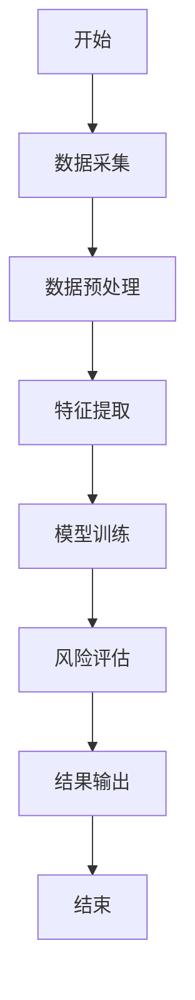
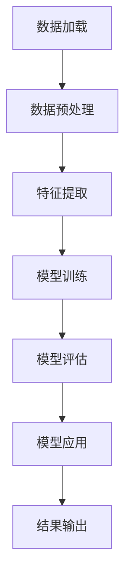
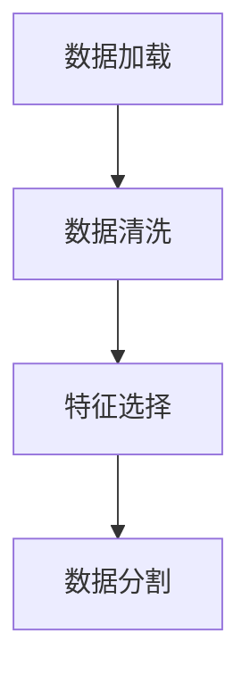
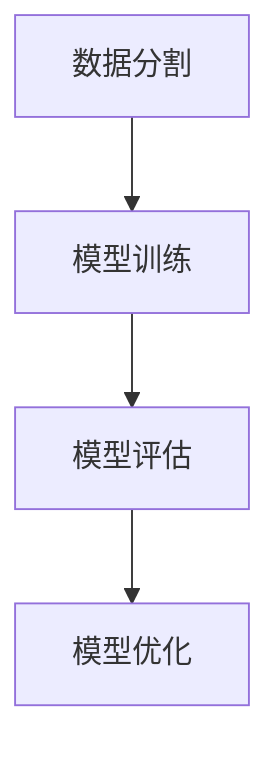
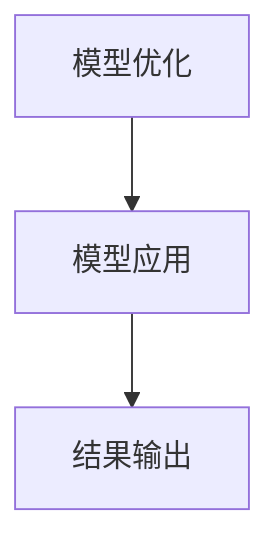
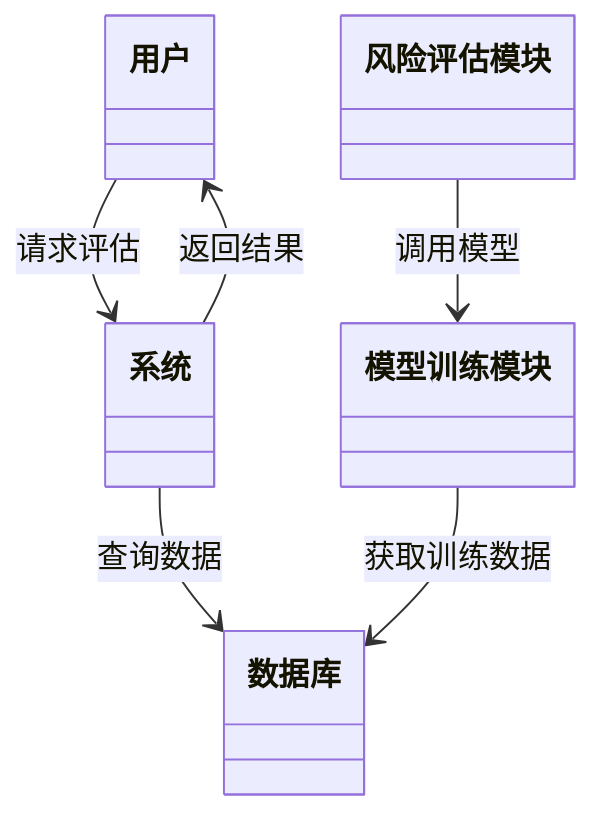
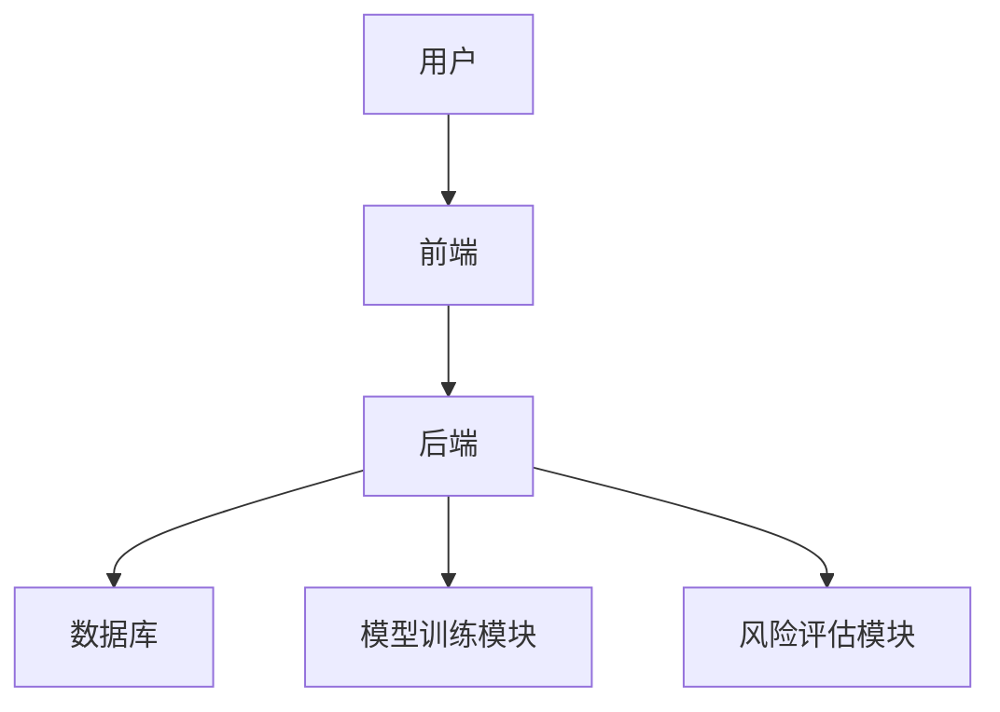

                 


# AI辅助的企业并购整合风险评估

---

## 关键词：企业并购、风险评估、人工智能、机器学习、风险模型、数据挖掘

---

## 摘要

企业并购是企业战略发展的重要手段，但并购整合过程中的风险评估一直是企业决策中的难点。传统的风险评估方法依赖于人工分析，效率低且容易受到主观因素的影响。随着人工智能技术的快速发展，利用AI辅助企业并购整合风险评估成为可能。本文从企业并购的基本概念出发，详细探讨了AI在风险评估中的应用，重点分析了机器学习算法、数据挖掘技术以及自然语言处理在风险评估中的作用。通过构建AI辅助的风险评估模型，本文提出了基于机器学习的整合风险评估方法，并通过实际案例展示了该方法的应用效果。文章还讨论了AI辅助风险评估的优势、挑战以及未来的发展方向。

---

# 第1章: 企业并购整合风险评估概述

## 1.1 企业并购的基本概念

### 1.1.1 企业并购的定义

企业并购（Mergers and Acquisitions, M&A）是指两个或多个企业之间通过合并或收购的方式，将企业的全部或部分股权或资产进行整合的过程。并购可以是横向并购（同一行业内的企业并购）、纵向并购（供应链上下游企业并购）或混合并购（不同行业或业务领域的企业并购）。

### 1.1.2 并购的类型与特点

企业并购的类型可以根据不同的标准进行分类：

1. **横向并购**：同一行业内的企业并购，旨在扩大市场份额或消除竞争。
2. **纵向并购**：供应链上下游企业之间的并购，以增强垂直整合能力。
3. **混合并购**：不同行业或业务领域的企业并购，以 diversification 的方式扩大业务范围。

### 1.1.3 并购整合的核心目标

并购整合的核心目标是实现企业价值的最大化。具体目标包括：

1. **优化资源配置**：通过整合资源，提高效率，降低成本。
2. **扩大市场影响力**：通过并购，扩大市场份额，增强市场竞争力。
3. **实现协同效应**：通过整合双方的优势资源，产生协同效应，提高整体效益。

## 1.2 企业并购整合中的风险

### 1.2.1 并购风险的定义

并购风险是指在企业并购过程中，由于各种不确定因素可能导致并购失败或整合效果不佳的风险。

### 1.2.2 并购整合的主要风险类型

1. **市场风险**：并购后市场需求变化导致的业务风险。
2. **财务风险**：并购过程中的财务杠杆过高或并购后的财务整合问题。
3. **运营风险**：并购后的组织整合、文化冲突、管理混乱等问题。
4. **法律风险**：并购涉及的法律问题，如反垄断法、知识产权问题等。
5. **技术风险**：并购涉及的技术整合、专利纠纷等问题。

### 1.2.3 风险评估的重要性

风险评估是企业并购决策中的关键环节。通过科学的风险评估，企业可以识别潜在风险，制定应对策略，降低并购失败的概率，确保并购整合的成功。

## 1.3 AI技术在企业并购中的应用

### 1.3.1 AI技术的基本概念

人工智能（Artificial Intelligence, AI）是指通过模拟人类智能的思维方式，使计算机能够执行复杂任务的技术。AI技术包括机器学习、自然语言处理、计算机视觉等领域。

### 1.3.2 AI在企业并购中的应用场景

1. **数据挖掘与分析**：利用AI技术对海量数据进行挖掘和分析，识别潜在的风险点。
2. **模式识别**：通过机器学习算法识别并购中的模式和趋势，辅助决策。
3. **自然语言处理**：分析并购相关的文本数据，如财务报表、法律文件等。

### 1.3.3 AI辅助风险评估的优势

1. **高效性**：AI技术能够快速处理海量数据，提高风险评估的效率。
2. **准确性**：通过机器学习算法，AI能够发现人类难以察觉的潜在风险。
3. **可扩展性**：AI技术可以应用于不同类型和规模的企业并购项目。

## 1.4 本章小结

本章主要介绍了企业并购的基本概念、并购整合中的风险类型以及AI技术在并购中的应用。通过分析，我们认识到AI技术在风险评估中的重要性，为后续章节的深入探讨奠定了基础。

---

# 第2章: 企业并购整合风险评估的核心概念

## 2.1 风险评估模型的原理

### 2.1.1 风险评估的基本原理

风险评估模型是通过分析潜在风险因素，预测并购整合过程中可能面临的风险，并制定相应的应对策略。模型的核心在于识别风险因素、量化风险程度并提出风险控制措施。

### 2.1.2 风险评估模型的构建步骤

1. **识别风险因素**：通过分析并购整合的各个阶段，识别潜在的风险因素。
2. **量化风险程度**：利用数据分析技术，对风险因素进行量化评估。
3. **制定应对策略**：根据风险评估结果，制定相应的风险控制措施。

### 2.1.3 模型的输入输出关系

- **输入**：并购项目的背景信息、历史数据、市场环境等。
- **输出**：风险评估报告，包括风险点、风险程度、应对策略等内容。

## 2.2 AI辅助风险评估的关键技术

### 2.2.1 数据挖掘与特征提取

数据挖掘是通过分析大量数据，提取有用信息的过程。在企业并购风险评估中，数据挖掘技术可以用于分析历史并购案例，提取风险特征。

### 2.2.2 机器学习算法的应用

机器学习算法是AI技术的核心，广泛应用于风险评估的各个阶段。常用的算法包括逻辑回归、支持向量机、随机森林等。

### 2.2.3 自然语言处理在并购文档分析中的作用

自然语言处理（NLP）技术可以用于分析并购相关的文本数据，如财务报表、法律文件等，提取关键信息。

## 2.3 风险评估模型的属性对比

### 2.3.1 不同模型的特征对比

| 模型类型       | 优点                         | 缺点                           |
|----------------|------------------------------|--------------------------------|
| 逻辑回归       | 模型简单，易于解释           | 分类效果有限                   |
| 支持向量机       | 分类精度高                   | 计算复杂性高                   |
| 随机森林       | 抗过拟合能力强               | 解释性较弱                   |

### 2.3.2 模型性能的评估指标

1. **准确率**：模型正确分类的样本数占总样本数的比例。
2. **召回率**：模型正确识别的正类样本数占实际正类样本数的比例。
3. **F1分数**：准确率和召回率的调和平均数。

### 2.3.3 模型适用场景的分析

1. **逻辑回归**：适用于二分类问题，如判断并购成功的概率。
2. **支持向量机**：适用于高维数据的分类问题。
3. **随机森林**：适用于复杂场景，能够处理多种特征。

## 2.4 实体关系图与流程图

### 2.4.1 风险评估的ER实体关系图

```mermaid
erDiagram
    actor 顾客角色
    actor 系统角色
    system 风险评估系统
    database 数据库
    actor 用户
    actor 开发者
    database 数据存储
    system 系统
    用户 --> 系统: 输入数据
    系统 --> 数据存储: 存储数据
    开发者 --> 数据存储: 更新数据
```

### 2.4.2 AI辅助风险评估的流程图



### 2.4.3 模型训练与应用的流程



## 2.5 本章小结

本章详细探讨了风险评估模型的原理、AI技术在风险评估中的应用以及不同模型的特征对比。通过分析，我们了解到AI技术在风险评估中的重要性，以及如何选择合适的算法来提高评估的准确性。

---

# 第3章: AI辅助风险评估的算法原理

## 3.1 机器学习算法概述

### 3.1.1 常见的机器学习算法

1. **逻辑回归**：适用于二分类问题。
2. **支持向量机**：适用于高维数据的分类问题。
3. **随机森林**：适用于复杂场景，能够处理多种特征。

### 3.1.2 监督学习与无监督学习的区别

| 监督学习        | 无监督学习          |
|-----------------|--------------------|
| 数据有标签      | 数据无标签          |
| 适用于分类、回归 | 适用于聚类、降维      |

### 3.1.3 算法选择的影响因素

1. **数据类型**：是否为结构化数据或非结构化数据。
2. **数据规模**：数据量的大小。
3. **任务目标**：是否为分类、回归等任务。

## 3.2 风险评估的数学模型

### 3.2.1 线性回归模型

线性回归模型用于预测连续型变量，其数学表达式为：

$$ y = \beta_0 + \beta_1 x_1 + \beta_2 x_2 + \dots + \beta_n x_n + \epsilon $$

其中，$\beta_0$ 是截距，$\beta_i$ 是回归系数，$x_i$ 是自变量，$\epsilon$ 是误差项。

### 3.2.2 逻辑回归模型

逻辑回归模型用于分类问题，其数学表达式为：

$$ P(Y=1|X) = \frac{e^{\beta_0 + \beta_1 x_1 + \beta_2 x_2 + \dots + \beta_n x_n}}{1 + e^{\beta_0 + \beta_1 x_1 + \beta_2 x_2 + \dots + \beta_n x_n}} $$

### 3.2.3 支持向量机模型

支持向量机模型用于分类问题，其数学表达式为：

$$ y = \text{sign}(\beta_0 + \beta_1 x_1 + \beta_2 x_2 + \dots + \beta_n x_n) $$

### 3.2.4 随机森林模型

随机森林模型是一种基于决策树的集成学习方法，其数学表达式为：

$$ y = \text{多数投票}(\text{决策树预测结果}) $$

## 3.3 算法流程图

### 3.3.1 数据预处理流程



### 3.3.2 模型训练流程



### 3.3.3 模型评估与优化流程



## 3.4 算法实现代码

### 3.4.1 数据加载与处理

```python
import pandas as pd
from sklearn.model_selection import train_test_split
from sklearn.preprocessing import StandardScaler

# 加载数据
data = pd.read_csv('并购数据.csv')

# 分割特征和标签
X = data.drop('目标变量', axis=1)
y = data['目标变量']

# 数据分割
X_train, X_test, y_train, y_test = train_test_split(X, y, test_size=0.2, random_state=42)

# 数据标准化
scaler = StandardScaler()
X_train = scaler.fit_transform(X_train)
X_test = scaler.transform(X_test)
```

### 3.4.2 模型训练与评估

```python
from sklearn.linear_model import LogisticRegression
from sklearn.metrics import accuracy_score

# 模型训练
model = LogisticRegression()
model.fit(X_train, y_train)

# 模型预测
y_pred = model.predict(X_test)

# 模型评估
print('准确率:', accuracy_score(y_test, y_pred))
```

### 3.4.3 算法优化与调参

```python
from sklearn.model_selection import GridSearchCV

# 调参
param_grid = {'C': [0.1, 1, 10], 'penalty': ['l1', 'l2']}
grid_search = GridSearchCV(LogisticRegression(), param_grid, cv=5)
grid_search.fit(X_train, y_train)

# 输出最佳参数
print('最佳参数:', grid_search.best_params_)
print('最佳模型准确率:', grid_search.best_score_)
```

## 3.5 本章小结

本章详细探讨了机器学习算法在风险评估中的应用，包括线性回归、逻辑回归、支持向量机和随机森林等算法的原理和实现。通过代码示例，我们了解了如何利用这些算法进行风险评估。

---

# 第4章: 系统分析与架构设计方案

## 4.1 问题场景介绍

企业并购整合风险评估系统需要解决以下问题：

1. 如何高效地收集和处理并购相关的数据？
2. 如何利用AI技术进行风险评估？
3. 如何将评估结果应用于实际决策？

## 4.2 项目介绍

本项目旨在开发一个基于AI技术的企业并购整合风险评估系统，通过数据挖掘、机器学习和自然语言处理等技术，实现对并购整合风险的自动评估和预测。

## 4.3 系统功能设计

### 4.3.1 领域模型mermaid类图



### 4.3.2 系统架构设计mermaid架构图



### 4.3.3 系统接口设计

1. **数据接口**：提供数据导入、数据查询等功能。
2. **模型接口**：提供模型训练、模型预测等功能。
3. **用户接口**：提供用户交互界面，展示评估结果。

### 4.3.4 系统交互mermaid序列图

```mermaid
graph TD
    A[用户] --> B[前端]: 请求评估
    B --> C[后端]: 发起评估请求
    C --> D[数据库]: 查询数据
    C --> E[模型训练模块]: 获取训练模型
    E --> F[风险评估模块]: 调用模型
    F --> C[后端]: 返回评估结果
    C --> A[用户]: 展示结果
```

## 4.4 本章小结

本章详细探讨了企业并购整合风险评估系统的架构设计，包括系统功能设计、架构设计和接口设计。通过图表展示，我们了解了系统的各个模块及其交互方式。

---

# 第5章: 项目实战

## 5.1 环境安装

1. **安装Python**：下载并安装Python 3.x。
2. **安装依赖库**：使用pip安装numpy、pandas、scikit-learn等库。

```bash
pip install numpy pandas scikit-learn
```

## 5.2 系统核心实现源代码

### 5.2.1 数据加载与处理

```python
import pandas as pd
from sklearn.model_selection import train_test_split
from sklearn.preprocessing import StandardScaler

# 加载数据
data = pd.read_csv('并购数据.csv')

# 分割特征和标签
X = data.drop('目标变量', axis=1)
y = data['目标变量']

# 数据分割
X_train, X_test, y_train, y_test = train_test_split(X, y, test_size=0.2, random_state=42)

# 数据标准化
scaler = StandardScaler()
X_train = scaler.fit_transform(X_train)
X_test = scaler.transform(X_test)
```

### 5.2.2 模型训练与评估

```python
from sklearn.linear_model import LogisticRegression
from sklearn.metrics import accuracy_score

# 模型训练
model = LogisticRegression()
model.fit(X_train, y_train)

# 模型预测
y_pred = model.predict(X_test)

# 模型评估
print('准确率:', accuracy_score(y_test, y_pred))
```

### 5.2.3 算法优化与调参

```python
from sklearn.model_selection import GridSearchCV

# 调参
param_grid = {'C': [0.1, 1, 10], 'penalty': ['l1', 'l2']}
grid_search = GridSearchCV(LogisticRegression(), param_grid, cv=5)
grid_search.fit(X_train, y_train)

# 输出最佳参数
print('最佳参数:', grid_search.best_params_)
print('最佳模型准确率:', grid_search.best_score_)
```

## 5.3 代码应用解读与分析

1. **数据加载与处理**：首先加载数据，然后分割特征和标签，进行数据标准化。
2. **模型训练与评估**：使用逻辑回归模型进行训练，并对测试集进行预测，评估模型的准确率。
3. **算法优化与调参**：通过网格搜索调优模型参数，提高模型性能。

## 5.4 实际案例分析

### 5.4.1 案例背景

假设我们有一个企业并购数据集，包含以下字段：

- 并购金额
- 被并购企业净利润
- 并购企业股价波动
- 行业风险指数

### 5.4.2 数据分析

通过分析数据集，我们发现：

1. 并购金额与并购风险呈正相关。
2. 被并购企业净利润对风险评估影响显著。
3. 行业风险指数是影响并购风险的重要因素。

### 5.4.3 模型应用

通过训练好的逻辑回归模型，我们可以对新的并购项目进行风险评估，预测并购成功的概率。

## 5.5 项目小结

通过本章的项目实战，我们了解了如何利用AI技术进行企业并购整合风险评估。通过实际案例分析，我们验证了模型的有效性，并为后续的研究提供了参考。

---

# 第6章: 最佳实践、小结与注意事项

## 6.1 最佳实践

1. **数据质量**：确保数据的完整性和准确性，避免数据偏差。
2. **模型选择**：根据具体场景选择合适的算法，避免盲目使用复杂模型。
3. **模型解释性**：选择可解释性强的模型，便于分析和优化。
4. **持续优化**：定期更新模型，适应数据变化和业务需求。

## 6.2 小结

通过本文的探讨，我们了解了AI技术在企业并购整合风险评估中的重要性，以及如何利用机器学习算法进行风险评估。通过实际案例分析，我们验证了模型的有效性，并为后续的研究提供了参考。

## 6.3 注意事项

1. **数据隐私**：在处理企业数据时，需要注意数据隐私和合规性。
2. **模型局限性**：AI技术虽然强大，但在某些场景下可能无法完全替代人工分析。
3. **技术更新**：AI技术发展迅速，需要持续学习和更新知识。

---

# 作者：AI天才研究院 & 禅与计算机程序设计艺术

