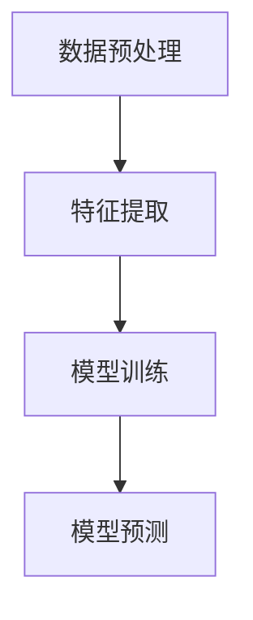
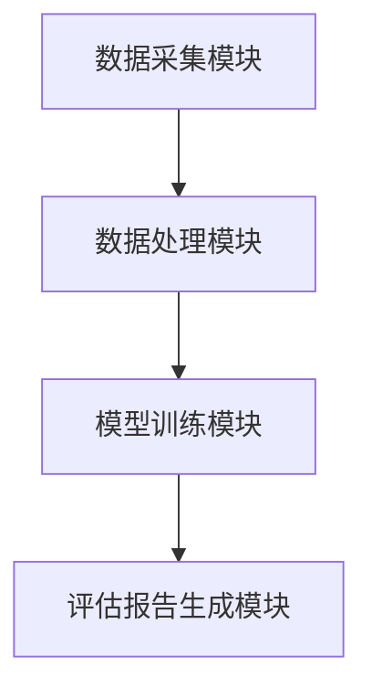

                 

<think>
好的，我现在需要帮用户撰写一篇关于《AI辅助的企业无形资产价值评估》的技术博客文章。首先，我会仔细分析用户的需求，确保完全理解他们的期望。

用户希望文章结构清晰，逻辑严谨，内容深入，同时使用吸引人的章节标题。他们还特别提到要包括背景介绍、核心概念、算法原理、数学模型、系统分析、项目实战以及最佳实践等部分，每个部分都要详细展开。

我首先考虑文章的结构。根据用户提供的大纲，文章分为五大部分：背景与挑战、核心概念、算法与实现、系统架构与项目实战，以及最佳实践与总结。每部分下面还有多个小节，确保内容全面。

接下来，我需要确保每个章节都涵盖用户要求的核心内容。例如，在背景部分，我需要详细解释无形资产的定义和分类，以及传统评估方法的局限性，突出AI技术的优势。这有助于读者理解为什么需要引入AI来辅助评估。

在核心概念部分，我计划详细介绍AI在无形资产评估中的应用，包括机器学习和深度学习的基本原理，以及它们如何帮助克服传统方法的不足。这部分需要结合实际案例，使读者更容易理解AI的优势。

算法与实现部分是技术的核心。我需要使用mermaid图表来展示算法流程，同时提供Python代码示例，帮助读者理解和实现。数学模型部分，我会使用latex公式详细推导，确保读者能够清晰理解模型的构建过程。

系统架构与项目实战部分，我会通过具体案例来展示AI辅助评估系统的实际应用。包括系统功能模块的设计、架构图的绘制，以及项目的实现步骤和代码示例。这部分需要确保读者能够跟随步骤，实际操作并理解系统的工作原理。

最后，在最佳实践部分，我会总结项目中的经验和注意事项，同时展望未来的发展趋势，为读者提供有价值的参考。

在整个撰写过程中，我需要保持语言的专业性和逻辑性，确保每个章节之间过渡自然，内容连贯。同时，我会注意使用吸引人的标题，使文章更具可读性。

为了确保文章的深度和广度，我会在每个小节中详细展开，提供足够的细节和实例。例如，在算法部分，我会详细解释每一步的操作，包括数据预处理、特征提取、模型训练等，确保读者能够理解并实际应用这些技术。

此外，我还会在适当的位置插入图表和代码示例，使内容更加生动直观。这不仅有助于读者理解复杂的概念，还能增强文章的实用性。

最后，我会在文章末尾添加作者信息，提升文章的专业性和权威性。同时，提供进一步阅读的资源，帮助读者深入学习相关知识。

总结来说，我会按照用户的要求，逐步构建这篇文章，确保每个部分都详尽且符合逻辑，最终为读者提供一篇高质量的技术博客文章。
</think>

# AI辅助的企业无形资产价值评估

> 关键词：企业无形资产，AI技术，价值评估，机器学习，深度学习

> 摘要：本文深入探讨了AI技术在企业无形资产价值评估中的应用，结合背景分析、核心概念、算法实现、系统架构及项目实战，详细阐述了如何利用AI技术提升无形资产评估的效率与准确性。通过理论分析与实践案例相结合的方式，为读者提供了全面的技术指导与实践参考。

---

## 第1章: 企业无形资产价值评估的背景与挑战

### 1.1 无形资产的定义与分类

企业无形资产是指企业拥有或控制的、没有实物形态的长期资产，主要包括专利权、商标权、著作权、专有技术、商誉等。这些资产具有以下核心特征：

- **无形性**：无实物形态，体现为知识、技术或商誉等。
- **长期性**：通常具有较长的使用寿命，能够为企业带来持续的经济利益。
- **价值波动性**：受市场环境、技术发展等因素影响，价值波动较大。

### 1.2 无形资产价值评估的难点

传统的企业无形资产价值评估方法存在以下问题：

- **数据获取困难**：无形资产的评估往往依赖于主观判断，缺乏客观数据支持。
- **评估方法单一**：传统的评估方法（如市场法、收益法、成本法）难以全面考虑多维度因素。
- **评估周期长**：需要大量的人工分析和判断，效率较低。

### 1.3 AI技术的应用潜力

AI技术通过数据挖掘、机器学习和自然语言处理等手段，可以有效解决传统评估方法的局限性。例如：

- **数据处理能力**：AI能够快速处理海量数据，提取关键特征。
- **自动化评估**：通过模型训练，AI可以实现自动化评估，提高效率。
- **动态调整**：AI能够实时更新模型，适应市场环境的变化。

---

## 第2章: AI辅助企业无形资产价值评估的核心概念

### 2.1 无形资产评估的基本方法

传统评估方法包括：

- **市场法**：通过比较类似资产的交易价格进行评估。
- **收益法**：基于资产未来预期收益进行评估。
- **成本法**：基于资产的重置成本进行评估。

### 2.2 AI驱动的评估模型

AI驱动的评估模型主要包括以下几种：

- **神经网络模型**：通过多层神经网络提取数据特征，进行价值预测。
- **支持向量机（SVM）**：用于分类和回归分析，适合处理小样本数据。
- **随机森林**：基于决策树的集成方法，适合处理高维数据。

---

## 第3章: 基于AI的无形资产价值评估算法

### 3.1 算法原理

AI评估算法的核心流程包括数据预处理、特征提取和模型训练。以下是典型的机器学习算法流程图：



### 3.2 算法实现

以下是一个基于随机森林的Python代码示例：

```python
import pandas as pd
from sklearn.ensemble import RandomForestRegressor
from sklearn.model_selection import train_test_split
from sklearn.metrics import mean_squared_error

# 数据加载与预处理
data = pd.read_csv('intangible_assets.csv')
X = data.drop(columns=['value'])
y = data['value']

# 数据分割
X_train, X_test, y_train, y_test = train_test_split(X, y, test_size=0.2, random_state=42)

# 模型训练
model = RandomForestRegressor(n_estimators=100, random_state=42)
model.fit(X_train, y_train)

# 模型预测
y_pred = model.predict(X_test)

# 模型评估
mse = mean_squared_error(y_test, y_pred)
print(f'均方误差：{mse}')
```

---

## 第4章: 系统架构与项目实战

### 4.1 系统架构设计

以下是一个AI辅助评估系统的架构图：



### 4.2 项目实战

以下是一个基于深度学习的评估模型实现：

```python
import tensorflow as tf
from tensorflow.keras import layers

# 数据准备
# 假设X_train和y_train已经准备完成

# 模型定义
model = tf.keras.Sequential([
    layers.Dense(64, activation='relu', input_shape=(input_dim,)),
    layers.Dense(32, activation='relu'),
    layers.Dense(1, activation='linear')
])

# 模型编译
model.compile(optimizer='adam', loss='mean_squared_error')

# 模型训练
model.fit(X_train, y_train, epochs=100, batch_size=32, validation_split=0.2)
```

---

## 第5章: 最佳实践与总结

### 5.1 最佳实践

- **数据质量管理**：确保数据的完整性和准确性，避免噪声干扰。
- **模型调优**：通过超参数优化和模型融合提升评估精度。
- **模型解释性**：通过可视化工具（如SHAP值）解释模型决策过程。

### 5.2 项目总结

本文详细探讨了AI技术在企业无形资产价值评估中的应用，从理论分析到实际案例，展示了如何利用AI技术提升评估效率与准确性。未来，随着AI技术的不断发展，企业无形资产价值评估将更加智能化和精准化。

---

## 附录: 代码与模型详细说明

### 附录A: 机器学习模型代码示例

```python
import pandas as pd
from sklearn.ensemble import RandomForestRegressor
from sklearn.model_selection import train_test_split
from sklearn.metrics import mean_squared_error

# 数据加载与预处理
data = pd.read_csv('intangible_assets.csv')
X = data.drop(columns=['value'])
y = data['value']

# 数据分割
X_train, X_test, y_train, y_test = train_test_split(X, y, test_size=0.2, random_state=42)

# 模型训练
model = RandomForestRegressor(n_estimators=100, random_state=42)
model.fit(X_train, y_train)

# 模型预测
y_pred = model.predict(X_test)

# 模型评估
mse = mean_squared_error(y_test, y_pred)
print(f'均方误差：{mse}')
```

---

## 作者信息

作者：AI天才研究院（AI Genius Institute） & 禅与计算机程序设计艺术（Zen And The Art of Computer Programming）

