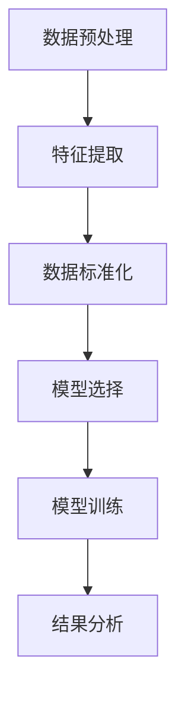
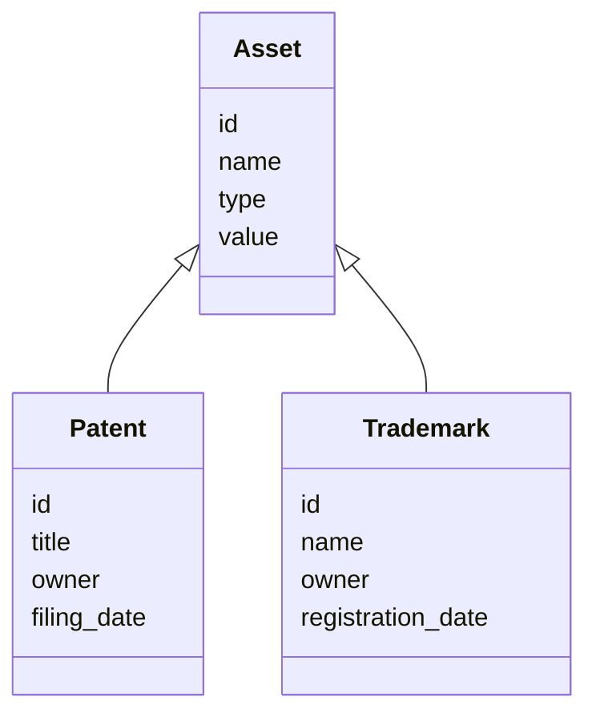
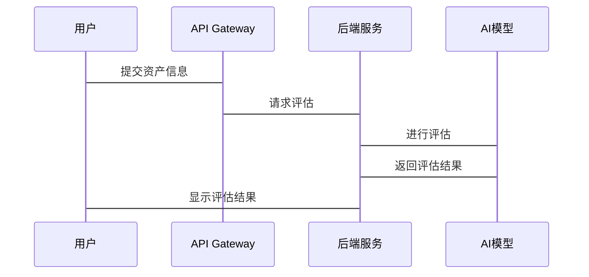

                 


# AI辅助的企业无形资产估值

> 关键词：AI辅助，企业无形资产，估值，算法原理，系统架构，项目实战

> 摘要：随着人工智能技术的快速发展，企业无形资产的评估方式正在经历一场深刻的变革。传统的评估方法由于依赖主观判断和复杂的数据分析，常常面临效率低下、结果不够精确的问题。AI技术的引入，为无形资产的评估提供了新的思路和工具。本文将从企业无形资产的基本概念、AI辅助评估的核心原理、算法实现、系统架构设计、项目实战等多方面展开，深入探讨如何利用AI技术提升企业无形资产的估值效率和准确性。通过本文的分析，读者将能够理解AI在无形资产评估中的应用价值，并掌握如何构建和优化AI辅助的评估系统。

---

# 第一部分: 企业无形资产与AI辅助估值的背景

## 第1章: 企业无形资产的基本概念

### 1.1 无形资产的定义与分类

- **无形资产的定义**：无形资产是指企业拥有或控制的，没有实物形态，但能够为企业创造价值的资源。常见的无形资产包括专利权、商标权、版权、商誉、客户关系等。

- **无形资产的分类**：
  - 知识产权类：专利、商标、版权等。
  - 商誉类：品牌价值、企业声誉等。
  - 关系类：客户关系、供应商关系等。

- **无形资产在企业中的重要性**：
  - 无形资产是企业核心竞争力的重要组成部分。
  - 无形资产的价值往往决定了企业的市场地位和盈利能力。

### 1.2 无形资产的评估挑战

- **无形资产评估的复杂性**：
  - 数据获取难：无形资产的价值往往依赖于主观判断和市场环境。
  - 方法多样性：传统评估方法包括市场法、收益法、成本法，但难以量化所有因素。

- **传统评估方法的局限性**：
  - 主观性较强：评估结果容易受到评估人员的主观影响。
  - 计算复杂：需要考虑多种因素，且难以实时更新。

- **AI技术在评估中的潜在价值**：
  - 提高评估效率：AI可以通过大数据分析快速获取相关信息。
  - 增强评估准确性：AI模型可以基于历史数据和市场趋势，提供更精准的估值。

### 1.3 AI技术在企业估值中的应用前景

- **AI技术的基本概念**：
  - 人工智能（AI）是指模拟人类智能的计算机系统，包括机器学习、深度学习、自然语言处理等技术。

- **AI在企业估值中的应用领域**：
  - 企业价值评估：通过AI分析企业的财务数据、市场表现等，评估企业整体价值。
  - 无形资产评估：利用AI技术量化无形资产的价值。

- **无形资产评估中的AI技术优势**：
  - 数据处理能力强：AI可以处理大量非结构化数据，如文本、图像等。
  - 模型自适应性强：AI模型可以根据市场变化自动调整评估策略。

## 第2章: AI技术与无形资产评估的结合

### 2.1 AI在无形资产评估中的核心作用

- **数据驱动的评估方法**：
  - AI通过收集和分析市场数据，提供更全面的评估依据。
  - 数据来源包括企业的财务报表、市场交易数据、行业报告等。

- **AI算法在评估中的应用**：
  - 机器学习算法：如线性回归、随机森林等，用于预测资产价值。
  - 深度学习算法：如神经网络，用于复杂模式识别。

- **从传统评估到AI辅助评估的转变**：
  - 传统评估方法依赖人工判断，效率低且误差大。
  - AI辅助评估通过自动化处理和大数据分析，显著提高了评估效率和准确性。

### 2.2 AI辅助评估的流程与框架

- **数据收集与预处理**：
  - 数据来源：企业财务数据、市场交易数据、行业报告等。
  - 数据清洗：处理缺失值、异常值等。

- **模型构建与训练**：
  - 选择合适的AI模型：根据数据类型和评估目标选择模型。
  - 训练数据：使用历史数据训练模型，使其能够预测无形资产价值。

- **结果分析与优化**：
  - 模型验证：通过测试数据验证模型准确性。
  - 模型优化：调整参数或尝试不同的模型结构以提高评估精度。

### 2.3 本章小结

- 本章介绍了AI在无形资产评估中的核心作用，详细描述了AI辅助评估的流程和框架。通过AI技术，企业可以更高效、更准确地评估无形资产价值，为决策提供可靠依据。

---

# 第二部分: 无形资产评估的核心概念与联系

## 第3章: 核心概念原理

### 3.1 无形资产的量化方法

- **量化方法的选择**：
  - 市场法：通过比较类似资产的市场交易价格进行评估。
  - 收益法：通过预测资产未来产生的收益折现值进行评估。
  - 成本法：通过估算资产的重置成本进行评估。

- **AI在量化方法中的应用**：
  - 使用机器学习模型预测资产未来收益。
  - 利用深度学习模型分析市场趋势，辅助市场法评估。

### 3.2 AI模型的评估指标

- **模型准确性**：
  - 均方误差（MSE）：评估模型预测值与实际值的差异。
  - R平方值（R²）：衡量模型预测的解释能力。

- **模型稳定性**：
  - 方差：衡量模型对不同数据集的适应能力。
  - 偏差：衡量模型对训练数据的拟合程度。

### 3.3 数据特征与模型性能的关系

- **数据特征的重要性**：
  - 特征选择：选择对评估结果影响较大的特征，如企业财务指标、市场占有率等。
  - 特征工程：通过数据变换和特征组合，提升模型性能。

## 第4章: 概念属性特征对比表格

### 4.1 不同无形资产类型的特征对比

| 资产类型 | 定价依据 | 数据来源 | 评估方法 |
|----------|----------|----------|----------|
| 专利权  | 技术创新性 | 专利申请记录、技术文档 | 收益法、市场法 |
| 商标权  | 品牌影响力 | 市场占有率、品牌知名度 | 市场法、成本法 |
| 客户关系 | 客户忠诚度 | 客户保留率、客户满意度 | 收益法、成本法 |

### 4.2 不同AI模型的性能对比

| 模型类型 | 优势 | 劣势 | 适用场景 |
|----------|-------|-------|----------|
| 线性回归 | 简单易懂 | 适合线性关系 | 初步预测 |
| 神经网络 | 高精度 | 计算复杂 | 复杂模式识别 |
| 随机森林 | 抗过拟合 | 需要大量数据 | 特征工程 |

## 第5章: ER实体关系图架构

### 5.1 实体关系图的构建

```mermaid
erDiagram
    +-- Enterprise
    Enterprise ||--o{ Asset : owns
    Asset ||--o{ Patent : has
    Asset ||--o{ Trademark : has
    Asset ||--o{ Brand : has
    Asset ||--o{ CustomerRelation : has
```

### 5.2 实体间的关系分析

- **企业与资产的关系**：企业拥有多种无形资产，如专利、商标等。
- **资产与具体类型的关联**：每类资产（如专利）可以进一步细分为具体的资产实例。

---

# 第三部分: AI辅助评估的算法原理

## 第6章: 算法原理概述

### 6.1 机器学习的基本原理

- **监督学习**：通过标签数据训练模型，使其能够预测新的数据。
- **无监督学习**：通过数据内在结构发现隐藏模式。
- **半监督学习**：结合监督学习和无监督学习的优势。

### 6.2 深度学习的基本原理

- **神经网络**：模拟人脑神经网络，用于处理复杂数据。
- **卷积神经网络（CNN）**：适用于图像识别。
- **循环神经网络（RNN）**：适用于时间序列数据。

### 6.3 适合无形资产评估的算法选择

- **线性回归**：适合简单的线性关系。
- **随机森林**：适合特征工程复杂的场景。
- **神经网络**：适合处理非线性关系。

## 第7章: 算法流程图



### 7.2 算法实现代码

#### 7.2.1 环境安装

- Python 3.8+
- scikit-learn、numpy、pandas

#### 7.2.2 数据加载与预处理

```python
import pandas as pd
import numpy as np

# 加载数据
data = pd.read_csv('asset.csv')

# 数据清洗
data.dropna(inplace=True)
data = pd.get_dummies(data)
```

#### 7.2.3 模型训练与评估

```python
from sklearn.model import LinearRegression

# 训练模型
model = LinearRegression()
model.fit(X_train, y_train)

# 模型评估
score = model.score(X_test, y_test)
print(f'模型准确度：{score}')
```

---

# 第四部分: 系统分析与架构设计方案

## 第8章: 问题场景介绍

### 8.1 项目介绍

- **项目目标**：构建一个基于AI的无形资产评估系统。
- **项目范围**：涵盖专利权、商标权、客户关系等多种无形资产。
- **项目约束**：数据获取难度大、模型需要高精度。

### 8.2 系统功能设计

- **领域模型mermaid类图**



### 8.3 系统架构设计


### 8.4 系统接口设计

- **输入接口**：接收用户输入的资产信息。
- **输出接口**：返回评估结果和相关分析报告。

### 8.5 系统交互mermaid序列图



---

# 第五部分: 项目实战

## 第9章: 项目实战

### 9.1 环境安装

- Python 3.8+
- scikit-learn、pandas、numpy

### 9.2 系统核心实现源代码

#### 9.2.1 数据加载与预处理

```python
import pandas as pd
import numpy as np

# 加载数据
data = pd.read_csv('asset.csv')

# 数据清洗
data.dropna(inplace=True)
data = pd.get_dummies(data)
```

#### 9.2.2 模型训练与评估

```python
from sklearn.model import LinearRegression

# 训练模型
model = LinearRegression()
model.fit(X_train, y_train)

# 模型评估
score = model.score(X_test, y_test)
print(f'模型准确度：{score}')
```

### 9.3 代码应用解读与分析

- **数据加载**：读取CSV文件中的数据。
- **数据清洗**：删除缺失值，进行特征工程。
- **模型训练**：使用线性回归模型训练数据。
- **模型评估**：评估模型的准确度。

### 9.4 实际案例分析

- **案例背景**：某企业拥有多项专利和商标，需要评估其无形资产价值。
- **数据准备**：收集企业的专利数量、市场占有率等数据。
- **模型应用**：使用训练好的模型进行评估，得出资产价值。

---

# 第六部分: 最佳实践与总结

## 第10章: 最佳实践 tips

### 10.1 小结

- 通过AI技术，企业可以更高效、更准确地评估无形资产价值。
- 选择合适的算法和模型，能够显著提高评估结果的准确性。

### 10.2 注意事项

- 数据质量是评估结果的关键，需确保数据的完整性和准确性。
- 模型的选择需根据具体场景和数据特点进行调整。

### 10.3 拓展阅读

- 《机器学习实战》
- 《深度学习》
- 《企业估值分析》

---

# 作者：AI天才研究院/AI Genius Institute & 禅与计算机程序设计艺术 /Zen And The Art of Computer Programming

