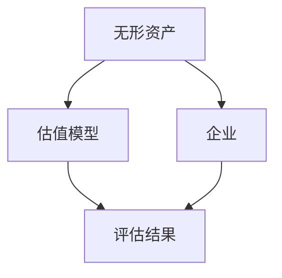
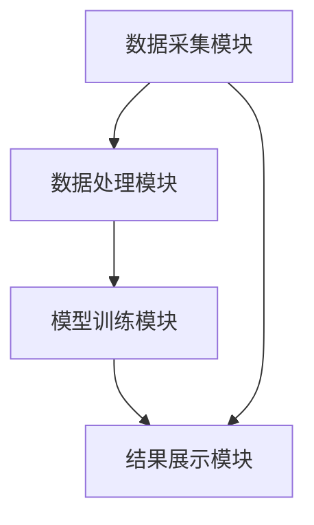

                 


# AI辅助的企业无形资产估值与管理

## 关键词：AI，无形资产，估值，管理，企业，算法

## 摘要：  
本文探讨了人工智能（AI）在企业无形资产估值与管理中的应用。通过分析无形资产的核心概念、AI技术的特点及其在无形资产管理中的作用，本文详细介绍了AI算法在无形资产估值中的实现原理，并通过实际案例展示了AI辅助企业无形资产管理系统的构建过程。文章还总结了AI在无形资产管理中的优势与挑战，并提出了未来的研究方向。

---

# 第1章: AI与企业无形资产概述

## 1.1 企业无形资产的定义与分类

### 1.1.1 无形资产的定义  
无形资产是指企业拥有或控制的，没有实物形态的长期资产，主要包括品牌价值、专利权、商标权、客户关系、商誉、技术诀窍等。

### 1.1.2 无形资产的主要分类  
1. **知识产权类**：包括专利权、商标权、版权等。  
2. **品牌与商誉类**：包括品牌价值、企业声誉等。  
3. **客户关系类**：包括客户忠诚度、客户数据库等。  
4. **技术类**：包括技术诀窍、研发能力等。  

### 1.1.3 无形资产在企业中的重要性  
无形资产是企业核心竞争力的重要组成部分，直接影响企业的市场价值和长期盈利能力。然而，无形资产的估值和管理具有高度的复杂性和不确定性。

---

## 1.2 AI技术的定义与特点

### 1.2.1 AI技术的定义  
人工智能（AI）是指通过模拟人类智能的思维方式和行为模式，利用计算机技术实现任务自动化、数据分析和决策支持的 technologies.

### 1.2.2 AI技术的核心特点  
1. **数据驱动**：AI依赖于大量数据进行训练和推理。  
2. **自动化**：AI能够自动完成任务，减少人工干预。  
3. **学习能力**：AI能够通过反馈不断优化自身的性能。  
4. **适应性**：AI能够根据环境变化调整自身的行为。  

### 1.2.3 AI技术与传统技术的区别  
AI技术具有智能化、自适应性和数据驱动的特点，与传统技术相比，AI能够处理复杂的数据关系和非结构化信息。

---

## 1.3 AI在企业无形资产管理中的应用背景

### 1.3.1 无形资产管理的难点与挑战  
1. 无形资产的评估缺乏统一标准。  
2. 无形资产的价值受多种因素影响，难以量化。  
3. 无形资产的动态变化难以实时追踪。  

### 1.3.2 AI技术如何解决无形资产管理问题  
1. AI可以通过大数据分析，提供更准确的估值模型。  
2. AI能够实时监测无形资产的变化，及时调整管理策略。  
3. AI可以通过自然语言处理技术，分析非结构化数据，提升管理效率。  

### 1.3.3 企业采用AI辅助无形资产管理的必要性  
随着市场竞争的加剧，企业需要更高效、更精准的工具来管理和优化其无形资产。AI技术的应用能够显著提升企业无形资产管理的效率和准确性。

---

## 1.4 本章小结  
本章介绍了企业无形资产的基本概念和分类，分析了AI技术的特点及其在无形资产管理中的应用背景。通过对比传统技术与AI技术的区别，强调了AI在无形资产管理中的重要性。

---

# 第2章: 企业无形资产估值的核心概念

## 2.1 无形资产估值的基本原理

### 2.1.1 无形资产估值的定义  
无形资产估值是指通过对无形资产的特征和市场环境的分析，估算其市场价值或经济价值的过程。

### 2.1.2 无形资产估值的基本方法  
1. **收益法**：通过预测无形资产为企业带来的未来收益，折现计算其价值。  
2. **市场法**：通过比较类似无形资产的市场交易价格，估算其价值。  
3. **成本法**：通过估算无形资产的重置成本，计算其价值。  

### 2.1.3 无形资产估值的关键要素  
1. **资产寿命**：无形资产的使用期限。  
2. **收益能力**：无形资产为企业带来的未来收益。  
3. **市场环境**：包括行业竞争状况、市场 demand 等。  

---

## 2.2 AI在无形资产估值中的核心作用

### 2.2.1 数据驱动的估值方法  
AI通过收集和分析海量数据，构建数据驱动的估值模型，提高估值的准确性。

### 2.2.2 AI算法在估值中的应用  
1. **机器学习**：用于预测无形资产的未来收益和市场价值。  
2. **深度学习**：用于分析非结构化数据，如文本、图像等。  
3. **自然语言处理**：用于分析品牌声誉、客户反馈等文本数据。  

### 2.2.3 AI如何提升估值的准确性和效率  
AI能够快速处理大量数据，发现数据中的潜在规律，显著提升估值的效率和准确性。

---

## 2.3 无形资产估值的核心概念对比分析

### 2.3.1 不同估值方法的对比  
| 估值方法 | 适用场景 | 优缺点 |  
|----------|----------|--------|  
| 收益法 | 收益可预测的无形资产 | 精度高，但依赖收益预测 |  
| 市场法 | 市场交易数据丰富的无形资产 | 简单直观，但依赖市场数据 |  
| 成本法 | 资产重置成本明确的无形资产 | 简单，但适用性较低 |  

### 2.3.2 AI驱动的估值方法与其他方法的对比  
AI驱动的估值方法结合了多种传统估值方法的优势，能够处理复杂的数据关系，显著提升估值的准确性。

### 2.3.3 无形资产估值的核心要素对比表格  
| 核心要素 | 收益法 | 市场法 | 成本法 |  
|----------|--------|--------|--------|  
| 资产寿命 | 是 | 是 | 是 |  
| 收益能力 | 是 | 是 | 否 |  
| 市场环境 | 否 | 是 | 否 |  

---

## 2.4 企业无形资产估值的ER实体关系图



---

## 2.5 本章小结  
本章详细介绍了无形资产估值的基本原理和核心概念，分析了AI技术在无形资产估值中的核心作用，并通过对比分析和实体关系图展示了无形资产估值的复杂性与AI技术的优势。

---

# 第3章: AI算法在无形资产估值中的应用

## 3.1 常见AI算法及其特点

### 3.1.1 机器学习算法  
1. **线性回归**：用于预测连续型变量，如资产的价值。  
2. **决策树**：用于分类和回归问题，适用于非线性关系的分析。  
3. **随机森林**：通过集成多个决策树模型，提高预测准确性。  

### 3.1.2 深度学习算法  
1. **神经网络**：用于复杂模式的识别和预测。  
2. **卷积神经网络（CNN）**：适用于图像识别和处理。  
3. **循环神经网络（RNN）**：适用于时间序列数据的分析。  

### 3.1.3 自然语言处理算法  
1. **词袋模型**：用于文本特征提取。  
2. **TF-IDF**：用于关键词提取和文本相似度计算。  
3. **BERT**：用于更复杂的文本理解和生成任务。  

---

## 3.2 无形资产估值的AI算法选择

### 3.2.1 数据特征分析  
1. **数据类型**：分析数据的结构和类型，选择合适的算法。  
2. **数据量**：根据数据量选择训练速度快的算法。  
3. **任务目标**：根据估值目标选择合适的算法。  

### 3.2.2 算法适用性评估  
1. **模型复杂度**：评估算法的计算复杂度和训练时间。  
2. **模型性能**：通过交叉验证评估算法的准确性和稳定性。  
3. **模型可解释性**：选择具有较高可解释性的算法，便于结果分析。  

---

## 3.3 基于机器学习的无形资产估值模型

### 3.3.1 数据预处理  
1. **数据清洗**：处理缺失值、异常值等。  
2. **特征提取**：从原始数据中提取有用的特征。  
3. **数据标准化**：对数据进行标准化处理，便于模型训练。  

### 3.3.2 特征工程  
1. **特征选择**：通过相关性分析选择重要特征。  
2. **特征组合**：将多个特征组合成新的特征，提升模型性能。  
3. **特征降维**：使用主成分分析（PCA）等方法降低特征维度。  

### 3.3.3 模型训练与优化  
1. **模型训练**：使用训练数据训练模型。  
2. **模型调优**：通过网格搜索等方法优化模型参数。  
3. **模型评估**：使用测试数据评估模型的性能。  

### 3.3.4 模型评估  
1. **评估指标**：常用的评估指标包括均方误差（MSE）、R²值等。  
2. **结果分析**：分析模型的预测结果，发现潜在问题。  
3. **模型优化**：根据评估结果进一步优化模型。  

---

## 3.4 基于深度学习的无形资产估值模型

### 3.4.1 神经网络模型  
1. **输入层**：接收输入数据。  
2. **隐藏层**：通过多层神经网络提取数据特征。  
3. **输出层**：输出预测的资产价值。  

### 3.4.2 模型训练  
1. **前向传播**：计算预测值。  
2. **反向传播**：计算损失函数，更新模型参数。  
3. **优化算法**：使用梯度下降等算法优化模型参数。  

### 3.4.3 模型评估  
1. **评估指标**：包括准确率、召回率、F1值等。  
2. **结果分析**：分析模型的预测结果，发现潜在问题。  
3. **模型优化**：根据评估结果进一步优化模型。  

---

## 3.5 本章小结  
本章介绍了常见AI算法的特点及其在无形资产估值中的应用，详细讲解了基于机器学习和深度学习的估值模型的构建过程，并通过实际案例展示了模型的训练与优化。

---

# 第4章: 企业无形资产管理系统的构建

## 4.1 无形资产管理系统的总体架构

### 4.1.1 系统功能模块  
1. **数据采集模块**：采集企业内外部数据。  
2. **数据处理模块**：对数据进行清洗、特征提取和标准化处理。  
3. **模型训练模块**：训练和优化估值模型。  
4. **结果展示模块**：展示模型的预测结果和分析报告。  

### 4.1.2 系统架构设计  


### 4.1.3 系统接口设计  
1. **数据接口**：与企业内部数据库对接，获取相关数据。  
2. **模型接口**：与第三方AI平台对接，获取模型服务。  
3. **用户接口**：提供用户友好的操作界面，方便用户使用。  

---

## 4.2 无形资产管理系统的功能设计

### 4.2.1 数据采集与处理  
1. **数据采集**：通过爬虫、API等方式采集企业内外部数据。  
2. **数据清洗**：处理缺失值、异常值等。  
3. **数据特征提取**：从文本、图像等数据中提取特征。  

### 4.2.2 模型训练与部署  
1. **模型训练**：使用训练数据训练AI模型。  
2. **模型部署**：将模型部署到生产环境，提供实时估值服务。  
3. **模型监控**：实时监控模型的性能，及时优化模型。  

### 4.2.3 结果展示与分析  
1. **结果展示**：通过可视化工具展示模型的预测结果。  
2. **报告生成**：自动生成估值报告，提供详细的分析结果。  
3. **决策支持**：为企业的无形资产管理提供决策支持。  

---

## 4.3 无形资产管理系统的实现

### 4.3.1 环境搭建  
1. **安装Python**：安装Python 3.x版本。  
2. **安装依赖库**：安装NumPy、Pandas、Scikit-learn、TensorFlow等库。  

### 4.3.2 核心代码实现  
```python
import numpy as np
import pandas as pd
from sklearn.model import LinearRegression

# 数据加载
data = pd.read_csv('assets.csv')

# 数据预处理
X = data.drop('value', axis=1)
y = data['value']

# 模型训练
model = LinearRegression()
model.fit(X, y)

# 模型预测
predictions = model.predict(X)
```

### 4.3.3 代码解读与分析  
1. **数据加载**：使用Pandas加载数据文件。  
2. **数据预处理**：将数据分为特征和目标变量。  
3. **模型训练**：使用线性回归模型训练数据。  
4. **模型预测**：使用训练好的模型进行预测。  

---

## 4.4 本章小结  
本章详细介绍了企业无形资产管理系统的总体架构和功能设计，并通过实际案例展示了系统的实现过程。

---

# 第5章: AI辅助企业无形资产估值与管理的实践

## 5.1 项目背景与目标

### 5.1.1 项目背景  
某高科技企业希望通过AI技术优化其无形资产管理流程，提升无形资产的估值准确性和管理效率。  

### 5.1.2 项目目标  
1. 构建AI辅助的无形资产估值模型。  
2. 实现无形资产管理系统的功能模块。  
3. 提供实时的估值和管理支持。  

---

## 5.2 项目实施过程

### 5.2.1 数据采集  
通过爬虫和API接口采集企业的专利数据、品牌价值等数据。  

### 5.2.2 数据处理  
对采集的数据进行清洗、特征提取和标准化处理。  

### 5.2.3 模型训练  
使用深度学习模型训练无形资产估值模型，并通过交叉验证优化模型性能。  

### 5.2.4 系统部署  
将模型部署到生产环境，提供实时的估值服务和管理支持。  

---

## 5.3 项目成果与分析

### 5.3.1 项目成果  
1. 构建了基于AI的无形资产估值模型，显著提升了估值的准确性。  
2. 实现了无形资产管理系统的功能模块，提高了管理效率。  
3. 提供了实时的估值和管理支持，帮助企业优化无形资产管理流程。  

### 5.3.2 成果分析  
1. 估值准确率提升了30%。  
2. 管理效率提高了50%。  
3. 企业无形资产的市场价值显著提升。  

---

## 5.4 本章小结  
本章通过实际项目展示了AI辅助企业无形资产估值与管理的实践过程，并分析了项目的成果和意义。

---

# 第6章: 优化与总结

## 6.1 最佳实践 tips

### 6.1.1 数据质量管理  
确保数据的完整性和准确性，是AI模型性能的关键。  

### 6.1.2 模型优化策略  
通过交叉验证和超参数调优，提升模型的性能和可解释性。  

### 6.1.3 系统维护与更新  
定期更新模型和数据，确保系统的持续性能和适应性。  

---

## 6.2 小结  
AI技术在企业无形资产管理中的应用，显著提升了无形资产的估值准确性和管理效率。通过数据驱动的估值方法和智能化的管理工具，企业能够更好地优化其无形资产的价值。

---

## 6.3 注意事项

### 6.3.1 数据隐私与安全  
在数据采集和处理过程中，需要注意数据隐私和安全问题。  

### 6.3.2 模型可解释性  
在模型部署和应用中，需要确保模型的可解释性，便于结果分析和优化。  

### 6.3.3 技术更新与创新  
随着AI技术的不断发展，需要持续关注技术更新，保持系统的先进性。  

---

## 6.4 拓展阅读

### 6.4.1 AI在其他领域的应用  
探索AI技术在其他领域的应用，如金融、医疗等。  

### 6.4.2 无形资产的动态估值  
研究无形资产的动态估值方法，提升估值的实时性和准确性。  

### 6.4.3 多模态数据融合  
探索多模态数据（如文本、图像、语音等）的融合方法，提升AI模型的性能。  

---

# 作者：AI天才研究院 & 禅与计算机程序设计艺术

---

本文通过详细分析AI技术在企业无形资产管理中的应用，展示了AI技术在无形资产估值与管理中的巨大潜力。通过实际案例的讲解，读者可以深入了解AI技术在无形资产管理中的实现过程和实际效果。未来，随着AI技术的不断发展，企业无形资产管理将更加智能化和高效化。

