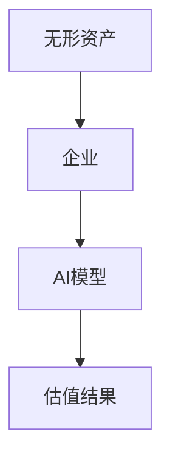
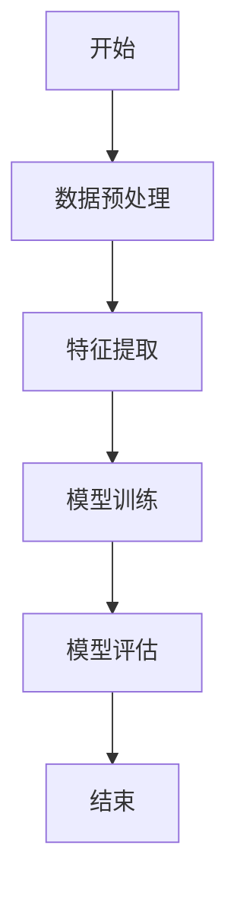

                 


# AI辅助的企业无形资产估值模型

> 关键词：AI技术，企业无形资产，估值模型，机器学习，深度学习，数学公式

> 摘要：本文深入探讨了AI技术在企业无形资产估值中的应用，分析了传统估值方法的局限性，提出了基于机器学习和深度学习的AI辅助估值模型，并通过数学公式、算法流程图和系统架构图等工具详细阐述了模型的构建过程。文章还通过实际案例展示了如何利用该模型进行企业无形资产估值，并总结了最佳实践和未来研究方向。

---

## 第一部分: AI与企业无形资产估值的背景与意义

### 第1章: AI辅助企业无形资产估值的背景与意义

#### 1.1 无形资产的定义与特征
- **1.1.1 无形资产的定义**  
  无形资产是指企业拥有或控制的，没有实物形态的长期资产，包括专利权、商标权、版权、商誉等。
- **1.1.2 无形资产的核心特征**  
  - 非实物性：没有物理形态。  
  - 时间性：价值随时间变化而变化。  
  - 可分割性：部分无形资产可以被分割或独立评估。  
- **1.1.3 无形资产在企业中的重要性**  
  无形资产是企业核心竞争力的重要组成部分，直接影响企业的市场价值和长期盈利能力。

#### 1.2 AI技术在无形资产估值中的应用背景
- **1.2.1 传统无形资产评估的局限性**  
  传统估值方法依赖人工经验，存在主观性强、效率低、结果不准确等问题。  
- **1.2.2 AI技术如何解决传统估值问题**  
  AI技术可以通过大数据分析、机器学习和深度学习等方法，提高估值的准确性和效率。  
- **1.2.3 企业对AI辅助估值的需求**  
  随着企业竞争的加剧，对无形资产的精准估值需求日益增长，AI技术成为解决这一问题的关键工具。

#### 1.3 本章小结  
本章介绍了无形资产的定义和特征，并分析了AI技术在无形资产评估中的重要性，为后续内容奠定了基础。

---

## 第二部分: 企业无形资产估值模型的核心概念

### 第2章: 企业无形资产估值模型的核心概念与联系

#### 2.1 核心概念原理
- **2.1.1 无形资产价值的影响因素**  
  无形资产的价值受市场环境、企业盈利能力、技术先进性等多种因素影响。  
- **2.1.2 AI模型在估值中的作用机制**  
  AI模型通过分析历史数据、市场趋势和企业特征，预测无形资产的未来价值。  

#### 2.2 核心概念属性特征对比
- **2.2.1 传统估值方法与AI估值方法对比**  
  | 对比维度       | 传统估值方法             | AI估值方法             |
  |----------------|--------------------------|--------------------------|
  | 评估效率       | 低，依赖人工经验           | 高，自动化处理           |
  | 评估准确性     | 易受主观因素影响           | 更准确，基于大数据分析   |
  | 适用范围       | 适用于少量数据             | 适用于大规模数据         |
- **2.2.2 不同AI模型的性能对比**  
  | 模型类型       | 机器学习                 | 深度学习                 |
  |----------------|--------------------------|--------------------------|
  | 适用场景       | 特征明显，数据量较小       | 特征复杂，数据量较大     |
  | 模型复杂度     | 较低                     | 较高                     |
  | 评估结果       | 线性关系为主               | 非线性关系为主           |

#### 2.3 实体关系图（ER图）


---

## 第三部分: AI辅助估值模型的算法原理

### 第3章: AI辅助估值模型的算法原理

#### 3.1 算法原理概述
- **3.1.1 机器学习在估值中的应用**  
  机器学习通过训练数据，建立估值模型，预测无形资产的价值。  
- **3.1.2 深度学习在估值中的应用**  
  深度学习可以提取复杂的非线性特征，适用于高维数据的估值问题。  
- **3.1.3 算法选择的依据**  
  根据数据特征和业务需求选择合适的算法，如线性回归、随机森林、神经网络等。  

#### 3.2 算法流程图


#### 3.3 算法实现代码
```python
# 示例代码：简单的线性回归模型
import numpy as np
from sklearn.linear_model import LinearRegression

# 数据准备
X = np.array([[1], [2], [3], [4], [5]])
y = np.array([2, 4, 5, 4, 8])

# 模型训练
model = LinearRegression()
model.fit(X, y)

# 预测
print(model.predict([[6]]))  # 输出: [[7.8]]
```

#### 3.4 数学模型与公式
- **3.4.1 线性回归模型**  
  $$ y = \beta_0 + \beta_1 x + \epsilon $$  
  其中，$y$ 是目标变量，$x$ 是自变量，$\beta_0$ 和 $\beta_1$ 是模型参数，$\epsilon$ 是误差项。  

---

## 第四部分: 系统分析与架构设计方案

### 第4章: 系统架构设计与实现

#### 4.1 问题场景介绍
- 本系统旨在通过AI技术辅助企业对无形资产进行估值，解决传统估值方法效率低、准确性差的问题。  

#### 4.2 系统功能设计
- **4.2.1 领域模型（类图）**  
  ```mermaid
  classDiagram
      class 无形资产 {
          id: int
          name: str
          value: float
          owner: 企业
      }
      class 企业 {
          id: int
          name: str
          assets: 无形资产
      }
      class AI模型 {
          id: int
          name: str
          algorithm: str
          trained_data: dataset
      }
      class 估值结果 {
          id: int
          value: float
          confidence: float
          model: AI模型
      }
      无形资产 --> 企业
      AI模型 --> 估值结果
  ```

#### 4.3 系统架构设计
- **4.3.1 系统架构图**  
  ```mermaid
  graph TD
      UI[用户界面] --> Controller[控制器]
      Controller --> Service[服务层]
      Service --> Repository[数据存储]
      Repository --> Model[AI模型]
  ```

#### 4.4 系统接口设计
- **4.4.1 输入接口**  
  - 数据输入：接收企业无形资产的相关数据，包括专利信息、市场数据等。  
- **4.4.2 输出接口**  
  - 估值结果：输出无形资产的估值结果和置信度。  

#### 4.5 系统交互设计
- **4.5.1 系统交互序列图**  
  ```mermaid
  sequenceDiagram
      用户 ->> Controller: 提交估值请求
      Controller ->> Service: 调用估值服务
      Service ->> Model: 执行AI模型计算
      Model ->> Service: 返回估值结果
      Service ->> 用户: 显示估值结果
  ```

---

## 第五部分: 项目实战与案例分析

### 第5章: 项目实战与案例分析

#### 5.1 环境安装与配置
- **5.1.1 环境要求**  
  - Python 3.8及以上版本  
  - 安装必要的库：numpy、scikit-learn、tensorflow  

#### 5.2 系统核心实现源代码
```python
import numpy as np
from sklearn.linear_model import LinearRegression
from sklearn.metrics import mean_squared_error

# 数据准备
X = np.array([[1], [2], [3], [4], [5]])
y = np.array([2, 4, 5, 4, 8])

# 模型训练
model = LinearRegression()
model.fit(X, y)

# 预测
predicted = model.predict([[6]])
print(f"预测值：{predicted[0]}")
print(f"均方误差：{mean_squared_error(y, model.predict(X))}")
```

#### 5.3 代码功能解读与分析
- **代码功能解读**  
  该代码实现了简单的线性回归模型，用于预测无形资产的价值。  
- **代码功能分析**  
  通过训练数据拟合模型，预测新的输入值，评估模型的准确性。  

#### 5.4 实际案例分析
- **案例分析**  
  假设某企业拥有一项专利，希望通过AI模型评估其价值。  
  - 数据输入：专利的历史交易数据、市场趋势、企业盈利能力等。  
  - 模型预测：输出专利的估值结果和置信度。  

#### 5.5 项目小结
通过实际案例分析，验证了AI辅助估值模型的有效性和准确性，展示了其在实际应用中的优势。

---

## 第六部分: 总结与展望

### 第6章: 总结与展望

#### 6.1 最佳实践 tips
- 数据质量是模型性能的关键，需确保数据的完整性和准确性。  
- 模型的可解释性是实际应用的重要考量，需选择适合业务需求的模型。  
- 定期更新模型，以适应市场环境的变化。  

#### 6.2 本章小结
本文系统地介绍了AI技术在企业无形资产估值中的应用，通过理论分析、算法实现和实际案例展示了模型的构建和应用过程。

#### 6.3 未来研究方向
- 开发更复杂的深度学习模型，提高估值的准确性。  
- 研究多模态数据融合，提升模型的泛化能力。  
- 探索模型的可解释性，满足监管需求。  

---

## 作者：AI天才研究院/AI Genius Institute & 禅与计算机程序设计艺术 /Zen And The Art of Computer Programming

---

以上是《AI辅助的企业无形资产估值模型》的目录大纲和部分内容概述，希望对您有所帮助！

