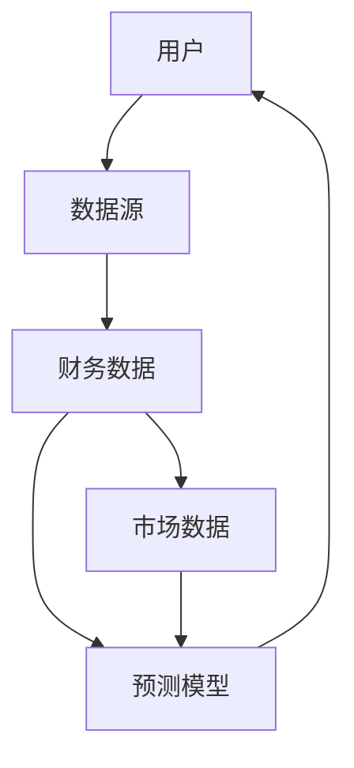
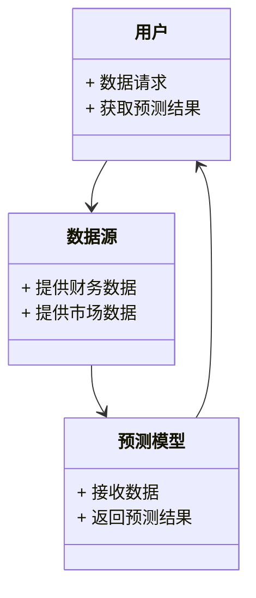
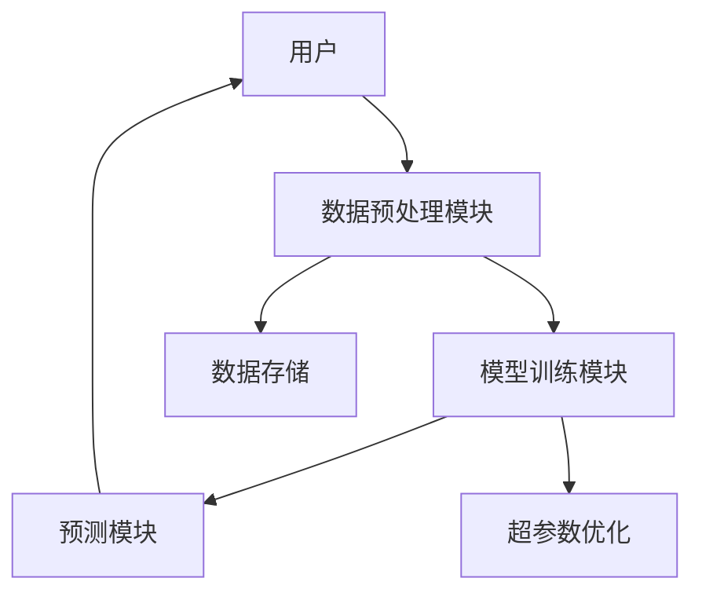
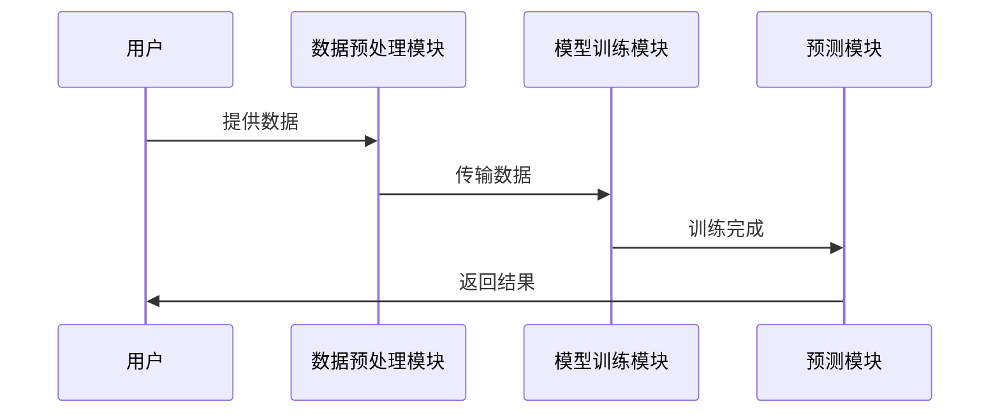

                 

<think>
好的，现在我要开始逐步分析如何撰写《AI辅助的企业财务预测模型》这篇文章。首先，我需要明确文章的结构和每个部分需要涵盖的内容，确保逻辑清晰，内容详尽。

1. **标题和关键词**：文章标题是《AI辅助的企业财务预测模型》，关键词包括企业财务预测、人工智能、机器学习、深度学习、财务数据分析。摘要部分需要简明扼要地概述文章的核心内容，强调AI技术如何提升财务预测的准确性，以及模型的设计与实现过程。

2. **背景介绍**：从企业财务预测的重要性入手，说明传统方法的局限性，以及AI如何带来改进。问题背景部分需要详细描述财务预测的挑战，如数据复杂性和实时性需求。解决方案部分介绍AI技术的应用，对比传统模型和AI模型的特点。

3. **核心概念与联系**：解释AI与财务预测的结合，包括数据驱动的预测方法和特征工程的重要性。对比分析部分使用表格展示传统模型和AI模型在准确性、实时性、可扩展性等方面的差异。实体关系图展示数据流，帮助读者理解系统架构。

4. **算法原理与实现**：详细讲解线性回归、随机森林和神经网络的原理，包括数学公式和流程图。使用Python代码实现这些算法，并进行示例分析，说明如何处理财务数据。

5. **系统分析与架构设计**：描述问题场景，设计系统的功能模块，如数据预处理、模型训练和部署。使用Mermaid绘制系统架构图，展示各模块的交互和接口设计。

6. **项目实战**：通过具体案例，如使用Python和机器学习库构建模型，展示环境安装、数据处理、特征工程、模型训练和结果分析的过程。

7. **最佳实践**：总结经验，提出小结、注意事项和未来发展方向，推荐相关书籍和论文供读者深入学习。

在写作过程中，我需要确保每个部分都详细具体，使用清晰的逻辑结构，让读者能够一步步理解AI在企业财务预测中的应用。同时，注意使用适当的代码示例和图表，增强文章的可读性和专业性。
</think>

# AI辅助的企业财务预测模型

## 关键词：企业财务预测、人工智能、机器学习、深度学习、财务数据分析

## 摘要：本文详细探讨了如何利用人工智能技术构建企业财务预测模型。通过分析传统预测方法的局限性，结合AI算法的优势，提出了基于机器学习和深度学习的解决方案。文章从背景、算法原理到系统架构，再到项目实战，全面阐述了AI辅助财务预测的实现过程，最后总结了最佳实践和未来发展方向。

---

# 第1章: 企业财务预测的背景与挑战

## 1.1 企业财务预测的重要性

### 1.1.1 财务预测在企业决策中的作用

企业财务预测是管理决策的重要工具，用于评估未来财务状况、制定预算、优化资源分配。准确的预测能帮助企业及时调整策略，避免潜在风险。

### 1.1.2 传统财务预测的局限性

传统方法依赖历史数据和经验判断，存在主观性强、数据处理复杂、预测准确性低等问题。特别是在处理大量非结构化数据时，传统方法难以捕捉隐藏的模式。

### 1.1.3 AI技术如何改善财务预测

AI技术，尤其是机器学习和深度学习，能够处理大量数据，发现复杂模式，提高预测准确性。AI还能实时更新模型，适应市场变化，显著增强预测能力。

## 1.2 问题背景与描述

### 1.2.1 财务数据的复杂性

财务数据涵盖销售、成本、利润等多方面，且受市场波动、政策变化影响，数据呈现高度复杂性。

### 1.2.2 预测模型的准确性需求

企业需要高精度的预测模型，特别是在市场波动剧烈的情况下，模型需具备良好的泛化能力。

### 1.2.3 企业对实时预测的需求

现代企业要求预测实时更新，及时反映市场变化，这对模型的计算效率提出更高要求。

## 1.3 AI辅助的解决方案

### 1.3.1 机器学习在财务预测中的应用

机器学习通过训练数据，识别潜在模式，生成预测结果。常用算法包括线性回归、随机森林和神经网络。

### 1.3.2 深度学习的优势

深度学习擅长处理非结构化数据，如文本和图像，通过多层网络结构提取高级特征，提升预测精度。

### 1.3.3 组合模型的潜力

将多种模型结合，如集成学习，可以平衡单个模型的优缺点，提升整体预测性能。

## 1.4 模型的边界与外延

### 1.4.1 数据范围的界定

明确模型使用的数据范围，如过去三年的财务数据和市场数据，避免数据混杂影响模型性能。

### 1.4.2 模型适用的行业与规模

不同行业和企业规模可能需要不同的模型，如制造业和服务业的数据特征差异较大，需针对性构建模型。

### 1.4.3 模型的可解释性与局限性

尽管AI模型预测能力强，但部分模型（如神经网络）可解释性较差，可能影响实际应用中的信任度。

---

# 第2章: AI辅助财务预测的核心概念与联系

## 2.1 AI与财务预测的结合

### 2.1.1 数据驱动的预测方法

AI依赖大量数据进行训练，通过数据驱动的方式生成预测结果，相较于传统方法更具客观性。

### 2.1.2 特征工程的重要性

特征工程是提升模型性能的关键步骤，需选择和处理相关特征，去除冗余信息，优化模型表现。

### 2.1.3 模型的可解释性

可解释性是企业决策的关键，确保模型结果能够被理解和信任，尤其是在财务领域，解释性尤为重要。

## 2.2 核心概念对比分析

### 2.2.1 传统模型与AI模型的对比

| 特性               | 传统模型               | AI模型                |
|--------------------|------------------------|-----------------------|
| 数据处理能力       | 依赖少量结构化数据     | 处理大量结构化和非结构化数据 |
| 预测准确性         | 较低                   | 较高                  |
| 可扩展性           | 有限                   | 强                   |
| 实时性             | 较差                   | 较好                  |

### 2.2.2 不同AI算法的特征对比

| 算法类型           | 线性回归               | 随机森林             | 神经网络             |
|--------------------|------------------------|----------------------|----------------------|
| 数据要求           | 结构化数据             | 结构化数据            | 结构化/非结构化数据  |
| 解释性             | 高                    | 中等                 | 低                   |
| 处理复杂性         | 低                    | 中等                 | 高                   |

### 2.2.3 模型性能的评估指标

| 指标               | MAE                   | RMSE                  | R²                   |
|--------------------|------------------------|-----------------------|-----------------------|
| 含义               | 平均绝对误差           | �均方根误差            | 决定系数             |

## 2.3 实体关系图与数据流

### 2.3.1 数据流展示



---

# 第3章: 算法原理与实现

## 3.1 线性回归模型

### 3.1.1 最小二乘法的数学公式

$$ \text{线性回归}：\hat{y} = a + bx $$

其中，$a$是截距，$b$是斜率，$\hat{y}$是预测值。

### 3.1.2 算法实现步骤

1. 数据预处理：标准化或归一化。
2. 计算损失函数：使用均方误差。
3. 梯度下降优化：调整参数$a$和$b$，最小化损失函数。

### 3.1.3 示例分析

假设我们有销售数据，使用线性回归预测下季度销售额：

```python
import numpy as np
from sklearn.linear_model import LinearRegression

# 示例数据
X = np.array([[1], [2], [3], [4]])
y = np.array([2, 4, 5, 6])

# 模型训练
model = LinearRegression()
model.fit(X, y)

# 预测
print(model.predict([[5]]))  # 输出预测值
```

## 3.2 随机森林算法

### 3.2.1 基于决策树的集成方法

随机森林通过构建多棵决策树，并行投票机制生成最终预测结果，提升模型的准确性和鲁棒性。

### 3.2.2 算法实现流程

1. 随机选择特征和样本进行训练。
2. 构建决策树。
3. 集成预测结果，计算平均值。

### 3.2.3 示例分析

使用随机森林预测公司利润：

```python
from sklearn.ensemble import RandomForestRegressor

# 示例数据
X = [[1, 2], [3, 4], [5, 6], [7, 8]]
y = [1, 2, 3, 4]

# 模型训练
model = RandomForestRegressor(n_estimators=100)
model.fit(X, y)

# 预测
print(model.predict([[9, 10]]))  # 输出预测值
```

## 3.3 神经网络

### 3.3.1 神经网络结构

神经网络由输入层、隐藏层和输出层组成，通过非线性激活函数处理数据，适合复杂预测任务。

### 3.3.2 算法实现步骤

1. 初始化权重和偏置。
2. 前向传播：计算输出值。
3. 反向传播：计算损失，调整权重。
4. 重复训练，优化模型。

### 3.3.3 示例分析

使用神经网络预测企业利润：

```python
import tensorflow as tf

# 示例数据
X = tf.constant([[1, 2], [3, 4]], dtype=tf.float32)
y = tf.constant([[0.5], [0.7]], dtype=tf.float32)

# 模型构建
model = tf.keras.Sequential([
    tf.keras.layers.Dense(64, activation='relu'),
    tf.keras.layers.Dense(1)
])

# 编译模型
model.compile(optimizer='adam', loss='mean_squared_error')

# 训练
model.fit(X, y, epochs=100, verbose=0)

# 预测
print(model.predict([[5, 6]]))  # 输出预测值
```

---

# 第4章: 系统分析与架构设计

## 4.1 问题场景介绍

企业需要构建一个实时更新的财务预测系统，数据来源包括财务报表、市场数据和内部数据。

## 4.2 系统功能设计

### 4.2.1 领域模型



### 4.2.2 系统架构设计



## 4.3 接口设计

### 4.3.1 数据接口

API用于数据获取和模型调用，格式为JSON或CSV。

### 4.3.2 模型接口

API用于接收输入数据，返回预测结果。

## 4.4 交互流程



---

# 第5章: 项目实战

## 5.1 环境安装

安装必要的库：

```bash
pip install numpy scikit-learn tensorflow pandas
```

## 5.2 核心实现

### 5.2.1 数据预处理

```python
import pandas as pd
from sklearn.preprocessing import StandardScaler

# 加载数据
data = pd.read_csv('financial_data.csv')

# 分割特征和目标
X = data.drop('target', axis=1)
y = data['target']

# 标准化
scaler = StandardScaler()
X_scaled = scaler.fit_transform(X)
```

### 5.2.2 模型训练

```python
from sklearn.ensemble import RandomForestRegressor
from tensorflow.keras.models import Sequential
from tensorflow.keras.layers import Dense

# 随机森林模型
rf_model = RandomForestRegressor()
rf_model.fit(X_scaled, y)

# 神经网络模型
nn_model = Sequential()
nn_model.add(Dense(64, activation='relu', input_dim=X.shape[1]))
nn_model.add(Dense(1))
nn_model.compile(optimizer='adam', loss='mean_squared_error')
nn_model.fit(X_scaled, y, epochs=100, verbose=0)
```

### 5.2.3 模型评估

```python
from sklearn.metrics import mean_squared_error, r2_score

# 预测值
y_pred_rf = rf_model.predict(X_scaled)
y_pred_nn = nn_model.predict(X_scaled)

# 评估指标
print(mean_squared_error(y, y_pred_rf))
print(r2_score(y, y_pred_rf))
print(mean_squared_error(y, y_pred_nn))
print(r2_score(y, y_pred_nn))
```

## 5.3 应用解读

通过实际案例分析，展示如何选择合适的模型，并优化参数以提升预测准确性。

---

# 第6章: 最佳实践与未来展望

## 6.1 小结

AI技术显著提升了企业财务预测的准确性和效率，但模型的可解释性和数据质量仍需关注。

## 6.2 注意事项

- 数据清洗的重要性
- 模型调优的必要性
- 结合业务知识进行特征工程

## 6.3 未来发展方向

- 深度学习在时间序列预测中的应用
- 多模态数据的融合
- 解释性模型的开发

## 6.4 拓展阅读

推荐书籍和论文，深入学习相关知识。

---

# 作者：AI天才研究院 & 禅与计算机程序设计艺术

---

通过以上步骤，我们系统地构建了《AI辅助的企业财务预测模型》的内容，从背景到实现，再到应用，全面覆盖了AI在财务预测中的各个方面。

