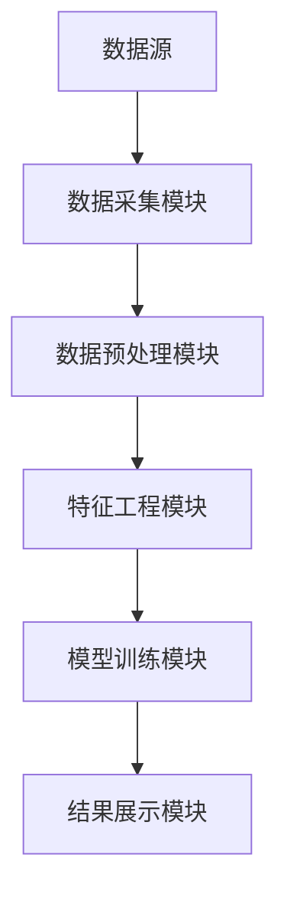

                 


# AI辅助的公司估值模型

## 关键词：公司估值，AI，机器学习，深度学习，数据分析

## 摘要：  
随着人工智能技术的快速发展，公司估值模型也在不断进化。传统的估值方法虽然经典，但在面对复杂市场环境和海量数据时显得力不从心。通过引入AI技术，特别是机器学习和深度学习算法，可以显著提升公司估值的准确性和效率。本文将详细探讨AI辅助的公司估值模型的构建过程，包括核心概念、算法原理、系统架构以及项目实战，为读者提供一套完整的解决方案。

---

## 第1章: 公司估值模型的背景与挑战

### 1.1 公司估值的基本概念  
公司估值是企业管理和投资决策中的核心任务之一，旨在通过分析公司的财务状况、市场表现、管理团队等因素，确定其市场价值。常见的估值方法包括市盈率法、市净率法、现金流折现法等。  

#### 1.1.1 什么是公司估值  
公司估值是对公司未来现金流的折现，反映公司在市场上的价值。  
$$ 企业价值 = \sum_{t=1}^{n} \frac{CF_t}{(1 + r)^t} $$  
其中，\( CF_t \) 表示第 \( t \) 年的现金流，\( r \) 为折现率。  

#### 1.1.2 公司估值的常见方法  
1. **市盈率法 (P/E Ratio)**：基于公司的市盈率与行业平均水平的对比，估算公司价值。  
2. **市净率法 (P/B Ratio)**：通过公司股价与每股净资产的比率来评估公司价值。  
3. **现金流折现法 (DCF)**：通过预测未来现金流并折现，计算公司整体价值。  

#### 1.1.3 传统公司估值方法的局限性  
传统方法依赖于财务数据和市场假设，难以应对非线性关系和复杂市场变化。例如，现金流折现法需要准确预测未来现金流，但在实际操作中往往难以实现。  

### 1.2 AI在公司估值中的作用  
AI技术，尤其是机器学习和深度学习，为公司估值提供了新的可能性。通过分析海量数据，AI能够发现传统方法难以察觉的模式和趋势，从而提高估值的准确性和效率。  

#### 1.2.1 AI如何提升公司估值的准确性  
AI通过分析非结构化数据（如新闻、社交媒体）和结构化数据（如财务报表），捕捉影响公司价值的多种因素。例如，自然语言处理（NLP）技术可以分析公司公告和行业新闻，提取潜在的市场情绪指标。  

#### 1.2.2 AI在公司估值中的应用场景  
1. **数据清洗与特征提取**：通过机器学习算法自动提取有用的特征，减少人工干预。  
2. **模型训练与优化**：使用深度学习模型（如LSTM）预测未来现金流。  
3. **结果解释与可视化**：通过可视化工具展示估值结果及其影响因素。  

#### 1.2.3 AI辅助公司估值的潜在优势  
AI能够处理海量数据，发现隐藏在数据中的模式，帮助投资者做出更明智的决策。此外，AI模型可以实时更新，适应市场变化。  

### 1.3 本章小结  
本章介绍了公司估值的基本概念和传统方法，分析了传统方法的局限性，并探讨了AI在公司估值中的潜力和应用场景。  

---

## 第2章: 公司估值的核心要素与AI的结合

### 2.1 公司估值的关键要素  
公司估值涉及多个关键要素，包括财务数据、市场环境、管理团队等。  

#### 2.1.1 财务指标分析  
财务指标是公司估值的基础，常见的指标包括收入、利润、资产负债率等。  
$$ 负债率 = \frac{\text{总负债}}{\text{总资产}} $$  

#### 2.1.2 市场分析与竞争环境  
公司所处的市场环境和竞争格局直接影响其估值。例如，行业增长趋势和竞争对手的市场份额都是重要的考量因素。  

#### 2.1.3 管理团队与公司战略  
优秀的管理团队和明确的战略规划是公司价值的重要组成部分。  

### 2.2 AI如何增强公司估值的核心要素分析  
AI技术通过自动化分析和模式识别，增强了对关键要素的分析能力。  

#### 2.2.1 数据特征提取  
通过机器学习算法（如PCA），可以从海量数据中提取有用的特征，降低维度。  

#### 2.2.2 模型选择与优化  
使用交叉验证等技术，选择最优的AI模型，并进行超参数优化。  

#### 2.2.3 结果解释与可视化  
通过可视化工具（如Matplotlib），将AI模型的预测结果转化为易于理解的图表。  

### 2.3 核心概念对比分析  
下表对比了传统估值方法和AI辅助估值方法的优缺点：

| **指标**           | **传统方法**               | **AI辅助方法**             |
|--------------------|-----------------------------|----------------------------|
| 数据处理能力       | 依赖结构化数据             | 支持结构化与非结构化数据     |
| 模型复杂性         | 简单，假设较多             | 复杂，能够捕捉非线性关系     |
| 精度               | 受限于假设                 | 更高，基于大数据分析         |
| 适应性             | 固定，难以实时更新         | 动态，能够实时调整           |

### 2.4 本章小结  
本章详细探讨了公司估值的关键要素，并分析了AI如何通过数据特征提取、模型优化和结果可视化等技术，增强传统估值方法的能力。  

---

## 第3章: AI算法在公司估值中的应用

### 3.1 线性回归模型  
线性回归是一种简单但有效的回归算法，适用于线性关系的场景。  

#### 3.1.1 线性回归的基本原理  
线性回归模型假设目标变量与特征变量之间存在线性关系。  
$$ y = \beta_0 + \beta_1 x + \epsilon $$  
其中，\( \beta_0 \) 和 \( \beta_1 \) 是回归系数，\( \epsilon \) 是误差项。  

#### 3.1.2 线性回归在公司估值中的应用  
线性回归可以用于预测公司股价，基于历史股价和财务指标进行建模。  

#### 3.1.3 线性回归的优缺点  
优点：简单易懂，计算速度快。缺点：无法捕捉非线性关系。  

### 3.2 随机森林与梯度提升树  
随机森林和梯度提升树是基于树的集成学习方法，适用于分类和回归任务。  

#### 3.2.1 随机森林的基本原理  
随机森林通过构建多棵决策树，并取其预测结果的平均值，减少过拟合。  

#### 3.2.2 梯度提升树的基本原理  
梯度提升树通过迭代优化，每一轮更新模型以减少预测误差。  

#### 3.2.3 随机森林与梯度提升树的对比  
随机森林适用于高维数据，而梯度提升树在处理复杂数据时表现更优。  

### 3.3 神经网络与深度学习模型  
神经网络和深度学习模型能够捕捉复杂的非线性关系，适用于复杂的公司估值场景。  

#### 3.3.1 神经网络的基本原理  
神经网络通过多层感知机模拟人脑神经网络，进行特征提取和分类。  

#### 3.3.2 深度学习模型在公司估值中的应用  
深度学习模型（如LSTM）可以用于时间序列预测，预测公司未来现金流。  

#### 3.3.3 深度学习模型的优缺点  
优点：能够捕捉复杂的模式。缺点：计算资源消耗大，需要大量数据。  

### 3.4 本章小结  
本章介绍了几种常用的AI算法，分析了它们在公司估值中的应用和优缺点，为后续的模型构建提供了理论基础。  

---

## 第4章: 系统分析与架构设计

### 4.1 系统功能设计  
AI辅助的公司估值系统需要具备数据采集、特征工程、模型训练和结果展示等功能。  

#### 4.1.1 数据采集与预处理模块  
数据采集模块负责从数据库或API获取数据，预处理模块对数据进行清洗和标准化。  

#### 4.1.2 特征工程模块  
特征工程模块负责提取有用的特征，如财务指标和市场情绪指标。  

#### 4.1.3 模型训练与优化模块  
模型训练模块使用训练数据训练AI模型，优化模块通过交叉验证优化模型参数。  

#### 4.1.4 结果展示与解释模块  
结果展示模块将估值结果以图表形式展示，解释模块提供结果的解读。  

### 4.2 系统架构设计  
系统架构采用模块化设计，各模块之间通过接口进行通信。  

#### 4.2.1 系统架构图  


#### 4.2.2 系统接口设计  
系统接口采用RESTful API，便于与其他系统集成。  

#### 4.2.3 系统交互设计  
用户通过图形界面输入数据，系统处理后返回估值结果。  

### 4.3 本章小结  
本章详细设计了AI辅助公司估值系统的功能和架构，为后续的项目实施提供了指导。  

---

## 第5章: 项目实战

### 5.1 环境安装与数据准备  
首先安装必要的Python库，如Pandas、Scikit-learn、TensorFlow等。  

#### 5.1.1 安装环境  
```bash
pip install pandas scikit-learn tensorflow matplotlib
```

#### 5.1.2 数据准备  
从公开数据源获取公司财务数据和市场数据，清洗数据并提取特征。  

### 5.2 模型实现与优化  
使用随机森林模型进行训练，并通过网格搜索优化模型参数。  

#### 5.2.1 模型实现  
```python
from sklearn.ensemble import RandomForestRegressor
from sklearn.model_selection import train_test_split
from sklearn.metrics import mean_squared_error

# 数据准备
X_train, X_test, y_train, y_test = train_test_split(X, y, test_size=0.2)

# 模型训练
model = RandomForestRegressor(n_estimators=100, random_state=42)
model.fit(X_train, y_train)

# 模型预测
y_pred = model.predict(X_test)
print(mean_squared_error(y_test, y_pred))
```

#### 5.2.2 模型优化  
通过网格搜索优化随机森林模型的超参数。  

### 5.3 结果分析与解读  
分析模型的预测结果，解读估值的准确性及其影响因素。  

#### 5.3.1 结果可视化  
使用Matplotlib绘制预测值与实际值的散点图。  

### 5.4 本章小结  
本章通过一个具体的项目实战，展示了AI辅助公司估值模型的实现过程，从数据准备到模型训练，再到结果分析，为读者提供了完整的操作指南。  

---

## 第6章: 总结与展望

### 6.1 本章总结  
本文详细探讨了AI辅助的公司估值模型的构建过程，从理论到实践，为读者提供了全面的指导。  

### 6.2 未来展望  
未来，随着AI技术的不断发展，公司估值模型将更加智能化和自动化。例如，结合自然语言处理技术，进一步提升模型对非结构化数据的分析能力。  

### 6.3 最佳实践 tips  
1. 在实际应用中，建议使用多种模型进行对比，选择最优方案。  
2. 数据质量是模型性能的关键，需重视数据清洗和特征工程。  
3. 模型解释性是实际应用的重要考量，需通过可视化工具帮助用户理解结果。  

---

## 作者：AI天才研究院/AI Genius Institute & 禅与计算机程序设计艺术 /Zen And The Art of Computer Programming

---

通过本文，读者可以系统地了解AI辅助公司估值模型的核心概念、算法原理和实现方法，为实际应用提供了宝贵的参考。

