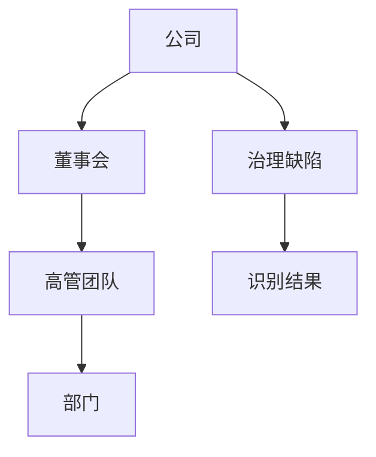
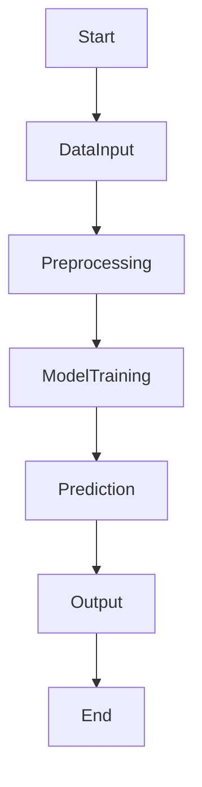
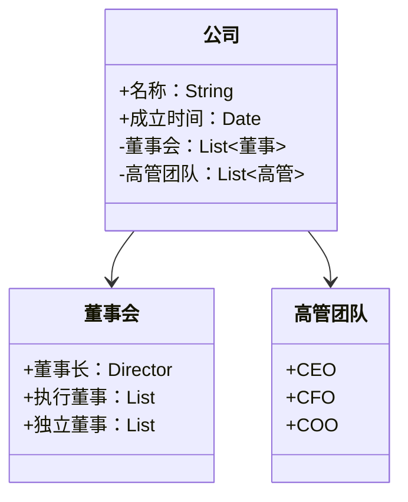
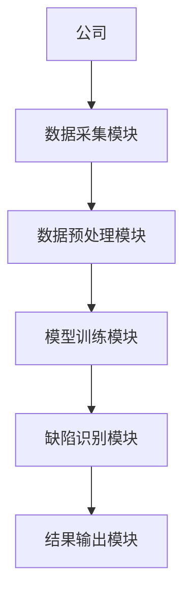
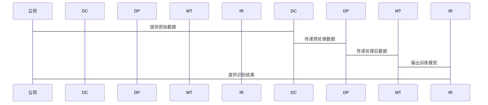

                 


# 目录大纲：《AI辅助的公司治理缺陷识别》

---

## 第1章：背景介绍

### 1.1 问题背景
- 1.1.1 企业治理中的常见问题
- 1.1.2 公司治理缺陷的定义与分类
- 1.1.3 传统治理缺陷识别的局限性

### 1.2 问题描述
- 1.2.1 治理缺陷对企业的影响
- 1.2.2 当前治理缺陷识别的挑战
- 1.2.3 问题解决的必要性

### 1.3 问题解决思路与目标
- 1.3.1 引入AI技术的必要性
- 1.3.2 AI辅助治理缺陷识别的目标
- 1.3.3 解决方案的边界与外延

### 1.4 核心概念与组成要素
- 1.4.1 AI技术在治理中的应用
- 1.4.2 治理缺陷识别的核心要素
- 1.4.3 系统架构与功能模块

---

## 第2章：核心概念与联系

### 2.1 核心概念的原理
- 2.1.1 AI在治理中的应用原理
- 2.1.2 治理缺陷识别的算法原理
- 2.1.3 多模态数据处理机制

### 2.2 核心概念的属性特征对比
- 2.2.1 治理缺陷类型对比表
- 2.2.2 不同AI模型的性能对比
- 2.2.3 数据来源与处理方式对比

### 2.3 ER实体关系图


---

## 第3章：算法原理讲解

### 3.1 算法流程


### 3.2 算法实现
```python
import numpy as np
from sklearn.model_selection import train_test_sp
```

### 3.3 数学模型与公式
- 3.3.1 概率论中的贝叶斯定理
  $$ P(A|B) = \frac{P(B|A)P(A)}{P(B)} $$
- 3.3.2 分类算法的损失函数
  $$ L = -\frac{1}{n}\sum_{i=1}^{n} y_i \log p(y_i|x_i) $$
- 3.3.3 深度学习中的激活函数
  $$ \text{ReLU}(x) = \max(0, x) $$

---

## 第4章：系统分析与架构设计

### 4.1 问题场景介绍
- 4.1.1 系统目标与范围
- 4.1.2 使用场景与用户需求

### 4.2 领域模型设计


### 4.3 系统架构设计


### 4.4 接口与交互设计


---

## 第5章：项目实战

### 5.1 环境安装
- 5.1.1 安装Python
- 5.1.2 安装必要的库（如TensorFlow、Pandas）
- 5.1.3 安装Jupyter Notebook

### 5.2 核心代码实现
```python
import pandas as pd
from sklearn.model_selection import train_test_split
from sklearn.ensemble import RandomForestClassifier
from sklearn.metrics import accuracy_score

# 加载数据
data = pd.read_csv('governance.csv')

# 数据分割
X = data.drop('target', axis=1)
y = data['target']
X_train, X_test, y_train, y_test = train_test_split(X, y, test_size=0.2)

# 模型训练
model = RandomForestClassifier()
model.fit(X_train, y_train)

# 预测与评估
y_pred = model.predict(X_test)
print("准确率:", accuracy_score(y_test, y_pred))
```

### 5.3 代码解读与分析
- 数据加载与预处理
- 模型训练与优化
- 结果分析与可视化

### 5.4 案例分析
- 5.4.1 某公司治理缺陷识别案例
- 5.4.2 案例分析与结果解读
- 5.4.3 案例总结与经验分享

### 5.5 项目总结
- 项目实现的关键点
- 项目成果与意义
- 项目改进建议

---

## 第6章：最佳实践与注意事项

### 6.1 最佳实践
- 数据质量管理
- 模型选择与优化
- 结果解释与可视化

### 6.2 小结
- 本章内容总结
- 关键点回顾
- 实际应用中的注意事项

### 6.3 注意事项
- 数据隐私与安全
- 模型泛化能力
- 实际场景中的边界条件

### 6.4 拓展阅读
- 推荐书籍与论文
- 相关技术领域
- 未来研究方向

---

## 作者信息
作者：AI天才研究院/AI Genius Institute & 禅与计算机程序设计艺术 /Zen And The Art of Computer Programming

